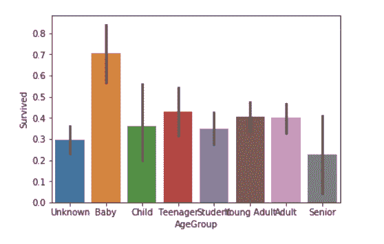

↑↑↑关注后"星标"Datawhale

每日干货 & [每月组队学习](https://mp.weixin.qq.com/mp/appmsgalbum?__biz=MzIyNjM2MzQyNg%3D%3D&action=getalbum&album_id=1338040906536108033#wechat_redirect)，不错过

 Datawhale干货 

**作者：陈锴，中山大学，Datawhale成员**

最近有很多读者留言，希望能有一个完整的数据分析项目练手，这几天收集了组织成员们的推荐。其中泰坦尼克号生存预测作为最经典的启蒙数据分析项目，对于初学者来说是应该是最合适的了，后面将分享更多进阶的数据分析项目。如果已经有基础了，推荐：

1.开源项目《动手学数据分析》：

https://github.com/datawhalechina/hands-on-data-analysis

2.[DCIC 2020算法分析赛](http://mp.weixin.qq.com/s?__biz=MzIwNDA5NDYzNA%3D%3D&chksm=96c426b2a1b3afa46852c6a871c6c439e9c5da2fc00d539c63c867e9fb6b94296ca89fb19ac7&idx=1&mid=2247486327&scene=21&sn=eee0cec6fe95a911d02f5b20f5dfd34a#wechat_redirect)：DCIC 是国内少有的开放政府真实数据的经典赛事，对能力实践，学术研究等都提供了很好的机会。

[https://mp.weixin.qq.com/s/-fzQIlZRig0hqSm7GeI_Bw](https://mp.weixin.qq.com/s?__biz=MzIwNDA5NDYzNA%3D%3D&idx=1&mid=2247486327&scene=21&sn=eee0cec6fe95a911d02f5b20f5dfd34a#wechat_redirect)

**全文如下：**

本文结合泰坦尼克号生存预测，从1.数据探索（数据可视化），2.数据预处理，3.模型训练，4.模型调参这四个步骤进行了完整的梳理：


# 1\. 数据概述与可视化

## 1.1 数据概述

首先我们导入我们的训练数据和测试数据：

数据集包含train.csv和test.csv两个文件，在 Datawhale 公众号回复 数据集，可获取打包链接，也可以直接在kaggle官网上下载。

```
train_data = pd.read_csv("input/train.csv", index_col=0)
test_data = pd.read_csv("input/test.csv", index_col=0)
train_data.head() 
```


```
train_data.describe() 
```

 通过describe()函数我们可以简单地看出哪些是数值型数据哪些是字符型数据，对于字符型数据我们当然要转换成数值型数据来处理，比如可以转换成0-1编码的数值型，但需要注意的是，对于一些数值型数据却未必就不需要进一步的处理了，比如Pclass特征，从名字我们就可以看出这是标识仓位等级的特征，取值范围为[1, 2, 3]，这个特征我们不应该简单地当作一个数值型数据放进分类模型中直接跑，应该把它转变为one-hot编码，标识乘客不同的仓位，这一步我们将在数据预处理步骤完成。

我们再看看数据中值为null的数据，这是我们后面需要进一步处理的：

```
train_data.isnull().sum().sort_values(ascending=False).head(4) 
```

显示结果为：

> ```
> Cabin       687
> Age         177
> Embarked      2
> Fare          0
> dtype: int64 
> ```

## 1.2 数据可视化

为了这篇文章看起来内容多一点（误），我们可以画多点图来展示数据信息，想直接进行数据预处理的读者可以跳过这部分，这部分内容大多来自Kaggle官网的一篇notebook。

### 1.2.1 性别与生存率

首先我们应该还记得电影里感人的“女士优先”策略：

```
sns.barplot(x="Sex", y="Survived", data=train_data) 
```

 这里我们可以看出女性的生存率远大于男性，这也很符合电影的情节。

### 1.2.2 仓位等级（社会等级）与生存率

我们还可以猜测不同仓位的乘客应有不同的获救率：

```
#draw a bar plot of survival by Pclass
sns.barplot(x="Pclass", y="Survived", data=train)

#print percentage of people by Pclass that survived
print("Percentage of Pclass = 1 who survived:", train["Survived"][train["Pclass"] == 1].value_counts(normalize = True)[1]*100)

print("Percentage of Pclass = 2 who survived:", train["Survived"][train["Pclass"] == 2].value_counts(normalize = True)[1]*100)

print("Percentage of Pclass = 3 who survived:", train["Survived"][train["Pclass"] == 3].value_counts(normalize = True)[1]*100) 
```


```
Percentage of Pclass = 1 who survived: 62.96296296296296
Percentage of Pclass = 2 who survived: 47.28260869565217
Percentage of Pclass = 3 who survived: 24.236252545824847 
```

数据结果还是很现实的，贵的仓位自然有更高的生存率 ，不然我花这冤枉钱干嘛，生死面前不是人人平等。

> As predicted, people with higher socioeconomic class had a higher rate of survival. (62.9% vs. 47.3% vs. 24.2%)

### 1.2.3 家属数与生存率

```
#draw a bar plot for SibSp vs. survival
sns.barplot(x="SibSp", y="Survived", data=train)

#I won't be printing individual percent values for all of these.
print("Percentage of SibSp = 0 who survived:", train["Survived"][train["SibSp"] == 0].value_counts(normalize = True)[1]*100)

print("Percentage of SibSp = 1 who survived:", train["Survived"][train["SibSp"] == 1].value_counts(normalize = True)[1]*100)

print("Percentage of SibSp = 2 who survived:", train["Survived"][train["SibSp"] == 2].value_counts(normalize = True)[1]*100) 
```

```
Percentage of SibSp = 0 who survived: 34.53947368421053
Percentage of SibSp = 1 who survived: 53.588516746411486
Percentage of SibSp = 2 who survived: 46.42857142857143 
```

 这里可以看出，有一个兄弟姐妹的一般有更高的生存率，所以快去鼓励爸爸妈妈生个弟弟妹妹吧~

> In general, it's clear that people with more siblings or spouses aboard were less likely to survive. However, contrary to expectations, people with no siblings or spouses were less to likely to survive than those with one or two. (34.5% vs 53.4% vs. 46.4%)

```
#draw a bar plot for Parch vs. survival
sns.barplot(x="Parch", y="Survived", data=train)
plt.show() 
```

 看起来独自旅游的人们生存率更低，想想眼眶竟湿润了

> People with less than four parents or children aboard are more likely to survive than those with four or more. Again, people traveling alone are less likely to survive than those with 1-3 parents or children.

### 1.2.4 年龄与生存率

```
#sort the ages into logical categories
train["Age"] = train["Age"].fillna(-0.5)
test["Age"] = test["Age"].fillna(-0.5)
bins = [-1, 0, 5, 12, 18, 24, 35, 60, np.inf]
labels = ['Unknown', 'Baby', 'Child', 'Teenager', 'Student', 'Young Adult', 'Adult', 'Senior']
train['AgeGroup'] = pd.cut(train["Age"], bins, labels = labels)
test['AgeGroup'] = pd.cut(test["Age"], bins, labels = labels)

#draw a bar plot of Age vs. survival
sns.barplot(x="AgeGroup", y="Survived", data=train)
plt.show() 
```

 这张图表绘制用到了pandas的一个方法：cut（），可以用这个方法对数据进行切分，我们得到很显然的一个结论，婴儿的生存率神他妈高（我觉得很大一部分原因是不占空间）

### 1.2.5 仓位特征是否存在与生存率

这是个奇怪的指标，据作者描述：

> I think the idea here is that people with recorded cabin numbers are of higher socioeconomic class, and thus more likely to survive.

好吧我们看看：

```
test["CabinBool"] = (test["Cabin"].notnull().astype('int'))

#calculate percentages of CabinBool vs. survived
print("Percentage of CabinBool = 1 who survived:", train["Survived"][train["CabinBool"] == 1].value_counts(normalize = True)[1]*100)

print("Percentage of CabinBool = 0 who survived:", train["Survived"][train["CabinBool"] == 0].value_counts(normalize = True)[1]*100)
#draw a bar plot of CabinBool vs. survival
sns.barplot(x="CabinBool", y="Survived", data=train)
plt.show() 
```

> ```
> Percentage of CabinBool = 1 who survived: 66.66666666666666
> Percentage of CabinBool = 0 who survived: 29.985443959243085 
> ```


脑洞确实大，结果确实不赖~

### 1.2.6 热力图

我们还可以给数据画上美丽的热力图，虽然没什么卵用：


# 2\. 数据预处理

## 2.1 拼接数据集

首先我们讲训练集中的Survived特征提取出来，这是我们需要预测的目标函数，这部分也是train_data和test_data的不同点，接着我们可以讲训练集和测试集的数据拼接起来一起进行数据预处理，当然在实际中我们是无从得知测试数据的，但在比赛中为了方便我们可以统一进行处理：

```
y_train = train_data.pop("Survived")
data_all = pd.concat((train_data, test_data), axis=0) 
```

## 2.2 处理Name特征，提取出Title

从左往右看我们首先可以看到Name这个特征是比较碍眼的，很多人可能直接把它去掉了，但仔细观察我们可以发现这一列特征里都含有名字的前缀，比如"Mr."，”Mrs.“，"Miss"等，只要学过小学一年级英语的都知道这个特征在一定程度上会代表阶级地位，婚配情况等，我们可以将这个特征做一个映射，实现方式如下：

```
title = pd.DataFrame()
title["Title"] = data_all["Name"].map(lambda name:name.split(",")[1].split(".")[0].strip())
# title.head()
Title_Dictionary = {
    "Capt":       "Officer",
    "Col":        "Officer",
    "Major":      "Officer",
    "Jonkheer":   "Royalty",
    "Don":        "Royalty",
    "Sir" :       "Royalty",
    "Dr":         "Officer",
    "Rev":        "Officer",
    "the Countess":"Royalty",
    "Dona":       "Royalty",
    "Mme":        "Mrs",
    "Mlle":       "Miss",
    "Ms":         "Mrs",
    "Mr" :        "Mr",
    "Mrs" :       "Mrs",
    "Miss" :      "Miss",
    "Master" :    "Master",
    "Lady" :      "Royalty"
}
title[ 'Title' ] = title.Title.map(Title_Dictionary)
title = pd.get_dummies(title.Title)
# title.head()
data_all = pd.concat((data_all, title), axis=1)
data_all.pop("Name")
data_all.head() 
```

上面这段是什么意思呢？我们可以将种类众多的头衔特征先进行归类，比如"Don"，"Sir"，”Jonkheer"这几个头衔出现的次数极低，大约每个出现次数只有不到十个，因此我们可以将意思相近的归为一类便于模型运行。然后我们用get_dummies将这些特征转为one-hot向量，得到的结果如下：


## 2.3 提取其他特征

这个 Ticket特征比较麻烦懒得搞了，先把它删掉吧，然后Cabin特征应该是很有用的，你想想嘛我们在船的不同位置到安全通道的距离当然是会随着Cabin位置的不同而不同的，我们简单提取A、B、C、D这几个仓位来作为特征，而不考虑C85、C123中的数字（表示某个仓中的位置），当然由于有些船在A、B、C、D等仓位可能都有安全通道，我们可能提取后面的数字会更适合，为了方便我们先不做此讨论：

```
data_all["Cabin"].fillna("NA", inplace=True)
data_all["Cabin"] = data_all["Cabin"].map(lambda s:s[0])
data_all.pop("Ticket") 
```

前面也说了Pclass更适合作为One-hot型特征出现，我们先将之转换为字符型特征再进行归类，这里我们顺手把几个靠谱的类别标签做One-hot特征：

```
data_all["Pclass"] = data_all["Pclass"].astype(str)
feature_dummies = pd.get_dummies(data_all[["Pclass", "Sex", "Embarked", "Cabin"]])
# feature_dummies.head()
data_all.drop(["Pclass", "Sex", "Embarked", "Cabin"], inplace=True, axis=1)
data_all = pd.concat((data_all, feature_dummies), axis=1)
data_all.head() 
```

于是我们将特征集合由原来的11列扩充到了27列，噢糟糕我们前面忘了做缺失值填充，不要紧我们现在做也不晚：

```
mean_cols = data_all.mean()
data_all = data_all.fillna(mean_cols) 
```

这里是使用了平均值对Age和Embarked两个特征进行填充，由于Age刚好是数值型特征，这种填充方式是合理的，且Embarked只有两个缺失值，因此随便填充啦~不碍事的。

## 2.4 将训练集测试集重新分开

在模型搭建之前不要忘了之前我们拼在一起的训练集和测试集噢，还记得最开始读取数据的时候加入的index_col嘛，这里刚好派上用场啦：

```
train_df = data_all.loc[train_data.index]
test_df = data_all.loc[test_data.index]
print(train_df.shape, test_df.shape) 
```

打印结果是(891, 27) (418, 27)，符合原训练集测试集的大小，我们的粗略数据预处理就到此为止了，下面进行模型搭建～

# 3\. 模型训练

## 3.1 Random Forest

首先导入sklearn的包

```
from sklearn.ensemble import RandomForestClassifier
from sklearn.model_selection import cross_val_score
import sklearn 
```

然后设置不同的树最大深度进行参数调优：

```
%matplotlib inline
depth_ = [1, 2, 3, 4, 5, 6, 7, 8]
scores = []
for depth in depth_:
    clf = RandomForestClassifier(n_estimators=100, max_depth=depth, random_state=0)
    test_score = cross_val_score(clf, train_df, y_train, cv=10, scoring="precision")
    scores.append(np.mean(test_score))
plt.plot(depth_, scores) 
```

 得到了这样一张图，这张图大致反映了模型中树的最大深度以6为最佳，此时可以达到0.84左右的验证准确率，我们当然可以继续调整其他参数获得更优的结果，但接下来我们先继续讨论其他模型。

## 3.2 Gradient Boosting Classifier

代码和上面差不多：

```
from sklearn.ensemble import GradientBoostingClassifier
depth_ = [1, 2, 3, 4, 5, 6, 7, 8]
scores = []
for depth in depth_:
    clf = GradientBoostingClassifier(n_estimators=100, max_depth=depth, random_state=0)
    test_score = cross_val_score(clf, train_df, y_train, cv=10, scoring="precision")
    scores.append(np.mean(test_score))
plt.plot(depth_, scores) 
```

成功率最高似乎接近0.82

## 3.3 Bagging

Bagging把很多小分类器放在一起，每个train随机的一部分数据，然后把它们的最终结果综合起来（多数投票制）

```
from sklearn.ensemble import BaggingClassifier
params = [1, 10, 15, 20, 25, 30, 40]
test_scores = []

for param in params:
    clf = BaggingClassifier(n_estimators=param)
    test_score = cross_val_score(clf, train_df, y_train, cv=10, scoring="precision")
    test_scores.append(np.mean(test_score))
plt.plot(params, test_scores) 
```

结果又不稳定又不好：


## 3.4 RidgeClassifier

下面就不说废话了，一个个试就对了：

```
from sklearn.linear_model import RidgeClassifier
alphas = np.logspace(-3, 2, 50)
test_scores = []

for alpha in alphas:
    clf = RidgeClassifier(alpha)
    test_score = cross_val_score(clf, train_df, y_train, cv=10, scoring="precision")
    test_scores.append(np.mean(test_score))
plt.plot(alphas, test_scores) 
```


## 3.5 RidgeClassifier + Bagging

```
ridge = RidgeClassifier(alpha=5)
params = [1, 10, 15, 20, 25, 30, 40]
test_scores = []

for param in params:
    clf = BaggingClassifier(n_estimators=param, base_estimator=ridge)
    test_score = cross_val_score(clf, train_df, y_train, cv=10, scoring="precision")
    test_scores.append(np.mean(test_score))
plt.plot(params, test_scores) 
```


结果比使用默认模型的Bagging策略稍好一些。

## 3.6 XGBClassifier

```
from xgboost import XGBClassifier
params = [1, 2, 3, 4, 5, 6]
test_scores = []
for param in params:
    clf = XGBClassifier(max_depth=param)
    test_score = cross_val_score(clf, train_df, y_train, cv=10, scoring="precision")
    test_scores.append(np.mean(test_score))
plt.plot(params, test_scores) 
```


## 3.7 神经网络

首先我们基于Keras搭建了一个简单的神经网络架构：

```
import tensorflow as tf
import keras
from keras.models import Sequential
from keras.layers import *

tf.keras.optimizers.Adam(
    learning_rate=0.003, beta_1=0.9, beta_2=0.999, epsilon=1e-07, amsgrad=False,
    name='Adam',
)
model = Sequential()
model.add(Dense(32, input_dim=train_df.shape[1],kernel_initializer = 'uniform', activation='relu'))
model.add(Dense(32, kernel_initializer = 'uniform', activation = 'relu'))
model.add(Dropout(0.4))
model.add(Dense(32,kernel_initializer = 'uniform', activation = 'relu'))
model.add(Dense(1, activation='sigmoid'))

model.compile(loss='binary_crossentropy', optimizer='adam', metrics=['accuracy']) 
```

然后将模型放入train_df进行训练得到结果：

```
history = model.fit(np.array(train_df), np.array(y_train), epochs=20, batch_size=50, validation_split = 0.2) 
```

最后一轮的结果为：

```
Epoch 20/20
712/712 [==============================] - 0s 43us/step - loss: 0.4831 - accuracy: 0.7978 - val_loss: 0.3633 - val_accuracy: 0.8715 
```

可以看到实验结果还是不错的，我们看一看模型的架构：

```
model.summary() 
```

```
Model: "sequential_1"
_________________________________________________________________
Layer (type)                 Output Shape              Param #
=================================================================
dense_1 (Dense)              (None, 32)                896
_________________________________________________________________
dense_2 (Dense)              (None, 32)                1056
_________________________________________________________________
dropout_1 (Dropout)          (None, 32)                0
_________________________________________________________________
dense_3 (Dense)              (None, 32)                1056
_________________________________________________________________
dense_4 (Dense)              (None, 1)                 33
=================================================================
Total params: 3,041
Trainable params: 3,041
Non-trainable params: 0
_________________________________________________________________ 
```

测试模型：

```
scores = model.evaluate(train_df, y_train, batch_size=32)
print(scores) 
```

```
891/891 [==============================] - 0s 18us/step
[0.4208374666645872, 0.8316498398780823] 
```

可以看到效果和随机森林的最佳效果差不多。

# 4\. 模型优化（调参）

后续我们可以通过对这些表现比较好的模型再进行第二层的学习获得更好的分数。

首先我们将之前获得的几个比较好的结果一一定好参数放上来（这里只随便调了一个参数）：

```
from sklearn.ensemble import RandomForestClassifier, GradientBoostingClassifier, BaggingClassifier, AdaBoostClassifier
from xgboost import XGBClassifier
from sklearn.model_selection import cross_val_score
from sklearn.linear_model import RidgeClassifier
import sklearn

classifier_num = 5
clf = [0 for i in range(classifier_num)]
clf[0] = RandomForestClassifier(n_estimators=100, max_depth=6, random_state=0)
clf[1] = GradientBoostingClassifier(n_estimators=100, max_depth=4, random_state=0)
clf[2] = RidgeClassifier(5)
clf[3] = BaggingClassifier(n_estimators=15, base_estimator=clf[2])
clf[4] = XGBClassifier(max_depth=2)

from sklearn.model_selection import train_test_split
X_train, X_test, Y_train, Y_test = train_test_split(train_df, y_train, random_state=0)

predictFrame = pd.DataFrame()
for model in clf:
    model.fit(X_train, Y_train)
    predictFrame[str(model)[:13]] = model.predict(X_test)
predictFrame.head() 
```


名字随意啦反正只要不重复就好了~然后将这个结果放入下一个分类器中学习，我没有试其他的就直接放进了随机森林分类器：

```
%matplotlib inline
depth_ = [1, 2, 3, 4, 5, 6, 7, 8]
scores = []
for depth in depth_:
    clf_ = RandomForestClassifier(n_estimators=100, max_depth=depth, random_state=0)
    test_score = cross_val_score(clf_, predictFrame, Y_test, cv=10, scoring="precision")
    scores.append(np.mean(test_score))
plt.plot(depth_, scores) 
```


好吧就定个参数为2，然后就将整体跑个结果试试：

```
finalFrame = pd.DataFrame()
XFrame = pd.DataFrame()
for model in clf:
    model.fit(train_df, y_train)
    XFrame[str(model)[:13]] = model.predict(train_df)
    finalFrame[str(model)[:13]] = model.predict(test_df)
final_clf = RandomForestClassifier(n_estimators=100, max_depth=2, random_state=0)
final_clf.fit(XFrame, y_train)
result = final_clf.predict(finalFrame) 
```

将result和passengerId一起拼接成一个Dataframe就直接输出看结果吧，比之前没有融合直接用随机森林结果稍好一些，但我们只是用了几个简单的机器学习算法搞来搞去也没有认真调参，实际上还是有很多优化空间的，读者可以自行优化。

*本文PDF和数据集 后台回复"****Titanic****"可下载*


“干货学习，**点****赞****三连**↓