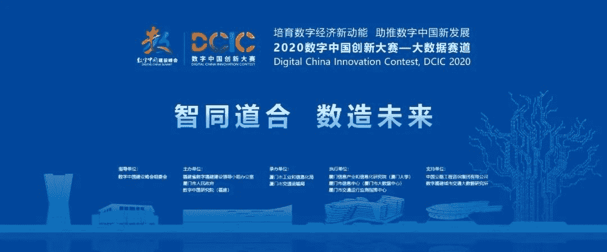
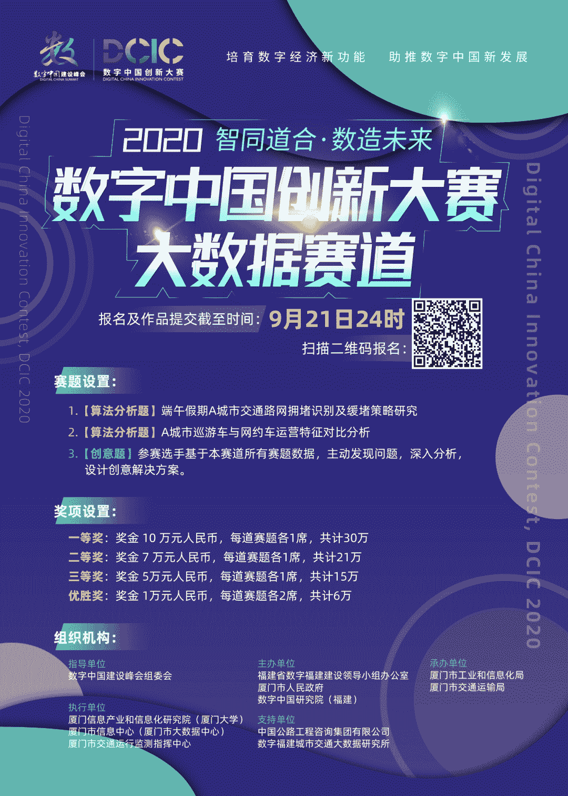

01

** DCIC 2020****：数字中国创新大赛**

DCIC 是国内赛事中少有的开放政府真实数据的经典赛事，除了高知名度，高影响力，高奖金，对能力履历，学术研究和企业技术应用都提供了很好的机会。作为数字中国建设峰会“一会、一展、一赛”的重要组成部分，2020 数字中国创新大赛以“培育数字经济新动能，助推数字中国新发展”为主题，将汇聚政、产、学、研多方面优势力量，推动技术创新和产业应用，为数字经济发展提供有力支撑。

02

** 大数据赛道**

大数据赛道以**“智同道合 数造未来”**为主题，征集基于交通大数据领域的创新**应用解决方案和算法模型**，助力改善城市交通拥堵问题，赋能城市交通智能化变革。

03

** 赛题任务**

**算法分析题：**

**赛题1：端午假期A城市交通路网拥堵识别及缓堵策略研究**

参赛方需利用端午假期期间多种交通运输车辆运行监测数据，完成GPS点位地图匹配，提供A城市交通运行指数计算方法说明、指数计算模型和指数计算结果、分析结论等，并为A城市市民游客提出端午假期旅游出行建议。

**赛题2：A城市巡游车与网约车运营特征对比分析**

参赛方需依据平台提供的出租车（包括巡游车和网约车）GPS和订单数据，对出租车运行的时间、空间分布特征进行量化计算。并根据出租车的时空运营特征，对巡游车与网约车的融合发展提出相关建议。

**创意题：**

**赛题3：参赛选手基于本赛道所有赛题数据，主动发现问题，深入分析，设计创意解决方案。**

04

** 奖项设置**

**72万现金池：**

????一等奖：奖金 **10 万元**人民币，每道赛题各1席，共计30万

????二等奖：奖金 **7 万元**人民币，每道赛题各1席，共计21万

????三等奖：奖金 **5万元**人民币，每道赛题各1席，共计15万

????优胜奖：奖金 **1万元**人民币，每道赛题各2席，共计6万

04

** 报 名 方式**

data.xm.gov.cn（电脑端打开）

**扫描下方二维码**或**阅读原文**直接报名

**竞赛组队交流群******

**答疑负责人**

鱼佬，武汉大学硕士，2020腾讯广告算法大赛冠军

阿水，北航计算机硕士，CV领域Top选手

杰少：南京大学硕士，DCIC冠军选手

若进群失败，后台回复【竞赛群】

即可得到最新的二维码！