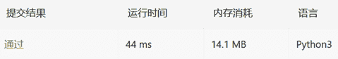

↑↑↑关注后"星标"Datawhale

每日干货 & [每月组队学习](https://mp.weixin.qq.com/mp/appmsgalbum?__biz=MzIyNjM2MzQyNg%3D%3D&action=getalbum&album_id=1338040906536108033#wechat_redirect)，不错过

 Datawhale干货 

**作者：周彬莲，东北石油大学，Datawhale优秀学习者**

## 引言

MapReduce（分治算法的应用） 是 Google 大数据处理的三驾马车之一，另外两个是 GFS 和 Bigtable。它在倒排索引、PageRank 计算、网页分析等搜索引擎相关的技术中都有大量的应用。

尽管开发一个MapReduce看起来很高深，感觉遥不可及。实际上，万变不离其宗，它的本质就是分治算法思想，分治算法。**如何理解分治算法？为什么说 MapRedue 的本质就是分治算法呢？**

分治是一种被广泛应用的有效方法，它的基本思想是**把最初的问题分解成若干子问题，然后，在逐个解决各个子问题的基础上得到原始问题的解**。所谓分治就是“分而治之”的意思。由于分解出的每个子问题总是要比最初的问题容易些，因而分治策略往往能够降低原始问题的难度，或者提高解决问题的效率。例如，到图书馆查找某一本书，一般都是根据大的类别确定书应该在文学类、自然科学类，还是在外语类，直奔相应的楼层，再按照下一级的分类找到对应的藏书室，如有必要，再按更细的分类找到对应的书架，最终找到需要的书。又如，学校要评选出本年度的三好学生，便把任务分配到各个学院，学院接到任务再分配到年级、班级，班级、年级评选的结果在学院汇总后上报学校，学校再把各学院报来的名单综合起来，从而完成整个评选工作。

根据如何由分解出的子问题求出原始问题的解，**分治策略**又可分为两种情形：**其一是原始问题的解只存在于分解出的某一个子问题中**，则只需要在原始问题的一个划分中求解即可，如前面的第一个例子；**另一种情形则是原始问题的解需要由各个子问题的解再经过综合处理而得到**，第二个例子就是这种类型。无论是哪一种情况，适当运用分治策略往往可以较快地缩小问题求解的范围，从而加快问题求解的速度。

分治策略运用于计算机算法时，往往会出现分解出来的子问题与原始问题类型相同的现象，而与原问题相比，各个子问题的“尺寸”变小了。这刚好符合“递归”的特征，因此计算机中的**分治策略往往是与递归联系在一起的**。

全文如下：

本文从分治算法的思想出发，深度讲解该算法的使用条件、基本解题步骤、及实现等几个方面，结合了分治实战，完整梳理算法内容。


## 1\. 算法思想

**总体思想**：

> *   **将要求解的较大规模的问题分割成k个更小规模的子问题**。
>     
>     
> *   **对这k个子问题分别求解。如果子问题的规模仍然不够小，则再划分为k个子问题，如此递归的进行下去，直到问题规模足够小，很容易求出其解为止**。
>     
>     
> *   **将求出的小规模的问题的解合并为一个更大规模的问题的解，自底向上逐步求出原来问题的解**。

**分治的设计思想是**，将一个难以直接解决的大问题，分割成一些规模较小的相同问题，以便各个击破，分而治之。


## 2\. 适用条件

分治所能解决的问题一般具有以下几个**特征**：

> *   **该问题的规模缩小到一定的程度就可以容易地解决**；
>     
>     
> *   **该问题可以分解为若干个规模较小的相同问题，即该问题具有最优子结构性质**
>     
>     
> *   **利用该问题分解出的子问题的解可以合并为该问题的解；**
>     
>     
> *   **该问题所分解出的各个子问题是相互独立的，即子问题之间不包含公共的子问题。**

这条特征涉及到分治的效率，如果各子问题是不独立的，则分治要做许多不必要的工作，重复地解公共的子问题，此时虽然也可用分治，但**一般用动态规划较好**。

## 3\. 基本步骤

设计过程分为**三个阶段**：

> *   Divide：整个问题划分为多个子问题
>     
>     
> *   Conquer：求解各子问题(递归调用正设计的算法)
>     
>     
> *   Merge：合并子问题的解, 形成原始问题的解

**伪代码：**

```
def divide_conquer(problem, paraml, param2,...)：
    # 不断切分的终止条件
    if problem is None：
        print_result
        return
    # 准备数据
    data=prepare_data(problem)
    # 将大问题拆分为小问题
    subproblems=split_problem(problem, data)
    # 处理小问题，得到子结果
    subresult1=self.divide_conquer(subproblems[0],p1,..…)
    subresult2=self.divide_conquer(subproblems[1],p1,...)
    subresult3=self.divide_conquer(subproblems[2],p1,.…)
    # 对子结果进行合并 得到最终结果
    result=process_result(subresult1, subresult2, subresult3,...) 
```

## 4\. 时间复杂性分析

一般的，分治的时间复杂性可归结为**递归方程**：

其中，a是子问题的个数，b是递减的步长， ~表示递减方式， D(n)是合成子问题的开销。
  通常，**递归元的递减方式~有两种**：

> 1、减法，即n – b，的形式
> 2、除法，即n / b，的形式

## 5\. 算法实现

**如果用算法A处理一个计算问题，当输入数据D是一个集合,其数据量比较大时,可以将D划分为几个子集D1,D2,…D**，**然后使用算法A分别处理这些子集,最后将k 个结果进行综合,从而得到原问题的解。这种方法称为**分治。

用**递归函数**框架描述分治：

```
Divide_and conquer (D) {
If (集合 D的数据量非常小，达到递归起点)
    用非递归方法直接处理D, 得到解S;
else {
   将D分解为子集D, D.*, Dk;
   for (i =1;i <=k;i++ )
   Si= Divide_ and_ conquer (D：) ;
  综合S,S2,...,Sk,得到解S;
} 
```

分治的执行步骤可以分为**三个阶段**,即划分数据阶段、递归处理阶段和综合合并阶段。有些问题的划分阶段时间费用较多,有些问题则合并阶段的时间费用较多。

## 6\. 应用与实例

分治算法的应用主要可分为以下五种：

1）**二分搜索算法**
    问题：要**求在一个n元已排序的数组A[n]中，搜索一个特定元素x**。

2）**合并排序算法**
    问题：**将一个n元数组A排序**。

3）**快速排序算法**     问题：**将一个n元数组A排序**。

4）**搜索第k元**     问题：**n元数组A中,寻找大小排第k位的元素**。

5）**最近点对**     问题：**空间n个点中,寻找距离最近的点对**。

而通过应用举例分析理解分治算法的原理其实并不难，但是要想灵活应用并在编程中体现这种思想中却并不容易。所以，这里这里用分治算法应用在排序的时候的一个例子，加深对分治算法的理解。

相关概念：

> • **有序度**：表示一组数据的有序程度
> • **逆序度**：表示一组数据的无序程度

一般通过计算**有序对或者逆序对的个数**，来表示数据的有序度或逆序度。

假设我们有 n 个数据，我们期望数据从小到大排列，那完全有序的数据的有序度就是 n(n-1)/2，逆序度等于 0；相反，倒序排列的数据的有序度就是 0，逆序度是 n(n-1)/2。

Q：如何编程求出一组数据的有序对个数或者逆序对个数呢？

**因为有序对个数和逆序对个数的求解方式是类似的，所以这里可以只思考逆序对（常接触的）个数的求解方法**。

方法1：

> *   拿数组里的每个数字跟它后面的数字比较，看有几个比它小的。
>     
>     
> *   把比它小的数字个数记作 k，通过这样的方式，把每个数字都考察一遍之后，然后对每个数字对应的 k 值求和 o 最后得到的总和就是逆序对个数。
>     
>     
> *   这样操作的时间复杂度是O(n^2)（需要两层循环过滤）。那有没有更加高效的处理方法呢？这里尝试套用分治的思想来求数组 A 的逆序对个数。

方法2：

> *   首先将数组分成前后两半 A1 和 A2，分别计算 A1 和 A2 的逆序对个数 K1 和 K2
>     
>     
> *   然后再计算 A1 与 A2 之间的逆序对个数 K3。那数组 A 的逆序对个数就等于 K1+K2+K3。
>     
>     
> *   注意使用分治算法其中一个要求是，子问题合并的代价不能太大，否则就起不了降低时间复杂度的效果了。
>     
>     
> *   如何快速计算出两个子问题 A1 与 A2 之间的逆序对个数呢？这里就要借助归并排序算法了。（这里先回顾一下归并排序思想）**如何借助归并排序算法来解决呢？归并排序中有一个非常关键的操作，就是将两个有序的小数组，合并成一个有序的数组。实际上，在这个合并的过程中，可以计算这两个小数组的逆序对个数了。每次合并操作，我们都计算逆序对个数，把这些计算出来的逆序对个数求和，就是这个数组的逆序对个数了。

## 7\. 分治实战

### 案例1：169.多数元素

【题目描述】

```
给定一个大小为 n 的数组，找到其中的众数。众数是指在数组中出现次数大于 [n/2] 的元素。
你可以假设数组是非空的，并且给定的数组总是存在众数。

示例 1：
输入：[3,2,3]
输出：3

示例 2：
输入：[2,2,1,1,1,2,2]
输出：2 
```

【解题思路】

*   **确定切分的终止条件**
      直到所有的子问题都是长度为 1 的数组，停止切分。

*   **准备数据，将大问题切分为小问题**
      递归地将原数组二分为左区间与右区间，直到最终的数组只剩下一个元素，将其返回

*   **处理子问题得到子结果，并合并**

> *   长度为 1 的子数组中唯一的数显然是众数，直接返回即可。
>     
>     
> *   如果它们的众数相同，那么显然这一段区间的众数是它们相同的值。
>     
>     
> *   如果他们的众数不同，比较两个众数在整个区间内出现的次数来决定该区间的众数

【参考代码】

```
class Solution(object)：
    def majorityElement2(self, nums)：
       """
        ：type nums：List[int]
        ：rtype：int
        """
        # 【不断切分的终止条件】
        if not nums：
            return None
        if len(nums) == 1：
            return nums[0]
        # 【准备数据，并将大问题拆分为小问题】
        left = self.majorityElement(nums[：len(nums)//2])
        right = self.majorityElement(nums[len(nums)//2：])
        # 【处理子问题，得到子结果】
        # 【对子结果进行合并 得到最终结果】
        if left == right：
            return left
        if nums.count(left) > nums.count(right)：
            return left
        else：
            return right 
```

1）解法1（时间复杂度O（n）的解法）

> 遍历nums，遇到与当前值相同count加一，不同count减一，并且当count减到0时，换当前数字为当前值，count置1

```
class Solution:
    def majorityElement(self, nums) -> int:
        cur = nums[0]
        count = 0
        for _ in nums:
            if cur == _:
                count += 1
            else:
                count -= 1
                if count == 0:
                    cur = _
                    count = 1

        return cur 
```


2）解法2（哈希表）

> 统计频次

```
class Solution:
    def majorityElement(self, nums: List[int]) -> int:
        numDict = {}
        n = len(nums)
        for i in nums:
            numDict[i] = numDict.get(i, 0) + 1
        for key in numDict.keys():
            if numDict[key] > n/2:
                return key 
```


### 案例2：53.最大子序和

【题目描述】

```
给定一个整数数组 nums ，找到一个具有最大和的连续子数组（子数组最少包含一个元素），返回其最大和。

示例：
输入：[-2,1,-3,4,-1,2,1,-5,4],
输出：6
解释：连续子数组 [4,-1,2,1] 的和最大为6。 
```

【解题思路】

*   **确定切分的终止条件**
      直到所有的子问题都是长度为 1 的数组，停止切分。

*   **准备数据，将大问题切分为小问题**
      递归地将原数组二分为左区间与右区间，直到最终的数组只剩下一个元素，将其返回

*   **处理子问题得到子结果，并合并**

> *   将数组切分为左右区间
>     
>     
> *   对与左区间：从右到左计算左边的最大子序和
>     
>     
> *   对与右区间：从左到右计算右边的最大子序和
>     
>     
> *   由于左右区间计算累加和的方向不一致，因此，左右区间直接合并相加之后就是整个区间的和
>     
>     
> *   最终返回左区间的元素、右区间的元素、以及整个区间(相对子问题)和的最大值

【参考代码】

```
class Solution(object)：
    def maxSubArray(self, nums)：
        """
        ：type nums：List[int]
        ：rtype：int
        """
        # 【确定不断切分的终止条件】
        n = len(nums)
        if n == 1：
            return nums[0]

        # 【准备数据，并将大问题拆分为小的问题】
        left = self.maxSubArray(nums[：len(nums)//2])
        right = self.maxSubArray(nums[len(nums)//2：])

        # 【处理小问题，得到子结果】
        #　从右到左计算左边的最大子序和
        max_l = nums[len(nums)//2 -1] # max_l为该数组的最右边的元素
        tmp = 0 # tmp用来记录连续子数组的和

        for i in range( len(nums)//2-1 , -1 , -1 )：# 从右到左遍历数组的元素
            tmp += nums[i]
            max_l = max(tmp ,max_l)

        # 从左到右计算右边的最大子序和
        max_r = nums[len(nums)//2]
        tmp = 0
        for i in range(len(nums)//2,len(nums))：
            tmp += nums[i]
            max_r = max(tmp,max_r)

        # 【对子结果进行合并 得到最终结果】
        # 返回三个中的最大值
        return max(left,right,max_l+ max_r) 
```

1）解法1（暴力求解）

```
class Solution:
    def maxSubArray(self, nums: List[int]) -> int:
        tmp = nums[0]
        max_ = tmp
        n = len(nums)
        for i in range(1,n):
            # 当当前序列加上此时的元素的值大于tmp的值，说明最大序列和可能出现在后续序列中，记录此时的最大值
            if tmp + nums[i]>nums[i]:
                max_ = max(max_, tmp+nums[i])
                tmp = tmp + nums[i]
            else:
            #当tmp(当前和)小于下一个元素时，当前最长序列到此为止。以该元素为起点继续找最大子序列,
            # 并记录此时的最大值
                max_ = max(max_, tmp, tmp+nums[i], nums[i])
                tmp = nums[i]
        return max_ 
```



2）解法2（分治法）

```
class Solution:
    def maxSubArray(self, nums: List[int]) -> int:
        tmp = nums[0]
        max_ = tmp
        n = len(nums)
        for i in range(1,n):
            # 当当前序列加上此时的元素的值大于tmp的值，说明最大序列和可能出现在后续序列中，记录此时的最大值
            if tmp + nums[i]>nums[i]:
                max_ = max(max_, tmp+nums[i])
                tmp = tmp + nums[i]
            else:
            #当tmp(当前和)小于下一个元素时，当前最长序列到此为止。以该元素为起点继续找最大子序列,
            # 并记录此时的最大值
                max_ = max(max_, tmp, tmp+nums[i], nums[i])
                tmp = nums[i]
        return max_ 
```


3）解法3（动态规划）

```
class Solution:
    def maxSubArray(self, nums: List[int]) -> int:
        dp=[0]*(len(nums))
        dp[0]=nums[0]
        for i in range(1,len(nums)):
            if dp[i-1]<=0:
                dp[i]=nums[i]
            else:
                dp[i]=dp[i-1]+nums[i]
        return max(dp) 
```


### 案例3：50.Pow(x, n)

【题目描述】

```
实现 pow(x, n) ，即计算 x 的 n 次幂函数。

示例 1：
输入：2.00000, 10
输出：1024.00000

示例 2：
输入：2.10000, 3
输出：9.26100

示例 3：
输入：2.00000, -2
输出：0.25000
解释：2-2 = 1/22 = 1/4 = 0.25 
```

【说明】

*   100.0 < x < 100.0 n 是 32 位有符号整数，其数值范围是 [−2^{31}, 2^{31} − 1] 。

【解题思路】

*   **确定切分的终止条件**
      对n不断除以2，并更新n，直到为0，终止切分

*   **准备数据，将大问题切分为小问题**
      对n不断除以2，更新

*   **处理子问题得到子结果，并合并**

> *   x与自身相乘更新x
>     
>     
> *   如果n%2 ==1
>     
>     
> *   将p乘以x之后赋值给p(初始值为1)，返回p

*   **最终返回p**

【参考代码】

```
class Solution(object)：
    def myPow(self, x, n)：
        """
        ：type x：float
        ：type n：int
        ：rtype：float
        """
        # 处理n为负的情况
        if n < 0 ：
            x = 1/x
            n = -n
        # 【确定不断切分的终止条件】
        if n == 0 ：
            return 1

        # 【准备数据，并将大问题拆分为小的问题】
        if n%2 ==1：
          # 【处理小问题，得到子结果】
          p = x * self.myPow(x,n-1)# 【对子结果进行合并 得到最终结果】
          return p
        return self.myPow(x*x,n/2) 
```

1）解法1（二分法）

```
class Solution:
    def myPow(self, x: float, n: int) -> float:
        if x == 0.0: return 0.0
        res = 1
        if n < 0: x, n = 1 / x, -n
        while n:
            if n & 1: res *= x
            x *= x
            n >>= 1
        return res 
```


2）解法2（优化递归）

```
class Solution(object):
    def myPow(self, x, n):
        """
        :type x: float
        :type n: int
        :rtype: float
        """
        if n == 0:
            return 1
        if n < 0:
            x = 1 / x
            n = -n
        if n % 2:
            return x * self.myPow(x, n - 1)
        return self.myPow(x * x, n / 2) 
```


## 参考资料

1.  编程实践（LeetCode 分类练习）

2.  力扣(LeetCode)平台


“整理不易，**点****赞****三连**↓