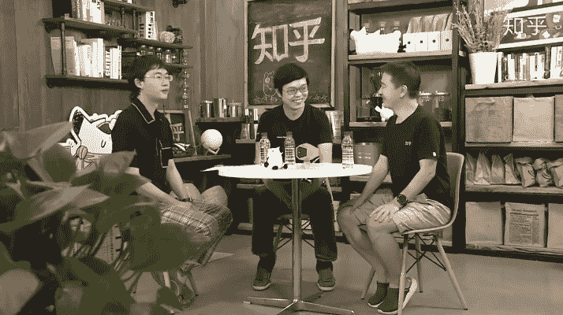
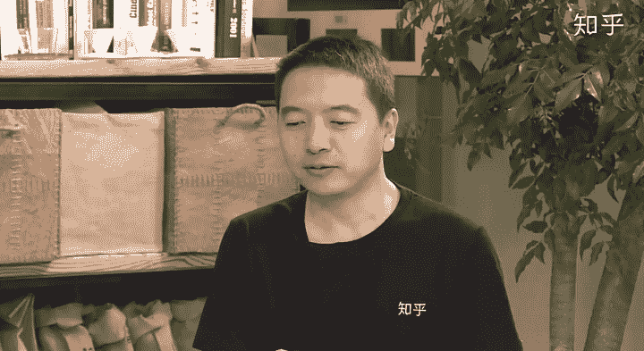
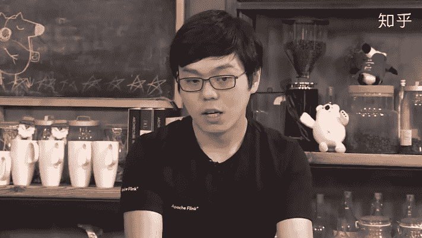
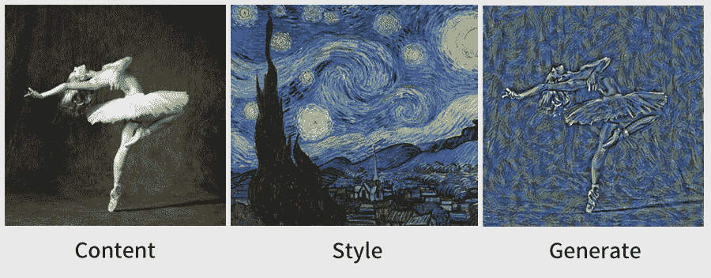

作者 | 陈彩娴、蒋宝尚

 编辑 | 青 暮

算法工程师不仅需要具备牛逼的算法能力，还要精通业务、善于沟通？（小本子赶紧记下来！）

8月23日晚，知乎直播“AI时代听大咖聊”邀请到AI领域的两个大神，分别是阿里云智能高级研究员贾扬清，以及知乎CTO李大海。

在直播中，贾扬清与李大海就国内外AI研究区别、在校生/职场新人如何培养自己的AI才能、AI应用落地，以及AI在未来的发展趋势展开讨论。

在讨论中，贾扬清认为：没有算法工程师这个角色，只有两个角色，一个是算法的研究人员，一个是应用的工程师，而“调参侠”没有市场。

另外，作为Caffe、PyTorch和Tensorflow曾经的核心开发者，他还提到，深度学习框架并不会出现大一统的局面，因为现实中需求很多，并没有一家机器学习框架能够囊括所有的需求。

**1**

**“专业”除草，没想到卖了3亿美元**

**Q1：能否请两位聊一下国内外做AI领域的研究有什么区别？**

**贾扬清：**首先，国内外的工程师都很用功，而且都追求最新的技术。个人认为国内的工程师更关注如何把方法与业务结合起来，而国外在AI方面有一些很好玩的事情。

举两个例子：一个是，如今很多农产品（比如黄瓜）在运去超市前需要筛选出大小、质量等许多方面合格的产品。以前都是用手分拣的，很麻烦，但自从有了深度学习的框架TensorFlow之后，有精通工程的年轻农民就结合算法，使用机器学习自动对黄瓜进行分类，实现了：大一点的黄瓜送超市，小一点的拿去做零售。

第二个是，我有一个研究生同学把Raspberry Pi放在后院，后院里有一个喂鸟的地方，松鼠经常过来，他就拿那个Raspberry Pi识别松鼠，松鼠一来就把它赶走。这些技术看着好像没有什么用处，但后来产生了非常多应用。硅谷有一个公司叫Blue River Technology，他们做的事情是运用技术在田间地头找杂草、除杂草，有点类似筛黄瓜、找松鼠。这个公司后来被美国最大的农机制造商约翰迪尔公司以3亿美元收购了。他们很多时候是出于纯粹的技术好奇心，但后来创造了一个产业。我觉得这是国外蛮有意思的一点。

直播截图 

**李大海：**扬清讲的这个公司我有印象，他们通过识别杂草、然后定点喷洒除草剂，杂草率可以降低到原来的10%。硅谷的公司一直有这个文化。当时我在谷歌的时候，Eric（谷歌执行董事长）曾经讲过一个很好玩的故事：当时在谷歌有一个柜子专门放T恤。在谷歌，无论发生什么，他们都会把事件印在T恤上，不定期往柜子里塞，然后大家去抢。当时柜子附近有一个摄像头，Eric就基于摄像头写了一些代码去监控这个柜子。一旦识别出这个柜子附近有人，摄像头就会发出“警报”来通知Eric，然后Eric一看到有人往柜子里面塞T恤就去抢。在美国，这些工程师会自发地去做这种（技术应用的）微创新。

国内工程师在创新方面与国外可能有一些差别。目前国内的AI应用场景已经很广。比如说，在知乎的工程团队里，大概1/6的人都是算法工程师。在工业界，算法确实已经渗透到应用场景的方方面面。第二点是，AI应用从互联网开始逐渐推向越来越多的传统企业和传统行业。但在个人层面，与国外相比，国内的工程师可能较少会自发去发现一些微小的创新机会，并实现它。

**2**

**如何优雅入“AI”这个坑**

**Q2：作为一个在校生，我要如何将学习与业务结合，如何培养自己的AI能力、才能进入比较好的互联网公司呢？**

**李大海：**我们一般称掌握了AI知识的同学为“算法工程师”。算法工程师在本质上首先是一个工程师，所以一个工程师所具备的能力，算法工程师也应该具备，例如说：1）代码能力，能够通过代码实现自己的想法；2）数据能力，即能够对数据进行分析，并发现数据所包含的重点，同时对数据进行处理；3）与人沟通的能力，因为算法工程师都是在团队里面工作，不是单打独斗，所以需要能够与同组的其他工程师、产品经理、测试和其他同事进行沟通。

第二点是算法工程师需要培养业务能力，即对业务的理解。工程师首先要掌握业务应用的知识。业务场景非常多，但每个场景所面临的问题是不一样的，所以算法工程师一定要理解业务到底是需要解决什么问题，具备定位问题、发现问题、拆解问题和解决问题的能力。

综上，对于在校生来说，拥有对算法的理解能力是非常重要的特质。虽然算法工程师都喜欢自黑，称自己是“调参侠”，但除了调参之外，还需要知道算法背后的原理。我们现在处于深度学习时代，但是在“前深度学习时代”有很多浅层模型，这些模型因为没有深度学习碾压式的表达能力，所以在浅层模型上做了很多思考。

个人认为：“当年”那些模型所用到的技巧对于培养机器学习的能力和解决现实问题是非常重要。

       直播截图

**贾扬清：**同意大海的观点：分析问题，定义问题，然后解决问题的整个逻辑非常重要。在校生得到的训练更多是：如何解决问题的能力。但其实如果问题定义清楚了，解决问题的方法就会出现很多。

另外，从工程的角度补充两点：第一，如何获取最新的技术和算法？现在整个开源领域进展迅速。其实，不光是开源，也有很多开发支持平台。所以，大家可以保持好奇心，然后多带着玩的心态进行尝试。例如三年前，名为叫Neural Style Transfer的AI应用，将拍的照片上传之后，就可以转换成一张类似梵高风格的艺术照。

第二是，“摸透”应用的实现流程。落地应用是“昙花一现”，但应用背后所涉及的工程步骤，例如把算法快速地迭代出来、如何做算法优化、如何把算法放到手机上，如何上线，等等。这种实际操作的流程和只看论文和demo是不一样的。今天，我们有GitHub这类的开源社区，很多实际操作都比以前更加容易。

**李大海：**我想补充一点。有段时间我订阅过arXiv上面的 topic，但我发现这是个坑。arXiv最近在机器学习领域非常火热，每天都大量的论文发布出来，其中包含很多不同领域的或大或小的突破，这其实会让人眼花缭乱。所以在这种情况下，我给学生们的建议是：自己先抓住一个重点（领域），至于其他领域，简单了解那些技术和突破是什么就好。

**Q3：假设一个同学已经入职了，已经成为算法工程师，他可能会经历初级、中级、高级三个阶段。所以，关于初级算法工程师怎么晋升到中级算法工程师，以及中级算法工程师怎么晋升到高级算法工程师，两位有何看法？**

**贾扬清：**我觉得挺重要的一点是学习是所谓的engineering practice（工程实践）。很多时候，我们在写研究代码时，跟研究本质是一样的，因为研究是快速迭代，不需要做工程实现。假如，今天要上线一个功能，不仅要保证它的整个foundation（基础）是solid（坚固）的。这时候，我们怎么做代码的管理、协同、review（审查）、测试、CD和上线？怎么做 performance（性能）的benchmark（基准）跟profiling ？这一系列的工程流程也挺重要。

第二点是保持好奇心。其实任何一个公司的平台都是挺大的。拿阿里大数据和AI平台来举例子，像ODPS（Open Data Processing Service）大数据平台是10年前开始建造的，今天平台非常复杂，包括上层的C语言库、中间的 Query Optimization（查询优化）和底层的执行调度，肯定不能完全把握。在这个时候，算法工程师就要与他人保持交流，多提问、多讨论。就像T型，对系统的某一点了解特别深，对系统的其他部分就触类旁通。逐渐成为一个高级算法工程师之后呢，成为一个架构师所拥有的能力，其实也能使得我们在更看得更宽、看得更大的同时，有一个更加全局的系统架构的视野。

**Q4：扬清有没有一些具体的建议？比如说你在学生时代是怎么学习的？用什么途径获取到新的 AI资讯，遇到问题怎么解决？**

**贾扬清：**在我学生时代，当时大家了解深度学习的算法是通过看论文，看完论文后大概就知道怎么做架构设计。在看论文的过程中会有非常多的输入，比如我们学到，人们最开始写深度学习框架的时候（Torch是2000年左右出来的，Theano是2008年出来的），它们的架构设计怎么做神经网络、怎么做layer（层数）等等，这对我们后来设计其他的框架，像Caffe、MXNet、PyTorch等等，是非常有帮助的。再比如说，我们怎么样做模型civilization的格式化等等，这时候谷歌的ProtoBuf又是一个很好的测试框架，如G test。这些现有的工程实践以及设计有现成的代码、文档和应用，看这些其实能够在实际中提升自己的能力。

**李大海：**我非常赞同扬清的观点，就是在学校的时候我们会更关注代码的算法上是否足够精妙，但是对架构和工程的关注度是不够的。我自己在早年的时候也犯过这样的错误，像我们数学系毕业的，在工程上接受到的培训是偏少的，但进入公司以后，工程实践却变得很重要。扬清之前在一次线下分享中曾提到的一句话我也很赞同，就是：AI是一个系统工程，90%的时间里所做的事情都跟算法无关。在现实中也确实是这样。

那么，作为刚入职的同学，其实首先我认为入职已经晚了，在入职前就应该挑选一个在工程上相对规范的公司去入职。如果是一个小公司，自己又没有工程上的 sense（意识），那么你进入的是一个工程规范很乱的一家公司，这对于个人的职业发展和工程能力的培养是很有问题的。

**Q5：想请问两位 AI从业者，你们觉得跟其他AI从业者比，你们最大的优势是什么？**

**贾扬清：**在AI领域里，在业界做得非常成功的人或团队都有一个特点，就是业务化。他们不光懂算法，而且懂得怎么用算法。因为在今天，算法已经迅速普及，找一个研究生，两分钟就能搞出ResNet。

另外，AI算法的创新在逐渐变慢。比如说，Bert在NLP领域，ResNet在CV领域都已经比较成熟。虽然算法创新还可以稍微提升一下，但算法已经不是一个核心的differentiate（区别点）。在这种情况下，怎么样找到实际应用场景，如何把算法和应用结合起来，我觉得这是最能体现出价值的地方。所以，如今AI的突破可能不是在算法上，而是“算法+系统+应用”，而且应用可能会变得越来越重要。

**李大海：**我们还处于AI的应用层。AI现在已经是一个非常大的框，里面可以放非常多东西，领域也非常广。我觉得我们更像是AI行业的从业者，是把AI当成一个功能强大的工具去使用。

我们的团队内部曾经很喜欢一个国外经济学家写的一本书，叫《与运气竞争》          

里面讲到，当我们手上有一把钻子的时候，很容易想到的是我拿着钻子可以干嘛？但其实很多时候，用户可能只需要钻一个孔来挂衣服。所以，如果你想的总是“如何提高钻头的合金程度”、“让它变得更好看”，这可能根本就不是用户想要的。

总的来说，工具非常重要，我们对于 AI的理解和AI前沿技术的跟踪也很重要，但更重要的事情是：用户的需求到底在哪里，我们能解决什么问题。

**3**

**感知大神VS决策白痴**

**Q6：现在人工智能处于什么发展阶段？它未来会给我们带来哪些改变？它的长期规划可能是什么样的？**

**李大海：**如果要判断AI目前处于什么阶段，我们得先知道AI的全景是什么样子，但这个很难预测。这时又会涉及到：人工智能最后到底能走到什么阶段？它能不能达到强人工智能的状态？我的观点是偏悲观的，我觉得强人工智能可能永远都达不到。

但说到应用，我们可以看到，人工智能在许多领域里已经打败人了，比如说图片分类。所以在应用层面上我是很乐观的。人工智能的历史始于20世纪初，后来经历了一些起起伏伏。

到今天，AI可能有一些泡沫，但这个泡沫其实是AI公司在商业模式上遇到的问题。但从技术层面上讲，AI这个工具越来越强大，数据量越来越大，这些都是毋庸置疑的事情，所以在应用层面上我是很看好的。

**贾扬清：**从历史的角度来看，计算机诞生的目的是为了更加智能化地处理人与世界交互的问题。在人工智能最早的时候，大家都在处理决策的问题。等决策系统做了一堆工作后，我们发现，其实我们首先都还不知道这个世界是如何从一个像素、语音“导入”到计算机逻辑的系统里。所以在前面这几年，深度学习其实是在从决策层面转到感知层面，从而来解决感知的问题。

从感知的角度来说，今天已经相对较成熟。例如2014年，图像识别的正确率在一个限定的范围内已经超过人类。

回过头来看决策，人工智能的决策发展还不行。比如说，在自动驾驶里，我能感知这里有一辆车、那里有一个人，但是知道后如何做决策？逻辑是什么？甚至在一些更复杂的场景，例如限速25，但前面的车都超速往前开了，这时候我又怎么办呢？这些事情都是要在决策层面上解决的。人工智能很有可能会先解决感知/认知问题，然后在感知的基础上做决策。

综上，分领域来看，人工智能在认知领域已经到达非常成熟的阶段，但在决策领域可能还处于初期的探索。

**4**

**AI离不开云**

**Q7：有一句话叫“AI是云的内核，云是AI的必然形态。”如何看AI和云的关系，以及AI在云里面扮演的角色。**

**贾扬清：**为什么今天我们说云和AI是一个强结合的状态呢？我觉得原因可能有两点：一是算力，二是数据。从算力的角度来说，以前我们在学校做实验或自己创业的时候都搭过机器。搭机器很痛苦，而且运维机器在一定程度上不产生价值，然后AI又对GPU有非常强烈的需求。GPU又是一个很恶心的事，有时候运行不错，有时候又会过热，有时候又需要我们做资源的调度等等。任何一个实验室都会遇到资源调度问题：一个是科研人员在那找GPU的时候发现找不着，然后系统工程师跑去一看，说：“哇天啊！利用率好低！”一边是starvation（饥饿），一边是satiation（饱和）。

如今，云可以很好地解决算力问题。30年前，所有的单位都有一个发电机，但今天没有人用发电机了，因为底层的基础设施已经非常成熟，可以低成本、大规模地给社会提供电力。在今天，云的计算力就像水电煤一般的基础设施，我们不需要担心哪天机器哪里出了问题。比如说，今天我突然要拉起一个大量的应用，这个时候云可以“soo”一声弹上来，不要了就放掉。这是算力方面。

第二个是数据。前段时间，许多人关注深度学习领域，如图像、语音等等。但许多AI应用其实是跟结构化数据绑在一块的。咱们举个例子。比如说像知乎有大量的用户内容，这涉及到两方面：一方面是自然语言的处理，另一方面是用户和内容的匹配。这时候，其实是在一个大数据底座（像Hadoop和MaxComput）上面做结构化数据的人工智能。

这和一个大规模分布式系统是分不开的，因为我不可能今天说把这些数据放到一个GPU机器上面，拿三个SSD把它给接起来。所以这时候就需要一套比较完整的系统，从数据的存储、处理、分析到计算，到上层去进行任务的编排、模型的开发、模型的上线，以及数据的回流。无论用户是自己搭一个系统（我们叫“私有云”），还是在公有云上面进行，云都是AI不可或缺的一个环境。

今天的AI，越来越多会关注到系统、云。这也标志着AI未来发展的必然形态。目前，算法能够“单机”开发，但是如何运用算法，则需要算力和数据的支持，因此也会需要云和云相关的技术。

我现在在做的工作是把AI和大数据进行结合。例如，前段时间我们发现：深度学习的工程师会发现目前的大数据平台不能满足需求。因为过去需要数据库管理结构化数据，而如今需要大数据逐渐向这种深度学习的应用领域进行改变。

另一方面，对于结构化的应用工程师来说，当存在推荐系统的需求时，所需要的并不是把所有的代码写出来，而是通过更加灵活的“拖拉拽”等方式。因此，过去是从大数据的角度进行AI落地，而未来一到两年内需要从系统的层面，推动非结构化深度学习场景和结构化“传统经济学产品”进步。

**5**

**算法工程师的未来“凶多吉少”**

**Q8：AI工程师和AI算法工程师之间有何不同？各自的发展趋势是怎样的？两者会不会融合？**

**李大海：**在谷歌内部，AI的工作是普通的工程师在进行，只要把问题描述清楚，然后放到“系统”上，系统就能够给出一个大概的解决方案。在未来，随着技术的发展，AI和AI工程的门槛会越来越低。这就意味着AI工程师的从业门槛也会越来越低。

但是有许多缺口需要AI工程师补充，所以，AI工程师也需要积累算法。因此，从这个角度来看，AI工程师既需要懂架构，又需要懂算法。对于学生或者刚进入工作的职场新人而言，需要好好塑造自己的方法论，快速补充自己，根据自己的业务需求让自己的能力变强。

其实，无论是在谷歌还是在知乎，我们招聘工程师都有一个标准，即希望工程师足够聪明，能够快速学习，可以根据自己的业务补充“技能树”。

综上，无论是算法还是工程，其基础能力和学习能力非常重要。

**贾扬清：**我来讨论可能相对比较有争议性的话题：个人认为没有算法工程师这个角色，只有两个角色，一个是算法的研究人员，一个是应用的工程师，而“调参侠”没有市场。因为，有的调参工作只需要写for 循环语句即可。

算法的科研人员更多是攻坚“更好的算法”，例如在计算机视觉领域，可能要把模型做得更大、更准，在某些问题上需要把模型做得更小。当然，在具体量化的过程中，需要在两者之间进行平衡。也就是说，科研人员更多是思考如何在一些“普遍”的场景下对算法进行创新。

在具体的应用过程中，调参只是一个手段。例如，在无人驾驶领域，其场景和机场的云点识别的场景非常类似，但是其数据的分布不一样，所要做的事情不一样。应用工程师更多的是了解其背后的业务场景差距和限制，例如传统的约束满足问题(CSP)。所以，应用工程师更多的是对端到端进行整合，找到最优的方向进行调参，也就是说，调参只是一个手段。综上，调参侠没有市场，现实中只存在算法科研人员和应用工程师。

**6**

**小板凳蹲阿里、知乎的AI展望**

**Q9：AI的发展情况如何？在知乎和阿里有哪些技术沉淀？未来的应用情况、重点投入的AI方向是什么？**

**李大海：**目前的AI工作和场景结合紧密。抽象来看，（知乎）有三大方向：一是内容生产，如何利用AI让内容生产进行更有效率，例如创作者匹配、激活创作者；二是内容理解，建立内容概述，对内容质量有初步把握，例如内容底线内容在哪里？内容是不是带有辱骂性质？是不是有极端（仇恨）情绪；三是内容分发，这个方向建立在第二个方向基础之上，但不再仅仅局限在内容的理解上，还需要对用户进行理解。具体而言有两种情况，一是用户主动搜索，将AI算法赋能到搜索引擎里；二是，被动推荐，将高质量内容推荐给合适用户。

那知乎在文本方面（NLP）有哪些工作呢？主要有两个方面，一是分词，例如最近的一次迭代结果是：F1的值从91%上涨到93.5%。二是词性的判断，这类工作包括命名实体识别、消歧等等。

**贾扬清：**阿里有很多团队在研究AI，例如阿里的PAI团队致力于AI的开发和治理的平台，基本上阿里的所有工程师都会在上面做开发，达摩院的同学就会在上面构建很多应用和落地的算法，包含图片、语音等等。

具体而言，阿里在开发和工程平台上基本上有三方面的应用，首先是AI和大数据的结合，目的是在传统机器学习领域里，如何让应用工程师、或者数据科学家更加容易使用数据和算法。换句话说，更加丰富、更加成熟、更加高效的算法的结合，目的是为公司提供需要的场景化的解决方案。最典型的例子有两个，一个是搜索推荐，另外一个是金融风控。这两个领域对AI存在强需求。如果存在场景化的解决方案，那么就能让其更容易将领域数据和AI相结合。

第二是更加云原生、顺畅的AI的深度学习的体验。以往的大数据、深度学习平台其结构往往比较重，使用云原生“容器化”的能力可以构建出一个和“自己”的开发环境相符合的“产品”。例如在无人驾驶场景中，可以实现非常灵活的深度学习开发，构建灵活的深度学习应用。

第三是更加成熟的工程化的AI算法的部署，旨在解决模型的稳定程度和弹性以及检测模型的性能。再者，如果有新的模型上线，如何进行A/B 测试？如何回流模型的用户反馈？等等都是需要考虑的问题。

在阿里我们还进行了一些“隐形”的工程能力。例如，针对系统利用率低，我们做了资源调度、资源的编排管理等工作。具体而言，我们在OSDI这一会议发布了异构相关文章，还发布了在推理的框架里如何自动生成代码等论文。这些工作在产品中显现不清楚，但是确确实实能够帮助平台降成本，增效率。

**Q10：有何展望？阿里云会不会有自己的深度学习框架？接下来有哪些新的产品形态？**

**贾扬清：**接下来在产品形态上会把产品做得更加成熟，更加模块化。目的是让大家根据自己的需求进行灵活选择，模块化的灵活组合。

另外，也会着重强调稳定性和用户体验。关于深度学习框架，个人逻辑是：从需求出发。TensorFlow和Pytorch其出现的原因也是这个逻辑，例如TensorFlow能够迎合“在一个大规模的弹性系统上面，灵活构建高性能AI的需求”。

但是TensorFlow也有学习难度比较大的弱点。所以针对学习难度问题，出现了Pytorch。目前，这两者也在相互借鉴，例如TensorFlow在增强用户体验，Pytorch在增强系统能力。所以，从需求的角度来看，这两者在一定程度上很好的解决了用户体验问题。

设计深度学习框架切记不要 meet to product，即和TensorFlow和PyTorch在结构上不一样，但是所能够满足的需求，能够做的事情是一样的。（贾扬清意思是：这种框架不值得）

其实，个人认为，当前最重要的价值是如何更好的对接软硬件的协同设计，不光是大规模的系统，如何将众多的芯片（例如平头哥芯片、AMD芯片、苹果芯片）和框架进行对接，也是一个非常现实的工程问题。

所以，软硬件系统的设计才是核心问题，能否出现新的深度学习框架，这个框架将会解决什么问题，也都会围绕这个核心问题。

**7**

**精挑细选的问答**

问答1：作为CTO，管理着上百人的技术团队，你们一天的工作内容是什么？

**李大海：**技术体系的工作分为两种，第一种是建体制，即从机制层面思考创造让团队认真工作的环境。让大家觉得工作更愉悦，工作目标更明确。如果这个问题解决不好，直接会影响工程团队的组织能力，会影响到团队的文化氛围。

第二种是对重点的工作领域进行分类，在几百人的团队里，我们的工作覆盖面非常广，所以我会关注到哪些领域的重要程度最高，然后判断现状和重要程度之间的差距如何。

最后，我作为全局领导者，拥有的信息比较全面。也会关注拥有部分信息的员工所作出的决策，如果他出现错误，我会进行纠正。

**贾扬清：**有四个方面，第一做事情，即如何搭建平台，如何进行业务，这里涉及到和阿里云的其他团队进行对接，讨论需求，商量决策。

第二是如何通过团队之间的良好沟通，确保团队的战斗力。这需要考虑人的喜怒哀乐，需要考虑组织温度。

第三，如何构建机制，我们的做法是通过“战役”进行确定重点方向，例如针对用户体验，用战役的机制进行讨论、执行，确保能够做出用户需要的产品。

第四，自我学习。在做管理的时候，感觉自身有很多不足的地方。并且，我的知识储备和团队相比并不会雄厚。所以，需要自我学习，提升能力，从而更好的管理团队。

总结一下，我在阿里云做管理，涉及到的工作是：人、机制、自我学习。

**问答2：会不用有一个大一统深度学习框架？**

**贾扬清：**我觉得不会， 例如可口可乐和百事可乐；安卓和ios ，mac和windows。曾经看到过这么一个经济学观点，我们的现实需求很多，并没有一家能够囊括所有的需求。例如在最好的语言评选中，数据科学家更倾向于Python，系统工程师会选择C++。因此，不会有一个一统江湖的框架，也不会存在一成不变的框架。（编者注：贾扬清说的可能是政治经济学里面的“垄断并不会消除竞争”~）

**李大海：**同意贾扬清的观点，但是我想从另一个角度讨论这个问题。例如微信只有一个，但是其他产品可能会出现并存。是否形成一家独大的判断标准，我认为是是否有网络效益。机器学习平台并没有那么强的网络效益，需求的点有很多，不同的需求可能存在不同的平台。所以，Tensorflow和Pytorch这两大主流平台可能会长期存在，而在某些垂直领域还可能出现某些“小而美”的平台。

**问题3：有哪些好的学习方法，最近在看的书可以分享？**

**贾扬清：**学习方法在于好的知识输入渠道，推荐四个：1、知乎；2、Hacker News；3、TechCrunch；4、Reddit machine learning group。关于书籍，最近在看一些管理方面的书籍，例如《公司的进化》。

“干货分享，**点****赞****三连**↓