这篇文章主要介绍的是家用的深度学习工作站，典型的配置有两种，分别是一个 GPU 的机器和四个 GPU的机器。如果需要更多的 GPU 可以考虑配置两台四个 GPU 的机器。

如果希望一台机器同时具备 6~8 个 GPU 需要联系专门的供应商进行配置，并且有专业的机房存放，放在家里噪声很大并且容易跳闸。

**CPU**

由于最近 AMD 和 Intel 频繁更新 CPU，因此大家选择新款的 CPU 比较好。

**CPU 与 GPU 的关系**

CPU 瓶颈没有那么大，一般以一个GPU 对应 2~4 个 CPU 核比较好，比如单卡机器买四核 CPU，四卡机器买十核 CPU。

当你在训练的时候，只要数据生成器（DataLoader）的产出速度比 GPU 的消耗速度快，那么 CPU 就不会成为瓶颈，也就不会拖慢训练速度。

**PCI-E 支持情况**

除了核数，你还需要注意 PCI-E 支持情况，一般显卡是 PCI-E 3.0 x16，比如 i9-9820X 的 PCI-E 通道数是 44 ，配置四卡的话，只能支持 1x16+3x8+1x4，也就是单卡全速，三卡半速，一个 NVMe 固态硬盘。这种情况下可以考虑选择带有 PLX 桥接芯片的主板。

AMD 的 2990WX 有 64条 PCI-E，但是只支持 x16/x8/x16/x8 的四卡配置。

**英特尔CPU**

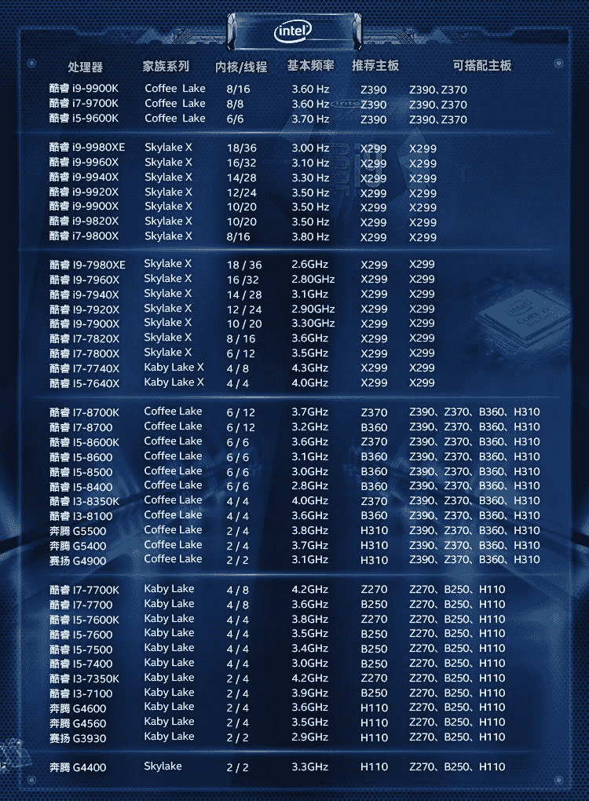

英特尔CPU

双卡机器选 i9-9900K，四卡机器按照预算选X系列的CPU。

**主板**

主板需要注意：

*   CPU 接口是否能对上，如LGA2066 和 SocketTR4

*   PCI-E 插槽的高度是否够插显卡，比如 PCI-E 插口之间的距离至少要满足双槽宽显卡的高度

*   PCI-E 同时可以支持几张卡以什么样的速度运行，如 1x16 + 3x8 是常见的配置

**主板必看参数**

GIGABYTE X299 AORUS MASTER (rev. 1.0) 使用了 4 组 2 槽间距显卡插槽设计，支持1x16、2x16、2x16 + 1x8、1x16 + 3x8 四种配置（需要十核以上的 CPU），这里请参阅说明书安装显卡，安装在不同位置的速度是不一样的：

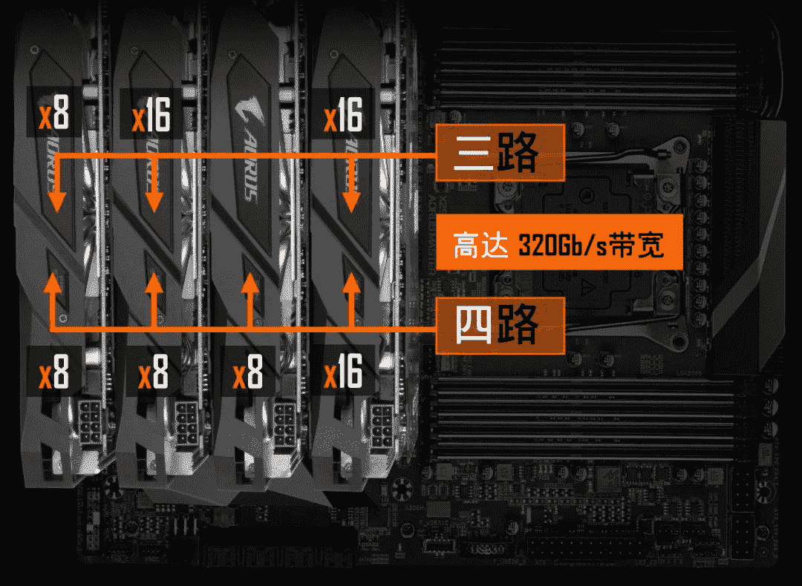

GIGABYTE X299 AORUS MASTER (rev. 1.0)

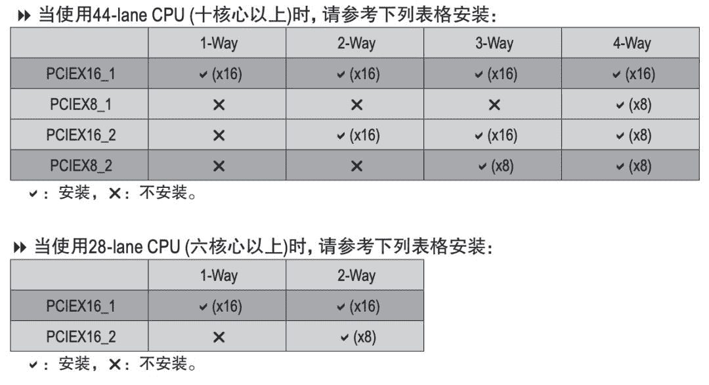

GIGABYTE X299 AORUS MASTER manual

**带有桥接芯片的主板**

有的主板如 WS X299 SAGE 带有 PLX 桥接芯片，可以在 CPU 没有足够 PCI-E 的情况下达到四卡 x16 的速度：

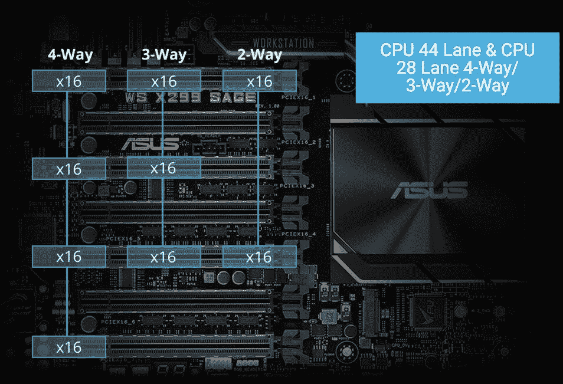

WS X299 SAGE

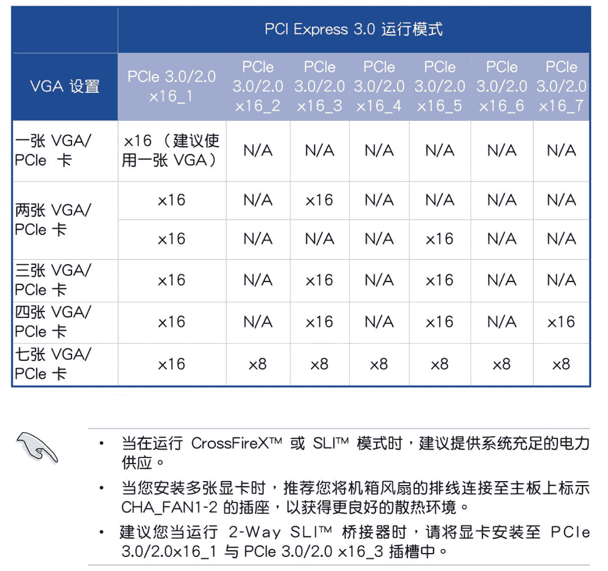

WS X299 SAGE User Guide

在多卡并行训练的时候，PCI-E 的传输速度决定了梯度同步的速度，如果你训练的的模型比较大，希望搭建多卡机器，建议选择支持四路 PCI-E x16 的主板。

**显卡**

**显卡性能表**

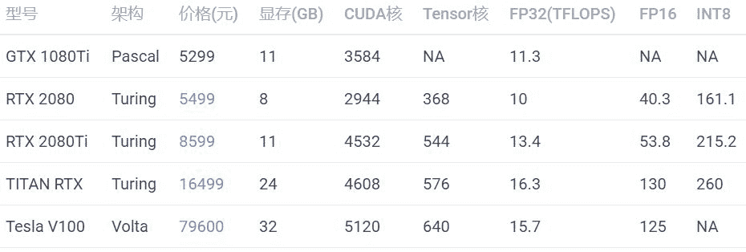

训练需要 FP32 和 FP16 的性能，推断需要 INT8 的性能。训练大模型需要注意显存大小。

考虑成本可以买 RTX 2080Ti，想要高性能并且高性价比可以买 TITAN RTX，土豪可以选 Tesla V100。

RTX 2080 显存较小，不推荐。GTX1080Ti 已经出了太久了，网上都是二手卡，不推荐。

**涡轮与风扇**

采购显卡的时候，一定要注意买涡轮版的，不要买两个或者三个风扇的版本，除非你只打算买一张卡。

因为涡轮风扇的热是往外机箱外部吹的，所以可以很好地带走热量，散热比较好。如果买三个风扇的版本，插多卡的时候，上面的卡会把热量吹向第二张卡，导致第二张卡温度过高，影响性能。

风扇显卡很有可能是超过双槽宽的，第二张卡可能插不上第二个 PCI-E 插槽，这个也需要注意。

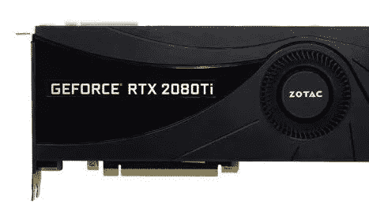

涡轮散热

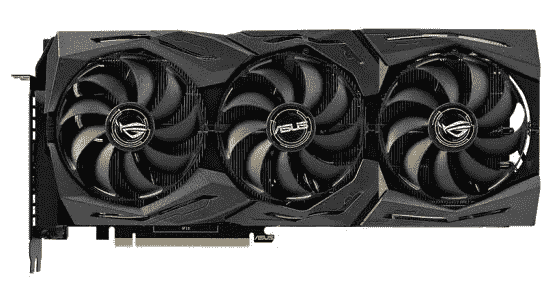

风扇散热

**服务器推断卡**

除了用于训练，还有一类卡是用于推断的（只预测，不训练），如：

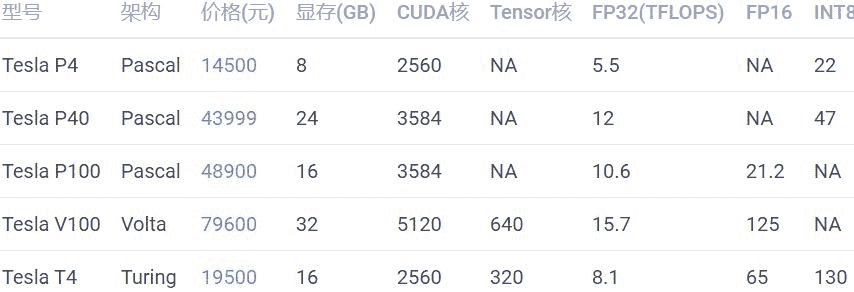

这些卡全部都是不带风扇的，但它们也需要散热，需要借助服务器强大的风扇被动散热，所以只能在专门设计的服务器上运行，具体请参考英伟达官网的说明。

性价比之选应该是 Tesla T4，但是发挥全部性能需要使用 TensorRT 深度优化，目前仍然存在许多坑，比如当你的网络使用了不支持的运算符时，需要自己实现。

英伟达只允许这类卡在服务器上运行，像 GTX 1080Ti、RTX 2080Ti 都是不能在数据中心使用的。

> No Datacenter Deployment. The SOFTWARE isnot licensed for datacenter deployment, except that blockchain processing in adatacenter is permitted.

* * *

**硬盘**

**硬盘类型**

常用硬盘接口有三种：

SATA3.0，速度 600MB/s

SAS，速度 1200MB/s

PCIE 3.0 x4（NVMe)，速度 3.94GB/s

**参数对比**

下面是根据代表产品查询的参数：

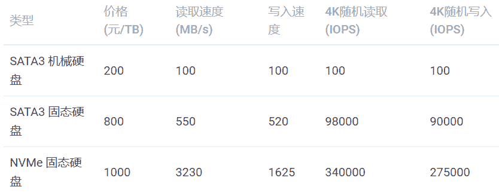

注：

4K 随机读写的队列深度为 32

SATA3 机械硬盘没有太好的数据来源，所以数据是经验值

SATA3 固态硬盘数据来源：三星（SAMSUNG）1TB SSD固态硬盘 SATA3.0接口 860 EVO

NVMe 固态硬盘数据来源：英特尔（Intel）1TB SSD固态硬盘 M.2接口(NVMe协议) 760P系

在面对大量小文件的时候，使用 NVMe 硬盘可以一分钟扫完 1000万文件，如果使用普通硬盘，那么就需要一天时间。为了节省生命，简化代码，硬盘建议选择 NVMe 协议的固态硬盘。

如果你的主板不够新，没有NVMe 插槽，你可以使用 M.2 转接卡将 M.2 接口转为PCI-E 接口。

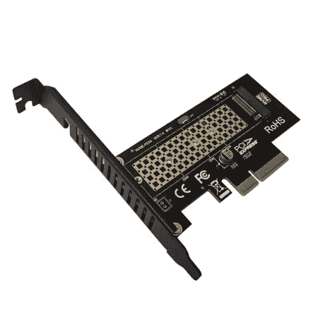

M.2 转接卡

**内存**

内存容量的选择通常大于显存，比如单卡配 16GB 内存，四卡配 64GB 内存。由于有数据生成器（DataLoader），数据不必全部加载到内存里，通常不会成为瓶颈。

**电源**

先计算功率总和，如单卡 CPU 100W，显卡 250W，加上其他的大概 400W，那么就买 650W 的电源。

双卡最好买 1000W 以上的电源，四卡最好买 1600W 的电源，我这里实测过四卡机用 1500W 的电源来带，跑起来所有的卡以后会因为电源不足而自动关机。

一般墙上的插座只支持 220V 10A，也就是 2200W 的交流电，由于电源要把交流电转直流电，所以会有一些损耗，最高只有1600W，因此如果想要支持八卡，最好不要在家尝试。八卡一般是双电源，并且需要使用专用的 PDU 插座，并且使用的是 16A 插口，如果在家使用，会插不上墙上的插座。

**网卡**

一般主板自带千兆网卡。如果需要组建多机多卡集群，请联系供应商咨询专业的解决方案。

**机箱**

如果配单卡，可以直接买个普通机箱，注意显卡长度能放下就行。

如果配四卡机器，建议买一个 Air 540 机箱，因为我正在用这一款。

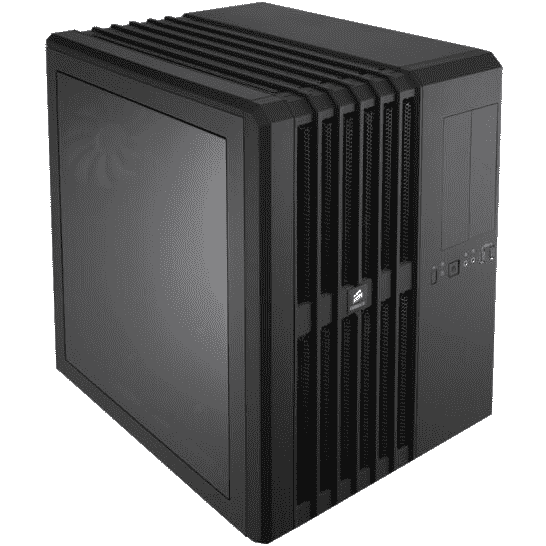

Air 540

**显示器**

深度学习工作站装好系统以后就不需要显示器了，装系统的时候使用手边的显示器就行。

**键盘鼠标**

深度学习工作站装好系统以后就不需要键盘鼠标了，装系统的时候使用手边的键盘鼠标就行。

**参考链接**

Turing 架构白皮书

Volta 架构白皮书

RTX 2080 Ti Deep Learning Benchmarks with TensorFlow - 2019

https://developer.nvidia.com/deep-learning-performance-training-inference

https://www.nvidia.cn/object/where-to-buy-tesla-catalog-cn.html

https://www.supermicro.org.cn/support/resources/gpu/

https://www.geforce.com/drivers/license/geforce

“整理不易，**点****赞****三连**↓