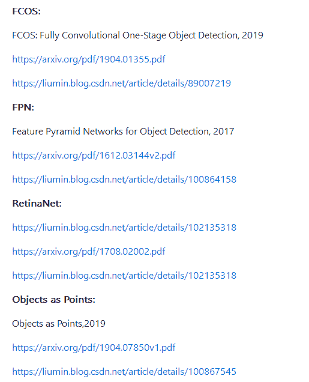

 Datawhale干货 

**作者：红色石头，北京大学，Datawhale伙伴**

大家还记得这张图吗？


之前，红色石头发文介绍过一份很不错的资源：

[52 个深度学习目标检测模型汇总，论文、源码一应俱全！](http://mp.weixin.qq.com/s?__biz=MzIwOTc2MTUyMg%3D%3D&chksm=976c5198a01bd88ed97392c0a8d6cdad239211b77ca465617c638f9eb1aa9957185738626f1d&idx=1&mid=2247496709&scene=21&sn=b455d486db9700ba46c0df836b53effa#wechat_redirect)

深度系统介绍了 52 个目标检测模型，纵观 2013 年到 2020 年，从最早的 R-CNN、OverFeat 到后来的 SSD、YOLO v3 再到去年的 M2Det，新模型层出不穷，性能也越来越好！

上文聚焦于源码和论文，对于各种卷积神经网络模型的实现，本文将介绍它们的 PyTorch 实现，非常有用！

这份资源已经开源在了 GitHub 上，链接如下：

https://github.com/shanglianlm0525/PyTorch-Networks

先来个总结介绍，该系列的卷积神经网络实现包含了 9 大主题，目录如下：

**1\. 典型网络** 

**2. 轻量级网络**

**3. 目标检测网络**

**4. 语义分割网络**

**5. 实例分割网络**

**6. 人脸检测和识别网络** 

**7. 人体姿态识别网络**

**8. 注意力机制网络** 

**9. 人像分割网络**

下面具体来看一下：

## 1\. 典型网络（Classical network）

典型的卷积神经网络包括：AlexNet、VGG、ResNet、InceptionV1、InceptionV2、InceptionV3、InceptionV4、Inception-ResNet。


以 AlexNet 网络为例，AlexNet 是 2012 年 ImageNet 竞赛冠军获得者 Hinton 和他的学生 Alex Krizhevsky 设计的。AlexNet 中包含了几个比较新的技术点，也首次在 CNN 中成功应用了 ReLU、Dropout 和 LRN 等 Trick。同时 AlexNet 也使用了 GPU 进行运算加速。


AlexNet 网络结构的 PyTorch 实现方式如下：

```
import torch
import torch.nn as nn

def Conv3x3BNReLU(in_channels,out_channels,stride,padding=1):
    return nn.Sequential(
            nn.Conv2d(in_channels=in_channels, out_channels=out_channels, kernel_size=3, stride=stride, padding=1),
            nn.BatchNorm2d(out_channels),
            nn.ReLU6(inplace=True)
        )

def Conv1x1BNReLU(in_channels,out_channels):
    return nn.Sequential(
            nn.Conv2d(in_channels=in_channels, out_channels=out_channels, kernel_size=1, stride=1, padding=0),
            nn.BatchNorm2d(out_channels),
            nn.ReLU6(inplace=True)
        )

def ConvBNReLU(in_channels,out_channels,kernel_size,stride,padding=1):
    return nn.Sequential(
            nn.Conv2d(in_channels=in_channels, out_channels=out_channels, kernel_size=kernel_size, stride=stride, padding=padding),
            nn.BatchNorm2d(out_channels),
            nn.ReLU6(inplace=True)
        )

def ConvBN(in_channels,out_channels,kernel_size,stride,padding=1):
    return nn.Sequential(
            nn.Conv2d(in_channels=in_channels, out_channels=out_channels, kernel_size=kernel_size, stride=stride, padding=padding),
            nn.BatchNorm2d(out_channels)
        )

class ResidualBlock(nn.Module):
    def __init__(self, in_channels, out_channels):
        super(ResidualBlock, self).__init__()
        mid_channels = out_channels//2

        self.bottleneck = nn.Sequential(
            ConvBNReLU(in_channels=in_channels, out_channels=mid_channels, kernel_size=1, stride=1),
            ConvBNReLU(in_channels=mid_channels, out_channels=mid_channels, kernel_size=3, stride=1, padding=1),
            ConvBNReLU(in_channels=mid_channels, out_channels=out_channels, kernel_size=1, stride=1),
        )
        self.shortcut = ConvBNReLU(in_channels=in_channels, out_channels=out_channels, kernel_size=1, stride=1)

    def forward(self, x):
        out = self.bottleneck(x)
        return out+self.shortcut(x) 
```

## 2.轻量级网络（Lightweight）

轻量级网络包括：GhostNet、MobileNets、MobileNetV2、MobileNetV3、ShuffleNet、ShuffleNet V2、SqueezeNet Xception MixNet GhostNet。


以 GhostNet 为例，同样精度，速度和计算量均少于此前 SOTA 算法。GhostNet 的核心是 Ghost 模块，与普通卷积神经网络相比，在不更改输出特征图大小的情况下，其所需的参数总数和计算复杂度均已降低，而且即插即用。


GhostNet 网络结构的 PyTorch 实现方式如下：

https://github.com/shanglianlm0525/PyTorch-Networks/blob/master/Lightweight/GhostNet.py

## 3. 目标检测网络（ObjectDetection）

目标检测网络包括：SSD、YOLO、YOLOv2、YOLOv3、FCOS、FPN、RetinaNet Objects as Points、FSAF、CenterNet FoveaBox。





以 YOLO 系列为例，YOLO（You Only Look Once）是一种基于深度神经网络的对象识别和定位算法，其最大的特点是运行速度很快，可以用于实时系统。目前 YOLOv3 应用比较多。


YOLOV3 网络结构的 PyTorch 实现方式如下：

https://github.com/shanglianlm0525/PyTorch-Networks/blob/master/ObjectDetection/YOLOv3.py

## 4. 语义分割网络（SemanticSegmentation）

语义分割网络包括：FCN、Fast-SCNN、LEDNet、LRNNet、FisheyeMODNet。


以 FCN 为例，FCN 诞生于 2014 的语义分割模型先驱，主要贡献为在语义分割问题中推广使用端对端卷积神经网络，使用反卷积进行上采样。FCN 模型非常简单，里面全部是由卷积构成的，所以被称为全卷积网络，同时由于全卷积的特殊形式，因此可以接受任意大小的输入。


FCN 网络结构的 PyTorch 实现方式如下：

https://github.com/shanglianlm0525/PyTorch-Networks/blob/master/SemanticSegmentation/FCN.py

## 5. 实例分割网络（InstanceSegmentation）

实例分割网络包括：PolarMask。


## 6. 人脸检测和识别网络（commit VarGFaceNet）

人脸检测和识别网络包括：FaceBoxes、LFFD、VarGFaceNet。


## 7. 人体姿态识别网络（HumanPoseEstimation）

人体姿态识别网络包括：Stacked Hourglass、Networks Simple Baselines、LPN。


## 8. 注意力机制网络

注意力机制网络包括：SE Net、scSE、NL Net、GCNet、CBAM。


## 9. 人像分割网络（PortraitSegmentation）

人像分割网络包括：SINet。

综上，该 GitHub 开源项目展示了近些年来主流的 9 大类卷积神经网络，总共包含了几十种具体的网络结构。其中每个网络结构都有 PyTorch 实现方式。还是很不错的。

最后再放上 GitHub 开源地址：

https://github.com/shanglianlm0525/PyTorch-Networks

