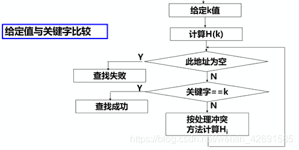

↑↑↑关注后"星标"Datawhale

每日干货 & [每月组队学习](https://mp.weixin.qq.com/mp/appmsgalbum?__biz=MzIyNjM2MzQyNg%3D%3D&action=getalbum&album_id=1338040906536108033#wechat_redirect)，不错过

 Datawhale干货 

**作者：周郴莲，东北石油大学，Datawhale优秀学习者**

## 前言

查找（Search），又称为搜索，指从数据表中找出符合特定条件的记录。如今我们处在信息爆炸的大数据时代，如何从海量信息中快速找到需要的信息，这就需要查找技术。如果有什么不懂的或要查询的，都会上网搜索一下，查找是最常见的应用之一。

本文解释了查找的基本概念和查找算法的评价指标，阐述了静态查找表的三种具体分类，以及应该如何查找哈希表，手把手教你如何解决查找冲突。最后作者结合Leetcode，带你刷一刷查找常见题。


## 1\. 查找的基本概念

**查找也即检索**。首先，简要说明在查找中涉及的术语。

> 文件：**由记录组成的集合**，即含有大量数据的元素线性组合而成。
> 记录：**由若干数据项组成的数据元素**，这些数据项也常称作记录中的数据域，用以表示某个状态的物理意义。
> 关键字：**用以区分文件中记录的数据项的值**。若此关键字可以惟一地标识一个记录，则称此关键字为主关键字。也就是说，对于不同的记录，其对应的主关键字的值均不相同。若数据元素只有一个数据项，其关键字即为该数据元素的值。

**查找是指根据给定的某个值，确定关键字值，查询确定关键字值与给定值相等的记录在文件中的位置**。它是程序设计中一项重要的基本技术。查找的结果有两种情况：**若在文件中找到了待查找的记录，则称查找成功**，这时可以得到该记录在文件中的位置，或者得到该记录中其他的信息；**若在文件中没有找到所需要的记录，则称查找不成功或查找失败**，这时，相应的查找算法给出查找失败的信息，同时也得到记录插入文件的位置。

如何进行查找？查找的方法很多，对不同的数据结构有不同的查找方法。**例如**，查电话号码时，如果电话号码簿是按用户的姓名且以笔画顺序编排，则查找的方法是先顺序查找待查用户的所属类别，然后在此类中再顺序查找，直到找寻到用户的电话号码为止。**又如**，查英文单词时，由于字典是按单词的字母在字母表中的顺序编排的，因此，查找时不需要从字典中第一个单词开始比较，而只要根据待查单词中每个字母在字母表中的位置查找该单词。在设计相应的查找算法时，就是按以上的步骤进行的。

应当注意，在计算机中进行查找的方法是根据文件中的记录是何种结构组织而确定的，对不同的结构应采用不同的查找方法。

查找算法的优劣对计算机的应用效率影响很大，同样的一个文件结构，选择正确的、适合文件组织形式的查找方法可以极大地提高程序的运行速度。查找可分为**静态查找和动态查找**两种，**在查找过程中不修改查找表的长度和表中内容的方法称作静态查找，反之称作动态查找**。

## 2\. 查找算法的评价指标

关键字的平均比较次数，也称**平均搜索长度ASL**(Average Search Length)：


*   n：记录的个数

*   pi：查找第i个记录的概率 ( 通常认为pi =1/n )

*   ci：找到第i个记录所需的比较次数

## 3\. 静态查找表

### 3.1 顺序查找

1）应用范围：

*   顺序表或线性链表表示的静态查找表

*   表内元素之间无序

2）顺序表的表示：

```
typedef struct {
	ElemType *R; //表基址
	int length;     //表长
}SSTable; 
```

3）顺序查找的性能分析：

*   空间复杂度：**一个辅助空间**

*   时间复杂度：

*   *   查找成功时的平均查找长度(设表中各记录查找概率相等)：ASLs(n)=(1+2+ … +n)/n =(n+1)/2

    *   查找不成功时的平均查找长度：ASLf =n+1

4）顺序查找算法有特点

*   **算法简单**，对表结构无任何要求（顺序和链式）。

*   n很大时查找**效率较低**。

*   改进措施：**非等概率查找时，可按照查找概率进行排序**。

### 3.2 折半查找

1）算法思想：

设表长为n，low、high和mid分别指向待查元素所在区间的上界、下界和中点，k为给定值：

*   初始时，令low=1, high=n, mid=(low+high)/2

*   让k与mid指向的记录比较：若k = R[mid].key，查找成功 若k < R[mid].key，则high=mid-1 若k > R[mid].key，则low=mid+1

*   重复上述操作，直至low>high时，查找失败

例如：


<figcaption>
</figcaption>

  2）折半查找的性能分析：

*   查找过程：每次将待查记录所在区间缩小一半，比顺序查找效率高,时间复杂度**O(log2 n)**

*   适用条件：采用**顺序存储结构**的有序表，不宜用于链式结构

### 3.3 分块查找（块间有序，块内无序）

分块有序，即**分成若干子表，要求每个子表中的数值都比后一块中数值小**（但**子表内部未必有序**）。 然后将各子表中的最大关键字构成一个索引表，表中还要包含每个子表的起始地址（即头指针）。

 1）分块查找过程：

*   **对索引表使用折半查找法**（因为索引表是有序表）

*   **确定了待查关键字所在的子表后，在子表内采用顺序查找法**（因为各子表内部是无序表）


2）分块查找优缺点：

*   优点：插入和删除比较容易，无需进行大量移动。

*   缺点：要增加一个索引表的存储空间并对初始索引表进行排序运算。

*   适用情况：若线性表既要快速查找又经常动态变化，则可采用分块查找

## 4\. 哈希表的查找

### 4.1 理论基础

1）基本思想：**记录的存储位置与关键字之间存在对应关系**：


<figcaption>在这里插入图片描述</figcaption>


*   优点：查找速度极快O(1),查找效率与元素个数n无关。

    例如：


*   查找方法：

    根据**哈希函数H(k)＝k** ，查找key=9,则访问H(9)=9号地址，若内容为9，则成功。若查不到，则返回一个特殊值，如空指针或空记录。

2）有关术语

*   **哈希方法(杂凑法)**

*   *   选取某个函数，依该函数按关键字计算元素的存储位置，并按此存放；

    *   查找时，由同一个函数对给定关键值k计算地址，将k与地址单元中

*   **元素关键码进行比，确定查找是否成功**

*   *   哈希函数(杂凑函数)：哈希方法中使用的转换函数

    *   哈希表(杂凑表)：按上述思想构造的表

 4.2 冲突解决

当不同的关键码映射到同一个哈希地址时，即冲突出现：key1≠key2，但H(key1)=H(key2)。具有相同函数值的两个关键字可以成为同义词。

1）冲突现象举例

 2）如何减少冲突

实际上，**冲突是不可能避免的**：

 3）如何解决冲突：

*   开放定址法（开地址法）

    其基本思想：**有冲突时就去寻找下一个空的哈希地址，只要哈希表足够大，空的哈希地址总能找到，并将数据元素存入**。

    步骤：

    哈希函数：

    其中：m为哈希表长度，di 为增量序列

*   *   step1 取数据元素的关键字key，计算其哈希函数值（地址）。若该地址对应的存储空间还没有被占用，则将该元素存入；否则执行step2解决冲突。

    *   step2 根据选择的冲突处理方法，计算关键字key的下一个存储地址。若下一个存储地址仍被占用，则继续执行step2，直到找到能用的存储地址为止。


*   链地址法

    基本思想：**相同哈希地址的记录链成一单链表，m个哈希地址就设m个单链表，然后用用一个数组将m个单链表的表头指针存储起来，形成一个动态的结构**。

    步骤:

    优点:

*   *   非同义词不会冲突，无“聚集”现象

    *   链表上结点空间动态申请，更适合于表长不确定的情况

    *   取数据元素的关键字key，计算其哈希函数值（地址）。若该地址对应的链表为空，则将该元素插入此链表；

### 4.3 函数构造方法

1）哈希函数的构造方法

 2）构造哈希函数考虑的因素

*   执行速度（即计算哈希函数所需时间）

*   关键字的长度

*   哈希表的大小

*   关键字的分布情况

*   查找频率

### 4.4 哈希表的查找



*   哈希表的查找效率分析：

    使用平均查找长度ASL来衡量查找算法，ASL取决于：

    α 越大，表中记录数越多，说明表装得越满，发生冲突的可能性就越大，查找时比较次数就越多。ASL与装填因子α 有关！既不是严格的O(1)，也不是O(n)。

*   *   哈希函数

    *   处理冲突的方法

    *   哈希表的装填因子


*   结论

*   *   对哈希表技术具有**很好的平均性能**，优于一些传统的技术

    *   链地址法**优于开地址法**

    *   **除留余数法**作哈希函数优于其它类型函数

## 5\. 基本数据结构

*   第一类：查找有无–set

*   *   元素’a’是否存在，通常用set：集合

    *   set只存储键，而不需要对应其相应的值。

    *   set中的键不允许重复

*   第二类：查找对应关系(键值对应)–dict

*   *   元素’a’出现了几次：dict–>字典

    *   dict中的键不允许重复

*   第三类：改变映射关系–map

*   *   通过将原有序列的关系映射统一表示为其他

## 6\. 实战1（查找表）

### 案例1：349 Interp Of Two Arrays 1

【**题目描述**】

给定两个数组nums,求两个数组的公共元素。

```
如nums1 = [1,2,2,1],nums2 = [2,2]

结果为[2]

结果中每个元素只能出现一次
出现的顺序可以是任意的 
```

【**解题思路**】

由于每个元素只出现一次，因此不需要关注每个元素出现的次数，用set的数据结构就可以了。**记录元素的有和无**。

把nums1记录为set，判断nums2的元素是否在set中，是的话，就放在一个公共的set中，最后公共的set就是我们要的结果。

代码如下：

```
class Solution:
    def interp(self, nums1: List[int], nums2: List[int]) -> List[int]:
        nums1 = set(nums1)
        return set([i for i in nums2 if i in nums1]) 
```

也可以通过set的内置方法来实现，直接求set的交集：

```
class Solution:
    def interp(self, nums1: List[int], nums2: List[int]) -> List[int]:
        set1 = set(nums1)
        set2 = set(nums2)
        return set2 & set1 
```

1）解法1（哈希表：时间复杂度:O(m+n),空间复杂度:O(m)）

```
class Solution:
    def interp(self, nums1: List[int], nums2: List[int]) -> List[int]:
        hash_dict = {}
        ans = []
        for i in nums1:
            if hash_dict.get(i) is None:
                hash_dict[i] = 1
        for j in nums2:
            if hash_dict.get(j) is not None:
                ans.append(j)
                hash_dict[j] = None
        return ans 
```


2）解法2（遍历，set函数：时间复杂度:O(m+n)，空间复杂度：O(m+n)）

```
class Solution:
    def interp(self, nums1: List[int], nums2: List[int]) -> List[int]:
        nums1 = set(nums1)
        nums2 = set(nums2)
        return nums1 & nums2 
```

 案例2： 350 Interp Of Two Arrays 2

【**题目描述**】

给定两个数组nums,求两个数组的交集。

```
如nums1=[1,2,2,1],nums=[2,2]
结果为[2,2]

出现的顺序可以是任意的 
```

【**解题思路**】

元素出现的次数有用，那么对于存储次数就是有意义的，所以选择数据结构时，就应该选择dict的结构，**通过字典的比较来判断**；记录每个元素的同时要记录这个**元素的频次**。

记录num1的字典，遍历nums2，**比较nums1的字典的nums的key是否大于零**，从而进行判断。

代码如下：

```
class Solution:
    def intersect(self, nums1: List[int], nums2: List[int]) -> List[int]:
        from collections import Counter
        nums1_dict = Counter(nums1)
        res = []
        for num in nums2:
            if nums1_dict[num] > 0:
                # 说明找到了一个元素即在num1也在nums2
                res.append(num)
                nums1_dict[num] -= 1
        return res 
```

1）解法1（哈希表：时间复杂度：O(n+m)，空间复杂度：O(n+m)）

```
class Solution:
    def intersect(self, nums1: List[int], nums2: List[int]) -> List[int]:
        n1,n2=collections.Counter(nums1),collections.Counter(nums2)
        res=[]
        for i in n1:
            tmp=min(n1[i],n2[i])
            while tmp>0:
                res.append(i)
                tmp-=1
        return res 
```


2）解法2（字典）

```
class Solution:
    def intersect(self, nums1: List[int], nums2: List[int]) -> List[int]:
        nums1_map  = collections.Counter(nums1)
        nums2_map = collections.Counter(nums2)
        res = []
        for i,j  in nums1_map.items():
            if nums2_map.get(i):
                res.extend([i]*min(j,nums2_map.get(i)))
        return res 
```

 案例3： 242 Interp Of Two Arrays 2

【**题目描述**】

给定两个字符串 s 和 t ，编写一个函数来判断 t 是否是 s 的字母异位词。

```
示例1:
	输入: s = "anagram", t = "nagaram"
	输出: true

示例 2:
	输入: s = "rat", t = "car"
	输出: false 
```

【**解题思路**】

**判断异位词即判断变换位置后的字符串和原来是否相同**，那么不仅需要存储元素，还需要记录元素的个数。可以选择dict的数据结构，将字符串s和t都用dict存储，而后直接比较两个dict是否相同。

```
class Solution:
    def isAnagram(self, s: str, t: str) -> bool:
        from collections import Counter
        s = Counter(s)
        t = Counter(t)
        if s == t:
            return True
        else:
            return False 
```

1）解法1（哈希表：时间复杂度：O(n)，空间复杂度：O(n)）

```
class Solution:
    def isAnagram(self, s: str, t: str) -> bool:
        if len(s) != len(t):
            return False
        dic = {}
        for i in s:
            if i not in dic:
                dic[i] = 1
            else:
                dic[i] += 1
        for j in t:
            if j not in dic:
                return False
            else:
                dic[j] -= 1
        for val in dic.values():
            if val != 0:
                return False
        return True 
```


2）解法2（排序法：时间复杂度：O(nlogn)，空间复杂度：o(1)）

```
class Solution:
    def isAnagram(self, s: str, t: str) -> bool:
        if  len(s) != len(t): return False
        return True if sorted(s) == sorted(t) else False 
```


### 案例4：202 Happy number

【**题目描述**】

编写一个算法来判断一个数是不是“快乐数”。

一个“快乐数”定义为：对于一个正整数，每一次将该数替换为它每个位置上的数字的平方和，然后重复这个过程直到这个数变为 1，也可能是无限循环但始终变不到 1。如果可以变为 1，那么这个数就是快乐数。

```
示例:
	输入: 19
	输出: true

解释:
	1^2 + 9^2 = 82
	8^2 + 2^2 = 68
	6^2 + 8^2 = 100
	1^2 + 0^2 + 0^2 = 1 
```

【**解题思路**】

这道题目思路很明显，当n不等于1时就循环，每次循环时，将其最后一位到第一位的数依次平方求和，比较求和是否为1。

**难点在于，什么时候跳出循环？**

开始笔者的思路是，循环个100次，还没得出结果就false，但是小学在算无限循环小数时有一个特征，就是当除的数中，和之前历史的得到的数有重合时，这时就是无限循环小数。

那么这里也可以按此判断，因为只需要判断有或无，不需要记录次数，故用set的数据结构。每次对求和的数进行append，当新一次求和的值存在于set中时，就return false。

代码如下：

```
class Solution:
    def isHappy(self, n: int) -> bool:
        already = set()
        while n != 1:
            sum = 0
            while n > 0:
                # 取n的最后一位数
                tmp = n % 10   
                sum += tmp ** 2
                # 将n的最后一位截掉
                n //= 10
            # 如果求的和在过程中出现过
            if sum in already:
                return False
            else:
                already.add(sum)
            n = sum
        return True 
```

**tips**

```
#一般对多位数计算的套路是：

	#循环从后向前取位数
		while n >0 :
	#取最后一位：
		tmp = n % 10
	#再截掉最后一位：
		n = n // 10 
```

1）解法1（快慢指针：时间复杂度：O(log n)，空间复杂度：O(1)）

```
class Solution:
    def isHappy(self, n: int) -> bool:
        f = lambda n: reduce(lambda x, y: x + y ** 2, (int(i) for i in str(n)), 0)
        slow, fast = n, f(n)
        while slow != fast:
            slow = f(slow)
            fast = f(f(fast))
            if slow == 1 or fast == 1:
                return True
        return slow == 1 
```


2）解法2（哈希表：时间复杂度：O(log n)，空间复杂度：O(log n)）

```
class Solution:
    def isHappy(self, n: int) -> bool:
        already = set()
        while n != 1:
            if n in already:
                return False
            already.add(n)
            n = sum([int(x) * int(x) for x in str(n)])
        return True 
```


### 案例5：290 Word Pattern

【**题目描述**】

给出一个模式(pattern)以及一个字符串，判断这个字符串是否符合模式。

```
示例1:
	输入: pattern = "abba",
	str = "dog cat cat dog"
	输出: true

示例 2:
	输入:pattern = "abba",
	str = "dog cat cat fish"
	输出: false

示例 3:
	输入: pattern = "aaaa", str = "dog cat cat dog"
	输出: false

示例 4:
	输入: pattern = "abba", str = "dog dog dog dog"
	输出: false 
```

【**解题思路**】

抓住变与不变，笔者开始的思路是选择了dict的数据结构，比较count值和dict对应的keys的个数是否相同，但是这样无法判断顺序的关系，如测试用例：‘aba’,‘cat cat dog’。

**那么如何能既考虑顺序，也考虑键值对应的关系呢？**

抓住变与不变，变的是键，但是不变的是各个字典中，对应的相同index下的值，如dict1[index] = dict2[index]，那么我们可以创建两个新的字典，遍历index对两个新的字典赋值，并比较value。

还有一个思路比较巧妙，既然不同，那么可以考虑怎么让它们相同，将原来的dict通过map映射为相同的key，再比较相同key的dict是否相同。

代码实现如下：

```
class Solution:
    def wordPattern(self,pattern, str):
        str = str.split()
        return list(map(pattern.index,pattern)) == list(map(str.index,str)) 
```

**tips**

*   因为str是字符串，不是由单个字符组成，所以开始需要根据空格拆成字符list：
    str = str.split()

*   通过map将字典映射为index的list:
    map(pattern.index, pattern)

*   map是通过hash存储的，不能直接进行比较，需要转换为list比较list

1）解法1（哈希表：时间复杂度: O(n)，空间复杂度: O(n)）

```
class Solution:
    def wordPattern(self, pattern: str, str: str) -> bool:
        s = str.split()
        if len(pattern) != len(s):
            return False
        dict1, dict2 = {}, {}
        for i in range(len(pattern)):
            if pattern[i] not in dict1 and s[i] not in dict2:
                dict1[pattern[i]] = s[i]
                dict2[s[i]] = pattern[i]
            elif pattern[i] in dict1:
                if dict1[pattern[i]] != s[i]:
                    return False
            elif s[i] in dict2:
                if dict2[s[i]] != pattern[i]:
                    return False
        return True 
```


### 案例6：205 Isomorphic Strings

【**题目描述**】

给定两个字符串 s 和 t，判断它们是否是同构的。

如果 s 中的字符可以被替换得到 t ，那么这两个字符串是同构的。

所有出现的字符都必须用另一个字符替换，同时保留字符的顺序。两个字符不能映射到同一个字符上，但字符可以映射自己本身。

```
示例 1:
	输入: s = "egg", t = "add"
	输出: true

示例 2:
	输入: s = "foo", t = "bar"
	输出: false

示例 3:
	输入: s = "paper", t = "title"
	输出: true 
```

【**解题思路**】

思路与上题一致，可以考虑通过建两个dict，比较怎样不同，也可以将不同转化为相同。

直接用上题的套路代码：

```
class Solution:
    def isIsomorphic(self, s: str, t: str) -> bool:
        return list(map(s.index,s)) == list(map(t.index,t)) 
```

1）解法1（哈希表：时间复杂度: O(n)，空间复杂度: O(1)）

```
class Solution:
    def isIsomorphic(self, s: str, t: str) -> bool:
        record = {}
        if len(set(s))!=len(set(t)):
            return False
        for ss, tt in zip(s, t):
            if ss not in record:
                record[ss] = tt
            else:
                if record[ss] != tt:
                    return False
        return True 
```


2）解法2（字典）

```
class Solution:
    def isIsomorphic(self, s: str, t: str) -> bool:
        map1 = {}
        map2 = {}
        for i in range(len(s)):
            if s[i] in map1 and t[i] != map1[s[i]]:
                return False
            if t[i] in map2 and s[i] != map2[t[i]]:
                return False
            map1[s[i]] = t[i]
            map2[t[i]] = s[i]
        return True 
```


### 案例7：451 Sort Characters By Frequency

【**题目描述**】

给定一个字符串，请将字符串里的字符按照出现的频率降序排列。

```
示例 1:
	输入:
		"tree"
	输出:
		"eert"

示例 2:
	输入:
		"cccaaa"
	输出:
		"cccaaa"

示例 3:
	输入:
		"Aabb"
	输出:
		"bbAa" 
```

【**解题思路**】

对于相同频次的字母，顺序任意，需要考虑大小写，返回的是字符串。

使用字典统计频率，对字典的value进行排序，最终根据key的字符串乘上value次数，组合在一起输出。

```
class Solution:
    def frequencySort(self, s: str) -> str:
        from collections import Counter
        s_dict = Counter(s)
        # sorted返回的是列表元组
        s = sorted(s_dict.items(), key=lambda item:item[1], reverse = True)
        # 因为返回的是字符串
        res = ''
        for key, value in s:
            res += key * value
        return res 
```

**tips**

*   通过sorted的方法进行value排序，对字典排序后无法直接按照字典进行返回，返回的为列表元组：

```
# 对value值由大到小排序
s = sorted(s_dict.items(), key=lambda item:item[1], reverse = True)

# 对key由小到大排序
s = sorted(s_dict.items(), key=lambda item:item[0]) 
```

*   输出为字符串的情况下，可以由字符串直接进行拼接:

```
# 由key和value相乘进行拼接
's' * 5 + 'd'*2 
```

1）解法1（字典：时间复杂度: O(nlogn)，空间复杂度: O(n)）

```
class Solution:
    def frequencySort(self, s: str) -> str:
        cnt = defaultdict(int)
        for i in s:
            cnt[i] += 1

        ans = ""
        for k, v in sorted(cnt.items(), key=lambda x: -x[1]):
            ans += k * v
        return ans 
```

 2）解法2（Counter）

```
class Solution:
    def frequencySort(self, s: str) -> str:
        return "".join(k * v for k, v in collections.Counter(s).most_common()) 
```


## 7\. 实战2（二分查找）

### 7.1 理解

查找在算法题中是很常见的，但是怎么最大化查找的效率和写出bugfree的代码才是难的部分。一般查找方法有**顺序查找、二分查找和双指针**，推荐一开始可以直接用顺序查找，如果遇到TLE的情况再考虑剩下的两种，毕竟AC是最重要的。

一般**二分查找的对象是有序或者由有序部分变化的**（可能暂时理解不了，看例题即可），但还存在一种可以运用的地方是按值二分查找，之后会介绍。

### 7.2 代码模板

总体来说二分查找是比较简单的算法，网上看到的写法也很多，掌握一种就可以了。以下是我的写法，参考C++标准库里的写法。这种写法比较好的点在于：

*   即使区间为空、答案不存在、有重复元素、搜索开/闭区间的上/下界也同样适用

*   ±1 的位置调整只出现了一次，而且最后返回lo还是hi都是对的，无需纠结

```
class Solution:
    def firstBadVersion(self, arr):
        # 第一点
        lo, hi = 0, len(arr)-1
        while lo < hi:
            # 第二点
            mid = (lo+hi) // 2
            # 第三点
            if f(x):
                lo = mid + 1
            else:
                hi = mid
        return lo 
```

解释：

*   第一点：lo和hi分别对应搜索的上界和下界，但不一定为0和arr最后一个元素的下标。

*   第二点：因为Python没有溢出，int型不够了会自动改成long int型，所以无需担心。如果再苛求一点，可以把这一行改成

```
mid = lo + (hi-lo) // 2
# 之所以 //2 这部分不用位运算 >> 1 是因为会自动优化，效率不会提升 
```

*   第三点：比较重要的就是这个f(x)，在带入模板的情况下，写对函数就完了。
    那么我们一步一步地揭开二分查找的神秘面纱，首先来一道简单的题。

### 案例1：35\. Search Insert Position

【**题目描述**】

给定排序数组和目标值，如果找到目标，则返回索引。如果不是，则返回按顺序插入索引的位置的索引。您可以假设数组中没有重复项。

```
Example 1:
		Input: [1,3,5,6], 5
		Output: 2

Example 2:
		Input: [1,3,5,6], 2
		Output: 1

Example 3:
		Input: [1,3,5,6], 7
		Output: 4

Example 4:
		Input: [1,3,5,6], 0
		Output: 0 
```

【**解题思路**】

这里要注意的点是 high 要设置为 len(nums) 的原因是像第三个例子会超出数组的最大值，所以要让 lo 能到 这个下标。

```
class Solution:
    def searchInsert(self, nums: List[int], target: int) -> int:        
        lo, hi = 0, len(nums)
        while lo < hi:
            mid = (lo + hi) // 2
            if nums[mid] < target:
                lo = mid + 1
            else:
                hi = mid
        return lo 
```

1）解法1（暴力破解：时间复杂度：O(N)，空间复杂度：O(1)）

```
class Solution:
    def searchInsert(self, nums: List[int], target: int) -> int:
        n = len(nums)
        for i in range(-1, n - 1):
            if nums[i + 1] >= target:
                return i + 1
        return n 
```


2）解法2（二分法：时间复杂度：O(logn)，空间复杂度：O(1)）

```
class Solution:
    def searchInsert(self, nums: List[int], target: int) -> int:
        size = len(nums)
        if size==0:
            return 0
        if nums[size-1]<target:
            return size
        left, right = 0, size-1
        while left < right:
            mid = (left + right) // 2
            if nums[mid] < target:
                left = mid + 1
            else:
                right = mid
        return left 
```

 案例2： 540\. Single Element in a Sorted Array

【**题目描述**】

您将获得一个仅由整数组成的排序数组，其中每个元素精确出现两次，但一个元素仅出现一次。找到只出现一次的单个元素。

```
Example
	Example 1:

			Input: [1,1,2,3,3,4,4,8,8]
			Output: 2

	Example 2:

			Input: [3,3,7,7,10,11,11]
			Output: 10 
```

【**解题思路**】

异或的巧妙应用！如果mid是偶数，那么和1异或的话，那么得到的是mid+1，如果mid是奇数，得到的是mid-1。如果相等的话，那么唯一的元素还在这之后，往后找就可以了。

```
class Solution:
    def singleNonDuplicate(self, nums):
        lo, hi = 0, len(nums) - 1
        while lo < hi:
            mid = (lo + hi) // 2
            if nums[mid] == nums[mid ^ 1]:
                lo = mid + 1
            else:
                hi = mid
        return nums[lo] 
```

是不是还挺简单哈哈，那我们来道HARD难度的题！

1）解法1（二分法：时间复杂度：O(logn)，空间复杂度：O(n)）

```
class Solution(object):
    def singleNonDuplicate(self, nums):
            l = 0
            r = len(nums) - 1
            while l < r:
                mid = l + (r-l)//2
                if mid % 2 == 1:
                    mid -= 1
                if nums[mid] == nums[mid+1]:
                    l = mid + 2
                else:
                    r = mid
            return nums[l] 
```


### 案例3：410\. Split Array Largest Sum

【**题目描述**】

给定一个由非负整数和整数m组成的数组，您可以将该数组拆分为m个非空连续子数组。编写算法以最小化这m个子数组中的最大和。

```
Example
	Input:
		nums = [7,2,5,10,8]
		m = 2

	Output:
		18

Explanation:
	There are four ways to split nums into two subarrays.
	The best way is to split it into [7,2,5] and [10,8],
	where the largest sum among the two subarrays is only 18. 
```

【**解题思路**】

*   这其实就是二分查找里的按值二分了，可以看出这里的元素就无序了。但是我们的目标是找到一个合适的最小和，换个角度理解我们要找的值在最小值max(nums)和sum(nums)内，而这两个值中间是连续的。是不是有点难理解，那么看代码吧

*   辅助函数的作用是判断当前的“最小和”的情况下，区间数是多少，来和m判断

*   这里的下界是数组的最大值是因为如果比最大值小那么一个区间就装不下，数组的上界是数组和因为区间最少是一个，没必要扩大搜索的范围

```
class Solution:
    def splitArray(self, nums: List[int], m: int) -> int:

        def helper(mid):
            res = tmp = 0
            for num in nums:
                if tmp + num <= mid:
                    tmp += num
                else:
                    res += 1
                    tmp = num
            return res + 1

        lo, hi = max(nums), sum(nums)
        while lo < hi:
            mid = (lo + hi) // 2
            if helper(mid) > m:
                lo = mid + 1
            else:
                hi = mid
        return lo 
```

1）解法1（二分法：时间复杂度：O(n*log(sum(nums)-max(nums)))，空间复杂度：O(1)）

```
class Solution:
    def splitArray(self, nums: List[int], m: int) -> int:
        lo, hi = 0, 0
        for num in nums:
            lo = max(lo, num)
            hi += num
        while lo < hi:
            mid = lo + ((hi - lo) >> 1)
            if self._count(nums, mid) > m:
                lo = mid + 1
            else:
                hi = mid
        return lo

    def _count(self, nums, val):
        count = 1
        _sum = 0
        for n in nums:
            _sum += n
            if _sum > val:
                count += 1
                _sum = n
        return count 
```


2）解法2（动态规划：时间复杂度O(m_len(nums))，空间复杂度O(m_len(nums))）

```
class Solution:
    def splitArray(self, nums: List[int], m: int) -> int:
        from functools import lru_cache
        n = len(nums)

        def dfs(i, k):
            if k == 1:
                return sum(nums[i:])
            res = float("inf")
            cur = 0
            for j in range(i, n):
                cur += nums[j]
                # 关键
                if res <= cur:
                    break
                res = min(res, max(cur, dfs(j + 1, k - 1)))
            return res

        return dfs(0, m) 
```


## 【参考资料】

1.  编程实践（LeetCode 分类练习）

2.  力扣(LeetCode)平台


“整理不易，**点****赞****三连**↓