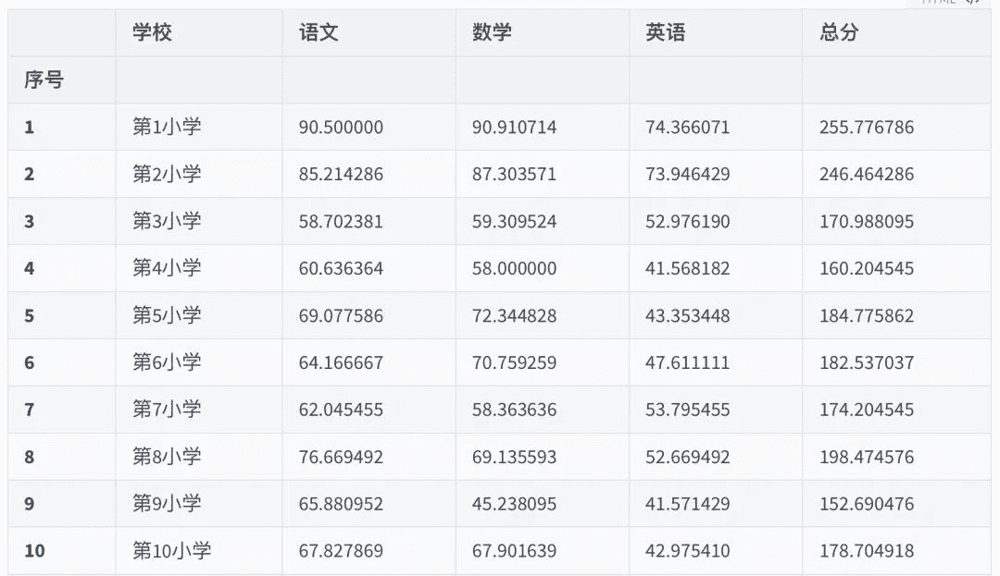
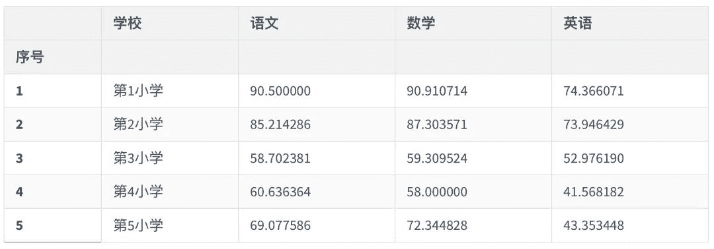
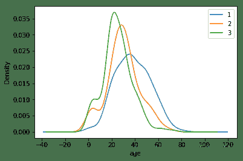

↑↑↑关注后"星标"Datawhale

每日干货 & [每月组队学习](https://mp.weixin.qq.com/mp/appmsgalbum?__biz=MzIyNjM2MzQyNg%3D%3D&action=getalbum&album_id=1338040906536108033#wechat_redirect)，不错过

Datawhale干货

**作者：CrescentAI，华南理工大学，Datawhale优秀学习者**

## 前言

本文对课程数据集及泰坦尼克号数据集进行了实例讲解，一步一步带你绘制数据可视化中常用的五种图形，并对数据间可能存在的相关性做出了阐述。


## 绘制常用图形

常用图形有：

*   plt.scatter() 散点图

*   plt.plot()    折线图

*   plt.bar() 直方图

*   plt.pie() 饼图

*   plt.boxplot() 箱型图

** 本次实例数据集可在后台回复【****学生成绩****】来获取。**

```
#导入相应的包
import numpy as np
import pandas as pd
import matplotlib.pyplot as plt
%matplotlib inline

#图可以显示中文和负号
plt.rcParams['font.sans-serif']='SimHei'
plt.rcParams['axes.unicode_minus']=False 
```

```
data = pd.read_excel("D:\data\student-score\student-score.xlsx")
data.head() 
```


```
data = data.drop(columns = ["序号","品德","科学"],axis = 1) #由于品德和科学的总分与其他学科不一致,为了图片显示效果,删除这两个学科成绩 
```

```
data.loc[:,"总分"] = data.loc[:,"语文"] + data.loc[:,"数学"] + data.loc[:,"英语"]  #重新计算总分成绩
data.head() 
```


接着我们还可以查看其数据结构：

```
data.shape  #查看数据结构

# 输出
(629, 6) 
```

以及查看各学科的缺失值情况：

```
data.isnull().sum()  #查看缺失值情况

'''
姓名    0
学校    0
语文    1
数学    0
英语    0
总分    1
dtype: int64
''' 
```

对于这些缺失值，我们可以选择使用`dropna()`函数删除：

```
data = data.dropna()  #删除缺失值
data.shape  # (628, 6) 
```

再使用`describe()`函数进行简单的统计描述：

```
data.describe()  #简单统计描述 
```


### 散点图

```
gp = data.groupby(by = "学校",as_index=False)  #以学校为分组依据进行分组
data1=gp.mean() #分组后的聚合运算为计算均值
data1.head() 
```

得到结果：


```
# 绘制各学科成绩散点图
plt.figure(figsize=(6,4))
plt.scatter(data1["总分"],data1["语文"],marker='v')
plt.scatter(data1["总分"],data1["数学"],marker='o')
plt.scatter(data1["总分"],data1["英语"],marker='*')
plt.title("各学校成绩散点图",fontsize = 14)
plt.xlabel("总成绩")
plt.ylabel("各学科成绩")
plt.legend(["语文","数学","英语"]); 
```


```
# 绘制各学科成绩散点图
plt.figure(figsize=(6,4))
plt.scatter(data1["总分"],data1["语文"],marker='v')
plt.title("各学校语文与总分成绩散点图",fontsize = 14)
plt.xlabel("总成绩")
plt.ylabel("各学科成绩")
plt.legend(["语文"])

# <matplotlib.legend.Legend at 0x1da13d256c8> 
```


```
# 绘制各学科成绩散点图
data1.plot.scatter(x = "总分", y = "语文")
plt.title("语文与总分成绩散点图")
data1.plot.scatter(x = "总分", y = "数学")
plt.title("数学与总分成绩散点图")
data1.plot.scatter(x = "总分", y = "英语")
plt.title("英语与总分成绩散点图")
# plt.show() 
```

得到`Text(0.5, 1.0, '英语与总分成绩散点图')`，且散点图结果如下：

  

### 折线图

```
data1.head() 
```


```
data1["序号"]=data1.学校.str.extract('(\d+)')
data1 
```

 

```
ser1 = data1.序号
ser1 
```

得到输出：

```
0     10
1     11
2     12
3     13
4     14
5     15
6     16
7     17
8     18
9     19
10     1
11    20
12    21
13     2
14     3
15     4
16     5
17     6
18     7
19     8
20     9
Name: 序号, dtype: object 
```

接着：

```
ser1 = ser1.astype("int")
ser1 
```

得到输出：

```
0     10
1     11
2     12
3     13
4     14
5     15
6     16
7     17
8     18
9     19
10     1
11    20
12    21
13     2
14     3
15     4
16     5
17     6
18     7
19     8
20     9
Name: 序号, dtype: int32 
```

可以尝试删除序号列，并且重设索引列：

```
del data1["序号"]
data1.index = ser1
data1 
```

 

再按照索引排序，可得到相应结果：

```
data1=data1.sort_index()
data1 
```

 

接着查看一共有多少行数据作为x轴数据

```
len(data1) # 21 
```

再将各科成绩数据进行绘图，得到折线图结果：

```
plt.figure(figsize=(10,4))
plt.plot(range(21),data1.iloc[:,1],'-*') #选取语文成绩数据
plt.plot(range(21),data1.iloc[:,2],'-o') #选取数学成绩数据
plt.plot(range(21),data1.iloc[:,3],'-v') #选取英语成绩数据
plt.title('各学科成绩变化走势图')
plt.xlabel('各学校')
plt.ylabel('学科成绩')
plt.xticks(range(21),data1["学校"],rotation=30)  #rotation=30控制文字倾斜角度
plt.legend(['语文','数学','英语']); 
```


### 直方图

```
yw = data1.loc[:,"学校":"语文"]  #提取数据绘制直方图,直方图原理,每个需要被画图的标签对应一个数值
yw = yw.T
yw 
```


```
yw.columns = yw.iloc[0]  #将学校字段转换成列索引
yw1 = yw.drop("学校",axis=0)  #删多余的行信息
yw1 
```


再将语文成绩数据进行绘图，得到直方图结果：

```
# 每个学校语文平均成绩的直方图
plt.figure(figsize=(12,4))
plt.bar(range(21),yw.loc["语文",:],width=0.5)
plt.title("语文成绩直方图",fontsize = 14)
plt.ylabel("语文成绩",fontsize = 14)
plt.xticks(range(21),yw.iloc[0],rotation=30,fontsize = 12); #x轴刻度为各学校名称 
```


```
sx = data1.loc[:,["学校","数学"]]
sx = sx.T
sx 
```


```
sx.columns = sx.iloc[0]
sx = sx.drop("学校",axis=0)
sx 
```


再将数学平均成绩数据进行绘图，得到直方图结果：

```
# 每个学校数学平均成绩的直方图
plt.figure(figsize=(12,4))
plt.bar(range(21),sx.loc["数学",:],width=0.5)
plt.title("数学成绩直方图",fontsize = 14)
plt.ylabel("数学成绩",fontsize = 14)
plt.xticks(range(21),yw.iloc[0],rotation=30,fontsize = 12); #x轴刻度为各学校名称 
```


将多个学科成绩画到一副图中

```
data1 
```

 

```
data2 = data1.drop("总分",axis = 1)  #新建一个dataframe,删掉总分列,因为总分和单科成绩相差太多,影响绘图效果
data2.head() 
```


```
# 将多个学科成绩画到一张图中  #截取前十
data2.plot.bar(x = '学校',y = ['语文','数学','英语'],figsize=(16,6),width=0.7,rot = 30,title = "各学科成绩直方图"); #rot空值标签倾斜程度 
```


### 饼图

```
data2.head() 
```



```
plt.figure(figsize=(4,4),dpi=80)
plt.pie(data2.iloc[0,1:] #选取数据源
        ,labels=['语文','数学','英语']
        ,autopct='%1.2f') #设置百分比经度
#         ,explode=[0.1,0.02,0.02]  #设置饼图各个扇区之间的间隙
#         ,colors=['r','g','b']) #设置饼图各个扇区的颜色
plt.title('第1小学各学科成绩占比',fontsize=12);
#fontsize设定字体的大小，xlabel,ylabel,title里面都可以设定 
```


```
pic2 = plt.figure(figsize=(8,8),dpi=80)

fig1 = pic2.add_subplot(2,2,1) #第一个子图
plt.pie(data2.iloc[0,1:] #选取数据源 第10小学各学科成绩
        ,labels=['语文','数学','英语']
        ,autopct='%1.2f') #设置百分比经度
#         ,explode=[0.1,0.02,0.02]  #设置饼图各个扇区之间的间隙
#         ,colors=['r','g','b']) #设置饼图各个扇区的颜色
plt.title('第1小学各学科成绩占比',fontsize=12)

fig2 = pic2.add_subplot(2,2,2) #第二个字图
plt.pie(data2.iloc[1,1:] #选取数据源,第11小学各学科成绩
        ,labels=['语文','数学','英语']
        ,autopct='%1.2f') #设置百分比经度
#         ,explode=[0.1,0.02,0.02]  #设置饼图各个扇区之间的间隙
#         ,colors=['r','g','b']) #设置饼图各个扇区的颜色
plt.title('第2小学各学科成绩占比',fontsize=12)

fig3 = pic2.add_subplot(2,2,3) #第二个字图
plt.pie(data2.iloc[2,1:] #选取数据源,第12小学各学科成绩
        ,labels=['语文','数学','英语']
        ,autopct='%1.2f') #设置百分比经度
#         ,explode=[0.1,0.02,0.02]  #设置饼图各个扇区之间的间隙
#         ,colors=['r','g','b']) #设置饼图各个扇区的颜色
plt.title('第3小学各学科成绩占比',fontsize=12)

fig4 = pic2.add_subplot(2,2,4) #第二个字图
plt.pie(data2.iloc[3,1:] #选取数据源,第13小学各学科成绩
        ,labels=['语文','数学','英语']
        ,autopct='%1.2f') #设置百分比经度
#         ,explode=[0.1,0.02,0.02]  #设置饼图各个扇区之间的间隙
#         ,colors=['r','g','b']) #设置饼图各个扇区的颜色
plt.title('第4小学各学科成绩占比',fontsize=12); 
```


### 箱型图

```
data.head() 
```


```
data_1 = data.loc[data['学校'] =="第1小学"]  #提取第一小学的所有信息
score = (list(data_1.iloc[:,2]),list(data_1.iloc[:,3]),list(data_1.iloc[:,4]))

plt.figure(figsize=(8,6))
plt.boxplot(score
            ,labels=['语文','数学','英语']
            ,notch=True #缺口中位数位置
            ,sym='*'#设定异常值的形状
            ,whis=1.5); #设定几倍标准差之外的数据算是异常值，默认是1.5 
```


## 泰坦尼克号数据

```
text = pd.read_csv(r'result.csv')
text.head() 
```


### 男女中生存人数分布情况

```
sex = text.groupby('Sex')['Survived'].sum()
sex.plot.bar(color='chocolate')
plt.title('survived_count')
plt.show() 
```


女性比男性生存人数多。

### 男女中生存人与死亡人数的比例

```
text.groupby(['Sex','Survived'])['Survived'].count().unstack().plot(kind='bar',stacked='True')
plt.title('survived_count')
plt.ylabel('count')

# Text(0, 0.5, 'count') 
```


男女性生存与死亡人数的占比偏差比较大。

### 不同票价的人生存和死亡人数分布情况

```
# 排序后绘折线图
fare_sur = text.groupby(['Fare'])['Survived'].value_counts().sort_values(ascending=False)
fig = plt.figure(figsize=(20, 18))
fare_sur.plot(grid=True)
plt.legend()
plt.show() 
```


不同的票价所反映出来的生存人数是非常明显的，票价低的人死亡数量高是因为离甲板远，且逃生机会大大降低。

```
# 排序前绘折线图
fare_sur1 = text.groupby(['Fare'])['Survived'].value_counts()
fig = plt.figure(figsize=(20, 18))
fare_sur1.plot(grid=True)
plt.legend()
plt.show() 
```


### 不同仓位等级的人生存和死亡人员的分布情况

```
# 1表示生存，0表示死亡
pclass_sur = text.groupby(['Pclass'])['Survived'].value_counts()

import seaborn as sns
sns.countplot(x="Pclass", hue="Survived", data=text)

# <matplotlib.axes._subplots.AxesSubplot at 0x1da160cdc08> 
```

 不同年龄的人生存与死亡人数分布情况

```
facet = sns.FacetGrid(text, hue="Survived",aspect=3)
facet.map(sns.kdeplot,'Age',shade= True)
facet.set(xlim=(0, text['Age'].max()))
facet.add_legend()

# <seaborn.axisgrid.FacetGrid at 0x1da16136588> 
```

 不同仓位等级的人年龄分布情况

```
text.Age[text.Pclass == 1].plot(kind='kde')
text.Age[text.Pclass == 2].plot(kind='kde')
text.Age[text.Pclass == 3].plot(kind='kde')
plt.xlabel("age")
plt.legend((1,2,3),loc="best")

# <matplotlib.legend.Legend at 0x1da161b27c8> 
```




“整理不易，**点****赞****三连**↓