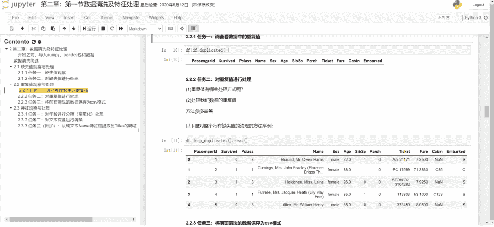

↑↑↑关注后"星标"Datawhale

每日干货 & [每月组队学习](https://mp.weixin.qq.com/mp/appmsgalbum?__biz=MzIyNjM2MzQyNg%3D%3D&action=getalbum&album_id=1338040906536108033#wechat_redirect)，不错过

 Datawhale干货 

**作者：陈安东，湖南大学，Datawhale成员**

## 1\. 开源初衷

对于任何一个将来要实际运用的技能，**通过实战，自己亲自将一行行代码敲出来，然后达到自己想要的效果**，这个过程是最好的学习方式。

最开始接触了Datawhale数据分析项目，那时我作为一名学员的以《Python for data analysis》这本书为教材，通过刷这本教材的代码来学习数据分析的数据处理技能，书里对于pandas和numpy操作讲的很细，但是对于数据分析思维的内容涉及就少了很多。最后感觉就是敲了一堆代码并不知道怎么用。

后面又接触了Datawhale数据挖掘实战项目[1] 。这个项目又比较偏模型和实战，直接给你一个任务，让你去完成，上手难度比较大，但是它的实战性可以让你对于什么是数据挖掘，以及数据挖掘的逻辑有很好的把握。

所以我们在想有没有这样一个项目，**以实战为主线，将知识点孕育其中**，通过边学，边做以及边被引导的方式来使学习效果达到更好，学完之后既能掌握数据处理技能又能掌握数据分析的大致思路和流程。于是就有了开源项目《动手学数据分析》，让小白也可以更好地开启他的数据分析之路。

## 2\. 项目详情

### 2.1 项目概括

项目分为三个单元，大致可以分为：**数据基础操作，数据清洗与重构，建模和评估**。每个部分的学习内容如下：

*   第一单元：我们获得一个要分析的数据，我要学会如何加载数据，查看数据，然后学习Pandas的一些基础操作，最后开始尝试探索性的数据分析。

*   第二单元：当我们可以比较熟练的操作数据并认识这个数据之后，我们需要开始数据清洗以及重构，将原始数据变为一个可用好用的数据，为之后放入模型做准备。

*   第三单元：我们根据任务需求不同，要考虑建立什么模型，我们使用流行的sklearn库，建立模型。对于一个模型的好坏，我们是需要评估的，之后我们会评估我们的模型，对模型做优化。

### 2.2 项目详情

*   开源地址：

    https://github.com/datawhalechina/hands-on-data-analysis

*   代码形式：jupyter

*   数据集：kaggle上的泰坦尼克[2]数据集

*   目的：是通过真实的数据，以实战的方式熟悉数据分析python的基本操作和了解数据分析思维

*   结果：完成Kaggle上泰坦尼克任务

在从GitHub下载了我们的仓库之后，里面包含了我们所需的数据以及实战需要的代码。在每个单元里，分别有【**课程**】文件和【**答案**】文件。

【课程】是实战文件，根据我们的引导，通过代码完成相应的任务。除了需要完成了代码的编写，**在重要的地方我们设计了思考题**，学习者可以有更深刻的理解。

在完成一个【课程】后，既掌握了这一部分知识又可以完成代码的编写。

在相对应的【答案】文件，我们提供了**参考答案**。也是希望新手可以在实战的路上少一点坑，多一点注意力放到知识点本身。

## 3\. 写到最后

关于我们项目的名字——动手学数据分析（Hands-on data analysis）。数据分析是一个要从一堆数字中看到真相的过程。学会操作数据只是数据分析的一半功力，剩下的另一半要用我们的大脑，多思考，多总结，更要多动手，实打实的的敲代码。所以也希望在学习这个开源教程的时候，多去推理，多去问问为什么；多多练习，确保理论实践结合起来，在学习结束的时候一定会大有收获。

### 参考资料

[1]

数据挖掘实战: *https://github.com/datawhalechina/team-learning-data-mining*

[2]

泰坦尼克数据集: *后台回复titanic获取*

*后台回复 ****动手学数据分析****，可下载 PDF***教程****

“干货学习，**点****赞****三连**↓