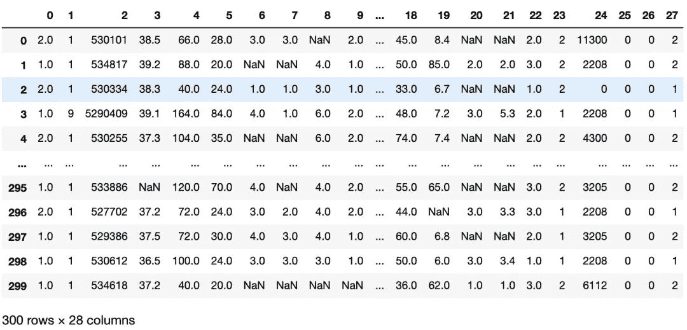

↑↑↑关注后"星标"Datawhale

每日干货 & [每月组队学习](https://mp.weixin.qq.com/mp/appmsgalbum?__biz=MzIyNjM2MzQyNg%3D%3D&action=getalbum&album_id=1338040906536108033#wechat_redirect)，不错过

 Datawhale干货 

**作者：游璐颖，福州大学，Datawhale成员**

## 前言

KNN（k-nearest neighbors）又叫做K近邻，是机器学习中相对简单好理解的算法，并且它是个几乎不需要训练就可以得到预测结果的模型。

我们常说物以类聚，人以群分，大家之所以能够成为朋友，多少是因为身上的某些特质是相近的，K近邻算法借助的就是这个思想。它使用某种方法找到样本空间中距离测试点最近的K个点，以投票表决的方式决定该测试点的标签。

本文将结合阿里云提供的机器学习算法(三): K近邻(k-nearest neighbors)初探与清华大学李航老师的PPT，来具体解释这其中的理论基础和代码实例。


## 1\. KNN理论基础

### 1.1 背景介绍

大家通过视频软件挑选电影的时候，通常会先按照电影的类别进行挑选，例如动作片、爱情片、歌舞片。这些电影有各自的特点，像是动作片的打斗场景一定比爱情片多，它也不会像歌舞片一样一言不合就开始跳舞，但又不能完全排除有出现的可能。

总结这三类型的影片所具有的显著特点：打斗、亲吻、跳舞。假设现在用一个元组`(a, b, c)`来表示，值在0～1之间，`Movie = (0.8, 0.1, 0.1)`时，就认为这个电影是动作片。那么很自然的，提出了使用一个三维空间作为该数据集的样本空间，每一部电影在空间中都有属于自己的点。

假定现在把一堆电影在这个空间中表示出来，大概率会发现它们具有一定的聚集性，动作片中点与点的距离会比动作片和爱情片中点与点的距离更短。如果不能理解，也可以拿二维的做类比。

根据这个特点，提出了K近邻算法。对于给定的一个测试电影，将它在空间中标注出来，使用曼哈顿距离或者欧式距离等，选出K个距离该测试点最近的点，而我们已经事先知道了这些被选出来的最近点的电影类型，接着对其进行类型统计投票，选择票数最多的那个作为该测试电影的类型。

比如当K=5时，用`a、b、c`分别表示三类型电影的票数，如果`a = 4, b = 1, c = 0`，我们就认为这部电影是动作片。

从这个过程你可以看出，它只需要一个多维空间、带标签的训练集，因此它也是个有监督学习。

### 1.2 工作原理与特点

K近邻算法的工作原理如下：

首先，存在一个样本数据集合，也称作训练样本集，并且样本集中每个数据都存在标签，即我们知道样本集中每个数据与所属分类的对应关系。

其次，输入没有标签的新数据后，将新数据的每个特征与样本集中数据对应的特征进行比较，然后算法提取样本集中特征最相似数据（最近邻）的分类标签。一般来说，只选择样本数据集中前N个最相似的数据。K一般不大于20。

最后，选择k个中出现次数最多的分类，作为新数据的分类。

借个《机器学习实战》中的例子，下图是每部电影的打斗镜头数、接吻镜头数以及电影评估类型，其中有一部未知电影的接吻镜头有90次，打斗18次，电影类型是未知的。

 那么接下来通过计算未知电影与样本集合中其他电影的距离：  现在我们得到了样本集中所有电影与未知电影的距离，按照距离递增排序，可以找到k个距离最近的电影。假定k=3，则三个最靠近的电影依次是He's Not Really into Dudes、Beautiful Woman和California Man。k-近邻算法按照距离最近的三部电影的类型，决定未知电影的类型，而这三部电影全是爱情片，因此我们判定未知电影是爱情片。

K近邻算法的特点也显而易见，由于选择了K个邻近的参考点，因此它的精度较高，且对异常值不敏感，无数据输入假定，使用于数值型和标称型的数据。缺点是计算复杂度和空间复杂度双高。

### 1.3 处理流程

1.  收集数据：可以使用任何方法。

2.  准备数据：距离计算所需要的数值，最好是结构化的数据格式。

3.  分析数据：可以使用任何方法。

4.  训练算法：此步骤不适用于k-近邻算法。

5.  测试算法：计算错误率。

6.  使用算法：首先需要输入样本数据和结构化的输出结果，然后运行k近邻算法判定输入数据分别属于哪个分类，最后应用对计算出的分类执行后续的处理。

### 1.4 距离计算

如果你认真的看到这里，比较迷惑的点大概就在于距离应该如何计算度量。

样本之间的距离的计算，我们一般使用对于一般使用Lp距离进行计算。

当p=1时候，称为曼哈顿距离(Manhattan distance)。

当p=2时候，称为欧氏距离(Euclidean distance)。

当p=∞时候，称为极大距离(infty distance)，表示各个坐标的距离最大值,另外也包含夹角余弦等方法。

一般采用欧式距离较多，但是文本分类则倾向于使用余弦来计算相似度。

对于两个向量 ,一般使用 距离进行计算。假设特征空间 是n维实数向量空间 , 其中, ,  ,   <svg xmlns="http://www.w3.org/2000/svg" viewBox="0 -750 3190.1 1044.2" style="vertical-align: -0.666ex;width: 7.217ex;height: 2.363ex;"><g stroke="currentColor" fill="currentColor" stroke-width="0" transform="matrix(1 0 0 -1 0 0)"><g><g transform="translate(1143.7, 0)">，</g></g></g></svg> 的 距离定义为:

这里的 . 当 时候，称为欧氏距离(Euclidean distance)：

当 时候，称为曼哈顿距离(Manhattan distance)：

当 时候，称为极大距离(infty distance), 表示各个坐标的距离最大值：

需要注意的一点是，**对于那些存在缺失值的数据，应该如何使用欧式距离进行计算呢**？

接下来我们来详细举例说明：

1.  **正常的欧式距离**：每个维度上都有数值。

1.  **带有空值的欧式聚类**：某个或多个维度上的值为空NaN。

只计算所有非空的值，对所有空加权到非空值的计算上，上例中，我们看到一个有3维，只有第二维全部非空，将第一维和第三维的计算加到第二维上，所有需要乘以3。

当然这个空值我们也是需要处理一下的，需要计算每个样本最近的k个样本，使用简单的加权平均进行填充。

比如当k=2时，样本[1, 2, np.nan] 最近的2个样本是: [3, 4, 3] [np.nan, 6, 5], 计算距离的时候使用欧式距离，只关注非空样本。[1, 2, np.nan] 填充之后得到 [1, 2, (3 + 5) / 2] = [1, 2, 4]。

| 带有空值的样本 | 最相近的样本1 | 最相近的样本2 | 填充之后的值 |
| --- | --- | --- | --- |
| [1, 2, np.nan] | [3, 4, 3]; 3.46 | [np.nan, 6, 5]; 6.93 | [1, 2, 4] |
| [np.nan, 6, 5] | [3, 4, 3]; 3.46 | [8, 8, 7]; 3.46 | [5.5, 6, 5] |

所以，这样我们碰到缺失值就再也不用害怕啦！

### 1.5 K值选择

另外一个困惑就是K值的选择。

如果选择较小的K值，“学习”的近似误差（approximation error)会减小，但 “学习”的估计误差（estimation error) 会增大，噪声敏感，K值的减小就意味着整体模型变得复杂，容易发生过拟合。

如当K=1时，预测的结果只和最近的一个训练样本相关，此时很容易发生过拟合。

如果选择较大的K值，可以减少学习的估计误差，但缺点是学习的近似误差会增大。K值的增大就意味着整体的模型变得简单。

如当K=20时，预测的结果和最近的20个样本相关，假如我们只有20个样本，此时是所有样本的平均值，此时所有预测值都是均值，很容易发生欠拟合。

一般情况下，使用KNN的时候，根据数据规模我们会从[3, 20]之间进行尝试，选择最好的K。

## 2\. 代码实践

我们借助鸢尾花的案例案例，了解在无缺失数值的数据集中，如何实现KNN算法。再借助马绞痛数据来练习数据预处理，以及KNN分类的pipeline。

### 2.1 鸢尾花案例

第一步，首先库函数导入：

```
import numpy as np
import matplotlib.pyplot as plt
# 导入KNN分类器
from sklearn.neighbors import KNeighborsClassifier
from sklearn import datasets
from sklearn.model_selection import train_test_split 
```

第二步，载入鸢尾花的数据集，并按照8:2的比例划分训练集与测试集：

```
# 载入鸢尾花数据集
# iris是一个对象类型的数据，其中包括了data（鸢尾花的特征）和target（也就是分类标签）
iris = datasets.load_iris()

# 将样本与标签分开
x = iris['data']
y = iris['target']
print(x.shape, y.shape)  # (150, 4) (150,)

# 划分数据集
x_train, x_test, y_train, y_test = train_test_split(x, y, test_size = 0.2)  # 8:2
print(x_train.shape, x_test.shape, y_train.shape, y_test.shape)

# (120, 4) (30, 4) (120,) (30,) 
```

第三步，使用KNeighborsClassifier来训练模型，这里我们设置参数k(n_neighbors)=5, 使用欧式距离(metric=minkowski & p=2)：

```
clf = KNeighborsClassifier(n_neighbors=5, p=2, metric="minkowski")
clf.fit(x_train, y_train)  # fit可以简单的认为是表格存储

# KNeighborsClassifier() 
```

第四步，使用predict函数进行模型预测，并计算出预测准确率：

```
y_predict = clf.predict(x_test)
y_predict.shape  # (30,)

acc = sum(y_predict == y_test) / y_test.shape[0]
acc 
```

得到最终的准确率为0.933。

### 2.2 马绞痛案例

马可能会发生一些病变，该数据集可以这么下载：

```
# 下载需要用到的数据集
!wget https://tianchi-media.oss-cn-beijing.aliyuncs.com/DSW/3K/horse-colic.csv 
```

第一步，首先库函数导入：

```
import numpy as np
import pandas as pd
# kNN分类器
from sklearn.neighbors import KNeighborsClassifier
# kNN数据空值填充
from sklearn.impute import KNNImputer
# 计算带有空值的欧式距离
from sklearn.metrics.pairwise import nan_euclidean_distances
# 交叉验证
from sklearn.model_selection import cross_val_score
# KFlod的函数
from sklearn.model_selection import RepeatedStratifiedKFold
from sklearn.pipeline import Pipeline
import matplotlib.pyplot as plt
from sklearn.model_selection import train_test_split 
```

第二步，读出csv文件，并且简要观察其数据特点：

```
temp = pd.read_csv('KNN.csv', header=None)

temp  # 数据的第23列表示是否病变，1为yes，2为no 
```

明显发现数据有些小'?'，比如第一行的第8列和第20、21列。


所以我们应该在读取的时候就把这些问号改成NaN，以便之后的处理：

```
df = pd.read_csv('KNN.csv', header=None, na_values='?')  # na_values='?'
df 
```



现在我们知道，该原始数据有300行，28列，并且存在NaN值待处理，其中数据的第23列表示是否病变，1为yes，2为no。

第三步，单独提取出了病变结果列，并统计每一列的数据缺失个数：

```
data = df.values  # 原始数据有300行，28列
x_index = [i for i in range(data.shape[1]) if i != 23]

x, y = data[:, x_index], data[:, 23]  # 单独提取出了病变结果列
print(x.shape, y.shape)  # (300, 27) (300,)

cols_null=[]
for i in range(x.shape[1]):
    cols_null.append(df[i].isnull().sum())  # 每一列的数据缺失个数

cols_null # [1, 0, 0,60, 24, 58, ...] 
```

第四步，处理空值，进行数值填充。这里我们使用KNNImputer进行空值填充，其填充方法和之前在距离计算那里提到的计算方式是一样的，所以就不再赘述：

```
imputer = KNNImputer()
# 填充数据集中的空值
x1 = imputer.fit_transform(x)  # 或者是fit和transform分开写

print(sum(np.isnan(x1)))  # 处理后不再存在空值
print(sum(np.isnan(x)))

# [0 0 0 0 0 0 0 0 0 0 0 0 0 0 0 0 0 0 0 0 0 0 0 0 0 0 0]
# [  1   0   0  60  24  58  56  69  47  32  55  44  56 104 106 247 102 118 29  33 165 198   1   0   0   0   0] 
```

接着你可以使用KNeighborsClassifier来处理该数据，详细参考鸢尾花案例。

这里我们再介绍一种数据管道Pipeline的方式，任何有序的操作有可以看做pipeline，例如工厂流水线，对于机器学习模型来说，也就是数据流水线。是指数据通过管道中的每一个节点，结果除了之后，继续流向下游。

对于我们这个例子，数据是有空值，我们会有一个KNNImputer节点用来填充空值，之后继续流向下一个kNN分类节点，最后输出模型。


所以将第四和第五步结合，使用数据管道来处理：

```
# 使用数据管道来处理
pipe = Pipeline(steps=[('imputer', KNNImputer(n_neighbors=5)), ('model', c())])

 # 得到训练集合和验证集合, 8: 2
x_train, x_test, y_train, y_test = train_test_split(x, y, test_size=0.2)

# 验证model
pipe.fit(x_train, y_train)
score = pipe.score(x_test, y_test)
score  # 0.8166 
```

最终得到分数为0.817，其实结果并不是很高，可能和K值的设定有关，具体设置为多少效果会更好，就留给你自己去探究。

## 参考资料

1.  《机器学习实战》

2.  https://developer.aliyun.com/ai/scenario/febc2223e46f419dae84df47b1760ffc


“整理不易，**点****赞****三连**↓