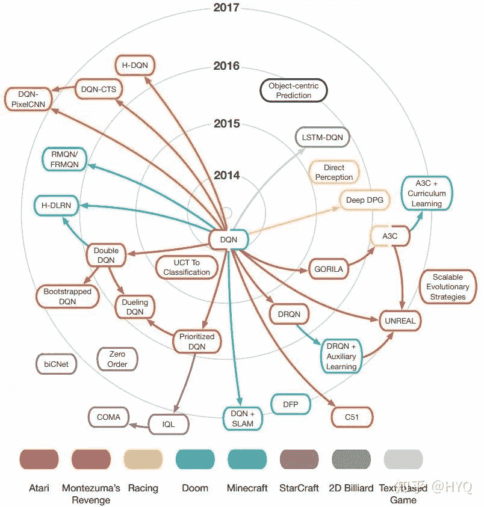

↑↑↑关注后"星标"Datawhale

每日干货 & [每月组队学习](https://mp.weixin.qq.com/mp/appmsgalbum?__biz=MzIyNjM2MzQyNg%3D%3D&action=getalbum&album_id=1338040906536108033#wechat_redirect)，不错过

 Datawhale干货 

**来源：**DeepRL实验室**，转自：**睿慕课****

## ********************▌一、深度强化学习的泡沫********************

2015年，DeepMind的Volodymyr Mnih等研究员在《自然》杂志上发表论文Human-level control through deep reinforcement learning[1]，该论文提出了一个结合深度学习（DL）技术和强化学习（RL）思想的模型Deep Q-Network(DQN)，在Atari游戏平台上展示出超越人类水平的表现。自此以后，结合DL与RL的深度强化学习（Deep Reinforcement Learning, DRL）迅速成为人工智能界的焦点。

过去三年间，DRL算法在不同领域大显神通：在视频游戏[1]、棋类游戏上打败人类顶尖高手[2,3]；控制复杂的机械进行操作[4]；调配网络资源[5]；为数据中心大幅节能[6]；甚至对机器学习算法自动调参[7]。各大高校和企业纷纷参与其中，提出了眼花缭乱的DRL算法和应用。可以说，过去三年是DRL的爆红期。DeepMind负责AlphaGo项目的研究员David Silver喊出“AI = RL + DL”，认为结合了DL的表示能力与RL的推理能力的DRL将会是人工智能的终极答案。

RL论文数量迅速增长[8]

## **1.1 DRL的可复现性危机**

然而，研究人员在最近半年开始了对DRL的反思。由于发表的文献中往往不提供重要参数设置和工程解决方案的细节，很多算法都难以复现。2017年9月，著名RL专家Doina Precup和Joelle Pineau所领导的的研究组发表了论文Deep Reinforcement Learning that Matters[8]，直指当前DRL领域论文数量多却水分大、实验难以复现等问题。该文在学术界和工业界引发热烈反响。很多人对此表示认同，并对DRL的实际能力产生强烈怀疑。

其实，这并非Precup& Pineau研究组第一次对DRL发难。早在2个月前，该研究组就通过充足的实验对造成DRL算法难以复现的多个要素加以研究，并将研究成果撰写成文Reproducibility of Benchmarked Deep Reinforcement Learning Tasks for Continuous Control[9]。同年8月，他们在ICML 2017上作了题为“Reproducibility of Policy Gradient Methods for Continuous Control”的报告[10]，通过实例详细展示了在复现多个基于策略梯度的算法的过程中，由于种种不确定性因素导致的复现困难。

12月，在万众瞩目的NIPS 2017 DRL专题研讨会上，Joelle Pineau受邀作了题为“Reproducibility of DRL and Beyond”的报告[11]。报告中，Pineau先介绍了当前科研领域的“可复现性危机” ：在《自然》杂志的一项调查中，90%的被访者认为“可复现性”问题是科研领域存在的危机，其中，52%的被访者认为这个问题很严重。在另一项调查中，不同领域的研究者几乎都有很高的比例无法复现他人甚至自己过去的实验。可见“可复现性危机”有多么严峻！Pineau针对机器学习领域发起的一项调研显示，同样有90%的研究者认识到了这个危机。

机器学习领域存在严重的“可复现性危机”[11]

随后，针对DRL领域，Pineau展示了该研究组对当前不同DRL算法的大量可复现性实验。实验结果表明，不同DRL算法在不同任务、不同超参数、不同随机种子下的效果大相径庭。在报告后半段，Pineau呼吁学界关注“可复现性危机”这一问题，并根据她的调研结果，提出了12条检验算法“可复现性”的准则，宣布计划在ICLR 2018开始举办“可复现实验挑战赛”（“可复现危机”在其他机器学习领域也受到了关注，ICML 2017已经举办了Reproducibility in Machine Learning Workshop，并将在今年继续举办第二届），旨在鼓励研究者做出真正扎实的工作，抑制机器学习领域的泡沫。Pineau & Precup研究组的这一系列研究获得了广泛关注。

Pineau基于大量调查提出的检验算法“可复现性”准则[11]

**1.2 DRL研究存在多少坑**

同样在12月，Reddit论坛上也开展了关于机器学习不正之风的热烈讨论[12]。有人点名指出，某些DRL代表性算法之所以在模拟器中取得了优秀却难以复现的表现，是因为作者们涉嫌在实验中修改模拟器的物理模型，却在论文中对此避而不谈。

对现有DRL算法的批判浪潮仍旧不断涌来。2018年的情人节当天，曾经就读于伯克利人工智能研究实验室（Berkeley Artificial Intelligence Research Lab, BAIR）的Alexirpan通过一篇博文Deep Reinforcement Learning Doesn't Work Yet[13]给DRL圈送来了一份苦涩的礼物。他在文中通过多个例子，从实验角度总结了DRL算法存在的几大问题：

**1) 样本利用率非常低；**

**2) 最终表现不够好，经常比不过基于模型的方法；**

**3) 好的奖励函数难以设计；**

**4) 难以平衡“探索”和“利用”,以致算法陷入局部极小；**

**5) 对环境的过拟合；**

**6) 灾难性的不稳定性…**

虽然作者在文章结尾试着提出DRL下一步应该解决的一系列问题，很多人还是把这篇文章看做DRL的“劝退文”。几天后，GIT的博士生Himanshu Sahni发表博文Reinforcement Learning never worked, and 'deep'>

另一位DRL研究者Matthew Rahtz则通过讲述自己试图复现一个DRL算法的坎坷历程来回应Alexirpan，让大家深刻体会了复现DRL算法有多么难[15]。半年前，Rahtz出于研究兴趣，选择对OpenAI的论文Deep Reinforcement Learning from Human Preferences进行复现。在复现的过程中，几乎踩了Alexirpan总结的所有的坑。他认为复现DRL算法与其是一个工程问题，更不如说像一个数学问题。“它更像是你在解决一个谜题，没有规律可循，唯一的方法是不断尝试，直到灵感出现彻底搞明白。……很多看上去无关紧要的小细节成了唯一的线索……做好每次卡住好几周的准备。”Rahtz在复现的过程中积累了很多宝贵的工程经验，但整个过程的难度还是让他花费了大量的金钱以及时间。他充分调动不同的计算资源，包括学校的机房资源、Google云计算引擎和FloydHub，总共花费高达850美元。可就算这样，原定于3个月完成的项目，最终用了8个月，其中大量时间用在调试上。

复现DRL算法的实际时间远多于预计时间[15]

Rahtz最终实现了复现论文的目标。他的博文除了给读者详细总结了一路走来的各种宝贵工程经验，更让大家从一个具体事例感受到了DRL研究实际上存在多大的泡沫、有多少的坑。有人评论到，“DRL的成功可能不是因为其真的有效，而是因为人们花了大力气。”

很多著名学者也纷纷加入讨论。目前普遍的观点是，DRL可能有AI领域最大的泡沫。机器学习专家Jacob Andreas发了一条意味深长的tweet说：

Jacob Andreas对DRL的吐槽

DRL的成功归因于它是机器学习界中唯一一种允许在测试集上训练的方法。

从Pineau & Precup打响第一枪到现在的1年多时间里，DRL被锤得千疮百孔，从万众瞩目到被普遍看衰。就在笔者准备投稿这篇文章的时候，Pineau又受邀在ICLR 2018上作了一个题为 Reproducibility, Reusability, and Robustness in DRL的报告[16]，并且正式开始举办“可复现实验挑战赛”。看来学界对DRL的吐槽将会持续，负面评论还将持续发酵。那么， DRL的问题根结在哪里？前景真的如此黯淡吗？如果不与深度学习结合，RL的出路又在哪里？

在大家纷纷吐槽DRL的时候，著名的优化专家 Ben Recht，从另一个角度给出一番分析。

## ********************▌二、免模型强化学习的本质缺陷********************

RL算法可以分为基于模型的方法（Model-based）与免模型的方法（Model-free）。前者主要发展自最优控制领域。通常先通过高斯过程（GP）或贝叶斯网络（BN）等工具针对具体问题建立模型，然后再通过机器学习的方法或最优控制的方法，如模型预测控制（MPC）、线性二次调节器（LQR）、线性二次高斯（LQG）、迭代学习控制（ICL）等进行求解。而后者更多地发展自机器学习领域，属于数据驱动的方法。算法通过大量采样，估计代理的状态、动作的值函数或回报函数，从而优化动作策略。

从年初至今，Ben Recht连发了13篇博文，从控制与优化的视角，重点探讨了RL中的免模型方法[18]。Recht指出免模型方法自身存在以下几大缺陷：

基于模型 vs. 免模型 [17]

*   免模型方法无法从不带反馈信号的样本中学习，而反馈本身就是稀疏的，因此免模型方向样本利用率很低，而数据驱动的方法则需要大量采样。比如在Atari平台上的《Space Invader》和《Seaquest》游戏中，智能体所获得的分数会随训练数据增加而增加。利用免模型DRL方法可能需要 2 亿帧画面才能学到比较好的效果。AlphaGo 最早在 Nature 公布的版本也需要 3000 万个盘面进行训练。而但凡与机械控制相关的问题，训练数据远不如视频图像这样的数据容易获取，因此只能在模拟器中进行训练。而模拟器与现实世界间的Reality Gap，直接限制了训练自其中算法的泛化性能。另外，数据的稀缺性也影响了其与DL技术的结合。

*   免模型方法不对具体问题进行建模，而是尝试用一个通用的算法解决所有问题。而基于模型的方法则通过针对特定问题建立模型，充分利用了问题固有的信息。免模型方法在追求通用性的同时放弃这些富有价值的信息。

*   基于模型的方法针对问题建立动力学模型，这个模型具有解释性。而免模型方法因为没有模型，解释性不强，调试困难。

*   相比基于模型的方法，尤其是基于简单线性模型的方法，免模型方法不够稳定，在训练中极易发散。

为了证实以上观点，Recht将一个简单的基于LQR的随机搜索方法与最好的免模型方法在MuJoCo实验环境上进行了实验对比。在采样率相近的情况下，基于模型的随机搜索算法的计算效率至少比免模型方法高15倍[19]。

基于模型的随机搜索方法ARS吊打一众免模型方法[19]

通过Recht的分析，我们似乎找到了DRL问题的根结。近三年在机器学习领域大火的DRL算法，多将免模型方法与DL结合，而免模型算法的天然缺陷，恰好与Alexirpan总结的DRL几大问题相对应（见上文）。

看来，DRL的病根多半在采用了免模型方法上。为什么多数DRL的工作都是基于免模型方法呢？笔者认为有几个原因。第一，免模型的方法相对简单直观，开源实现丰富，比较容易上手，从而吸引了更多的学者进行研究，有更大可能做出突破性的工作，如DQN和AlphaGo系列。第二，当前RL的发展还处于初级阶段，学界的研究重点还是集中在环境是确定的、静态的，状态主要是离散的、静态的、完全可观察的，反馈也是确定的问题（如Atari游戏）上。针对这种相对“简单”、基础、通用的问题，免模型方法本身很合适。最后，在“AI = RL + DL”这一观点的鼓动下，学界高估了DRL的能力。DQN展示出的令人兴奋的能力使得很多人围绕着DQN进行拓展，创造出了一系列同样属于免模型的工作。

绝大多数DRL方法是对DQN的扩展，属于免模型方法[20]

那么，DRL是不是应该抛弃免模型方法，拥抱基于模型的方法呢？

## ********************▌三、基于模型或免模型，问题没那么简单********************

**3.1 基于模型的方法，未来潜力巨大**

基于模型的方法一般先从数据中学习模型，然后基于学到的模型对策略进行优化。学习模型的过程和控制论中的系统参数辨识类似。因为模型的存在，基于模型的方法可以充分利用每一个样本来逼近模型，数据利用率极大提高。基于模型的方法则在一些控制问题中，相比于免模型方法，通常有10^2级的采样率提升。此外，学到的模型往往对环境的变化鲁棒,当遇到新环境时，算法可以依靠已学到的模型做推理，具有很好的泛化性能。

基于模型的方法具有更高采样率[22]

此外，基于模型的方法还与潜力巨大的预测学习（Predictive Learning）紧密相关。由于建立了模型，本身就可以通过模型预测未来，这与Predictive Learning的需求不谋而合。其实，Yann LeCun在广受关注的NIPS 2016主题报告上介绍Predictive Learning时，也是以基于模型的方法作为例子的[21]。笔者认为，基于模型的RL方法可能是实现Predictive Learning的重要技术之一。

这样看来，基于模型的方法似乎更有前途。但天下没有免费的午餐，模型的存在也带来了若干问题。

**3.2 免模型方法，依旧是第一选择**

基于模型的DRL方法相对而言不那么简单直观，RL与DL的结合方式相对更复杂，设计难度更高。目前基于模型的DRL方法通常用高斯过程、贝叶斯网络或概率神经网络（PNN）来构建模型，典型的如David Silver在2016年提出的Predictron模型[23]。另外一些工作，如Probabilistic Inference for Learning COntrol (PILCO)[24]，本身不基于神经网络，不过有与BN结合的扩展版本。而Guided Policy Search (GPS) 虽然在最优控制器的优化中使用了神经网络，但模型并不依赖神经网络[25]。此外还有一些模型将神经网络与模型耦合在一起[26]。这些工作不像免模型DRL方法那样直观且自然，DL所起的作用也各有不同。

除此之外，基于模型的方法也还存在若干自身缺陷：

1.  针对无法建模的问题束手无策。有些领域，比如NLP，存在大量难以归纳成模型的任务。在这种场景下，只能通过诸如R-max算法这样的方法先与环境交互，计算出一个模型为后续使用。但是这种方法的复杂度一般很高。近期有一些工作结合预测学习建立模型，部分地解决了建模难的问题，这一思路逐渐成为了研究热点。

2.  建模会带来误差，而且误差往往随着算法与环境的迭代交互越来越大，使得算法难以保证收敛到最优解。

3.  模型缺乏通用性，每次换一个问题，就要重新建模。

针对以上几点，免模型方法都有相对优势：对现实中非常多的无法建模的问题以及模仿学习问题，免模型算法仍是最好的选择。并且，免模型方法在理论上具备渐近收敛性，经过无数次与环境的交互可以保证得到最优解，这是基于模型的方法很难获得的结果。最后，免模型最大的优势就是具备非常好的通用性。事实上，在处理真正困难的问题时，免模型方法的效果通常更好。Recht也在博文中指出，控制领域很有效的MPC算法其实与Q-Learning这样的免模型方法非常相关[18]。

基于模型的方法与免模型的方法的区别其实也可以看做基于知识的方法与基于统计的方法的区别。总体来讲，两种方法各有千秋，很难说其中一种方法优于另一种。在RL领域中，免模型算法只占很少一部分，但基于历史原因，当前免模型的DRL方法发展迅速数量庞大，而基于模型的DRL方法则相对较少。笔者认为，我们可以考虑多做一些基于模型的DRL方面的工作，克服当前DRL存在的诸多问题。此外，还可以多研究结合基于模型方法与免模型方法的半模型方法，兼具两种方法的优势。这方面经典的工作有RL泰斗Rich Sutton提出的Dyna框架 [27] 和其弟子David Silver提出的Dyna-2框架[28]。通过以上讨论，我们似乎对DRL目前的困境找到了出路。但其实，造成当前DRL困境的原因远不止这些。

**3.3 不仅仅是模型与否的问题**

上文提到Recht使用基于随机搜索的方法吊打了免模型方法，似乎宣判了免模型方法的死刑。但其实这个对比并不公平。

2017年3月，机器学习专家Sham Kakade的研究组发表文章Towards Generalization and Simplicity in Continuous Control，试图探寻针对连续控制问题的简单通用的解法 [29] 。他们发现当前的模拟器存在非常大的问题，经过调试的线性策略就已经可以取得非常好的效果——这样的模拟器实在过于粗糙，难怪基于随机搜索的方法可以在同样的模拟器上战胜免模型方法！

可见目前RL领域的实验平台还非常不成熟，在这样的测试环境中的实验实验结果没有足够的说服力。很多研究结论都未必可信，因为好性能的取得或许仅仅是因为利用了模拟器的bugs。此外，一些学者指出当前RL算法的性能评判准则也不科学。Ben Recht和Sham Kakade都对RL的发展提出了多项具体建议，包括测试环境、基准算法、衡量标准等[18,29]。可见RL领域还有太多需要改进和规范化。

那么，RL接下来该如何突破呢？

## ********************▌**********************四、重新审视强化学习**

对DRL和免模型RL的质疑与讨论，让我们可以重新审视RL，这对RL今后的发展大有裨益。

**4.1 重新审视DRL的研究与应用**

DQN和AlphaGo系列工作给人留下深刻印象，但是这两种任务本质上其实相对“简单”。因为这些任务的环境是确定的、静态的，状态主要是离散的、静态的、完全可观察的，反馈是确定的，代理也是单一的。目前DRL在解决部分可见状态任务（如StarCraft），状态连续的任务（如机械控制任务），动态反馈任务和多代理任务中还没取得令人惊叹的突破。

当前大量的DRL研究，尤其是应用于计算机视觉领域任务的研究中，很多都是将计算机视觉的某一个基于DL的任务强行构造成RL问题进行求解，其结果往往不如传统方法好。这样的研究方式造成DRL领域论文数量暴增、水分巨大。作为DRL的研究者，我们不应该找一个DL任务强行将其RL化，而是应该针对一些天然适合RL处理的任务，尝试通过引入DL来提升现有方法在目标识别环节或函数逼近环节上的能力。

DRL取得成功的任务本质上相对简单[30]

在计算机视觉任务中，通过结合DL获得良好的特征表达或函数逼近是非常自然的思路。但在有些领域，DL未必能发挥强大的特征提取作用，也未必被用于函数逼近。比如DL至今在机器人领域最多起到感知作用，而无法取代基于力学分析的方法。虽然有一些将DRL应用于物体抓取等现实世界的机械控制任务上并取得成功的案例，如QT-Opt[70]，但往往需要大量的调试和训练时间。我们应该清晰地认识DRL算法的应用特点：因为其输出的随机性，当前的DRL算法更多地被用在模拟器而非真实环境中。而当前具有实用价值且只需运行于模拟器中的任务主要有三类，即视频游戏、棋类游戏和自动机器学习（AutoML，比如谷歌的AutoML Vision）。这并不是说DRL的应用被困在模拟器中——如果能针对某一具体问题，解决模拟器与真实世界间的差异，则可以发挥DRL的强大威力。最近Google的研究员就针对四足机器人运动问题，通过大力改进模拟器，使得在模拟器中训练的运动策略可以完美迁移到真实世界中，取得了令人惊艳的效果[71]。不过，考虑到RL算法的不稳定性，在实际应用中不应盲目追求端到端的解决方案，而可以考虑将特征提取（DL）与决策（RL）分开，从而获得更好的解释性与稳定性。此外，模块化RL（将RL算法封装成一个模块）以及将RL与其他模型融合，将在实际应用中有广阔前景。而如何通过DL学习一个合适于作为RL模块输入的表示，也值得研究。

**4.2 重新审视RL的研究**

机器学习是个跨学科的研究领域，而RL则是其中跨学科性质非常显著的一个分支。RL理论的发展受到生理学、神经科学和最优控制等领域的启发，现在依旧在很多相关领域被研究。在控制理论、机器人学、运筹学、经济学等领域内部，依旧有很多的学者投身RL的研究，类似的概念或算法往往在不同的领域被重新发明，起了不同的名字。

RL的发展受到多个学科的影响[31]

Princeton大学著名的运筹学专家Warren Powell曾经写了一篇题为AI, OR and Control Theory: A Rosetta Stone for Stochastic Optimization的文章，整理了RL中同一个概念、算法在AI、OR（运筹学）和Control Theory（控制理论）中各自对应的名称，打通了不同领域间的隔阂 [32] 。由于各种学科各自的特点，不同领域的RL研究又独具特色，这使得RL的研究可以充分借鉴不同领域的思想精华。

在这里，笔者根据自身对RL的理解，试着总结一些值得研究的方向：

1.  基于模型的方法。如上文所述，基于模型的方法不仅能大幅降低采样需求，还可以通过学习任务的动力学模型，为预测学习打下基础。

2.  提高免模型方法的数据利用率和扩展性。这是免模型学习的两处硬伤，也是Rich Sutton的终极研究目标。这个领域很艰难，但是任何有意义的突破也将带来极大价值。

3.  更高效的探索策略（Exploration Strategies）。平衡“探索”与“利用”是RL的本质问题，这需要我们设计更加高效的探索策略。除了若干经典的算法如Softmax、ϵ-Greedy[1]、UCB[72]和Thompson Sampling[73]等，近期学界陆续提出了大批新算法，如Intrinsic Motivation [74]、Curiosity-driven Exploration[75]、Count-based Exploration [76]等。其实这些“新”算法的思想不少早在80年代就已出现[77]，而与DL的有机结合使它们重新得到重视。此外，OpenAI与DeepMind先后提出通过在策略参数[78]和神经网络权重[79]上引入噪声来提升探索策略, 开辟了一个新方向。

4.  与模仿学习（Imitation Learning, IL）结合。机器学习与自动驾驶领域最早的成功案例ALVINN[33]就是基于IL；当前RL领域最顶级的学者Pieter Abbeel在跟随Andrew Ng读博士时候,设计的通过IL控制直升机的算法[34]成为IL领域的代表性工作。2016年，英伟达提出的端到端自动驾驶系统也是通过IL进行学习[68]。而AlphaGo的学习方式也是IL。IL介于RL与监督学习之间，兼具两者的优势，既能更快地得到反馈、更快地收敛，又有推理能力，很有研究价值。关于IL的介绍，可以参见[35]这篇综述。

5.  奖赏塑形（Reward Shaping）。奖赏即反馈，其对RL算法性能的影响是巨大的。Alexirpan的博文中已经展示了没有精心设计的反馈信号会让RL算法产生多么差的结果。设计好的反馈信号一直是RL领域的研究热点。近年来涌现出很多基于“好奇心”的RL算法和层级RL算法，这两类算法的思路都是在模型训练的过程中插入反馈信号，从而部分地克服了反馈过于稀疏的问题。另一种思路是学习反馈函数，这是逆强化学习（Inverse RL, IRL）的主要方式之一。近些年大火的GAN也是基于这个思路来解决生成建模问题, GAN的提出者Ian Goodfellow也认为GAN就是RL的一种方式 [36]。而将GAN于传统IRL结合的GAIL[37]已经吸引了很多学者的注意。

6.  RL中的迁移学习与多任务学习。当前RL的采样效率极低，而且学到的知识不通用。迁移学习与多任务学习可以有效解决这些问题。通过将从原任务中学习的策略迁移至新任务中，避免了针对新任务从头开始学习，这样可以大大降低数据需求，同时也提升了算法的自适应能力。在真实环境中使用RL的一大困难在于RL的不稳定性，一个自然的思路是通过迁移学习将在模拟器中训练好的稳定策略迁移到真实环境中，策略在新环境中仅通过少量探索即可满足要求。然而，这一研究领域面临的一大问题就是现实鸿沟（Reality Gap），即模拟器的仿真环境与真实环境差异过大。好的模拟器不仅可以有效填补现实鸿沟，还同时满足RL算法大量采样的需求，因此可以极大促进RL的研究与开发，如上文提到的Sim-to-Real[71]。同时，这也是RL与VR技术的一个结合点。近期学术界和工业界纷纷在这一领域发力。在自动驾驶领域，Gazebo、EuroTruck Simulator、TORCS、Unity、Apollo、Prescan、Panosim和Carsim等模拟器各具特色，而英特尔研究院开发的CARLA模拟器[38]逐渐成为业界研究的标准。其他领域的模拟器开发也呈现百花齐放之势：在家庭环境模拟领域， MIT 和多伦多大学合力开发了功能丰富的VirturalHome模拟器；在无人机模拟训练领域，MIT也开发了Flight Goggles模拟器。

7.  提升RL的的泛化能力。机器学习最重要的目标就是泛化能力, 而现有的RL方法大多在这一指标上表现糟糕[8]，无怪乎Jacob Andreas会批评RL的成功是来自“train>

8.  层级RL（Hierarchical RL, HRL）。周志华教授总结DL成功的三个条件为：有逐层处理、有特征的内部变化和有足够的模型复杂度[39]。而HRL不仅满足这三个条件，而且具备更强的推理能力，是一个非常潜力的研究领域。目前HRL已经在一些需要复杂推理的任务（如Atari平台上的《Montezuma's Revenge》游戏）中展示了强大的学习能力[40]。

9.  与序列预测（Sequence Prediction）结合。Sequence Prediction与RL、IL解决的问题相似又不相同。三者间有很多思想可以互相借鉴。当前已有一些基于RL和IL的方法在 Sequence Prediction任务上取得了很好的结果 [41,42,43]。这一方向的突破对Video Prediction和NLP中的很多任务都会产生广泛影响。

10.  （免模型）方法探索行为的安全性（Safe RL）。相比于基于模型的方法，免模型方法缺乏预测能力，这使得其探索行为带有更多不稳定性。一种研究思路是结合贝叶斯方法为RL代理行为的不确定性建模，从而避免过于危险的探索行为。此外，为了安全地将RL应用于现实环境中，可以在模拟器中借助混合现实技术划定危险区域，通过限制代理的活动空间约束代理的行为。

11.  关系RL。近期学习客体间关系从而进行推理与预测的“关系学习”受到了学界的广泛关注。关系学习往往在训练中构建的状态链，而中间状态与最终的反馈是脱节的。RL可以将最终的反馈回传给中间状态，实现有效学习，因而成为实现关系学习的最佳方式。2017年DeepMind提出的VIN[44]和Pridictron[23]均是这方面的代表作。2018年6月，DeepMind又接连发表了多篇关系学习方向的工作如关系归纳偏置[45]、关系RL[46]、关系RNN[47]、图网络[48]和已经在《科学》杂志发表的生成查询网络（Generative Query Network，GQN）[49]。这一系列引人注目的工作将引领关系RL的热潮。

12.  对抗样本RL。RL被广泛应用于机械控制等领域，这些领域相比于图像识别语音识别等等，对鲁棒性和安全性的要求更高。因此针对RL的对抗攻击是一个非常重要的问题。近期有研究表明，会被对抗样本操控，很多经典模型如DQN等算法都经不住对抗攻击的扰动[50,51]。

13.  处理其他模态的输入。在NLP领域，学界已经将RL应用于处理很多模态的数据上，如句子、篇章、知识库等等。但是在计算机视觉领域，RL算法主要还是通过神经网络提取图像和视频的特征，对其他模态的数据很少涉及。我们可以探索将RL应用于其他模态的数据的方法，比如处理RGB-D数据和激光雷达数据等。一旦某一种数据的特征提取难度大大降低，将其与RL有机结合后都可能取得AlphaGo级别的突破。英特尔研究院已经基于CARLA模拟器在这方面开展了一系列的工作。

**4.3 重新审视RL的应用**

当前的一种观点是“RL只能打游戏、下棋，其他的都做了”。而笔者认为，我们不应对RL过于悲观。其实能在视频游戏与棋类游戏中超越人类，已经证明了RL推理能力的强大。通过合理改进后，有希望得到广泛应用。往往，从研究到应用的转化并不直观。比如，IBM Watson® 系统以其对自然语言的理解能力和应答能力闻名世界，曾在2011年击败人类选手获得Jeopardy!冠军。而其背后的支撑技术之一竟然是当年Gerald Tesauro开发TD-Gammon程序[52]时使用的RL技术[53]。当年那个“只能用于”下棋的技术，已经在最好的问答系统中发挥不可或缺的作用了。今天的RL发展水平远高于当年，我们怎么能没有信心呢？通过调查，我们可以发现RL算法已经在各个领域被广泛使用：

1.  控制领域。这是RL思想的发源地之一，也是RL技术应用最成熟的领域。控制领域和机器学习领域各自发展了相似的思想、概念与技术，可以互相借鉴。比如当前被广泛应用的MPC算法就是一种特殊的RL。在机器人领域，相比于DL只能用于感知，RL相比传统的法有自己的优势：传统方法如LQR等一般基于图搜索或概率搜索学习到一个轨迹层次的策略，复杂度较高，不适合用于做重规划；而RL方法学习到的则是状态-动作空间中的策略，具有更好的适应性。

2.  自动驾驶领域。驾驶就是一个序列决策过程，因此天然适合用RL来处理。从80年代的ALVINN、TORCS到如今的CARLA，业界一直在尝试用RL解决单车辆的自动驾驶问题以及多车辆的交通调度问题。类似的思想也广泛地应用在各种飞行器、水下无人机领域。

3.  NLP领域。相比于计算机视觉领域的任务，NLP领域的很多任务是多轮的，即需通过多次迭代交互来寻求最优解（如对话系统）；而且任务的反馈信号往往需要在一系列决策后才能获得（如机器写作）。这样的问题的特性自然适合用RL来解决，因而近年来RL被应用于NLP领域中的诸多任务中，如文本生成、文本摘要、序列标注、对话机器人（文字/语音）、机器翻译、关系抽取和知识图谱推理等等。成功的应用案例也有很多，如对话机器人领域中Yoshua Bengio 研究组开发的 MILABOT 的模型[54]、Facebook聊天机器人[55]等；机器翻译领域Microsoft Translator [56]等。此外，在一系列跨越NLP与计算机视觉两种模态的任务如VQA、Image/Video Caption、Image Grounding、Video Summarization等中，RL技术也都大显身手。

4.  推荐系统与检索系统领域。RL中的Bandits系列算法早已被广泛应用于商品推荐、新闻推荐和在线广告等领域。近年也有一系列的工作将RL应用于信息检索、排序的任务中[57]。

5.  金融领域。RL强大的序列决策能力已经被金融系统所关注。无论是华尔街巨头摩根大通还是创业公司如Kensho，都在其交易系统中引入了RL技术。

6.  对数据的选择。在数据足够多的情况下，如何选择数据来实现“快、好、省”地学习，具有非常大的应用价值。近期在这方面也涌现出一系列的工作，如UCSB的Jiawei Wu提出的Reinforced Co-Training [58]等。

7.  通讯、生产调度、规划和资源访问控制等运筹领域。这些领域的任务往往涉及“选择”动作的过程，而且带标签数据难以取得，因此广泛使用RL进行求解。

关于RL的更全面的应用综述请参见文献 [59，60]。虽然有上文列举的诸多成功应用，但我们依旧要认识到，当前RL的发展还处于初级阶段，不能包打天下。目前还没有一个通用的RL解决方案像DL一样成熟到成为一种即插即用的算法。不同RL算法在各自领域各领风骚。在找到一个普适的方法之前，我们更应该针对特定问题设计专门的算法，比如在机器人领域，基于贝叶斯RL和演化算法的方法（如CMAES[61]）比DRL更合适。当然，不同的领域间应当互相借鉴与促进。RL算法的输出存在随机性，这是其“探索”哲学带来的本质问题，因此我们不能盲目 All in RL, 也不应该RL in All, 而是要找准RL适合解决的问题。

**4.4 重新审视RL的价值**

在NIPS 2016上，Yan LeCun认为最有价值的问题是“Predictive Learning”问题，这其实类似于非监督学习问题。他的发言代表了学界近来的主流看法。而Ben Recht则认为，RL比监督学习（Supervised Learning, SL）和非监督学习（Unsupervised Learning, UL）更有价值。他把这三类学习方式分别与商业分析中的描述分析（UL）、预测分析（SL）和指导分析（RL）相对应[18]。

描述分析是对已有的数据进行总结，从而获得更鲁棒和清晰的表示，这个问题最容易，但价值也最低。因为描述分析的价值更多地在于美学方面而非实际方面。比如，“用GAN将一个房间的图片渲染成何种风格”远没有“依据房间的图片预测该房间的价格”更重要。而后者则是预测分析问题——基于历史数据对当前数据进行预测。但是在描述分析和预测分析中，系统都是不受算法影响的，而指导分析则更进一步地对算法与系统间的交互进行建模，通过主动影响系统，最大化价值收益。类比以上两个例子，指导分析则是解决“如何通过对房间进行一系列改造来最大化提升房间价格”之类的问题。这种问题最难，因为涉及到了算法与系统的复杂交互，但也最有价值，因为指导性分析（RL）的天然目标就是价值最大化，也是人类解决问题的方式。并且，无论是描述分析还是预测分析，所处理的问题的环境都是静态的、不变的，这个假设对大多数实际的问题都不成立。而指导分析则被用来处理环境动态变化的问题，甚至还要考虑到与其他对手的合作或竞争，与人类面临的大多数实际问题更相似。

指导分析问题最难，也最有价值[18]

在最后一节，笔者将试图在更广的范围内讨论类似于RL的从反馈中学习的方法，从而试图给读者介绍一种看待RL的新视角。

## ********************▌**********************五、广义的RL——从反馈学习**

本节使用“广义的RL”一词指代针对“从反馈学习”的横跨多个学科的研究。与上文中介绍的来自机器学习、控制论、经济学等领域的RL不同，本节涉及的学科更宽泛，一切涉及从反馈学习的系统，都暂且称为广义的RL。

**5.1 广义的RL，是人工智能的最终目标**

1950年，图灵在其划时代论文Computing Machinery and Intelligence[62]中提出了著名的“图灵测试”概念：如果一个人（代号C）使用测试对象皆理解的语言去询问两个他不能看见的对象任意一串问题。对象为：一个是正常思维的人（代号B）、一个是机器（代号A）。如果经过若干询问以后，C不能得出实质的区别来分辨A与B的不同，则此机器A通过图灵测试。

请注意，“图灵测试”的概念已经蕴含了“反馈”的概念——人类借由程序的反馈来进行判断，而人工智能程序则通过学习反馈来欺骗人类。同样在这篇论文中，图灵还说到“除了试图直接去建立一个可以模拟成人大脑的程序之外，为什么不试图建立一个可以模拟小孩大脑的程序呢？如果它接受适当的教育，就会获得成人的大脑。”——从反馈中逐渐提升能力，这不正是RL的学习方式么？可以看出，人工智能的概念从被提出时其最终目标就是构建一个足够好的从反馈学习的系统。

1959年，人工智能先驱Arthur Samuel正式定义了“机器学习”这概念。也正是这位Samuel，在50年代开发了基于RL的的象棋程序，成为人工智能领域最早的成功案例[63]。为何人工智能先驱们的工作往往集中在RL相关的任务呢？经典巨著《人工智能：一种现代方法》里对RL的评论或许可以回答这一问题：可以认为RL囊括了人工智能的所有要素：一个智能体被置于一个环境中，并且必须学会在其间游刃有余（Reinforcement Learning might be considered to encompass all of AI: an agent is placed in an environment and must learn to behave successfully therein.） [64]。

不仅仅在人工智能领域，哲学领域也强调了行为与反馈对智能形成的意义。生成论（Enactivism）认为行为是认知的基础，行为与感知是互相促进的，智能体通过感知获得行为的反馈，而行为则带给智能体对环境的真实有意义的经验[65]。

行为和反馈是智能形成的基石[65]

看来，从反馈学习确实是实现智能的核心要素。

回到人工智能领域。DL取得成功后，与RL结合成为DRL。知识库相关的研究取得成功后，RL算法中也逐渐加入了Memory机制。而变分推理也已经找到了与RL的结合点。近期学界开始了反思DL的热潮，重新燃起对因果推理与符号学习的兴趣，于是也出现了关系RL和符号RL[66]相关的工作。通过回顾学术的发展，我们也可以总结出人工智能发展的一个特点：每当一个相关方向取得突破，总是会回归到RL问题, 寻求与RL相结合。与其把DRL看作DL的拓展，不如看作RL的一次回归。因此我们不必特别担心DRL的泡沫，因为RL本就是人工智能的最终目标，有着旺盛的生命力，未来还会迎来一波又一波的发展。

**5.2 广义的RL，是未来一切机器学习系统的形式**

Recht在他的最后一篇博文中[67]中强调，只要一个机器学习系统会通过接收外部的反馈进行改进，这个系统就不仅仅是一个机器学习系统，而且是一个RL系统。当前在互联网领域广为使用的A/B测试就是RL的一种最简单的形式。而未来的机器学习系统，都要处理分布动态变化的数据并从反馈中学习。因此可以说，我们即将处于一个“一切机器学习都是RL”的时代，学界和工业界都亟需加大对RL的研究力度。Recht从社会与道德层面对这一问题进行了详细探讨[67]，并将他从控制与优化角度对RL的一系列思考总结成一篇综述文章供读者思考[69]。

**5.3 广义的RL，是很多领域研究的共同目标**

4.2节已经提到RL在机器学习相关的领域被分别发明与研究，其实这种从反馈中学习的思想，在很多其他领域也被不断地研究。仅举几例如下：

在心理学领域，经典条件反射与操作性条件反射的对比，就如同SL和RL的对比；而著名心理学家Albert Bandura 提出的“观察学习”理论则与IL非常相似；精神分析大师Melanie Klein 提出的“投射性认同”其实也可以看做一个RL的过程。在心理学诸多领域中，与RL关联最近的则是行为主义学派（Behaviorism）。其代表人物John Broadus Watson将行为主义心理学应用于广告业，极大推动了广告业的发展。这很难不让人联想到，RL算法的一大成熟应用就是互联网广告。而行为主义受到认知科学影响而发展出的认知行为疗法则与RL中的策略迁移方法有异曲同工之妙。行为主义与RL的渊源颇深，甚至可以说是RL思想的另一个源头。本文限于篇幅无法详述，请感兴趣的读者参阅心理学方面的文献如[53]。

在教育学领域，一直有关于“主动学习”与“被动学习”两种方式的对比与研究，代表性研究有Cone of Experience，其结论与机器学习领域关于RL与SL的对比非常相似。而教育学家杜威提倡的“探究式学习”就是指主动探索寻求反馈的学习方法；

在组织行为学领域，学者们探究“主动性人格”与“被动性人格”的不同以及对组织的影响；

在企业管理学领域，企业的“探索式行为”和“利用式行为”一直是一个研究热点；

……

可以说，一切涉及通过选择然后得到反馈，然后从反馈中学习的领域，几乎都有RL的思想以各种形式存在，因此笔者称之为广义的RL。这些学科为RL的发展提供了丰富的研究素材，积累了大量的思想与方法。同时，RL的发展不会仅仅对人工智能领域产生影响，也会推动广义的RL所包含的诸多学科共同前进。

## ********************▌**********************结语**

虽然RL领域目前还存在诸多待解决的问题，在DRL这一方向上也出现不少泡沫，但我们应该看到RL领域本身在研究和应用领域取得的长足进步。这一领域值得持续投入研究，但在应用时需保持理性。而对基于反馈的学习的研究，不仅有望实现人工智能的最终目标，也对机器学习领域和诸多其他领域的发展颇有意义。这确实是通向人工智能的最佳路径。这条路上布满荆棘，但曙光已现。

## ********************▌**********************作者简介**

**侯宇清**

博士，现为英特尔中国研究院认知计算实验室和清华大学计算机科学与技术系智能技术与系统国家重点实验室联合培养博士后研究员，研究兴趣为强化学习的理论以及应用，研究方向为基于深度强化学习的视觉信息处理以及元学习。2016年毕业于北京大学，研究方向为多模态学习。发表学术论文7篇，拥有5项美国/国际专利及申请。

**陈玉荣**

博士，现任英特尔首席研究员、英特尔中国研究院认知计算实验室主任。负责领导视觉认知和机器学习研究工作，推动基于英特尔平台的智能视觉数据处理技术创新。发表学术论文50余篇，拥有50余项美国/国际专利及申请。 

本文转载地址：[https://mp.weixin.qq.com/s/CO4TjKbdCakxv2ldRg3cUw](https://mp.weixin.qq.com/s?__biz=MzI4NTcyMDE1NQ%3D%3D&idx=2&mid=2247487948&scene=21&sn=ab0639ed9cf2f2e22eaa7c2488bf0f44#wechat_redirect)

“干货学习，**点****赞****三连**↓