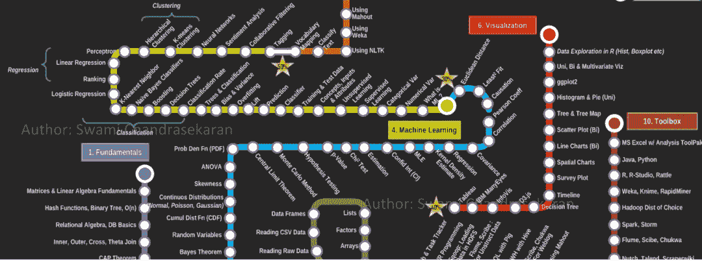

↑↑↑关注后"星标"Datawhale

每日干货 & [每月组队学习](https://mp.weixin.qq.com/mp/appmsgalbum?__biz=MzIyNjM2MzQyNg%3D%3D&action=getalbum&album_id=1338040906536108033#wechat_redirect)，不错过

 Datawhale干货 

**作者：周远，来源：机器之心**

> 这是一份写给公司算法组同事们的技术路线图，其目的主要是为大家在技术路线的成长方面提供一些方向指引，配套一些自我考核项，可以带着实践进行学习，加深理解和掌握。

内容上有一定的通用性，所以也分享到知乎上。欢迎大家给出建议，如有错误纰漏，还望不吝指正 :)

**工程师能力层级概览**

对于不同级别的算法工程师技能要求，我们大致可以分成以下几个层级：

*   初级：可以在一些指导和协助下独立完成开发任务。具体到算法方面，需要你对于工具框架，建模技术，业务特性等方面有一定的了解，可以独立实现一些算法项目上的需求。

*   中级：可以基本独立完成一个项目的开发与交付。在初级工程师的基础上，对于深入了解技术原理的要求会更高，并且能够应对项目中各种复杂多变的挑战，对于已有技术和工具进行改造适配。在整体工程化交付方面，对于代码质量，架构设计，甚至项目管理方面的要求会开始显现。另外从业务出发来评估技术选型和方案也变得尤为重要。

*   高级：可以独立负责一条产品线的运作。在中级工程师的基础上，需要更广阔的技术视野与开拓创新能力，定义整个产品线的前进方向。解决问题已经不是关键，更重要的是提出和定义问题，能够打造出在业界具有领先性和差异性的产品，为公司创造更大的价值。

事实上对于不同层级的工程师，非技术部分的要求都有一定占比。本文主要聚焦在技术路线图上，对于其他方面的学习进阶路线不会做覆盖。

**阅读建议**

以下内容分工程基础，算法基础，算法工程交叉，工程深入方向，算法深入方向几个部分，在各个部分内部会进一步区分一些主题。在各个主题内部，也是有深入程度的区别的，不过限于篇幅没有进行详细的说明。建议学习路线可以先把两个基础部分与工作中较为相关的内容做一个整体基础的夯实，然后可以在后续交叉和深入方向的主题中选择感兴趣的进行深入了解和学习，过程中发现基础部分欠缺的，可以再回到基础部分查漏补缺，迭代前行。

**工程基础**

****编程语言****

**Python**

Python 是算法工程师日常工作中最常用的语言，应该作为必须掌握的一门技术。大致的学习路线如下：

*   学习掌握 Python 的基本语法，可以通过各类入门教程来看，个人推荐《Learn Python the Hard Way》。

*   自我考核：能够读懂大多数的内部项目及一些开源项目代码的基本模块，例如 pandas, sklearn 等。

*   学习 Python 的编程风格，建议学习观远内部的 Python 代码规范。

*   自我考核：编写的代码符合编码规范，能够通过各类 lint 检查。

*   Python 进阶，这方面有一本非常著名的书《Fluent Python》，深入介绍了 Python 内部的很多工作原理，读完之后对于各类疑难问题的理解排查，以及语言高级特性的应用方面会很有帮助。另外动态语言元编程这块，《Ruby 元编程》也是一本非常值得推荐的书。

*   自我考核：能够读懂一些复杂的 Python 项目，例如 sqlalchemy 中就大量使用了元编程技巧。在实际工程项目中，能够找到一些应用高级技巧的点进行实践，例如基于 Cython 的性能优化等。

*   领域应用，Python 的应用相当广泛，在各个领域深入下去都有很多可以学习的内容，比如 Web 开发，爬虫，运维工具，数据处理，机器学习等。这块主要就看大家各自的兴趣来做自由选择了，个人推荐熟悉了解一下 Python web 开发，测试开发相关的内容，开拓视野。

*   自我考核：以 Web 开发和测试开发为例，尝试写一个简单的 model serving http 服务，并编写相应的自动化测试。

**Scala/Java**

Java 目前是企业级开发中最常用的软件，包括在大数据领域，也是应用最广泛的语言，例如当年的 Hadoop 生态基本都是基于 Java 开发的。Scala 由于其函数式编程的特性，在做数据处理方面提供了非常方便的 API，也因为 Spark 等项目的火热，形成了一定的流行度。在进行企业级的软件开发，高性能，大规模数据处理等方面，JVM 上的这两门语言有很大的实用价值，值得学习。

顺带一提，Scala 本身是一门非常有意思的语言，其中函数式编程的思想与设计模式又是非常大的一块内容，对于拓宽视野，陶冶情操都是挺不错的选择。

考虑到算法工程师的工作内容属性，这边给出一个 Scala 的学习路线：

*   学习掌握 Scala 的基本语法，开发环境配置，项目编译运行等基础知识。这里推荐 Coursera 上 Martin Odersky 的课程，《快学 Scala》或《Programming in Scala》两本书也可以搭配着浏览参考。

*   自我考核：能使用 Scala 来实现一些简单算法问题，例如 DFS/BFS。或者使用 Scala 来处理一些日常数据工作，例如读取日志文件，提取一些关键信息等。

*   学习使用 Scala 来开发 Spark 应用，推荐 edX 上的《Big Data Analytics Using Spark》或者 Coursera 上的《Big Data Analytics with Scala and Spark》，另外有些相关书籍也可以参考，比如《Spark 快速大数据分析》等。

*   自我考核：能够使用 Spark 的 Scala API 来进行大规模的数据分析及处理，完成 lag feature 之类的特征工程处理。

*   JVM 的原理学习，Scala/Java 都是 JVM 上运行的优秀语言，其背后是一个非常大的生态，包括在 Web，Android，数据基础架构等方面有广泛的应用。JVM 相比 Python 虚拟机，发展更加成熟，有一套非常完善的 JDK 工具链及衍生的各类项目，便于开发者 debug，调优应用。这方面推荐学习周志明的《深入理解 Java 虚拟机》。

*   自我考核：理解 JVM GC 原理，能通过 JDK 中相关工具或者优秀的第三方工具如 arthas 等，排查分析 Spark 数据应用的资源使用情况，GC profiling，hot method profiling 等，进而进行参数优化。

*   计算机语言理论。Programming Language 作为计算机科学的一个重要分支，包含了很多值得深入研究的主题，例如类型论，程序分析，泛型，元编程，DSL，编译原理等。这方面的很多话题，在机器学习方面也有很多实际应用，比如 TVM 这类工作，涉及到大量编译原理的应用，知乎大佬 “蓝色” 也作为这个领域的专家在从事深度学习框架相关的工作。llvm, clang 作者 Chris Lattner 也加入 Google 主导了 Swift for Tensorflow 等工作。Scala 作为一门学术范非常强的语言，拥有极佳的 FP，元编程等能力支持，强大的类型系统包括自动推理，泛型等等高级语言特性，相对来说是一门非常 “值得” 学习的新语言，也是一个进入 PL 领域深入学习的 "gateway drug" :) 对这个方面有兴趣的同学，可以考虑阅读《Scala 函数式编程》，《冒号课堂》，以及 Coursera 上《Programming Languages》也是一门非常好的课程。另外只想做科普级了解的同学，也可以读一读著名的《黑客与画家》感受一下。

**C/C++/Rust**

当前流行的算法框架，例如 TensorFlow, PyTorch, LightGBM 等，底层都是基于 C++ 为主要语言进行实现的。但是 C++ 本身过于复杂，使用场景也比较有限制，建议只需要达到能够读懂一些基础的 C++ 代码逻辑即可。在系统级开发领域，目前有一门新语言逐渐崛起，连续几年被 StackOverflow 投票评选为程序员最喜爱的语言：Rust。从设计理念和一些业界应用（例如 TiKV）来看还是非常不错的，但是我也没有深入学习了解过，就不做具体推荐了。这方面建议的学习内容包括经典的《The C Programming Language》以及 Rust 官方的：https://github.com/rust-lang/rustlings

*   自我考核：能够读懂 LightGBM 里对于 tweedie loss 的相关定义代码。

**操作系统**

**基本概念**

我们所编写的算法应用，都是通过操作系统的环境运行在物理硬件之上的。在实际运作过程中，会碰到不少相关的问题，例如为什么程序报了资源不足的错误，为什么 notebook 在浏览器里打不开，为什么进程 hang 住了没有响应等等，都需要一些操作系统的知识来帮助理解和分析问题，最终排查解决。操作系统涵盖的内容比较多，建议一开始只需要了解一些主要概念（例如硬件结构，CPU 调度，进程，线程，内存管理，文件系统，IO，网络等），对于整体图景有一些感觉即可。后续碰到了实际问题，可以再在各个部分深入学习展开。优秀的学习资料也有很多，基本都是大部头，重点推荐《深入理解计算机系统》，《Operating Systems: Three Easy Pieces》，以及《现代操作系统》。

*   自我考核：能够基本明确运行一个模型训练任务过程中，底层使用到的硬件，操作系统组件，及其交互运作的方式是如何的。

**Linux 基础**

平时工作中最常用的两个操作系统 CentOS 和 macOS，都是 Unix/Linux 系的，因此学习掌握相关的基础知识非常重要。一些必须掌握的知识点包括：Shell 与命令行工具，软件包管理，用户及权限，系统进程管理，文件系统基础等。这方面的入门学习资料推荐《鸟哥的 Linux 私房菜》，基本涵盖了 Linux 系统管理员需要掌握知识的方方面面。进阶可以阅读《Unix 环境高级编程》，对于各种系统调用的讲解非常深入，可以为后续性能调优等高级应用打下基础。

*   自我考核：开发一个 shell 小工具，实现一些日常工作需求，例如定时自动清理数据文件夹中超过一定年龄的数据文件，自动清理内存占用较大且运行时间较久的 jupyter notebook 进程等。

**深入应用**

工作中碰到的疑难问题排查，性能分析与优化，系统运维及稳定性工程等方面，都需要较为深入的计算机体系和操作系统知识，感兴趣的同学可以针对性的进行深入学习。以性能优化为例，可以学习经典的《性能之巅》，了解其中的原理及高级工具链。像其中的系统调用追踪 (strace)，动态追踪(systemtap, DTrace, perf, eBPF) 等技术，对于操作系统相关的问题排查都会很有帮助。

*   自我考核：能够分析定位出 LightGBM 训练过程中的性能瓶颈，精确到函数调用甚至代码行号的级别。

**软件工程**

**算法与数据结构**

暂时先把这块放到软件工程模块下。这里指的算法是计算机科学中的经典算法，例如递归，排序，搜索，动态规划等，有别于我们常说的机器学习算法。这块的学习资料网上有非常多，个人当年是通过普林斯顿的算法课 (需要有 Java 基础) 入门，后来又上了斯坦福的算法分析与设计，开拓了一些视野。书籍方面推荐新手从《算法图解》入门，然后可以考虑阅读 Jeff Erickson 的《Algorithms》，或者选择上面提到的网课。另外像《编程珠玑》，《编程之美》等也可以参阅，里面有不少问题的巧妙解法。除了从书本中学习，还可以直接去 LeetCode 等网站进行实战操作进行练习提高。

*   自我考核：能够设计相关的数据结构，实现一个类似 airflow 中点击任意节点向后运行的功能。

**代码规范**

从初级程序员到中高级程序员，其中比较大的一个差异就是代码编写习惯上，从一开始写计算机能理解，能够运行成功的代码，逐渐演化到写人能够理解，易于修改与维护的代码。在这条学习路径上，首先需要建立起这方面的意识，然后需要在实战中反复思考和打磨自己的代码，评判和学习其它优秀的项目代码，才能逐渐精进。推荐的学习书籍有《编写可读代码的艺术》，一本非常短小精悍的入门书籍，后续可以再慢慢阅读那些经典大部头，例如《Clean Code》，《Code Complete》，《The Pragmatic Programmer》等。这方面 Python 也有一本比较针对性的书籍《Effective Python》，值得一读。

*   自我考核：审视自己写的项目代码，能发现并修正至少三处不符合最佳编码实践的问题。

**设计模式**

在代码架构方面，设计模式是一个重要的话题，对于日常工作中出现的许多典型场景，给出了一些解决方案的“套路”。这方面最著名的书当属 GoF 的《设计模式》，不过个人并不十分推荐，尤其是以 Python 作为主要工作语言的话，其中很大部分的设计模式可能并不需要。入门可以浏览一下这个网站掌握一些基本概念：https://refactoringguru.cn/design-patterns/python ，后续可以考虑阅读《Clean Architecture》，《重构》等相关数据，理解掌握在优化代码架构过程中思考的核心点，并加以运用。Python 相关的设计模式应用，还可以参考《Python in Practice》。

*   自我考核：在项目中，找到一处可以应用设计模式的地方，进行重构改进。

**质量保障**

对于需要实际上线运行的软件工程，质量保障是非常重要的一个环节，能够确保整个产品按照期望的方式进行运作。在机器学习项目中，由于引入了数据这个因素，相比传统的软件测试会有更高的难度，也是业界还在摸索前进的方向。建议可以先阅读《单元测试的艺术》或《Google 软件测试之道》，大致理解软件测试的一些基本概念和运作方式，在此基础上可以进一步阅读 Martin Fowler 对于机器学习领域提出的 CD4ML 中相关的测试环节，学习 sklearn，LightGBM 等开源库的测试开发方式，掌握机器学习相关的质量保障技术能力。

*   自我考核：在项目中，实现基础的数据输入测试，预测输出测试。

**项目管理**

软件工程推进过程中，项目管理相关的技能方法与工具运用也非常的关键。其中各种研发流程与规范，例如敏捷开发，设计评审，代码评审，版本管控，任务看板管理等，都是实际项目推进中非常重要的知识技能点。这方面推荐学习一本经典的软件工程教材《构建之法》，了解软件项目管理的方方面面。进一步来说广义的项目管理上的很多知识点也是后续深入学习的方向，可以参考极客时间上的课程《项目管理实战 20 讲》。

*   自我考核：在某个负责项目中运用项目管理方法，完成一个实际的需求评估，项目规划，设计与评审，开发执行，项目上线，监控维护流程，并对整个过程做复盘总结。

**高级话题**

软件工程师在技能方向成长的一条路线就是成为软件架构师，在这个方向上对于技能点会有非常高的综合性要求，其中也有不少高级话题需要深入学习和了解，例如技术选型与系统架构设计，架构设计原则与模式，宽广的研发知识视野，高性能，高可用，可扩展性，安全性等等。有兴趣的同学可以了解一下极客时间的《从 0 开始学架构》这门课，逐渐培养这方面的视野与能力。另外如《微服务架构设计模式》还有领域驱动设计方面的一系列书籍也值得参考学习。

*   自我考核：设计一个算法项目 Docker 镜像自动打包系统。

**算法基础**

**数据分析**

**数学基础**

在进行算法建模时，深入了解数据情况，做各类探索性分析，统计建模等工作非常重要，这方面对一些数学基础知识有一定的要求，例如概率论，统计学等。这方面除了经典的数学教材，也可以参考更程序员向的《统计思维》，《贝叶斯方法》，《程序员的数学 2》等书籍。

*   自我考核：理解实际项目中的数据分布情况，并使用统计建模手段，推断预测值的置信区间。

**可视化**

在进行数据分析时，可视化是一个非常重要的手段，有助于我们快速理解数据情况，发掘数据规律，并排查异常点。对于各种不同类型的数据，会对应不同的可视化最佳实践，如选择不同的图表类型，板式设计，分析思路编排，人机交互方式等等。另一方面，可视化与数据报告也是我们与不同角色人群沟通数据 insights 的一个重要途径，需要从业务角度出发去思考可视化与沟通方式。这方面可以参考《Storytelling with Data》，《The Visual Display of Quantitative Information》等经典数据，同时也需要培养自己的商业背景 sense，提升沟通能力。

*   自我考核：对内沟通方面，能使用可视化技术，分析模型的 bad case 情况，并确定优化改进方向。对外沟通方面，能独立完成项目的数据分析沟通报告。

**误差分析与调优**

在做算法模型调优改进中，需要从数据分析的基础上出发来决定实验方向，这么做有几个好处：

*   从分析出发指导调优更有方向性，而不是凭经验加个特征，改个参数碰运气。哪怕是业务方提供的信息，也最好是有数据分析为前提再做尝试，而不是当成一个既定事实。

*   由分析发现的根源问题，对于结果验证也更有帮助。尤其在预测的数据量极大情况下，加一个单一特征很可能总体只有千分位准确率的提升，无法确定是天然波动还是真实的提升。但如果有分析的前提，那么我们可以有针对性的看对于这个已知问题，我们的调优策略是否生效，而不是只看一个总体准确率。

*   对于问题的彻底排查解决也更有帮助，有时候结果没有提升，不一定是特征没用，也可能是特征代码有 bug 之类的问题。带着数据分析的目标去看为什么这个特征没有效果，是模型没学到还是特征没有区分度等，有没有改进方案，对于我们评判调优尝试是否成功的原因也更能彻查到底。

*   数据分析会帮助我们发现一些额外的问题点，比如销量数据清洗处理是不是有问题，是不是业务本身有异常，需要剔除数据等。

这方面在业界有一些关于误差分析的探索研究，不过大多数都是基于分类问题的，例如《Identifying Unknown Unknowns in the Open World》，《A Characterization of Prediction Errors》等。可以在了解这些研究的基础上，结合具体的业务情况，深入思考总结误差分析的思路与方法论。

*   自我考核：在项目中形成一套可以重复使用的误差分析方案，能够快速从预测输出中定位到目前模型最重要的误差类别，并一定程度上寻找到根本原因。

**机器学习基础**

**传统机器学习**

这块大家应该都非常熟悉了，初阶的学习路线可以参考周志华老师的《机器学习》，涵盖了机器学习基础，常用机器学习方法，和一些进阶话题如学习理论，强化学习等。如果希望深化理论基础，可以参考经典的《PRML》，《ESL》和《统计学习方法》。在实战中，需要综合业务知识，算法原理，及数据分析等手段，逐渐积累形成建模调优的方法论，提高整体实验迭代的效率和成功率。

*   自我考核：结合实际业务和机器学习理论知识，挖掘项目中算法表现不够好的问题，并通过算法改造进行提升或解决。

**深度学习**

近些年兴起的深度学习，已经成为机器学习领域一个非常重要的分支，在各个应用方向发挥了很大的作用。相对于传统机器学习，对于特征工程要求的降低成了其核心优势。另一方面，深度学习对于大数据量，大规模算力的应用能力很强，也一定程度上提升了整体的产出效果。由于理论方面的研究稍显落后，深度学习在实际应用中对于使用者的经验技能要求相对比较高，需要有大量的实战经验才能达到比较理想的效果。这方面的学习资料推荐 Keras 作者的《Deep Learning with Python》，以及《Hands-on Machine Learning with Scikit-Learn and TensorFlow》，而在理论方面推荐著名的“花书”《Deep Learning》。在学习理论原理的基础上，尤其要注意在实际算法应用中，能够通过观察各种指标与数据分析，找到提升模型的操作改进方向。

*   自我考核：能够在实际项目中，使用深度学习模型，达到接近甚至超过传统 GBDT 模型的精确度效果，或者通过 ensemble，embedding 特征方式，提升已有模型的精度。

**领域建模**

目前我们的业务领域在时间序列预测，自然语言处理，推荐等方面，其它类似图像，搜索，广告等领域也都有各自的一些领域建模方法。在时间序列领域，包括了传统时序模型，如 ARIMA, Prophet，机器学习模型，如划动窗口特征构建方法结合 LightGBM，及深度学习模型，例如 LSTM，seq2seq，transformer 等。这方面可以参考 Kaggle 上相关比赛的方案分享，以及 Amazon，Uber，天猫等有类似业务场景公司的分享资料。其它领域也是类似，通过了解历史技术演进，相关比赛，业界的方案分享与开源项目，会议论文来逐渐掌握学习建模方法，结合实际业务进行实践尝试，积累起更加体系性的个人知识技能。

*   自我考核：在项目中复现一个 Kaggle 获胜方案，检验其效果，分析模型表现背后的原因，并尝试进行改进。

**算法框架**

**数据处理框架**

在项目实施过程中，会需要各类复杂的数据处理操作，因此熟练掌握此类框架就显得尤为重要。目前行业的标准基本上会参照 Pandas DataFrame 的定义，在数据量较大的情况下，也有许多类似的框架，如 Spark，Dask，Modin，Mars 等支持分布式运行的 DataFrame，以及 cuDF，Vaex 等提升单机性能的改进实现。这方面经典的书籍可以参考 Wes McKinney 的《Python for Data Analysis》，在掌握基础数据操作的基础上，可以进而了解窗口函数，向量化性能优化等高级话题。另外 SQL 也可以做非常复杂的数据处理工作，有不少公司例如阿里会以 SQL 为主来构建数据处理流程，感兴趣的同学也可以学习一下 SQL 中各种高级计算的使用及优化方法。

*   自我考核：在已有项目中，能把至少三个使用 apply 方法的 pandas 处理修改成向量化运行，并测试性能提升。使用 window function 或其它方案来实现 lag 特征，减少 join 次数。

**机器学习框架**

机器学习方面的新框架层出不穷，一方面我们需要掌握经典框架的使用方式，理解其模块构成，接口规范的设计，一定程度上来说其它新框架也都需要遵循这些业界标准框架的模块与接口定义。另一方面对于新框架或特定领域框架，我们需要掌握快速评估，上手使用，并且做一定改造适配的能力。一些比较经典的框架有：

*   通用机器学习：scikit-learn，Spark ML，LightGBM

*   通用深度学习：Keras/TensorFlow，PyTorch

*   特征工程：tsfresh, Featuretools，Feast

*   AutoML：hyperopt，SMAC3，nni，autogluon

*   可解释机器学习：shap，aix360，eli5，interpret

*   异常检测：pyod，egads

*   可视化：pyecharts，seaborn

*   数据质量：cerberus，pandas_profiling，Deequ

*   时间序列：fbprophet，sktime，pyts

*   大规模机器学习：Horovod，BigDL，mmlspark

*   Pipeline：MLflow, metaflow，KubeFlow，Hopsworks

一般的学习路径主要是阅读这些框架的官方文档和 tutorial，在自己的项目中进行尝试使用。对于一些核心接口，也可以阅读一下相关的源代码，深入理解其背后的原理。

*   自我考核：在 LightGBM 框架下，实现一个自定义的损失函数，并跑通训练与预测流程。

**其它框架**

其它比较常见且与算法工程师日常工作会有一些联系的有 Web 框架，爬虫框架等，最具有代表性的当属 Flask 和 scrapy。这两者背后各自又是很大一块领域，尤其 web 开发更是保罗万象。感兴趣的同学还可以了解一下一些新兴的基于 Python3 的框架，例如 FastAPI，其背后借鉴的许多现代框架的思想设计，包括数据验证，序列化，自动文档，异步高性能等，开拓一下知识面。

*   自我考核：实现一个简单的 model serving http 服务。

**算法工程交叉**

**大规模算法运行**

**分布式训练**

在很多项目中，数据量达到十亿级以上的情况下，单机训练会难以支撑。因此分布式训练也是实际工程落地中非常重要的一个主题。分布式训练涉及到多机的通讯协同方式，优化算法的改造，数据及模型的并行与聚合，以及框架的选择和运维等话题，具体可以参考《分布式机器学习》。另外对于分布式系统，也可以参阅《数据密集型应用系统设计》这本神作，了解其背后原理。

*   自我考核：能够在多机上进行亿级数据的 GBDT 模型训练与预测。

**高性能计算**

在做大规模的数据训练与推理时，近些年涌现出许多高性能计算优化的方法，例如从硬件方面，有各种超线程技术，向量化指令集，GPGPU，TPU 的应用等，从软件方面，有针对数值计算场景的 OpenBLAS，有自动并行化的 OpenMP，有各种 codegen，JIT 技术下的运行时优化等。这方面可以学习的方向也很多，从基础的并行编程，编译原理及优化的知识开始，到 CUDA，OpenMP 的应用（例如 Nvidia 的 cuDNN，还有 LightGBM 中也用到了 OpenMP），Codegen，JIT 等技术在 Spark，TVM 等项目中的使用等，建议有深度性能优化需求时可以往这些方向做调研和学习。

*   自我考核：能够通过 LLVM JIT 来优化实现 Spark window function 的执行性能。

**模型加速领域**

这个方向分两个部分，一块是模型训练方面，能够做到加速，例如使用大 batch size，迁移学习，持续的在线 / 增量学习等手段，另一块在模型预测方面，也有很多加速需求，比如模型参数量优化，模型压缩，混合精度，知识蒸馏等技术手段，都是为了做到更高性能，更低资源消耗的模型预测推理。这方面业界有各个方向的文章和技术实现可以参考，比如经典的《Training ImageNet in 1 Hour》，MobileNet，TensorRT，二值网络等。

*   自我考核：在典型的销量预测场景中实现增量训练与预测。

**MLOps**

**编排调度**

包含各类 pipeline 的编排与调度能力的支持，包括数据 pipeline，训练 pipeline 和 serving pipeline 等。这方面比较常用的框架工具有 Airflow，DolphinScheduler，Cadence 等，需要掌握其基本的工作原理和使用方式，并能够应用于离线实验与线上运行。

*   自我考核：使用 Airflow 完成一个标准的项目 pipeline 搭建与运行。

**数据集成**

相对于传统的 DevOps，机器学习项目最大的区别在于数据方面的依赖会更加显著与重要。这方面的话题包括数据血缘，数据质量保障，数据版本控制等，有各类工具可以借鉴使用，例如数据版本管理方面的 DVC，数据质量方面的 TFX Data Validation，Cerberus，Deequ 等。在方法论层面，《The ML Test Score》中给出了不少数据相关的具体测试方法，值得参考学习。

*   自我考核：在项目中实现输入数据的分布测试，特征工程测试及特征重要性准入测试。

**实验管理**

这部分也是 ML 项目的独特之处，在开发过程中有大量的实验及相应的结果输出需要记录，以指导后续调整优化的方向，并选择最优结果来进行上线部署。这方面可以参考的项目有 MLflow，fitlog，wandb 等。当然对于单独的项目来说，可能 online Excel 就能满足需求了 :)

*   自我考核：在实际项目中实行一套标准的实验记录手段，并能从中找出各类实验尝试带来的精度提升的 top 5 分别是哪些操作。

**Serving**

目前我们的 serving 大多数是离线 batch 预计算的形式，所以主要依赖的技术手段是各类离线 inference 的方法，例如直接使用 model predict 接口，使用 mmlspark 等做大规模并行 inference 等。如果涉及到在线 serving，情况会更加复杂，例如在线 pipeline 的运行，实时特征获取，low latency/high throughput 的 serving 服务等，可以参考 TF Serving，MLeap，H2O，PredictionIO，PMML/PFA/ONNX 等开发标准模型格式等。

*   自我考核：部署一个实时预测服务，能够根据用户输入产生相应的预测结果。

**CI/CD**

软件工程中的持续集成，持续部署已经成为一种标准实践，在算法项目中，额外引入了数据这个维度的复杂性，带来了一些新的挑战。在这个方向上，几个主要话题包括自动化测试，pipeline 打包部署，持续监控运维等，可以参考 Martin Fowler 关于 CD4ML 的文章。工具系统层面，可以学习传统的 Jenkins，也有一些新选择例如 CircleCI，GoCD，VerCD（Uber）等。

*   自我考核：通过 Jenkins 实现 pipeline 自动测试，打包，上线流程。

**系统监控**

在整个项目上线后，需要对系统的各个环节进行监控，并对各种异常情况作出响应。例如输入数据的监控，判别测试数据与训练数据的分布是否有偏移，整个运行 pipeline 的监控，判别是否有运行失败抛出异常的情况，对于预测输出的监控，确保没有异常的预测输出值，也包括对于系统计算资源等方面的监控，确保不会因为资源不足导致业务受到影响等。在监控信息收集，基础上，还需要配套一系列的自动告警通知，日志追踪排查等。这方面的工具框架包括 TF data validation 这类专门针对算法项目的新产品，也有 elasicsearch + kibana 这类传统产品。

*   自我考核：将三个项目中做过的问题排查改造成常规监控手段，支持自动的问题发现，告警通知，如有可能，提供自动化或半自动化的问题排查解决方案。

**MLOps 系统**

MLOps 整体是一个比较大的话题，在这方面有很多产品和系统设计方面的实践可以参考学习。例如 Uber 的 Michelangelo 系列文章，Facebook 的 FBLearner，neptune.ai，dataiku，domino 等，虽然没有开源，但是其背后的很多设计理念，演进思考，白皮书等都非常值得我们学习。在开源界也有很多可以参考的项目，例如 MLflow，Kubeflow，Metaflow，TFX 等，可以学习他们的设计理念，Roadmap，以及实现细节等。

*   自我考核：总结各个 MLOps 产品的功能模块矩阵对比，能够根据项目需求来进行产品选型与使用。

**工程深入方向**

**数据库**

**数据库原理**

在平时工作中，我们有大量的场景需要用到数据库。从客户数据的对接，数据集的管理和使用，到各种业务系统的数据表设计及优化等，都需要对数据库的运作原理，适用场景，运维使用，性能优化等方面有一定的了解。常见的需要掌握的概念有 OLTP vs OLAP，事务，索引，隔离级别，ACID 与 CAP 理论，数据同步，数据分片，SQL 语法，ORM 等。从底层原理看，会涉及到数据，索引，及日志等存储引擎方面，以及各种计算查询引擎，包括分布式系统的设计与实现。这方面推荐的学习资料有《数据库系统内幕》及《数据密集型应用系统设计》。

*   自我考核：能够理解 SQL 执行计划，并能够根据执行计划来做索引或查询调优。

**关系型数据库**

目前常用的关系型数据库主要是 MySQL 和 PostgreSQL，主要需要掌握的是日常的一些 SQL 操作，例如 DML（增删改查），DDL（创建表，修改索引等），DCL（权限相关）。在此基础上还可以进一步了解一些如数据类型，高级计算，存储引擎，部署运维，范式概念与表结构设计等方面的话题。对于高级话题这块，推荐《高性能 MySQL》与《高可用 MySQL》。

*   自我考核：在 MySQL 中设计相关表结构，存储实际项目中的一系列中间数据集。

**NoSQL 数据库**

常用的 NoSQL 数据库有几类，KV 存储（Redis），文档数据库（MongoDB），Wide-column 存储（Cassandra，HBase）以及图数据库（Neo4j）。在目前我们的算法项目中，比较有可能会用到的主要是 Redis 这类 KV 存储（也可能把 Cassandra 之类当泛 KV 来用），或者更新一点的类似 Delta Lake 的存储系统。建议学习了解一下这类 KV 存储，以及分布式数据库的常见操作方式，以及基础的运维排查，性能优化方法。

*   自我考核：考虑一个线上模型服务的场景，用户输入作为基础特征，使用类似 Redis 的 KV 系统，实现实时获取其它特征，并进行模型预测。

**云计算**

**基础架构**

IT 系统总体的发展趋势在往云计算方向演进，即使是自建的基础设施，也会采用云计算的一套构建方式，让开发者不用过多的关注底层计算存储资源的部署运维。对于应用开发者来说，需要了解一些基础架构方面的知识，例如各类虚拟化及容器技术，配置管理，容器编排等，便于在日常工作中使用相关技术来管理和发布应用。从工具层面看，Docker 与 k8s 等技术发展速度较快，主要还是根据官方文档来学习为主。浙大之前出版的《Docker - 容器与容器云》一书中有一些更深入的话题的探讨，另外《Kubernetes in Action》中也值得一读。从方法论层面看，《Infrastructure as Code》和《Site Reiliability Engineering》是两本非常不错的学习资料。与算法应用结合的虚拟化，运维，持续集成等都是比较新的领域，需要我们探索出一条可行路线。

*   自我考核：对于已有的算法项目，总结制定一套开发，测试，发布，运维的标准流程，且尽可能自动化执行。

**分布式存储**

前些年最流行的分布式存储是脱胎于 Google 经典的 GFS 论文实现的 HDFS，不过随着硬件技术的发展，计算存储分离思想的逐渐兴起，不但灵活性更高，成本更低，且各自架构的复杂度也大大降低了。因此目前更建议学习简单的 object store 形式的分布式存储，例如 s3，minio 等。在此基础上的一些存储系统，例如 Delta Lake，提供了事务，高效的 upsert，time travel 等功能，也值得关注与学习。原理方面，还是推荐《数据密集型应用设计》这本。

*   自我考核：在项目中实现不同机器能够访问同一个 s3 路径的文件，并进行正常的数据读写，模型文件读写等功能。

**分布式计算**

大数据时代的分布式计算的鼻祖来自于 Google 经典的 MapReduce 论文，后续在 Hadoop 系统中做了开源实现，在前几年是非常火热的一项技术。目前业界的主流是 Spark 和 Flink，前者在批处理计算中处于霸者地位，后者是流处理领域的领先者。目前我们的业务应用中，Spark 是比较常用的分布式计算引擎，其基本操作相关内容比较简单，参考官方文档或者《Spark 快速大数据分析》即可。后续的主要难点会有大数据量下的问题排查与性能调优，执行复杂计算或与 Python 相关 UDF 的交互配合方式等。这方面需要对 Spark 的系统架构，内部原理有一定了解，例如 master，worker，driver，executor 等之间的关系，lazy evaluation，DAG 的 lineage 与 stage 概念，shuffle 优化，wholestage codegen 等技术细节。这方面暂时没有找到比较好的资料，主要还是依赖实际问题解决的经验积累。

*   自我考核：用 Spark 来实现项目中的特征工程，并在一定数据量情况下取得比单机 Pandas 更好的性能效果。

**其它话题**

其它云服务基础设施还包括分布式数据库，消息队列，zk/raft 分布式协作系统，虚拟网络，负载均衡等。这些话题离算法应用方面会比较远一些，基本上达到遇到需求时会使用的能力即可，在这里不做展开。

**算法深入方向**

**AutoML**

**超参优化**

自动化机器学习中比较传统的一块是超参数优化，进而可以推广到整个 pipeline 的超参优化，包括数据预处理，特征工程，特征选择，模型选择，模型调优，后处理等部分。目前业界应用比较广泛的技术手段主要是随机搜索，贝叶斯优化，进化算法，Hyperband/BOHB 等，在特征工程方面有 Featuretools，tsfresh，AutoCrossing 等自动化特征工程工具。学术界有一些进一步的探索研究，包括 multi-fidelity 优化，多任务优化，HPO 结合 ensemble learning，pipeline planning，data diff 自动数据分布探测等方面。可以参考 http://automl.org 上的各类参考资料与书籍进行学习了解。主要难点包括 automl 算法的泛化能力，scalability，整体 pipeline 组合的搜索与生成，针对不同学习算法的自动优化手段等。

*   自我考核：了解超参优化的基础概念，能够在项目中应用框架工具来实现模型超参的贝叶斯优化流程。

**元学习**

Meta learning 是近年来非常活跃的一个新兴领域，其主要思路是希望能通过元学习模型方法，去积累建模调优的先验知识，跨任务推断模型效果并 warm start 新的训练任务，或者指导学习算法来进行更高效的具体任务的训练过程。这方面在工业界的主要应用基本上集中在建模调优先验知识的积累方面，比如通过一系列公开数据集搜索寻找出表现较好的起始参数，用于指导在新任务上做超参优化的起始搜索点。学术研究中除了 configuration space 的研究，还包括从 learning curve 中进行学习推断，元特征提取与建模，HTN planning 在 pipeline 构建中的应用，以及 MAML 等 few-shot learning 方向的探索。这方面推荐 Lilian Weng 的一系列文章（https://lilianweng.github.io/lil-log/2018/11/30/meta-learning.html），以及 http://automl.org 网站上的资料。

*   自我考核：设计一系列 meta feature 与 meta learning 手段，实现对新任务的参数选择的初始化。

**NAS**

AutoML 领域比较火，但也是比较特别的一个方向，目前需要大量的计算资源投入才能做这方面的研究与尝试，因此主要建议了解一下这个方向的一些工作即可，不做深入探索学习。

**AutoML 系统**

自动化机器学习相关的框架工具也非常多，比较有代表性的框架有 auto-sklearn(来自 http://automl.org 团队)，nni(microsoft)，auto-gluon(amazon)，H2O，ray tune 等，在工具级别也有如 hyperopt，SMAC3，featuretools 等。可以通过学习这些工具框架，了解 AutoML 系统的架构与实现方式，并应用到实际项目中。

*   自我考核：使用一种 AutoML 系统来进行项目的模型自动优化，并与手工优化的结果进行比较，看是否有所提升，及寻找背后的原因。

**模型解释**

**模型解释技术**

主要有三个方面，一是模型本身的解释性，例如线性回归，决策树等，模型结构简单，根据其原理，可以直接对预测结果，特征使用等方面给出解释。另外一些复杂模型，例如 EBM，神经网络，Bayesian rule lists，SLIMs 等，也可以利用一些本身的特性给出一些解释，例如 GradCAM 方法等。二是模型无关的解释方法，包括经典的 PDP，ICE 等特征图，LIME 等 surrogate model 方法，以及基于博弈论的 Shapley 方法。三是基于 sample 的解释方法，例如 conterfactual explanations，adversarial examples，prototypes，influential instances，kNN 等，不过看起来这类方法对于计算的开销一般都会比较大，不太容易在工程中实现落地。这方面的资料可以学习《Interpretable Machine Learning》和《Explainable AI》（关于深度学习的内容会更多）。另外学术界也有很多前沿探索，比如针对模型解释的降维工作，自动的时间序列分析及报告生成，因果模型，模型公平性及社会影响等方面，可以保持关注。

*   自我考核：理解 LIME，Shapley 的运作原理，并分析其局限性，尝试提出改进方案。

**模型解释应用**

从工具框架方面，有许多可以使用的开源项目，例如微软的 interpret，eli5，shap，AIX360 等。另外也有一些非传统意义上的模型解释，例如 manifold，tensorboard 这类模型 debugging 工具，自动化的误差分析与模型改进方案，因果模型框架，模型公平性评估与纠正工具等，都可以涵盖在广义的模型解释领域中。在工具基础上，如何结合业务领域知识，给出更有针对性的解释方案，也是值得思考深挖的方向。

*   自我考核：使用 shap，eli5 等工具来进行模型解释，并在此基础上形成面向开发者的模型 debug，误差分析及改进方案，或形成面向业务的 what-if 分析看板。

**总结**

目前机器学习应用领域还在高速发展与演进过程中，除了上述提到的技能方向，后续很可能会不断有新的主题引入进来，需要练就快速学习并应用落地的能力。在掌握前面编程，软件工程，机器学习的基础上，后半部分的研究方向，大家可以根据个人兴趣，选择几个进行深入探索与实践。仅阅读相关书籍和文章，只能对知识内容有一个初步的认识，必须要通过深入的动手实践，反复试错思考和修正，才能逐渐内化为自己的技能，并构建起较为坚实的知识体系。

**作者介绍**

周远（花名：字节），观远数据联合创始人与首席数据科学家。致力于算法前沿技术在泛零售消费领域的应用落地，深度参与主导了多个 AI 项目在行业头部，世界五百强客户的应用和上线，也和团队一起多次斩获智能零售方向的 Hackathon 冠军。曾就职于微策略，阿里云从事商业智能产品与云计算系统研发工作，拥有十多年的行业经验。目前研究兴趣主要包括可解释机器学习，AutoML 和大规模机器学习系统方向。

*原文链接：**https://zhuanlan.zhihu.com/p/192633890*

“干货学习，**点****赞****三连**↓