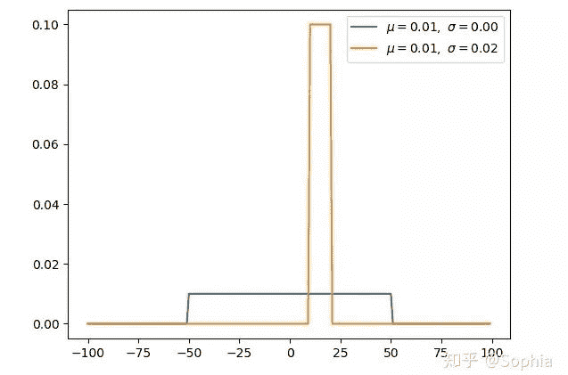

↑↑↑关注后"星标"Datawhale

每日干货 & [每月组队学习](https://mp.weixin.qq.com/mp/appmsgalbum?__biz=MzIyNjM2MzQyNg%3D%3D&action=getalbum&album_id=1338040906536108033#wechat_redirect)，不错过

 Datawhale干货 

**知乎作者：Sophia  来源：深度学习自然语言处理**

本文仅用于学术分享，著作权归作者所有。如有侵权，请联系后台作删文处理。

在逛Github时发现了一个不错的总结，对深度学习的概率分布进行了总结。

**作者的Github开源地址：**

https://github.com/graykode/distribution-is-all-you-needgithub.com

**1\. 均匀分布（连续）代码：**

https://github.com/graykode/distribution-is-all-you-need/blob/master/uniform.py

均匀分布在 [a，b] 上具有相同的概率值，是简单概率分布。

**2\. 伯努利分布（离散）代码：**

https://github.com/graykode/distribution-is-all-you-need/blob/master/bernoulli.py

先验概率 p（x）不考虑伯努利分布。因此，如果我们对最大似然进行优化，那么我们很容易被过度拟合。

利用二元交叉熵对二项分类进行分类。它的形式与伯努利分布的负对数相同。

**3\. 二项分布（离散）代码：**

https://github.com/graykode/distribution-is-all-you-need/blob/master/binomial.py

参数为 n 和 p 的二项分布是一系列 n 个独立实验中成功次数的离散概率分布。

二项式分布是指通过指定要提前挑选的数量而考虑先验概率的分布。

**4\. 多伯努利分布/分类分布（离散）代码：**

https://github.com/graykode/distribution-is-all-you-need/blob/master/categorical.py

多伯努利称为分类分布。交叉熵和采取负对数的多伯努利分布具有相同的形式。

**5\. 多项式分布（离散）代码：**

https://github.com/graykode/distribution-is-all-you-need/blob/master/multinomial.py

多项式分布与分类分布的关系与伯努尔分布与二项分布的关系相同。

**6\. β分布（连续）代码：**

https://github.com/graykode/distribution-is-all-you-need/blob/master/beta.py

β分布与二项分布和伯努利分布共轭。

利用共轭，利用已知的先验分布可以更容易地得到后验分布。

当β分布满足特殊情况（α=1，β=1）时，均匀分布是相同的。

**7\. Dirichlet 分布（连续）代码：**

https://github.com/graykode/distribution-is-all-you-need/blob/master/dirichlet.py

dirichlet 分布与多项式分布是共轭的。

如果 k=2，则为β分布。

**8.伽马分布（连续）代码：**

https://github.com/graykode/distribution-is-all-you-need/blob/master/gamma.py

如果 gamma（a，1）/gamma（a，1）+gamma（b，1）与 beta（a，b）相同，则 gamma 分布为β分布。

指数分布和卡方分布是伽马分布的特例。

**9\. 指数分布（连续）代码：**

https://github.com/graykode/distribution-is-all-you-need/blob/master/exponential.py

指数分布是 α 为 1 时 γ 分布的特例。

**10\. 高斯分布（连续）代码：**

https://github.com/graykode/distribution-is-all-you-need/blob/master/gaussian.py

高斯分布是一种非常常见的连续概率分布。

**11\. 正态分布（连续）代码：**

https://github.com/graykode/distribution-is-all-you-need/blob/master/normal.py

正态分布为标准高斯分布，平均值为0，标准差为1。

**12\. 卡方分布（连续）代码：**

https://github.com/graykode/distribution-is-all-you-need/blob/master/chi-squared.py

k 自由度的卡方分布是 k 个独立标准正态随机变量的平方和的分布。

卡方分布是 β 分布的特例。

**13\. t 分布（连续）代码：**

https://github.com/graykode/distribution-is-all-you-need/blob/master/student-t.py

t分布是对称的钟形分布，与正态分布类似，但尾部较重，这意味着它更容易产生远低于平均值的值。

“整理不易，**点****赞****三连**↓