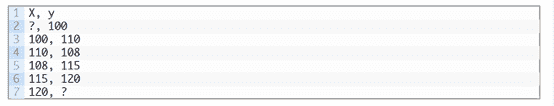

↑↑↑关注后"星标"Datawhale

每日干货 & [每月组队学习](https://mp.weixin.qq.com/mp/appmsgalbum?__biz=MzIyNjM2MzQyNg%3D%3D&action=getalbum&album_id=1338040906536108033#wechat_redirect)，不错过

 Datawhale干货 

**来源：Jason Brownlee，整理：数据派THU**

本文****约3300字****，建议阅读**10******分钟****

本文介绍了如何用XGBoost做时间序列预测，包括将时间序列转化为有监督学习的预测问题，使用前向验证来做模型评估，并给出了可操作的代码示例。

针对分类和回归问题，XGBoost是梯度提升算法的一种高效实现。

它兼顾了速度和效率，且在很多预测模型任务中表现优异，在数据科学比赛中广受赢家偏爱，如Kaggle。

XGBoost也可以用于时间序列预测，尽管要先把时间序列数据集转换成适用于有监督学习的形式。它还需要使用一种专门的技术来评估模型，称为前向推进验证，因为模型评估使用了k-折叠交叉，这会产生有正偏差的结果。

在本文中，你将会了解到如何开发应用于时间序列预测的XGBoost模型。

完成本教程后，你将知道：

*   XGBoost是用于分类和回归问题的梯度提升集成方法的一个实现。

*   通过使用滑动时间窗口表示，时间序列数据集可以适用于有监督学习。

*   在时间序列预测问题上，如何使用XGBoost模型进行拟合、评估、预测。

让我们开始吧！

**教程概览**

本教程分为三个部分，分别是：

**一、XGBoost集成**

**二、时间序列数据准备**

**三、时间序列预测上的XGBoost**

**一、XGBoost集成**

XGBoost是Extreme GradientBoosting的缩写，是一种高效的随机梯度提升的实现。

随机梯度提升算法（或者叫gradient boosting machines ortree boosting）是一种强大的机器学习技术，在很多有挑战的机器学习问题上，表现的非常好甚至是最好。

Tree boosting has been shown to give state-of-the-art results onmany standard classification benchmarks.

— XGBoost:A Scalable Tree Boosting System, 2016.

https://arxiv.org/abs/1603.02754

它是一个决策树算法的集成，其中新树可以对模型中已有树的结果进行修正。我们可以不断增加决策树，直到达到满意的效果。

XGBoost是随机梯度提升算法的一种高效实现，它可以通过一系列模型超参数在整个训练过程中控制模型。

The mostimportant factor behind the success of XGBoost is its scalability in allscenarios. The system runs more than ten times faster than existing popularsolutions on a single machine and scales to billions of examples in distributedor memory-limited settings.

— XGBoost: A Scalable TreeBoosting System, 2016.

https://arxiv.org/abs/1603.02754

XGBoost是为表格式数据集的分类和回归问题而设计的，也可以用于时间序列预测。

想获得更多有关GDBT和XGBoost实现，请看以下教程：

**《机器学习中梯度提升算法的简要概括》**

链接：https://machinelearningmastery.com/gentle-introduction-gradient-boosting-algorithm-machine-learning/

首先，XGBoost需要安装，你可以用pip安装，如下：


安装后，可以通过以下代码确认是否成功安装以及安装的版本：


执行以上代码，会看到如下的版本号，也有可能版本号更高：


虽然XGBoost库有自己的python接口，你也可以使用scikit-learn API中的XGBRegressor包装类。

模型的一个实例可以被实例化并像任何其他scikit-learn类一样用于模型评估。例如：


现在我们已经熟悉了XGBoost，接下来我们看一看如何准备用于监督学习的时间序列数据集。

**二、时间序列数据准备**

时间数据可以用于监督学习。

给定时间序列数据集的一系列数字，我们可以重新构造数据，使其看起来像一个有监督的学习问题。我们可以使用前一个时间步长的数据作为输入变量，并使用下一个时间步长作为输出变量。

让我们用一个例子来具体学习。设想我们有这样一组时间序列数据：


我们可以把这个时间序列数据集重新构造成一个有监督学习，用前一个时间步长的值来预测下一个时间步的值。

通过这种方式重新组织时间序列数据集，数据将如下所示：



注意！我们去掉了时间列，并且有几行数据不能用于训练，如第一行和最后一行。

这种表示称为滑动窗口，因为输入和期望输出的窗口随着时间向前移动，为有监督学习模型创建新的“样本”。

有关准备时间序列预测数据的滑动窗口方法的更多信息，请参阅教程：

**《Time Series Forecasting as Supervised Learning》**

链接：https://machinelearningmastery.com/time-series-forecasting-supervised-learning/

可以用pandas库的shift()方法，按照给定的输入输出的长度，把时间序列数据转换为新框架。

这将是一个有用的工具，因为它可以让我们用机器学习算法来探索时间序列问题的不同框架，看看哪种方法可能会产生更好的模型。

下面的函数将时间序列作为具有一列或多列的NumPy数组时间序列，并将其转换为具有指定数量的输入和输出的监督学习问题。


我们可以使用此函数为XGBoost准备一个时间序列数据集。             

有关此功能逐步开发的更多信息，请参阅教程：

**《如何在Python中将时间序列转化为监督学习问题》**

链接：https://machinelearningmastery.com/convert-time-series-supervised-learning-problem-python/

数据集准备好之后，我们需要关注如何使用它来拟合和评估一个模型。

比如用未来数据预测历史数据的模型是无效的。模型必须根据历史数据预测未来。

这意味着模型评估阶段，类似k折交叉检验这种数据集随机拆分的方法并不适用。相反我们必须使用一种称为向前推进验证的技术。

在前向验证中，首先通过选择一个拆分点将数据分为训练集和测试集，比如除去最后12个月的数据用于训练，最后12个月的数据用于测试。

如果对一步预测感兴趣，例如一个月，那么我们可以通过在训练数据集上训练并预测测试数据集中的第一个步长来评估模型。然后，我们可以将来自测试集的真实观测值添加到训练数据集中，重新调整模型，然后让模型预测测试数据集中的第二个步长。

在整个测试集上重复这个过程，可以得到一步长的预测，并且可以计算错误率来评估这个模型的表现。

有关前向验证的更多信息，请参考教程：

**《How To Backtest Machine Learning Models for Time Series Forecasting》**

链接：https://machinelearningmastery.com/backtest-machine-learning-models-time-series-forecasting/）

下边这个函数运行前向验证。

参数是整个时间序列数据集和用于测试集的行数。

然后它遍历测试集，调用xgboost_forecast()函数做一步长的预测。计算错误度量并返回详细信息以供分析。


train_test_split()函数是用来把数据集划分为训练集和测试集的。可以如下定义这个方法：


可以用XGBRegressor类来做一步预测。xgboost_forecast()方法实现的是，以训练集、测试集的输入作为函数的输入，拟合模型，然后做一步长预测。


现在我们已经知道如何准备用于预测的时间序列数据集，以及评估XGBoost模型，接下来我们可以在实际的数据集上使用XGBoost。

**三、XGBoost用于时间序列预测**

在本节中，我们将探讨如何使用XGBoost进行时间序列预测。   

我们将使用一个标准的单变量时间序列数据集，目的是使用该模型进行一步预测。

你可以使用本节的代码来开始自己项目，它可以轻易的转化应用于多变量输入、多变量预测、多步长预测。

以下链接可以用于下载数据集，在本地工作目录以“daily-total-female-births.csv“的文件名导入。

*   Dataset (daily-total-female-births.csv)

    链接：https://raw.githubusercontent.com/jbrownlee/Datasets/master/daily-total-female-births.csv

*   Description (daily-total-female-births.names)

    链接：https://raw.githubusercontent.com/jbrownlee/Datasets/master/daily-total-female-births.names

数据集的前几行如下所示：


首先导入数据，绘制数据集。完整的示例如下：


运行这段示例可以得到这个数据集的折线图。可以发现没有明显的趋势和季节性。

 

在预测后12个月的婴儿出生数的问题上，持续性模型实现了6.7的平均绝对误差（MAE）。提供了一个模型有效的基准。

接下来我们评估XGBoost模型在这个数据集上的表现，并对最后12个月的数据做一步长的预测。

我们仅使用前三个时间步长作为模型输入，以及默认的模型超参数，但是把loss改成了‘reg:squarederror‘（以避免警告消息）并在集合中使用1000棵树（以避免欠拟合）。

完整的示例如下：

```
# forecast monthlybirths with xgboost
from numpy importasarray
from pandas importread_csv
from pandas importDataFrame
from pandas importconcat
from sklearn.metricsimport mean_absolute_error
from xgboost importXGBRegressor
from matplotlib importpyplot

# transform a timeseries dataset into a supervised learning dataset
defseries_to_supervised(data, n_in=1, n_out=1, dropnan=True):
       n_vars = 1 if type(data) is list elsedata.shape[1]
       df = DataFrame(data)
       cols = list()
       # input sequence (t-n, ... t-1)
       for i in range(n_in, 0, -1):
              cols.append(df.shift(i))
       # forecast sequence (t, t+1, ... t+n)
       for i in range(0, n_out):
              cols.append(df.shift(-i))
       # put it all together
       agg = concat(cols, axis=1)
       # drop rows with NaN values
       if dropnan:
              agg.dropna(inplace=True)
       return agg.values

# split a univariatedataset into train/test sets
deftrain_test_split(data, n_test):
       return data[:-n_test, :], data[-n_test:,:]

# fit an xgboost modeland make a one step prediction
def xgboost_forecast(train,testX):
       # transform list into array
       train = asarray(train)
       # split into input and output columns
       trainX, trainy = train[:, :-1], train[:,-1]
       # fit model
       model =XGBRegressor(objective='reg:squarederror', n_estimators=1000)
       model.fit(trainX, trainy)
       # make a one-step prediction
       yhat = model.predict(asarray([testX]))
       return yhat[0]

# walk-forwardvalidation for univariate data
defwalk_forward_validation(data, n_test):
       predictions = list()
       # split dataset
       train, test = train_test_split(data,n_test)
       # seed history with training dataset
       history = [x for x in train]
       # step over each time-step in the testset
       for i in range(len(test)):
              # split test row into input andoutput columns
              testX, testy = test[i, :-1],test[i, -1]
              # fit model on history and make aprediction
              yhat = xgboost_forecast(history,testX)
              # store forecast in list ofpredictions
              predictions.append(yhat)
              # add actual observation tohistory for the next loop
              history.append(test[i])
              # summarize progress
              print('>expected=%.1f,predicted=%.1f' % (testy, yhat))
       # estimate prediction error
       error = mean_absolute_error(test[:, 1],predictions)
       return error, test[:, 1], predictions

# load the dataset
series =read_csv('daily-total-female-births.csv', header=0, index_col=0)
values = series.values
# transform the timeseries data into supervised learning
data =series_to_supervised(values, n_in=3)
# evaluate
mae, y, yhat =walk_forward_validation(data, 12)
print('MAE: %.3f' %mae)
# plot expected vspreducted
pyplot.plot(y,label='Expected')
pyplot.plot(yhat,label='Predicted')
pyplot.legend()
pyplot.show() 
```

运行这个示例将报告测试集中每个时间的预期值和预测值，然后报告所有预测值的MAE。             

我们可以看到，该模型比6.7MAE的持久性模型表现得更好，实现了大约5.3个出生婴儿的MAE。

**你可以做的更好吗？**

可以尝试不同的XGBoost超参数，以及不同的时间步长的输入，看看是否能够得到更好的模型，欢迎在评论区中分享结果。


下图绘制了用于比较最后12个月的预测值和实际值的折线图，该图提供了一个测试集上模型表现情况的可视化展示。


一旦选择了最终的XGBoost模型参数，就可以确定一个模型并用于对新数据进行预测。             

这称为**样本外预测**，例如训练集之外的预测。这与在评估模型期间进行预测是相同的：因为在评估选择哪个模型和用这个模型在新数据上做预测的流程是一样的。

下面的示例演示如何在所有可用数据上拟合最终的XGBoost模型，并在数据集末尾之外进行一步预测。

```
# finalize model andmake a prediction for monthly births with xgboost
from numpy importasarray
from pandas importread_csv
from pandas importDataFrame
from pandas importconcat
from xgboost importXGBRegressor

# transform a timeseries dataset into a supervised learning dataset
defseries_to_supervised(data, n_in=1, n_out=1, dropnan=True):
       n_vars = 1 if type(data) is list elsedata.shape[1]
       df = DataFrame(data)
       cols = list()
       # input sequence (t-n, ... t-1)
       for i in range(n_in, 0, -1):
              cols.append(df.shift(i))
       # forecast sequence (t, t+1, ... t+n)
       for i in range(0, n_out):
              cols.append(df.shift(-i))
       # put it all together
       agg = concat(cols, axis=1)
       # drop rows with NaN values
       if dropnan:
              agg.dropna(inplace=True)
       return agg.values

# load the dataset
series =read_csv('daily-total-female-births.csv', header=0, index_col=0)
values = series.values
# transform the timeseries data into supervised learning
train =series_to_supervised(values, n_in=3)
# split into input andoutput columns
trainX, trainy =train[:, :-1], train[:, -1]
# fit model
model =XGBRegressor(objective='reg:squarederror', n_estimators=1000)
model.fit(trainX,trainy)
# construct an inputfor a new preduction
row = values[-3:].flatten()
# make a one-stepprediction
yhat =model.predict(asarray([row]))
print('Input: %s,Predicted: %.3f' % (row, yhat[0])) 
```

运行该代码，基于所有可用数据构建XGBoost模型。

使用最后三个月的已知数据作为新的输入行，并预测数据集结束后的下一个月。


**进一步阅读**

如果您想深入了解，本节将提供有关该主题的更多资源。             

**相关教程**

*   机器学习中梯度提升算法的简要介绍

    https://machinelearningmastery.com/gentle-introduction-gradient-boosting-algorithm-machine-learning/

*   时间序列预测转化为监督学习问题

    https://machinelearningmastery.com/time-series-forecasting-supervised-learning/

*   如何用Python 将时间序列问题转化为有监督学习问题

    https://machinelearningmastery.com/convert-time-series-supervised-learning-problem-python/

*   How To Backtest Machine Learning Models for Time Series     Forecasting

    https://machinelearningmastery.com/backtest-machine-learning-models-time-series-forecasting/

**总结**

在本教程中，您了解了如何为时间序列预测开发XGBoost模型。

具体来说，你学到了： 

*   XGBoost是用于分类和回归的梯度boosting集成算法的实现

*   时间序列数据集可以通过滑动窗口表示转化为有监督学习。             

*   如何使用XGBoost模型拟合、评估和预测时间序列预测。

原文标题：

How to Use XGBoost for Time Series Forecasting

原文链接：

https://machinelearningmastery.com/xgboost-for-time-series-forecasting/


“干货学习，**点****赞****三连**↓