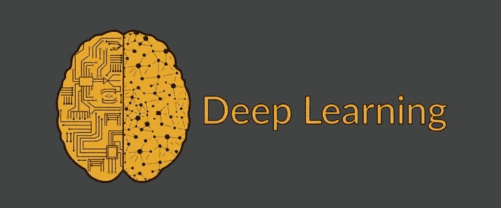
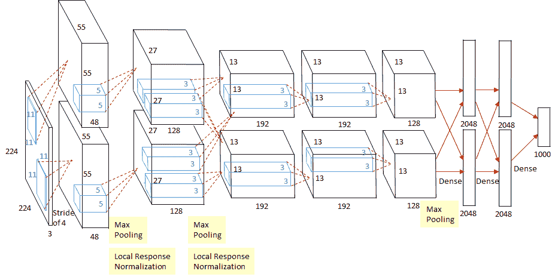
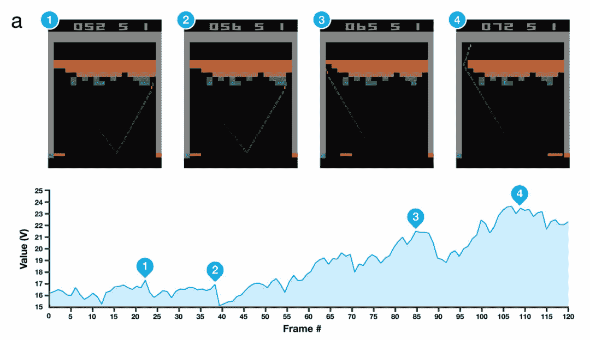
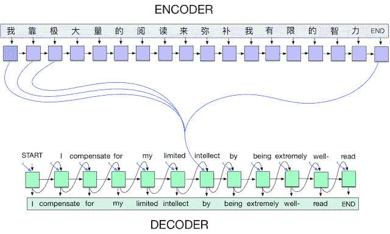
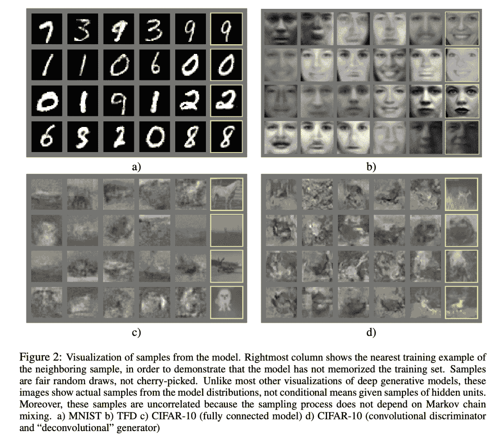
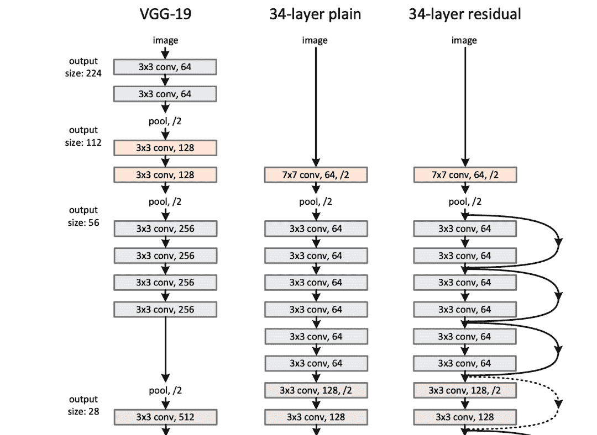
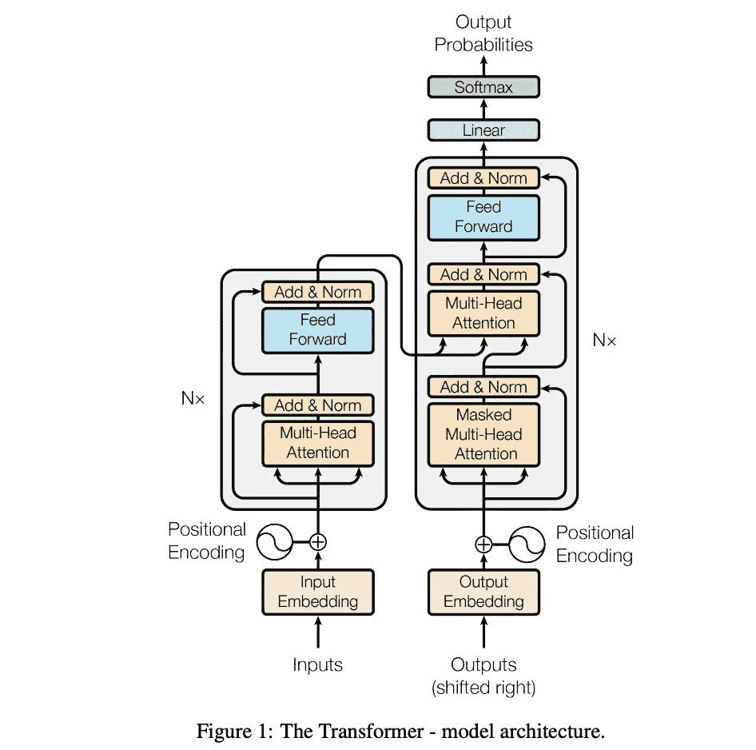
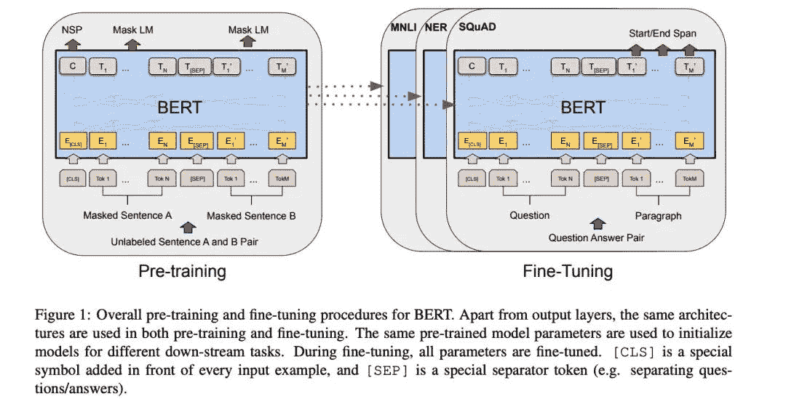

↑↑↑关注后"星标"Datawhale

每日干货 &[每月组队学习](https://mp.weixin.qq.com/mp/appmsgalbum?__biz=MzIyNjM2MzQyNg%3D%3D&action=getalbum&album_id=1338040906536108033#wechat_redirect)，不错过

 Datawhale干货 

**来源：AI科技评论，整理：数据派THU**

本文约****6000字****，建议阅读****10分钟。****

这些研究均已经过时间的考验，并得到广泛认可。

2006年，Hinton 发表了一篇论文《A Fast Learning Algorithm for Deep Belief Nets》，提出了降维和逐层预训练方法，该方法可成功运用于训练多层神经网络，使深度网络的实用化成为可能。该论文也被视作深度学习领域的经典之作。

从原理来看，深度学习与神经网络紧密相关：神经网络由一层一层的神经元构成，层数越多，神经网络越深，而所谓“深度学习”就是模拟人类大脑，运用深层神经网络对输入进行“思考”、“分析”并获得目标输出的过程。

那么， 自2006年Hinton发表经典论文以来，深度学习领域又取得了哪些突破性成果呢？

Google Brain前员工Denny Britz 在本文中进行了回顾整理，按时间顺序介绍了从2012年到2020年深度学习领域的数项关键性科研成就，包括运用AlexNet和Dropout处理ImageNet（2012年）、使用深度强化学习玩Atari游戏（2013年）、应用注意力机制的编码器-解码器网络（2014年）、生成对抗网络（2014-2015年）、ResNet（2015年）、Transformer模型（2017年）、BERT与微调自然语言处理模型（2018年），以及2019-2020年及之后的BIG语言模型与自监督学习等。这些技术大部分应用于视觉、自然语言、语音与强化学习等领域。

这些研究均已经过时间的考验，并得到广泛认可。本文不仅列举了2012年以来的部分出色成果，还涉及到大量有利于了解当今深度学习研究现状的基础技术与知识。深度学习基础技术的概念、方法和代码等具有相似性，研究人员可以触类旁通。比方说，一个终生研究计算机视觉（computer vision, CV)的学者很快也能适应自然语言处理（Natural Language Processing, NLP)，在NLP方向获得成就。如果你是深度学习领域的入门者，以下阅读将帮助你了解现有先进技术的来历与最初发明用途，方便你更好地开展自己的研究工作。

**2012年：应用AlexNet和Dropout 方法处理ImageNet**

**相关论文：**

*   ImageNet Classification with Deep Convolutional Neural Networks (2012)，https://papers.nips.cc/paper/4824-imagenet-classification-with-deep-convolutional-neural-networks

*   Improving neural networks by preventing co-adaptation of feature detectors (2012) ，https://arxiv.org/abs/1207.0580

*   One weird trick for parallelizing convolutional neural networks (2014) ，https://arxiv.org/abs/1404.5997

**具体实现：**

*   用PyTorch搭建AlexNet，https://pytorch.org/hub/pytorch_vision_alexnet/

*   用TensorFlow搭建AlexNet，https://github.com/tensorflow/models/blob/master/research/slim/nets/alexnet.py        

图源：https://papers.nips.cc/paper/4824-imagenet-classification-with-deep-convolutional-neural-networks

AlexNet算法被认为是深度学习和人工智能研究蓬勃发展的主要原因。它是一种以Yann LeCun提出的早期LeNet网络为基础的深度卷积神经网络（Deep Convolutional Neural Networ）。AlexNet结合芯片GPU的功能和算法优势，大大超越了以前其他对ImageNet数据集中的图像进行分类的方法。它的出现再一次证明了神经网络的强大。此外，AlexNet是最早运用Dropout的算法之一，之后也成为了提高各类深度学习模型泛化能力的一项关键技术。

AlexNet 所使用的架构，包含一系列卷积层、ReLU非线性（ReLU nonlinearity）和最大池化算法（max-pooling），被广泛视为后来CV架构创建和扩展的标准。如今，诸如PyTorch之类的软件库具有十分强大的功能，加上与目前最新的神经网络架构相比，AlexNet的构成十分简单，仅需几行代码即可通过 PyTorch 等软件库实现。有一点要注意的是：上述所介绍到的AlexNet的实现使用了论文《One weird trick for parallelizing convolutional neural networks》里所提到的网络变量。

**2013年：使用深度强化学习玩转 Atari 游戏**

**相关论文：**

*   Playing Atari with Deep Reinforcement Learning (2013)，https://arxiv.org/abs/1312.5602

**具体实现：**

*   用PyTorch搭建深度强化学习模型（DQN），https://pytorch.org/tutorials/intermediate/reinforcement_q_learning.html

*   用TensorFlow搭建DQN，https://www.tensorflow.org/agents/tutorials/1_dqn_tutorial

图源：https://deepmind.com/research/publications/human-level-control-through-deep-reinforcement-learning

DeepMind团队，基于近年来在图像识别和GPU方面取得的一系列突破，成功训练了一个能通过原始像素输入来玩Atari游戏的网络。不仅如此，同一个神经网络架构还在没有被告知详细游戏规则的前提下，学会了玩7款不同的游戏，从而证明了该方法的普适性。

强化学习与监督学习（比如图像分类）的不同之处在于：在强化学习里，智能体必须在多个时间步（time step）内学会如何获得最多奖励。具体来说，就是它必须赢得比赛，而不是仅仅预测某个标签。由于智能体与环境直接互动，且每个动作都会影响下一个动作，所以训练数据不是独立且分布均匀的，这就使得许多机器学习模型的训练十分不稳定。这个现象可以使用经验回放（experience replay）等技术来解决。

尽管这项研究没有实现明显的算法创新，但却巧妙地结合了现有技术、基于GPU训练的卷积神经网络、经验回放以及一些额外的数据处理技术，并获得了大多数人始料未及的出色结果。这也提升了研究人员扩展深度强化学习技术的信心，有望借鉴这个成果来解决包括围棋、Dota 2、Starcraft 2等等更复杂的任务。

Atari游戏在之后也成为了强化学习研究的标准基准。早期的深度强化学习方法仅超过人类基本水平、学会7款游戏，但在后来几年时间里，基于这些思路所取得的进步，开始在更多游戏里打败人类。其中有一款游戏叫《蒙特祖玛的复仇》，以需要长期规划而闻名，被认为是难度最大的游戏之一。直到最近，AI 已经在57款游戏中超越了人类玩家的基准线。

**2014年：采用“注意力”的编码器-解码器网络**

**相关论文：**

*   Sequence to Sequence Learning with Neural Networks，https://arxiv.org/abs/1409.3215

*   Neural Machine Translation by Jointly Learning to Align and Translate，https://arxiv.org/abs/1409.0473

**具体实现：**

*   用Pytorch搭建采用注意力的Seq2Seq，https://pytorch.org/tutorials/intermediate/seq2seq_translation_tutorial.html#

*   用TensorFlow搭建采用注意力的Seq2Seq，https://www.tensorflow.org/addons/tutorials/networks_seq2seq_nmt

图源：https://ai.googleblog.com/2017/04/introducing-tf-seq2seq-open-source.html

深度学习最卓越的成就大多体现在与视觉相关的任务中，并且由卷积神经网络驱动。虽然NLP研究已使用LSTM网络和编码器-解码器架构在语言建模和翻译方面取得了一定成功，但该领域也是直到注意力机制的出现才开始取得令人瞩目的成就。

在处理语言时，每个 token 都会被输入循环网络（如LSTM）中，并对先前处理过的输入保持了记忆。token可能是字符，可能是单词，也可能是介于字符和单词之间的某物。换句话说，每个token都是一个时间步，一个句子就像一个时间序列。这些循环模型通常不擅长处理间隔长时间的依赖关系。在处理序列时，他们很容易“忘记”较早之前的输入，因为它们的梯度需要通过大量时间步进行传播。通过梯度下降方法优化这些模型非常困难。

新的注意力机制则有助于缓冲这一阻碍。它引入快捷连接（shortcut connections)，给网络提供了一个能够在早期的时间步上适应性地“回头看”的选择。这些连接可以帮助网络决定生成特定输出时哪些输入是重要的。一个典型的例子就是机器翻译：在生成输出词时，它通常会映射一个甚至多个特定的输入词。

**2014年：Adam优化器**

**相关论文：**

*   Adam: A Method for Stochastic Optimization，https://arxiv.org/abs/1412.6980

**具体实现：**

*   用PyTorch搭建实现Adam优化器，https://d2l.ai/chapter_optimization/adam.html

*   PyTorch Adam实现，https://pytorch.org/docs/master/_modules/torch/optim/adam.html

*   TensorFlow Adam实现，https://github.com/tensorflow/tensorflow/blob/v2.2.0/tensorflow/python/keras/optimizer_v2/adam.py#L32-L281       

图源：http://arxiv.org/abs/1910.11758

神经网络通过运用优化器将损失函数（如平均分类误差）最小化进行训练。优化器负责调整网络参数来使网络学习目标。大多数优化器都是基于随机梯度下降（Stochastic Gradient Descent, SGD）的变量。但是，也有很多此类优化器包含了可调节的参数，比如优化器本身的学习率。针对特定问题寻找正确设置不仅能减少训练时间，还能通过找到局部最小损失函数来获取更好的结果。

大型研究实验室往往会运行成本高昂的、使用了复杂学习速率调度器（learning rate schedules）的超参数检索来获取简单但对超参数敏感的优化器（比如SGD）中最好的那一个。有时候，他们的效果虽然超越了现有基准，但是往往是花费了大笔资金调节优化器的结果。科研论文里往往不会提到研究成本这些细节。也就是说，研究人员如果没有足够的资金预算来优化他们的优化器，就只能深陷“效果不佳”的泥潭。

Adam优化器主张使用梯度的一阶矩和二阶矩来自动调整学习率。研究也表明，运用Adam优化器所获取的结果非常“鲁棒”，且对超参数的调整不敏感。换句话说，Adam在大部分情况下无需太多调整就可以正常运行。就研究结果而言，目前一个被调整得很好的SGD表现更好，但Adam能帮助研究人员以较少成本进行研究。这是因为，如果实现的效果不好，研究者起码知道并不是由于某个调整得不佳的优化器所造成的。

**2014/2015年：生成对抗网络（GAN）**

**相关论文：**

*   Generative Adversarial Networks，https://arxiv.org/abs/1406.2661

*   Unsupervised Representation Learning with Deep Convolutional Generative Adversarial Networks，https://arxiv.org/abs/1511.06434

**具体实现：**

*   用PyTorch搭建DCGAN，https://pytorch.org/tutorials/beginner/dcgan_faces_tutorial.html

*   用TensorFlow搭建DCGAN，https://www.tensorflow.org/tutorials/generative/dcgan       

图源：https://developers.google.com/machine-learning/gan/gan_structure

生成模型（如变分自编器）必须对整个数据分布进行建模，图像数据的像素极大，不像判别模型（discriminative model）一样仅是区分猫猫与狗狗。生成模型的目标是建立看起来逼真的数据样本，比如你可能在某处已经见过的人脸图像。生成对抗网络（GAN）就属于这类生成模型。

GAN的基本内容是对生成器（generator）和判别器（discriminator）进行一前一后的训练。判别器经过训练来分辨真实图像和生成图像，而生成器的目标就是生成一些能够骗过判别器的样本。随着训练的深入，判别器识别伪造物体的能力会提高，但生成器也会越来越狡猾，并渐渐生成看起来更逼真的样本。第一代GAN生成的图像分辨率低，模糊不清，并且训练起来十分不稳定。但随着时间的推移，研究者发明了许多改良版本，包括深度卷积生成对抗网络（DCGAN）、CycleGAN、StyleGAN（v2）等等。这些改良版本基于第一代 GAN 的思路，成功生成高分辨率的、拟真的图像和视频。

**2015年：残差网络（ResNet）**

**相关论文：**

*   Deep Residual Learning for Image Recognition，https://arxiv.org/abs/1512.03385

**具体实现：**

*   用PyTorch搭建ResNet，https://github.com/pytorch/vision/blob/master/torchvision/models/resnet.py

*   用TensorFlow搭建ResNet，https://github.com/tensorflow/tensorflow/blob/v2.2.0/tensorflow/python/keras/applications/resnet.py 

    

研究人员基于AlexNet 的突破进行了一段时间的深入研究，提出了一系列基于卷积神经网络的性能更佳的架构，如VGGNet、Inception等等。而ResNet 就是紧接这一波迅速发展的新架构的下一代神经网络架构。迄今为止，ResNet的变体被视为各类任务的基准模型架构和更复杂架构的基本构建要素，并得到广泛应用。

ResNet的出众，不仅是因为它在ILSVRC 2015的分类挑战赛中取得了第一名的好成绩，还因为与其他网络架构相比，它具有明显的深度优势。论文《Deep Residual Learning for Image Recognition》里介绍到该网络最深的层数可以达到1000层，而且，虽然该网络在基准任务上的表现略逊于101层和152层的网络，但总体表现依然十分优秀。这类深度网络的训练是一个非常有挑战性的优化问题，这是因为在训练深层网络的过程中，梯度会随着层数的增加而递减直至消失，这使得网络优化异常艰难。梯度消失的问题在序列模型（sequence model）中也有出现。极少研究人员相信训练层数如此深的网络能达到出色而稳定的表现结果。

ResNet应用恒等快捷连接（identity shortcut connections）来促进梯度的流动。ResNet只需要逐层学习“变化量（Δ）”，难度较低，往往比学习整个变化量容易。这种恒等连接是“高速网络”（Highway Network）里所提到的连接特例，反过来又受到长短期记忆网络（LSTM）的门控机制（gating mechanism）的启发。

**2017年：Transformer模型**

**相关论文：**

*   Attention is All You Need，https://arxiv.org/abs/1706.03762

**具体实现：**

*   PyTorch: 应用nn.Transformer和TorchText的序列到序列模型，https://pytorch.org/tutorials/beginner/transformer_tutorial.html

*   Tensorflow: 用于语言理解的Transformer模型，https://www.tensorflow.org/tutorials/text/transformer

*   HuggingFace的Transformers开发库，https://github.com/huggingface/transformers     

图源：https://arxiv.org/abs/1706.03762

上文提到，具有注意力的序列到序列模表现地非常好，但由于该模型的循环特性需要用到序列算法，所以还存在一些缺点。它们很难并行处理，因为每次只运用一个步骤处理输入。每个时间步都受到上一个时间步的影响。这也使得时间步很难扩展为长序列。即使具备了注意力机制，模型仍然在对复杂的长程依赖关系建模上面临挑战。大多数“工作”似乎都是在循环层中完成的。

Transformer模型有效解决了上述问题。模型应用多个前馈自注意层（feed-forward self-attention layers）取代循环层（recurrence），从而完全消除循环过程，从而能够平行处理所有输入并且生成输入和输出间相对较短的路径（这就意味着梯度下降更易于优化）。在这种情况下，模型能够进行快速训练，易于扩展并处理更多数据。此外，Transformer模型使用了位置编码来向网络传递输入顺序（这是循环模型无法做到的）。一开始学习Transformer模型也许有些摸不着头脑，但如果想了解更多Transformer模型的应用原理，可以参考以下链接里的讲解：http://jalammar.github.io/illustrated-transformer

Transformer模型的表现超出了所有人的期待。在接下来的几年里，Transfomer会成为大多数序列任务（如NLP）甚至是计算机视觉的架构标准。

**2018年：BERT和微调NLP模型**

**相关论文：**

*   BERT: Pre-training of Deep Bidirectional Transformers for Language Understanding，https://arxiv.org/abs/1810.04805

**具体实现：**

*   具备Hugging Face的微调BERT，https://huggingface.co/transformers/training.html

预训练指的是事先训练一个模型来执行特定任务，然后将训练过程中学到的参数作为初始值以继续学习其他相关任务。直观来说，就是如果一个模型已经学会进行图像分类、区分猫猫和狗狗，也应当大概了解图像和毛茸动物的一般特征。当我们对这个能够区分猫猫狗狗的模型进行微调，来对狐狸进行分类时，我们希望这个模型能够比必须从头开始训练的模型表现得更好。同样地，一个已经学会预测句子里的下一个单词的模型，也应该对人类语言模式有一定的了解。我们可能期望这个模型可以作为翻译或情感分析等相关任务的好的初始化模型。

预训练和微调在计算机视觉和自然语言处理中都已有了成功的应用。虽然预训练和微调在计算机视觉领域中作为标准已有很长一段时间了，但要在 NLP 领域得到很好的应用，似乎还困难重重。NLP 中取得的 SOAT 结果，依旧还是由于使用了完全监督模型。

随着Transformer的出现，研究者们终于可以在 NLP 任务中很好地应用预训练模型，并随之提出了ELMo、ULMFiT和OpenAI's GPT等方法。

BERT 便是预训练模型在 NLP 领域取得的最新进展，许多人认为它开启了NLP研究的新时代。BERT并不像其他大多数模型一样进行预测下一个字的预训练。它所接受的预训练是预测整个句子被故意删除/屏蔽的词以及两个句子之间是否有衔接关系。请注意：这些任务不需要用到标注的数据。它可以在任何文本上进行训练，而且适用于篇幅长的文本。这个预训练模型可能已学会语言的一些普遍特征，之后可以微调来执行有监督的任务（比如回答问题和预测情绪）。

BERT在许多不同类型的任务中均有出色表现。之后BERT成为了XLNet、RoBERTa和ALBERT等先进技术的奠基之作。

**2019/2020年及之后：BIG语言模型，自监督学习？**

《惨痛的教训》一文非常清晰地描述了深度学习发展史的趋势。算法在并行化计算（更多数据）和更多模型参数方面所取得了进步，一次又一次地超越了所谓“更聪明的技术”。这个趋势一直持续到2020年GPT-3的出现。GPT-3是一个由OpenAI创建的拥有1750亿参数的巨大语言模型。尽管GPT-3的训练目标和标准架构十分简单，但却展示了意料之外的良好泛化能力。

文章链接：http://www.incompleteideas.net/IncIdeas/BitterLesson.html

同样的发展趋势还包括对比性自监督学习（contrastive self-supervised learning，如SimCLR）等能更好利用未标记数据的方法。随着模型变得越来越大，训练速度变得越来越快，这些能够高效利用网页上的大量未标记数据以及能够学习可迁移到其他任务上的通用知识的技术，将变得越来越具有价值，越来越普遍使用。

作者注：

1.  本文不针对所提及的技术进行深入解析与代码示例。我们主要介绍技术的历史背景、相关论文链接和具体实现。建议有兴趣的读者能在不借助现有代码和高阶开发库的前提下将这些论文研究成果重新演示一遍，相信一定会有收获。

2.  本文聚焦于深度学习的主流领域，包括视觉、自然语言、语音和强化学习/游戏等。

3.  本文仅讨论运行效果出色的官方或半官方开放源代码实现。有些研究（比如Deep Mind的AlphaGo和OpenAI的Dota 2 AI）因为工程巨大、不容易被复制，所以在此没有被重点介绍。

4.  同一个时间段往往发布了许多相似的技术方法。但由于本文的主要目标是帮助初学者了解涵盖多个领域的不同观点，所以在每一类方法里选取了一种技术作为重点。比方说，GAN模型有上百种，但如果你想学习GAN的整体概念，只需要学习任意一种GAN即可。

编辑：黄继彦

“干货学习，**点****赞****三连**↓