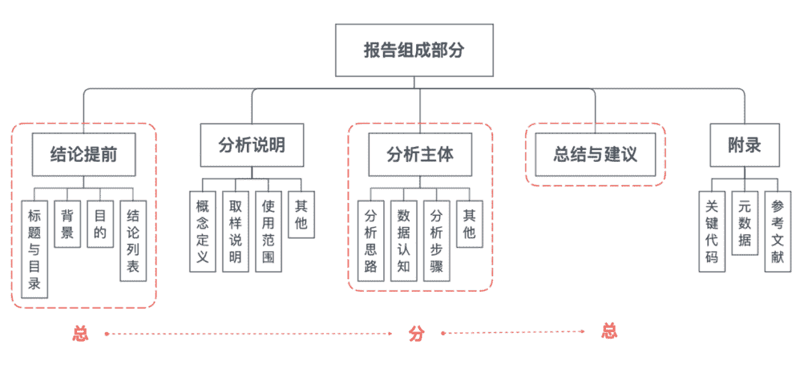
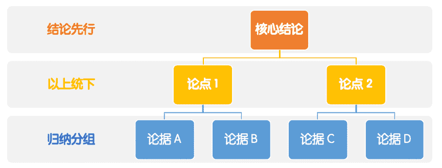
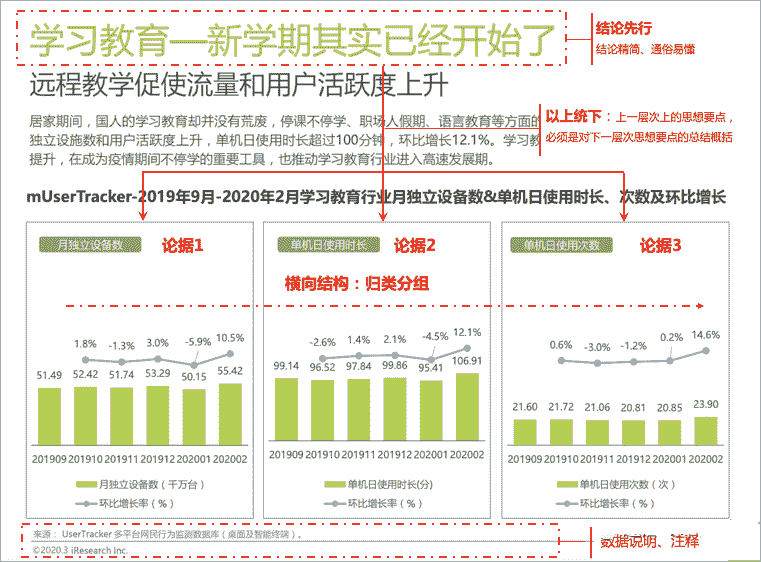
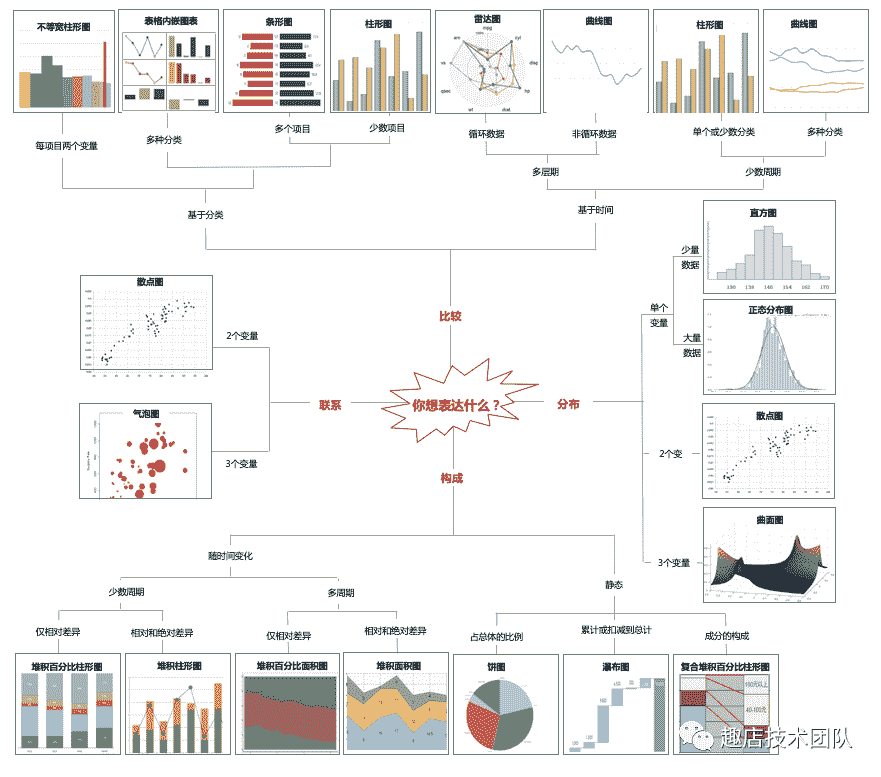
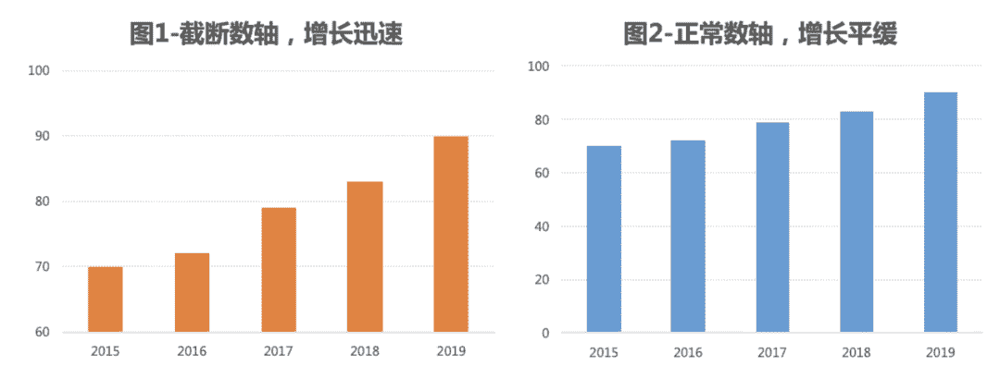
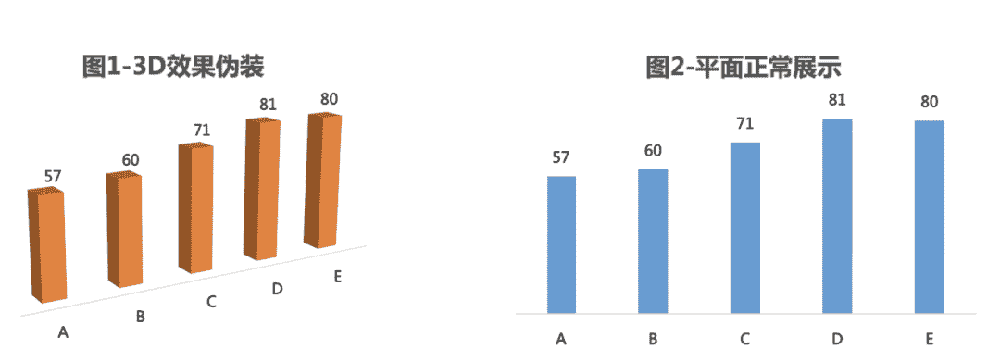
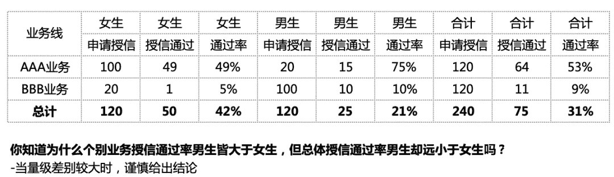

↑↑↑关注后"星标"Datawhale

每日干货 & [每月组队学习](https://mp.weixin.qq.com/mp/appmsgalbum?__biz=MzIyNjM2MzQyNg%3D%3D&action=getalbum&album_id=1338040906536108033#wechat_redirect)，不错过

 Datawhale干货 

****作者：吴迪-趣店数据分析师，来源：大数据DT****

**导读：**在数据分析中，无论数据收集过程有多么科学、数据处理多么先进、分析方法多么高深，如果不能将它们有效地组织和展示出来，并与决策者进行沟通与交流，就无法体现数据和分析的价值。

因此，分析报告实质上是一种沟通与交流的形式，主要作用在于**展示分析结果、验证分析质量，为决策者提供参考依据**，并可以有针对性、操作性、战略性的决策。今天，我们来一探究竟常见数据分析及报告规范。

作者：吴迪「趣店数据分析师」

趣店技术团队

**01 结构规范及写作**

报告常用结构：

**1\. 架构清晰、主次分明**

数据分析报告要有一个清晰的架构，层次分明能降低阅读成本，有助于信息的传达。虽然不同类型的分析报告有其适用的呈现方式，但总的来说作为议论文的一种，大部分的分析报告还是适用总-分-(总) 的结构。

推荐学习金字塔原理，中心思想明确，结论先行，以上统下，归类分组，逻辑递进。行文结构先重要后次要，先全局后细节，先结论后原因，先结果后过程。对于不太重要的内容点到即止，舍弃细枝末节与主题不相关的东西。

**2\. 核心结论先行、有逻辑有依据**

**结论求精不求多。**大部分情况下，数据分析是为了发现问题，一份分析报告如果能有一个最重要的结论就已经达到目的。精简的结论能降低阅读者的阅读门槛，相反太繁琐、有问题的结论100个=0。报告要围绕分析的**背景和目的**以及要解决的问题，给出明确的答案和清晰的结论；相反，结论或主题太多会让人不知所云，不知道要表达什么。

**分析结论一定要基于紧密严谨的数据分析推导过程，尽量不要有猜测性的结论**，太主观的结论就会失去说服力，一个连自己都没有把握的结论千万不要在报告里误导别人。

但实际中，部分合理的猜测找不到直观可行的验证，在给出猜测性结论的时候，一定是基于合理的、有部分验证依据前提下，谨慎地给出结论，并且说明是猜测。如果在条件允许的前提下可以通过调研/回访的方式进行论证。

**不回避 “不良结论” 。**在数据准确、推导合理的基础上，发现产品或业务问题并直击痛点，这其实是数据分析的一大价值所在。

**3\. 结合实际业务、建议合理**

基于分析结论，要有针对性的建议或者提出详细解决方案，那么如何写建议呢？

**首先，要搞清给谁提建议。**不同的目标对象所处的位置不同，看问题的角度就不一样，比如高层更关注方向，分析报告需要提供业务的深度洞察和指出潜在机会点，中层及员工关注具体策略，基于分析结论能通过哪些具体措施去改善现状。

**其次，要结合业务实际情况提建议。**虽然建议是以数据分析为基础提出的，但仅从数据的角度去考虑就容易受到局限、甚至走入脱离业务忽略行业环境的误区，造成建议提了不如不提的结果。因此提出建议，一定要基于对业务的深刻了解和对实际情况的充分考虑。

再进一步，如果可以给出这个建议实施后的收益，下单转化提升多少、交易提升多少、能节省多少成本等，把价值点直接传递给阅读对象。

上面讲了报告的写作原则，举个例子，参考艾瑞网，《留存与未来-疫情背后的互联网发展趋势报告》：

**Tips：尝试站在读者的角度去写分析报告，内容通俗易懂，用语规范谨慎。**如果汇报对象不是该领域的专家，就要避免使用太多晦涩难懂的词句，同时报告中使用的名词术语一定要规范，要与既定的标准（如公司指标规范）以及业内公认的术语一致。

**02 数据使用及图表**

数据分析往往是80%的数据处理，20%的分析。大部分时候，收集和处理数据确实会占据很多时间，最后才在正确数据的基础上做分析，既然一切都是为了找到正确的结论，那么保证数据准确就显得格外重要，否则一切努力都是误导别人。

**1\. 分析需要基于可靠的数据源**

用于鉴别信息/数据的可靠性，主要有四种方法：**同类对比、狭义/广义比对、相关对比和演绎归谬。**

*   **同类对比：**与口径相同或相近，但来源不同的信息进行对比。

*   **示例：**最常见就是把跑出来的数据和报表数据核对校验。

*   **狭义/广义对比：**通过与更广义（被包含）或更狭义（包含）的信息进行对比。

*   **示例：**3C品类销售额与商城总销售额比较，3C的销售额更高显然是错误的，因为商城总销售额包含3C销售额；某些页面/频道的UV与APP总UV比较也类似。 

*   **相关对比：**通过与具有相关性、关联性的信息进行对比。

*   **示例：**某平台的Dn留存率，对于同一个基准日期来说，D60留存率一定低于D30留存率的，如果出现大于的情况，那就是错误数据了。

*   **演绎归谬：**通过对现有证据的深入演绎，推导出结果，判断结果是否合理。

*   **示例：**比如某平台的销售客单价2000左右，总销售额1亿左右；计算得出当日交易用户数10万，通过乘以客单价，得到当天销售额2亿，显然与业务体量不符，为错误的数据。

**Tips：**以上都是常用的方法论，**最核心是足够了解业务，对关键指标数据情况了然于心**，那么对数据准确性的判断水到渠成。对此，建议是每日观测核心业务的数据情况，并分析波动原因，培养业务理解力和数据敏感度。

**2\. 尽量图表化，提高可读性**

用图表代替大量堆砌的数字，有助于阅读者更形象直观地看清楚问题和结论，当然，图表也不要太多，过多的图表一样会让人无所适从。

让图表五脏俱全，一张图必须包含完整的元素，才能让阅读者一目了然。标题、图例、单位、脚注、资料来源这些图表元素就好比图表的五脏六腑。

要注意的条条框框。

*   **首先，避免生出无意义的图表。**决定做不做图的唯一标准就是能否帮助你有效地表达信息。

*   **第二，不要把图表撑破。**最好一张图表反映一个观点，突出重点，让读者迅速捕捉到核心思想。

*   **第三，只选对的**，不选复杂的。

*   **第四，一句话标题。**

**常见的图表类型选择：**

**图表使用Tips：**

*   **折线图：**选用的线型要相对粗些，**线条一般不超过5条**，不使用倾斜的标签，纵坐标轴一般刻度从0开始。预测值的线条线型改为**虚线**。

*   **柱形图：**同一数据序列使用相同的颜色。不使用倾斜的标签，纵坐标轴一般刻度从0开始。一般来说，**柱形图最好添加数据标签，如果添加了数据标签，可以删除纵坐标刻度线和网格线。**

*   **条形图：**同一数据序列使用相同的颜色。不使用倾斜的标签，最好添加数据标签，**尽量让数据由大到小排列，方便阅读。**

*   **饼图：**饼图使用场景相对少，如需使用，注意以下事项：把数据从12点钟的位置开始排列，**最重要的成分紧靠12点钟的位置。数据项不要太多，保持在6项以内**，不使用爆炸式的饼图分离。不过可以将某一片的扇区分离出来，前提是你希望强调这片扇区。饼图不使用图例。不使用3D效果。当扇区使用颜色填充时，推荐使用白色的边框线，具有较好的切割感。

*   **警惕图表说谎**

*   **虚张声势的增长：**人们喜欢研究一条线的发展趋势，例如股市、房价、销售额的增长趋势，有时候为了吸引读者故意夸大变化趋势，如图1通过截断数轴夸大增长速度，从正常数轴的图2看到增长是缓慢的。

*   **3D效果的伪装：**3D图形容易造成视觉偏差，如图1有3D效果，看上去 A->B->C->D->E依次递增，实际是D>E，要格外小心图表的伪装。

**03 常见数据分析误区**

**“用数据说话”，已经成为一种流行语。**

在很多人的心里，数据就代表着科学，科学就意味着真相。“数据不会骗人”，也成了说服别人时常用的口头禅，事实果真如此吗？让我们来谈谈那些常见的误区。

**1\. 控制变量谬误**

在做A/B测试时没有控制好变量，导致测试结果不能反映实验结果。或者在进行数据对比时，两个指标没有可比性。举个例子，为测试不同营销时间点对下的转化的影响，但A实验使用短信营销、B实验使用电话营销，未控制变量（营销方式），导致实验无法得出结论。

**2\. 样本谬误**

*   **样本量不够**

**统计学的基础理论基石之一就是大数定律**，只有当数据量达到一定程度后，才能反映出特定的规律。如果出现样本量极少的情况，建议把时间线拉长，获得足量的样本。或者将不重要的限定条件去掉，增加样本数。

*   **存在选择性偏见或者幸存者偏见**

统计学的另一大理论基石是**中心极限定理**。简单描述就是，总体样本中，任意一个群体样本的平均值，都会围绕在这个群体的整体平均值周围。

举个例子，在应用升级期间，衡量登录用户数、交易用户数等指标，来判断用户对新版本的喜欢是否优于老版本。听上去非常合理，但这里实际就隐藏了选择性偏见，因为新版本发布时，第一批升级上来的用户往往就是最活跃的用户，往往这批用户的指标较好，但不代表新版本更好。

*   **混入脏数据**

这种数据的破坏性比较大，可能得出错误的结论。通常我们会采用数据校验的手段，屏蔽掉校验失败的数据。同时，在分析具体业务时，也要针对特定业务，对所使用的数据进行合理性限定，过滤掉异常离群值，来确保拥有比较好的数据质量。

**3\. 因果相关谬误**

会误把相关当因果，忽略中介变量。比如，有人发现雪糕的销量和河溪溺死的儿童数量呈明显相关，就下令削减雪糕销量。其实可能只是因为这两者都是发生在天气炎热的夏天。天气炎热，购买雪糕的人就越多，而去河里游泳的人也显著增多。

**4\. 辛普森悖论**

简单来说，就是在两个相差较多的分组数据相加时，在分组比较中都占优势的一方，会在总评中反而是失势的一方。

**5\. 个人认知谬误**

主观臆断、经验当事实、个体当整体、特征当全貌、眼见当事实。

举个主观臆断的例子：某个产品A页面到B页面的转化率30%，直接判断为很低，推导出可以提高到75%。但实际类似产品或者用户行为决定页面的转化率就只有这么高，得出一个错误的结论。

**标准至关重要，数据+标准=判断。有了判断才能深入分析。**通过分组对比找标准（**象限法、多维法、二八法、对比法**），有标准通过分析对比，找到“好/坏”的点。

**统计学规律和理论不会错，犯错的是使用它的人。**因此，我们在进行数据分析时，一定要格外小心，错误的数据，披上科学的外衣，就很难分辨了。

“干货学习，**点****赞****三连**↓