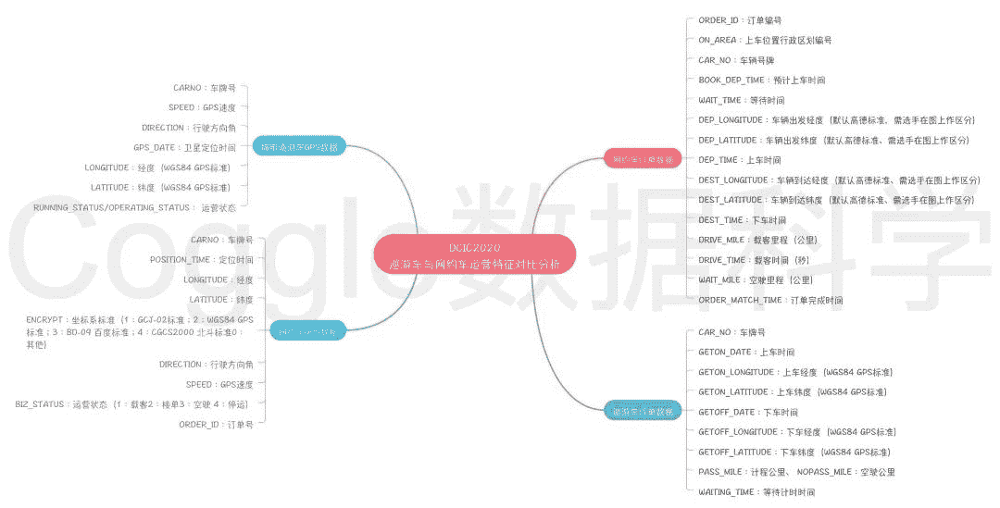
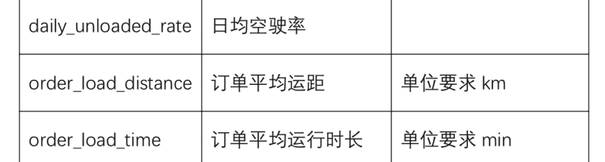
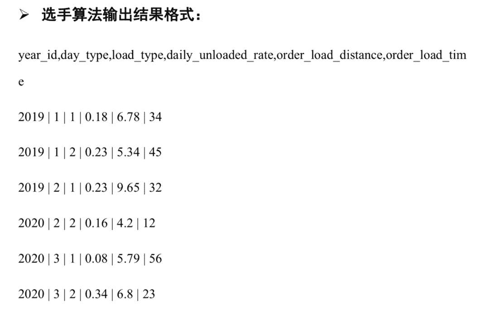
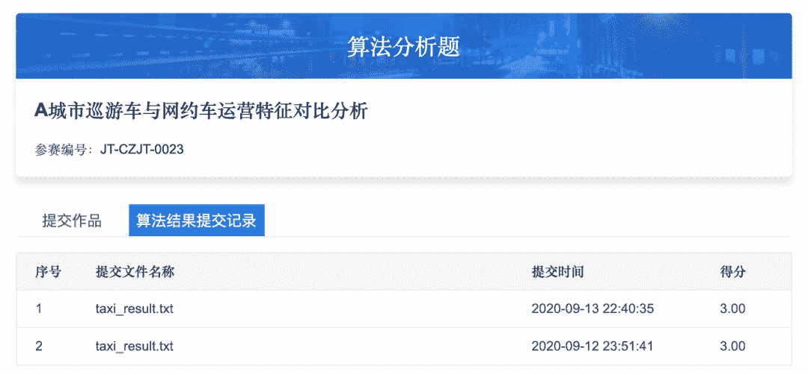

↑↑↑关注后"星标"Datawhale

每日干货 & [每月组队学习](https://mp.weixin.qq.com/mp/appmsgalbum?__biz=MzIyNjM2MzQyNg%3D%3D&action=getalbum&album_id=1338040906536108033#wechat_redirect)，不错过

 Datawhale干货 

**作者：阿水，北航计算机硕士，Datawhale成员**

**DCIC2020**

本文将以DCIC2020赛道二《巡游车与网约车运营特征对比》为具体内容，讲解赛题介绍、赛题理解、赛题任务解析、赛题数据介绍和赛题指标计算。

比赛地址：

https://data.xm.gov.cn/opendata-competition/#/contest_explain

本文会给出赛题二直接可以提交的代码思路，全文阅读需要10分钟。

赛题介绍

赛题名称：A城市巡游车与网约车运营特征对比分析


赛题说明：出租车作为城市客运交通系统的重要组成部分，以高效、便捷、灵活等优点深受居民青睐。出租车每天的运营中会产生大量的上下车点位相关信息，对这些数据进行科学合理的关联和挖掘，对比在工作日以及休息日、节假日的出租车数据的空间分布及其动态变化，对出租车候车泊位、管理调度和居民通勤特征的研究具有重要意义。

*   出租车/网约车：上下车地点挖掘；

*   出租车/网约车：不同日期的空间变化；

*   出租车/网约车：泊车和调度问题；

**赛题任务**：参赛者需依据赛事方提供的出租车（包括巡游车和网约车）GPS和订单数据

*   统计分析方法分别对所提供的巡游车和网约车运营的时间、空间分布特征进行量化计算，包括：

*   *   计算2年的每年工作日取日平均，非工作日取日平均和节假日取日平均，三种类型各自平均的时变分布变化，三种时间类型按网格划分的平均空间分布（网格划分颗粒度选手自选）；

    *   并分别对比分析所提供的网约车、巡游车，计算2年每年按工作日取日平均，非工作日取日平均和节假日取日平均三种类型的日均空驶率、订单平均运距、订单平均运行时长、上下客点分布密度等时变特性；

*   根据巡游车和网约车的时空运营特征，并尝试对巡游车与网约车的融合发展提出相关建议。在分析过程，参赛者必须用到但不局限于提供的数据，可自行加入自有数据进行参赛，但需说明自带数据来源并保证数据合法合规使用；

赛题思路


通过赛题理解&数据分析，参赛选手需要回答上述问题：

*   每年工作日取日平均，非工作日取日平均和节假日取日平均，三种情况下出租车&网约车：

*   *   运营时间规律：出车时间和运行时间；

    *   空间分布规律：城市分布规律，订单分布规律；

    *   日均空驶率：空驶里程(没有载客)在车辆总运行里程中所占的比例；

    *   订单平均运距：订单平均距离计算；

    *   订单平均运行时长：订单平时时长计算；

    *   上下客点分布密度：上下车位置分布；

*   对出租车&网约车的调度、融合发展提出建议：

*   *   如何进行订单调度？识别打不到车的位置；

    *   如何进行停车场推荐？

    *   订单差异性分析？

赛题数据

比赛数据说明（点击阅读原文即可直达）：

https://data.xm.gov.cn/opendata-competition/#/contest_explain

赛题数据基本可以分为四类：

*   巡游车GPS数据（2019年、2020年）；

*   巡游车订单数据（2019年、2020年）；

*   网约车GPS数据（2019年、2020年）；

*   网约车订单数据（2019年、2020年）；

数据字段说明如下：



赛题任务

城市巡游车与网约车运营特征对比分析赛题，提供 2019.05.31-2019.06.09 和2020.06.18-2020.06.27 两年共计 20 天的 A 城市网约车和巡游车的 GPS 数据、订 单数据，以及 A 城市路网矢量数据，上亿条数据。



我们可以很简单计算得出运行结果：

*   计算巡游车日均空驶率、运距和运行时长；

*   计算网约车日均空驶率、运距和运行时长；

```
import pandas as pd
import numpy as np
import glob

# 网约车计算
def cal_wyc(df):
    df = df[['DEST_TIME', 'DEP_TIME', 'WAIT_MILE', 'DRIVE_MILE']].dropna()

    if df['DEST_TIME'].dtype != np.int64:
        df = df[df['DEST_TIME'].apply(len) == 14]
        df = df[df['DEST_TIME'].apply(lambda x: x.isdigit())]

    df['DEP_TIME'] = pd.to_datetime(df['DEP_TIME'], format='%Y%m%d%H%M%S')
    df['DEST_TIME'] = pd.to_datetime(df['DEST_TIME'], format='%Y%m%d%H%M%S')

    df = df[df['DRIVE_MILE'].apply(lambda x: '-' not in str(x) and '|' not in str(x) and 
                                                                       '路' not in str(x))]
    df['DRIVE_MILE'] = df['DRIVE_MILE'].astype(float)
    df['WAIT_MILE'] = df['WAIT_MILE'].astype(float)

    # return df
    print('空驶率：', (df['WAIT_MILE'] / (df['WAIT_MILE'] + df['DRIVE_MILE'] + 0.01)).mean())
    print('订单平均距离：', df['DRIVE_MILE'].dropna().mean())
    print('订单平均时长：', ((df['DEST_TIME'] - df['DEP_TIME']).dt.seconds / 60.0).mean())

# 巡游车计算
def cal_taxi(df):
    df['GETON_DATE'] = pd.to_datetime(df['GETON_DATE'])
    df['GETOFF_DATE'] = pd.to_datetime(df['GETOFF_DATE'])

    print('空驶率：', (df['NOPASS_MILE'] / (df['NOPASS_MILE'] + df['PASS_MILE'])).mean())
    print('订单平均距离：', df['PASS_MILE'].mean())
    print('订单平均时长：', ((df['GETOFF_DATE'] - df['GETON_DATE']).dt.seconds / 60.0).mean()) 
```

2019年**端午节**数据：

```
INPUT_PATH = '../input/'
df = taxiorder2019 = pd.concat([
    pd.read_csv(INPUT_PATH + x) for x in [
        'taxiOrder20190607.csv',
        'taxiOrder20190608.csv',
        'taxiOrder20190609.csv'
    ]
])
cal_taxi(df)

INPUT_PATH = '../input/'
df = taxiorder2019 = pd.concat([
    pd.read_csv(INPUT_PATH + x) for x in [
        'wycOrder20190607.csv',
        'wycOrder20190608.csv',
        'wycOrder20190609.csv'
    ]
])
cal_wyc(df) 
```

```
出租车
空驶率：0.2997949500443629
订单平均距离：6.501010225346955
订单平均时长：13.055927380570695
网约车
空驶率：0.056048033587246776
订单平均距离：9.065422897306478
订单平均时长：111.21042580624874
```

```
2019年工作日数据：
INPUT_PATH = '../input/'df = taxiorder2019 = pd.concat([    pd.read_csv(INPUT_PATH + x) for x in [        'taxiOrder20190531.csv',        'taxiOrder20190603.csv',        'taxiOrder20190604.csv',        'taxiOrder20190605.csv',        'taxiOrder20190606.csv'    ]])cal_taxi(df)

INPUT_PATH = '../input/'df = taxiorder2019 = pd.concat([    pd.read_csv(INPUT_PATH + x) for x in [        'wycOrder20190531.csv',        'wycOrder20190603.csv',        'wycOrder20190604.csv',        'wycOrder20190605.csv',        'wycOrder20190606.csv'    ]])cal_wyc(df)
出租车
空驶率：0.28597477408680505
订单平均距离：6.463312988754979
订单平均时长：13.897280639095992
网约车
空驶率：0.0451398589440301
订单平均距离：8.678716893803035
订单平均时长：113.340031284820452019年周末数据： 
```

```
INPUT_PATH = '../input/'
df = taxiorder2019 = pd.concat([
    pd.read_csv(INPUT_PATH + x) for x in [
        'taxiOrder20190601.csv',
        'taxiOrder20190602.csv',
    ]
])
cal_taxi(df)

df = taxiorder2019 = pd.concat([
    pd.read_csv(INPUT_PATH + x) for x in [
        'wycOrder20190601.csv',
        'wycOrder20190602.csv',
    ]
])
cal_wyc(df) 
```

```
出租车

空驶率：0.2871319581401905
订单平均距离：6.289113628823901
订单平均时长：13.1542066691464
巡游车

空驶率：0.049881413163707276
订单平均距离：8.514400548965787
订单平均时长：113.50896480737183
```

需要注意2020年数据与上面计算逻辑相同，只需要修改下具体的文件名就可以完成计算。是不是很简单????

结果提交

算法运行结果要固定输出到 sftp 的/result 目录下，结果文件为taxi_result.txt，格式为 utf-8。比赛平台最终会去取这个结果文件算出结果， 如果提交结果为非 taxi_result.txt 文件命名，或没有提交到/result 目录下，则不会 有分数产生。算法运行结果文件内容中，每个字段间以英文半角竖线 “|” 符 分隔。



评分注意事项如下：

1、赛题算法模型得分占总得分 30%，即满分 30 分。

2、答案给出的将是区间值，在区间内则得分，不在区间内则不得分，选手 提交的答案分别各给出 2 年(2019、2020)*3 类时期(正常工作日，正常周 六日、端午节假日)*2 种运营方式(网约车、巡游出租车)*三个指标 (daily_unloaded_rate、order_load_distance、order_load_time)，共 36 个结果值。

3、参赛队伍提交的算法分析结果文件，平台每隔 2 小时评分一次，如果参赛队 伍提交的算法结果文件在同一个周期内多次提交，则以最后一次提交的文件参与 评分。最终算法分取参赛队伍历史分数最高的一次。算法模型分析结果集每日最 多提交3次。

4、选手可登录 

https://data.xm.gov.cn/opendata-competition/index.html#/

具体查看 每次算法得分结果及历史提交明细。




点击「阅读原文」实践