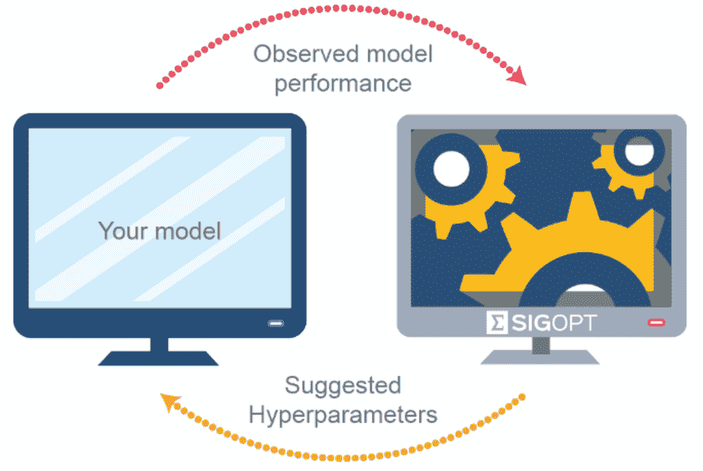
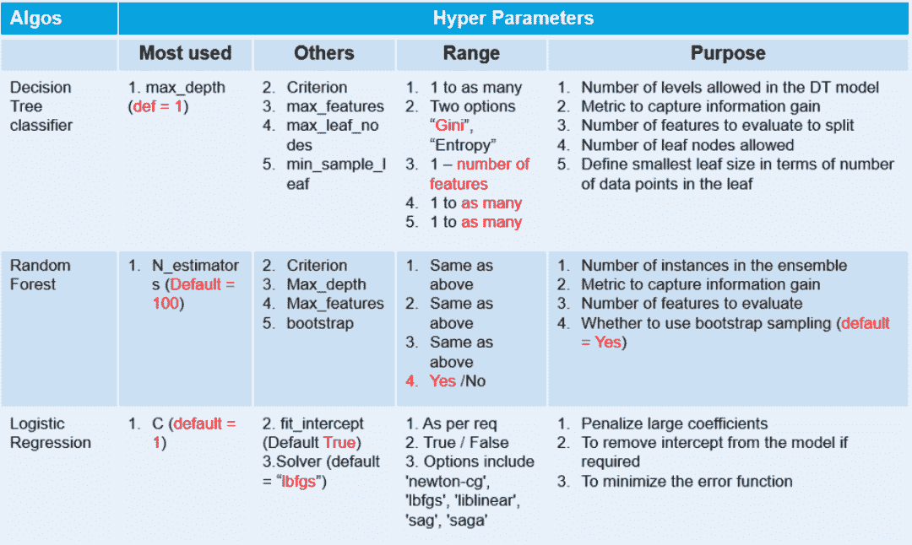
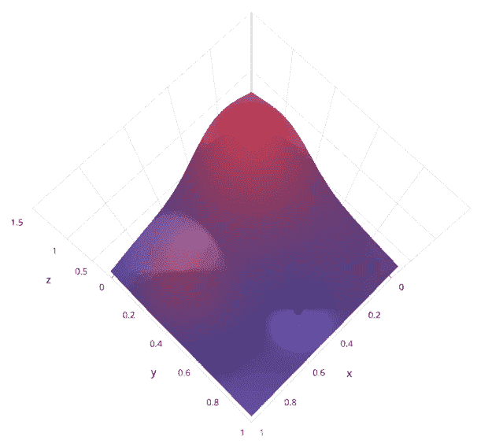
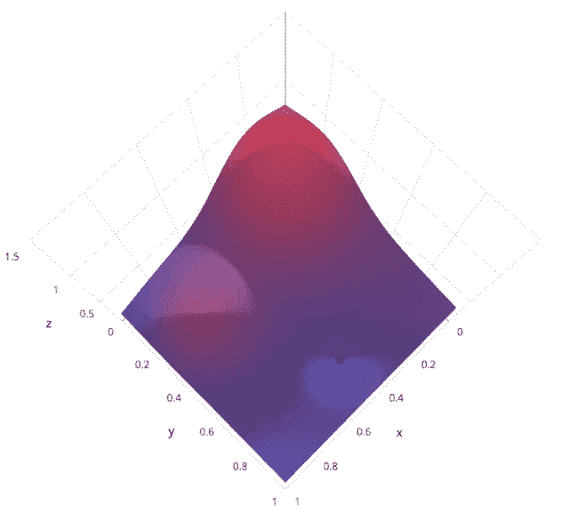
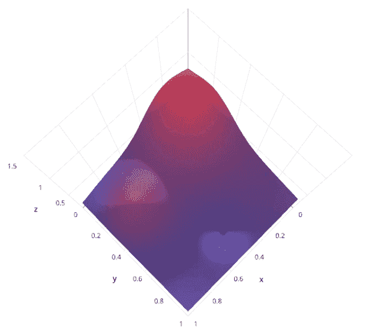

↑↑↑关注后"星标"Datawhale

每日干货 & [每月组队学习](https://mp.weixin.qq.com/mp/appmsgalbum?__biz=MzIyNjM2MzQyNg%3D%3D&action=getalbum&album_id=1338040906536108033#wechat_redirect)，不错过

 Datawhale干货 

**作者：Sivasai，来源：AI公园**

**导读**

ML工作流中最困难的部分之一是为模型找到最好的超参数。ML模型的性能与超参数直接相关。



# 介绍

> 维基百科上说，“**Hyperparameter optimization**或**tuning**是为学习算法选择一组最优的**hyperparameters**的问题”。

ML工作流中最困难的部分之一是为模型找到最好的超参数。ML模型的性能与超参数直接相关。超参数调优的越好，得到的模型就越好。调优超参数可能是非常乏味和困难的，更像是一门艺术而不是科学。

# 超参数

超参数是在建立模型时用于控制算法行为的参数。这些参数不能从常规训练过程中获得。在对模型进行训练之前，需要对它们进行赋值。



超参数的简单列表

# 内容

1.  传统的手工调参

2.  网格搜索

3.  随机搜索

4.  贝叶斯搜索

# 1\. 传统手工搜索

在传统的调参过程中，我们通过训练算法手动检查随机超参数集，并选择符合我们目标的最佳参数集。

我们看看代码：

```
#importing required libraries
from sklearn.neighbors import KNeighborsClassifier
from sklearn.model_selection import train_test_split
from sklearn.model_selection import KFold , cross_val_score
from sklearn.datasets import load_wine

wine = load_wine()
X = wine.data
y = wine.target

#splitting the data into train and test set
X_train,X_test,y_train,y_test = train_test_split(X,y,test_size = 0.3,random_state = 14)

#declaring parameters grid
k_value = list(range(2,11))
algorithm = ['auto','ball_tree','kd_tree','brute']
scores = []
best_comb = []
kfold = KFold(n_splits=5)

#hyperparameter tunning
for algo in algorithm:
  for k in k_value:
    knn = KNeighborsClassifier(n_neighbors=k,algorithm=algo)
    results = cross_val_score(knn,X_train,y_train,cv = kfold)

    print(f'Score:{round(results.mean(),4)} with algo = {algo} , K = {k}')
    scores.append(results.mean())
    best_comb.append((k,algo))

best_param = best_comb[scores.index(max(scores))]
print(f'\nThe Best Score : {max(scores)}')
print(f"['algorithm': {best_param[1]} ,'n_neighbors': {best_param[0]}]") 
```

**缺点**：

1.  没办法确保得到最佳的参数组合。

2.  这是一个不断试错的过程，所以，非常的耗时。

# 2\. 网格搜索

网格搜索是一种基本的超参数调优技术。它类似于手动调优，为网格中指定的所有给定超参数值的每个排列构建模型，评估并选择最佳模型。考虑上面的例子，其中两个超参数**k_value =[2,3,4,5,6,7,8,9,10]** & **algorithm =[' auto '， ' ball_tree '， ' kd_tree '， ' brute ']，**在这个例子中，它总共构建了**9*4 = 36**不同的模型。



让我们来了解一下sklearn的`GridSearchCV`是如何工作的：

```
from sklearn.model_selection import GridSearchCV

knn = KNeighborsClassifier()
grid_param = { 'n_neighbors' : list(range(2,11)) , 
              'algorithm' : ['auto','ball_tree','kd_tree','brute'] }

grid = GridSearchCV(knn,grid_param,cv = 5)
grid.fit(X_train,y_train)

#best parameter combination
grid.best_params_

#Score achieved with best parameter combination
grid.best_score_

#all combinations of hyperparameters
grid.cv_results_['params']

#average scores of cross-validation
grid.cv_results_['mean_test_score'] 
```

**缺点**：

由于它尝试了超参数的每一个组合，并根据交叉验证得分选择了最佳组合，这使得GridsearchCV非常慢。

# 3\. 随机搜索

使用随机搜索代替网格搜索的动机是，在许多情况下，所有的超参数可能不是同等重要的。随机搜索从超参数空间中随机选择参数组合，参数由n_iter给定的固定迭代次数的情况下选择。实验证明，随机搜索的结果优于网格搜索。



让我们来了解sklearn的`RandomizedSearchCV`是如何工作的，

```
from sklearn.model_selection import RandomizedSearchCV

knn = KNeighborsClassifier()

grid_param = { 'n_neighbors' : list(range(2,11)) , 
              'algorithm' : ['auto','ball_tree','kd_tree','brute'] }

rand_ser = RandomizedSearchCV(knn,grid_param,n_iter=10)
rand_ser.fit(X_train,y_train)

#best parameter combination
rand_ser.best_params_

#score achieved with best parameter combination
rand_ser.best_score_

#all combinations of hyperparameters
rand_ser.cv_results_['params']

#average scores of cross-validation
rand_ser.cv_results_['mean_test_score'] 
```

**缺点**：

随机搜索的问题是它不能保证给出最好的参数组合。

# 4\. 贝叶斯搜索

贝叶斯优化属于一类优化算法，称为基于序列模型的优化(SMBO)算法。这些算法使用先前对损失**f**的观察结果，以确定下一个(最优)点来抽样**f**。该算法大致可以概括如下。

1.  使用先前评估的点**X**1*:n*，计算损失**f**的后验期望。

2.  在新的点**X**的抽样损失**f**，从而最大化**f**的期望的某些方法。该方法指定**f**域的哪些区域最适于抽样。

重复这些步骤，直到满足某些收敛准则。



让我们用scikit- optimization的`BayesSearchCV`来理解这

> Installation: pip install scikit-optimize

```
from skopt import BayesSearchCV

import warnings
warnings.filterwarnings("ignore")

# parameter ranges are specified by one of below
from skopt.space import Real, Categorical, Integer

knn = KNeighborsClassifier()
#defining hyper-parameter grid
grid_param = { 'n_neighbors' : list(range(2,11)) , 
              'algorithm' : ['auto','ball_tree','kd_tree','brute'] }

#initializing Bayesian Search
Bayes = BayesSearchCV(knn , grid_param , n_iter=30 , random_state=14)
Bayes.fit(X_train,y_train)

#best parameter combination
Bayes.best_params_

#score achieved with best parameter combination
Bayes.best_score_

#all combinations of hyperparameters
Bayes.cv_results_['params']

#average scores of cross-validation
Bayes.cv_results_['mean_test_score'] 
```

另一个实现贝叶斯搜索的类似库是`bayesian-optimization`。

> Installation: pip install bayesian-optimization

**缺点**：

要在2维或3维的搜索空间中得到一个好的代理曲面需要十几个样本，增加搜索空间的维数需要更多的样本。

# 总结

在确定参数的最佳组合的保证和计算时间之间总是存在权衡。如果超参数空间(超参数个数)非常大，则使用随机搜索找到超参数的潜在组合，然后在该局部使用网格搜索(超参数的潜在组合)选择最优特征。


“干货学习，**点****赞****三连**↓