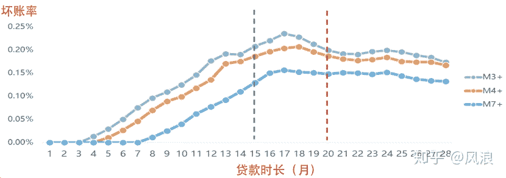
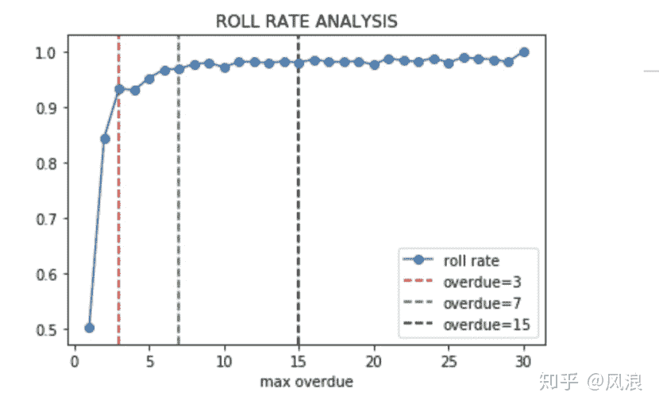

↑↑↑关注后"星标"Datawhale

每日干货 & [每月组队学习](https://mp.weixin.qq.com/mp/appmsgalbum?__biz=MzIyNjM2MzQyNg%3D%3D&action=getalbum&album_id=1338040906536108033#wechat_redirect)，不错过

 Datawhale干货 

**作者：风浪-知乎，来源：NewBeeNLP**

由于金融风控场景的特殊性，很多算法同学在刚进入这个领域容易“水土不服”，为了使机器学习项目（也包括图算法相关的应用）落地更加顺利，本文介绍下实践过程的一些经验和踩过的坑。

## 金融风控场景的特殊性

与电商、广告等场景的风控不同，金融风控有关**「钱」**的安全，决定了公司的营收甚至是公司的生命线。例如360金融月放款200亿，如果违约率上升1个点，损失有多大？当然反过来如果风控做得好，违约率稍微下降一些，大家就可以开心过个好年了：）

此外，风险具有滞后性，用户借款后至少要一个月才能知道是否会违约，甚至很多用户在还了半年甚至一年之后才违约。再者，线上获客成本比较高，成本低则百元，高的甚至超过千元，为了提高转化，授信、申请、审核等环节一般都是实时的。

由于这样的特殊性，在Kaggle比赛、推荐等领域中大发光彩的机器学习算法，却容易在金融风控场景中**「水土不服」**。道理很简单，不是算法不够强大，而是没有抓住金融风控的核心：**「可解释性、稳定性」**。因为是有关“钱”的安全，风控建模是比较严谨的，保证模型在可掌控、可理解范围内，包括如何评估数据、如何设计模型、如何进行特征工程以及后续模型开发和监控都有一套体系框架；而由于风险滞后性，模型上线后会运行很长时间，故对模型稳定性的要求其实要高于预测能力。

如何减少水土不服呢？下面笔者从数据**质量评估**、**模型设计**、**特征工程**、**线上监控环节**介绍下在金融风控场景实践的一些经验和踩过的坑。

## 一、数据质量评估：数据是万坑之源

模型不稳定，效果不好，绝大多数是数据质量的问题，而在金融风控场景表现得更为突出，一方面因为要回溯历史很长时间的数据，另外是因为风控流程比较复杂，模型实时性等特征。

#### 1.线上线下一致性评估

模型离线训练过程应保证与线上应用场景一致，从而使训练的模型具有代表性，这其实是机器学习的问题，但在金融风控场景上不一致这个坑很深又有迷惑性，体会较深，非常痛的领悟。

**「数据回溯的坑」**

由于数据存储/更新方式等原因，历史数据无法被回溯，直接使用当前数据建模，发生数据穿越，容易造成模型不稳定，效果不达预期。这个问题在风控场景会受到更多的关注，一方面原因是时间太久了，相比用户半年甚至一年前借款时的状态，当前状态很有可能发生变化；另一方面是一些老赖在借款后会主动删除资料甚至销号以逃避债务。故在建模前需要确认数据是否可回溯，重要的数据在存储时因考虑这个问题。

那不可回溯的特征都不能用了吗？如果特征比较重要，且可以构造出稳定的特征，可以评估其带来的增益及风险，让老板/业务方拍板。

**「不熟悉业务的坑」**

信贷风控流程每个环节的数据是不同的。比如考虑用户体验提高转化，在授信环节无需提交资料，在用户申请时又需要用户提交较多的资料；又如考虑成本问题，在审批时先用自有数据筛选出一批用户，然后再调用第三方数据进一步筛选。如果建模时使用了后面环节才会有数据，也会造成不一致问题，故提前沟通需求，了解风控业务流程很重要的：）

**「计算逻辑的坑」**

当好不容易完成模型开发，评审通过，准备上线时，才发现还又更深的坑在前面。
一般实时和离线存储和计算是两套逻辑，如果是不同团队负责，容易造成不一致，例如对手机号清洗的正则不同，又比如实时取数和离线取数的逻辑不同。
之前某次模型开发，使用了数仓团队开发的的特征库建模，结果模型上线验证时发现不一致，排查很久发现是取数逻辑不一致，无法修复，实在太心酸了。
后面我们开发了统一存储和计算引擎，模型上线周期从月为单位降低到周为单位，极大提高了生产力。

#### 2.其他评估项

**「数据时间项检查」**

分析数据起止时间、中间时段是否有缺失、是否有异常等现象，从而评估数据可用性。

**「主键是否唯一」**

过往每一家公司都遭遇过这种情况：离线数据可能存储时存在重复插入的现象，导致主键不唯一，导致计算“求和”、“次数”等指标会出错。实际为避免这种情况，习惯使用count(distinct key)替代count(key)，或事先通过group by 去重。

**「缺失值/异常值处理」**

不同数据源可能缺失值填充方式不同，需要统一标识;另外在风控场景往往需要考虑缺失或异常值背后的原因是什么，因为可能和风险相关。

## 二、模型设计：如何让你的模型更贴近业务

风险管理的本质不是杜绝坏账，而是追求利润最大化，但这个目标比较难衡量和优化，一般是用通过率和坏账率这两个量化指标来替代。

在信贷产品不同生命周期中，业务对模型的要求是不同的：新产品刚上线时希望能整体提升模型性能；而在放量阶段允许坏账有一定升到而尽可能提高通过率；在存量用户则可能降低坏账为主要目标。

模型怎么设计满足上述目标呢？一方面是特征工程的侧重性，挖掘的特征是更偏信用还是欺诈，另一方面则是模型设计上下功夫，下面来介绍下信贷风控模型如何设计，包括好坏用户如何定义、模型选型以及模型效果评价

#### 1\. 好坏用户定义

如何定义好坏用户其实是有“套路的”，首先介绍下图的时间轴中的三个术语：**「观察点」**、**「表现期」**、**「观察期」**

*   观察点：用于构建样本集的时间点，不同环节定义不同，比较抽象，这里举例说明：如果是申请模型，观察点定义为用户申贷时间，取19年1-12月所有的申贷订单作为构建样本集；如果是贷中行为模型，观察点定义为某个具体日期，如取19年6月15日在贷、没有发生逾期的申贷订单构建样本集。

*   表现期：定义好坏标签Y的时间窗口，信贷风险具有天然的滞后性，因为用户借款后一个月（第一期）才开始还钱，有得可能还了好几期才发生逾期。

*   观察期：构造特征的相对时间窗口，例如用户申请订单前12个月平均消费金额。设定观察期是为了每个样本的特征对齐，长度一般根据数据厚度决定。

所以我们只要定义表现期长度、逾期天数，例如前三期逾期15+为坏用户；前三期未发生逾期的为好用户。那这两个这么定义呢？发生过逾期就是坏用户吗？逾期可能是多方面的，可能只是忘还了，从“利润最大化”的角度，这部分人其实是好人，因为适当逾期其实可以增加公司的营收，接下来引入两个工具：账龄分析和滚动率分析。

*   账龄分析：定义表现期

一般通过账龄分析或者Vintage分析目标用户的“违约成熟度长度”来定义表现期。具体方法是将不同时期申贷的用户按“贷款时长”进行对齐，即观察用户还款多少期后，其违约率开始稳定，不会出现较大的变化/转移。由下图可以看出，可以将表现期定义为15期/20期。

*   滚动率分析：定义逾期天数

逾期超过多少天定义为“坏用户”是合理的呢？对业务而言适当的逾期有助于提高收入的增长，一般可以通过“滚动率”来分析定义坏用户。如下图所示：逾期1天的用户中有50%会偿还债务，剩余50%保持原有逾期状态，逾期2天的用户有25%会催收回来，而逾期7天后趋向稳定状态，有95%以上的用户不会偿还债务，则可以定义逾期7+为坏用户，更精细化的化可以结合催收策略及收益来定义。

**「样本划分」**

由于用户随时间变化比较大，信贷模型一般是按时间来切分样本：

*   首先按时间将分成训练-验证集和测试集（Out of Time，OOT）

*   然后将训练-验证集随机划分成训练集（In the Sample, INS）和验证集（Out of Sample，OOS）

*   通过INS训练模型，OOS调参，最终以OOT的效果为准，同时要保证这三个数据集的KS相差不大。

**「行业通用模型的样本如何设计」**

在乙方由于需要服务于不同场景的客户，如互金、银行、消费金融等，样本来源也多样化，需要设计一套基准来筛选样本，使构建的模型具有通用性并且效果达到预期，主要基于下面几个点：

1.  特殊样本处理：特殊月份单独拿出来作为测试集/单独建模模型，如暴雷潮、疫情期间的样本。

2.  时效性：筛选样本的时候，样本的发生日期不宜过早（比如近2年内），各月份样本量相对均衡，且确保有足够的表现期。

3.  代表性：样本需要来自稳定合规的业务，能反应所在细分市场主流的业务场景，另外避开单一地域限制，剔除局部地域业务为主的合作方样本。

4.  稳定性：各合作方的样本在各省份上的样本量分布与真实人口分布一致；各合作方在各月份的坏样率要相对稳定。

5.  样本相对均衡：不同业务场景的样本量要相对均衡，如消金、银行、现金贷场景的样本量要相当。

#### 2.模型选型：LR真的很差劲吗

刚接触金融风控时，感觉评分卡用LR太Low，机器学习可以拳打南山猛虎。但评分卡其实从60年代开始至今是依然主流的风控建模方法，存在即合理，因为评分卡是一套标准的建模流程，而不仅仅是LR。由于评分卡使用的模型LR因为是线性的，可解释性性较强，不过也需要在用户分群、特征分箱转换等方面需要耗费较大的精力以增加拟合能力。

而机器学习模型如XGBoost性能较强大，据对比一般KS能比LR高2-3个点，那机器学习如何嵌入到评分卡中呢？一般有两种方案：

1.  仅在建模环节使用机器学习模型替代LR，这样一来就不用进行繁琐的用户分群、特征分箱转换等步骤，但是整个评分卡框架不变，包括样本定义、特征分析、模型设计、模型分析等

2.  机器学习用于构造特征，如embedding， 这个在下面特征工程模块具体展开。

具体不展开细讲，不是本文重点。

#### 3.效果评估：KS表是与业务沟通效果最好的方式

业务目标是帮助业务达到预期，如模型上线后，坏账率降低多少，通过率提升多少。而模型目标一般用KS来衡量，或者更关注预测概率前10%人群的坏账率，根据不同目标去设计评价函数，此外也关注模型在未来很长时间内的的稳定性，用PSI来衡量。这里想说的是光看KS数值是不够的，还需要分析KS表，这是与业务沟通效果最好的方式，下面介绍下KS表主要的组成及badcase：

*   Rank：将模型预测的用户违约概率进行排序，并等分成k组，（k根据样本规模一般取5、10、20）

*   #Total：每一组用户总数

*   #Bad：每一组坏用户本数量

*   %Total_bad：每一组坏用户在所有坏用户中占比

*   Cum_%_Total_Bad、Cum_%_Total_Good：累积好坏用户占比

*   K-S:每一组的KS=|Cum_%_Total_Bad-Cum_%_Total_Good|，模型的KS值=每一组KS的最大值。

从上表中可以看出KS=0.28，具有一定区分性。但继续分析，发现**%Total_bad并不保序**，违反了“预测风险越高，其坏账率也越高”的假设，所以这个模型打回重做：）

**「KS表还有哪些比较有价值的信息呢？」** 例如可以看预测风险最高一组是否可以直接拒绝，又如看预测风险最低一组决策进行决策是否可以审批通过。

## 三、特征工程

特征衍生的方法是比较通用的，本章主要介绍实践中一点经验之谈。

#### 1.特征上线成本与项目周期的平衡

项目管理意识在金融风控场景是比较重要的，晚一天上线模型，对业务来说是多损失一天的钱，故需要评估特征是否已上线、新上线特征的时间成本、计算成本等因素，以保证项目进度。

#### 2.特征筛选策略

*   强规则、调整频繁的规则对应特征不用：模型不稳定会受规则调整影响

*   稳定性差的特征不用（根据psi计算）：一般PSI超过10%的特征，考虑不入模，如果不稳定的特征效果很好，考虑用于规则，这样从特征层面保证模型的稳定性。

*   特征数量不宜过多，根据top特征的数量与效果的趋势来卡阈值，减少上线成本。

*   无法解释的特征不用，如随着特征取值增加，风险程度不是随之增高，而是呈U字型，如果无法合理解释，剔除这类特征。

#### 3.Embedding特征如何使用？

*   首先需要确保embedding的特征观察期长度相同、未发生数据穿越。

*   其次看效果，加入embedding特征后的增量及稳定性。

*   最后应用时一般单独训练一个子模型，子模型的分数作为主模型的输入特征，这种方式相当于在”性能“和”可解释性“上做了折中，并且方便管理和维护。

## 四、线上监控:只是刚刚开始

因为模型要长期运行，线上监控非常重要，主动发现问题，和被业务找上门来是有很大差别的，此外通过监控可以评估模型是否需要迭代。

#### 1.稳定性监控

稳定性主要是通过监控模型分数psi、重要特征的psi以及特征缺失比例的变化（线上故障一般会造成某些特征缺失比例特别大）。

PSI中计算预期分布怎么计算？一般是以OOT样本对应的时间窗下所有申请用户进行计算， 因为模型上线后是对所有的申请用户进行决策。

PSI过高，代表模型不稳定了吗？一般PSI小于5%说明模型比较稳定，如果超过了10%甚至20%，需要排查原因，有可能是业务拉新导致大量新客群进入，需要及时和业务沟通确定；如果模型PSI持续升高，就需要提前计划迭代了。

#### 2.模型效果监控

模型上线后，线上KS效果比离线差怎么办？不要慌，模型上线后一般不看KS，而是通过观察逾期率和通过率是否改善了业务。因为模型进入决策，拦掉了较坏的那群人，效果肯定会下降一般保证线上ks在0.2左右，且保序即可。

## 五、写在最后

把握住金融风控的核心，后续机器学习相关应用落地会更顺利，包括但不限于如何设计金融风险图谱进行反欺诈、迁移学习如何解决违约样本获取成本较大的问题、如何用深度学习生成行为序列、风险文本相关的Embedding等等。
知乎 | https://www.zhihu.com/question/339287819

“干货学习，**点****赞****三连**↓