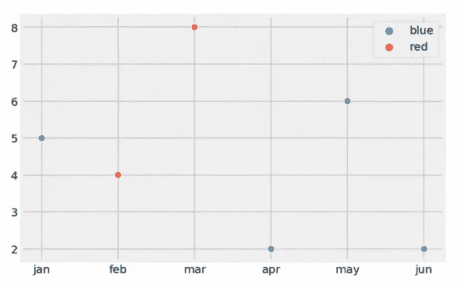

↑↑↑关注后"星标"Datawhale

每日干货 & [每月组队学习](https://mp.weixin.qq.com/mp/appmsgalbum?__biz=MzIyNjM2MzQyNg%3D%3D&action=getalbum&album_id=1338040906536108033#wechat_redirect)，不错过

 Datawhale干货 

**来源：《数据可视化陷阱》，转自：数据分析&职坐标**

导读：其实工作中我们并不需要作出很炫酷的视觉呈现，**数据可视化**主要旨在借助于图形化手段，清晰有效地传达与沟通信息，有效地传达思想概念，通过直观地传达关键的方面与特征，从而实现对于相当稀疏而又复杂的数据集的深入洞察。因此在设计过程中：**每一个选择，最终都应落脚于读者的体验，而非图表制作者个****人**。

**一、不得不注意的图表制作小技巧**

**1.条形图的基线必须从零开始**

Y轴不从零开始，可以使数据看起来具有比实际存在的更大的差距。这使得可视化会误导传输信息。条形图的原理就是通过比较条块的长度来比较值的大小。当基线被改变了，视觉效果也就扭曲了。

**2.使用简单易读的字体**

有些时候，排版可以提升视觉效果，增加额外的情感和洞察力。但数据可视化不包括在内。坚持使用简单的无衬线字体(通常是Excel等程序中的默认字体)。无衬线字体即是那些文字边缘没有小脚的字体。字体选择可以影响文本的易读性，增强或减损预期的含义。因此，最好避免艺术字体并坚持使用更基本的常用字体。

**3.条状图宽度适度**

条形图之间的间隔应该是1/2栏宽度。

**4.使用2D图形**

虽然他们看起来很酷，但是3d形状可以扭曲感知,因此扭曲数据。坚持2 次元，确保数据准确。

**5.使用表格数字字体**

表格间距赋予所有的数字相同的宽度，使它们排列时能彼此对齐，使比较更容易。大多数流行字体都内置了表格。不确定字体是否正确?就看小数点(或任何数字)是否对齐就行。

**6.统一感**

统一感使我们更容易接收信息：颜色，图像，风格，来源……

连贯的设计将有效融入背景，使用户能够轻松处理信息。最佳可视化帮助观众快速得出数据所呈现的结论

**7.不要过分热衷于饼图**

展示多个区块比例大小，所有区块（圆弧）的加和等于 100%。但最好避免使用这个图表，因为肉眼对面积大小不敏感。

**8.折线图中使用连贯的线条**

虚线,虚线容易分散注意力。相反,使用实线和颜色,反而容易区分彼此的区别。

**9.尊重部分所占整体的比例**

在人们多选的问题上就会出现比例的重叠，不同选项的百分比之和大于一。为了避免这种情况，不能直接把比例做成统计图。相较于呈现数值，有些图更着重于表现部分与整体的关系。

**10.面积、尺寸可视化**

对同一类图形（例如柱状、圆环和蜘蛛图等）的长度、高度或面积加以区别，来清晰的表达不同指标对应的指标值之间的对比。制作这类数据可视化图形时，要用数学公式计算，来表达准确的尺度和比例。

**11.使用大小来可视化值**

大小可以帮助强调重要信息并添加上下文提示，使用大小来表示值配合地图使用的效果也非常好。如果您的可视化中有多个大小相同的数据点，它们会混在一起，很难区分值。

**12.使用相同细节**

添加的细节(和数字)越多，大脑处理的时间就越长。想想你想要用你的数据传达什么，以及最有效的方式是什么。

**13.使用基础图形**

一个很好的经验法则是，如果你不能高效理解，你的读者或听众可能也难理解。因此，坚持使用基础图形:直方图、条形图、维恩图、散点图和线形图。

**14.视图数量**

将您的可视化中的视图数量限制为三到四个。如果您添加太多视图，大局会被详细信息所淹没。

**二、关于图表配色参考的5条准则**

**1.颜色深浅**

通过颜色的深浅来表达指标值的强弱和大小，是数据可视化设计的常用方法，用户一眼看上去便可整体的看出哪一部分指标的数据值更突出。

**2.使用同一色系**

颜色用得太花，会给数据增加不可承受之重，相反，设计师应该采用同一色系，或者类比色。

**3.避免使用鲜艳的颜色**

明亮鲜艳的颜色就像是把所有的字母都大写想要强调一样，你的听众感觉你在对他们大声推销。单调的颜色，反而能很好地用于数据可视化，因为它们可以让你的读者理解你的数据，而不至于被数据淹没。

**4.标签使用不同颜色区分**

在某些情况下，在一段时间或一系列的值中，我们可能测量了不同种类的物体。例如，假设我们测量 6 个月以来狗和猫的体重。在实验结束时，我们想画出每只动物的体重，分别用蓝色和红色区分猫和狗。

**5.颜色数量**

不要在一张图上使用6种以上的颜色。

建议：

使用具有高对比度的颜色

使用带有图案或纹理的颜色来传达不同类型的信息

使用文本或图标标记元素

**三、标准的可视化图表一定有注释**

**1.解释编码**

通过一定的形状、颜色和几何图形的结合，将数据呈现出来。为了让读者能读清楚，图表设计者就要把这些图形解码回数据值。

**2.轴标签**

这可能看起来没有必要，或者不是很有帮助，但是你无法想象，如果你的图表有点混乱，或者看到数据的人对此不是很熟悉，你会被问多少次 x/y 轴代表的是什么。按照前面的两个绘图示例，如果要为轴设置特定名称。

**3.标题**

如果我们要将数据呈现给第三方，另一个基本但关键的要点是使用标题，它和之前的轴标记非常相似。

**4.重点元素做注释**

通常情况下，仅仅在图表的左右两侧使用刻度本身并不是很清楚。在图上标注值对于解释图表非常有用。

**5.重要视图位置**

将最重要的视图放置在顶部或左上角。眼睛通常会首先注意到该区域。

**四、优秀的可视化图表，遵守的6条原则**

**1.数据排序有序**

数据类别按字母顺序,大小顺序,或价值进行排序，以一种合乎逻辑的和直观的方式来引导读者了解数据。

**2.比较数据**

比较是展示数据差异的好法子，但是如果你的读者不容易看出差别的话，那么你的比较就毫无意义。确保所有的数据都是呈现在读者面前,选择最合适的比较方法。

**3.不可扭曲数据**

确保所有可视化方式是准确的。例如,气泡图大小应该根据区域扩展,而不是直径。

**4.展示数据**

让读者看到数据，这是可视化的重点。确保没有数据丢失或被设计。例如,使用标准的面积图时，可以添加透明度,确保读者可以看到所有数据。

**5.删除变量**

很多时候，太多的信息会影响读者的注意，从可视化中删除隐含信息是一个好主意，在这种情况下，我认为我们不需要在轴中包含变量的名称。

**6.避免数据噪音**

把不重要的东西减到最少或者去掉。这包括减弱或移除图形线，改变轴线、图形线的颜色，以及用浅灰色描绘电子表格行。使得“数据比率”可以达到一个很高的水平，听众会更容易明白其中的数据情况。

良好的数据可视化应该通过使用图形，清晰有效地传达数据信息。最佳可视化使您可以轻松地一目了然地理解数据。他们将复杂的信息以一种简单的方式分解，使目标受众能够理解并以此为基础做出决策。

正如Edward R. Tufte指出的那样，“设计的基本考验是它有助于理解内容，而不是它的时尚性。”数据可视化尤其应该坚持这一理念。目标是通过设计增强数据，而不是引起对设计本身的关注。

本文内容节选自《数据可视化陷阱》一书，由阿尔贝托・开罗所著。阿尔贝托・开罗是一名记者，同时也是一名图表设计师。他撰写过多部教科书，同时为谷歌、微软、尼尔森等大型公司提供可视化方面的专业咨询。在过去20年中，阿尔贝托·开罗曾在30多个国家任教，并在西班牙、巴西和美国的新闻机构担任可视化和信息图形团队经理，积累了丰富的经验。

“干货学习，**点****赞****三连**↓