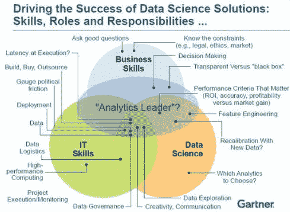

↑↑↑关注后"星标"Datawhale

每日干货 & [每月组队学习](https://mp.weixin.qq.com/mp/appmsgalbum?__biz=MzIyNjM2MzQyNg%3D%3D&action=getalbum&album_id=1338040906536108033#wechat_redirect)，不错过

 Datawhale干货 

**作者：**Vincent Granville，来源：机器之心****

> *在这篇文章中，数据科学家与分析师 Vincent Granville 明晰了数据科学家所具有的不同角色，以及数据科学与机器学习、深度学习、人工智能、统计学等领域的区别。这些概念的区别也一直是人工智能领域热烈讨论的一个话题，Quora、多个技术博客都曾有过解答。机器之心之前编译的一篇文章《[人工智能、机器学习、深度学习，三者之间的同心圆关系](http://mp.weixin.qq.com/s?__biz=MzA3MzI4MjgzMw%3D%3D&idx=4&mid=2650717606&scene=21&sn=b94b58d4fe75c1a1e42274720a269a99#wechat_redirect)》也对此问题进行了探讨。*

在本文中，数据科学家与分析师 Vincent Granville 明晰了数据科学家所具有的不同角色，以及数据科学与机器学习、深度学习、人工智能、统计学、物联网、运筹学和应用数学等相关领域的比较和重叠。

**1\. 数据科学家具有哪些不同类型？**

要更详细地了解数据科学家的类型，可参阅文章：http://suo.im/28rlX1 和 http://suo.im/3NNUpd。更多有用的信息可参阅：

*   数据科学家与数据架构师：http://suo.im/4bRkRG

*   数据科学家与数据工程师：http://suo.im/3mpo6E

*   数据科学家与统计学家：http://suo.im/2GGtfG

*   数据科学家与业务分析师：http://suo.im/3h0hkX

而在最近，数据科学家 Ajit Jaokar 则又讨论了 A 型数据科学家（分析师）和 B 型数据科学家（建造者）之间的区别：

A 型数据科学家能够很好地编写操作数据的代码，但并不一定是一个专家。A 型数据科学家可能是一个实验设计、预测、建模、统计推理或统计学方面的事情的专家。然而总体而言，一个数据科学家的工作产品并不是「P 值和置信区间」——就像学术界的统计学有时候建议的那样（而且这常常是为传统的制药等等行业工作的）。在谷歌，A 型数据科学家被称为统计学家、定量分析师、决策支持工程开发分析师，也有一些被称为数据科学家。

B 型数据科学家：这里的 B 是指 Building。B 型数据科学家和 A 型数据科学家具有相同的背景，但他们还是很强的程序员、甚至经验丰富的软件工程师。B 型数据科学家主要关注在生产环境中使用数据。他们构建能与用户进行交互的模型，通常是提供推荐（产品、可能认识的人、广告、电影、搜索结果等）。

而对于业务处理优化，我也有自己的看法，我将其分成了 ABCD 四个方向，其中 A 表示分析科学（analytics science），B 表示业务科学（business science），C 表示计算机科学（computer science），D 则表示数据科学（data science）。数据科学可能会涉及到编程或数学实践，但也可能不会涉及到。你可以参考 http://suo.im/11bR7o 这篇文章了解高端和低端的数据科学的差异。在一家创业公司，数据科学家通常要做很多类型的工作，其扮演的工作角色可能包括：执行、数据挖掘师、数据工程师或架构师、研究员、统计学家、建模师（做预测建模等等）和开发人员。

虽然数据科学家常常被看作是经验丰富的 R、Python、SQL、Hadoop 程序员，而且精通统计学，但这不只不过是冰山一角而已——人们对于数据科学家的这些看法不过是来自于重在教授数据科学的部分元素的数据培训项目而已。但正如一位实验室技术人员也可以称自己为物理学家一样，真正的物理学家远不止于此，而且他们的专业领域也是非常多样化的：天文学、数学物理、核物理、力学、电气工程、信号处理（这也是数据科学的一个领域）等等许多。数据科学也是一样，包含的领域有：生物信息学、信息技术、模拟和量化控制、计算金融、流行病学、工业工程、甚至数论。

对我而言，在过去的十年里，我专注于机器到机器和设备到设备的通信、开发能自动处理大型数据集的系统、执行自动化交易（比如购买网络流量或自动生成内容）。这意味着需要开发能够处理非结构化数据的算法，这也是人工智能、物联网和数据科学的交叉领域，也可被称为深度数据科学（deep data science）。其对数学的需求相对较少，也只涉及到较少的编程（大部分是调用 API），但其却是相当数据密集型的（包括构建数据系统），并且基于专门为此背景而设计的全新统计技术。

在此之前，我的工作是实时的信用卡欺诈检测。在我事业的早期阶段（大约 1990 年），我开发过图像远程感知技术，其中包括识别卫星图像的模式（形状和特征，比如湖泊）和执行图像分割：那段时间我的研究工作被称为是计算统计学，但在我的母校，隔壁的计算机科学系也在做着几乎完全一样的事情，但他们把自己的工作叫做是人工智能。

今天，这项工作被称作数据科学或人工智能，其子领域包括信号处理、用于物联网的计算机视觉等。

另外，数据科学家也可以在各种各样的数据科学项目中出现，比如数据收集阶段或数据探索阶段一直到统计建模和已有系统维护。

**2\. 机器学习 vs 深度学习**

在深入探讨数据学习与机器学习之间的区别前，我们先简单讨论下机器学习与深度学习的区别。机器学习一系列在数据集上进行训练的算法，来做出预测或采取形同从而对系统进行优化。例如，基于历史数据，监督分类算法就被用来分类潜在的客户或贷款意向。根据给定任务的不同（例如，监督式聚类），用到的技术也不同：朴素贝叶斯、支持向量机、神经网络、ensembles、关联规则、决策树、逻辑回归或多种方法之间的结合。

这些都是数据科学的分支。当这些算法被用于自动化的时候，就像在自动飞行或无人驾驶汽车中，它被称为人工智能，更具体的细说，就是深度学习。如果数据收集自传感器，通过互联网进行传输，那就是机器学习或数据科学或深度学习应用到了 IoT 上。

有些人对深度学习有不同的定义。他们认为深度学习是带有更多层的神经网络（神经网络是一种机器学习技术）。深度学习与机器学习的区别这一问题在 Quora 上也被问到过，下面对此有详细的解释：

*   人工智能是计算机科学的一个子领域，创造于 20 世纪 60 年代，它涉及到解决对人类而言简单却对计算机很难的任务。详细来说，所谓的强人工智能系统应该是能做人类所能做的任何事。这是相当通用的，包含所有的任务，比如规划、到处移动、识别物体与声音、说话、翻译、完成社会或商业事务、创造性的工作（绘画、作诗）等。

*   自然语言处理只是人工智能与语言有关的一部分。

*   机器学习被认为是人工智能的一方面：给定一些可用离散术语（例如，在一些行为中，那个行为是正确的）描述的人工智能问题，并给出关于这个世界的大量信息，在没有程序员进行编程的情况下弄清楚「正确」的行为。典型的是，需要一些外部流程判断行为是否正确。在数学术语中，也就是函数：馈入输入，产生正确的输出。所以整个问题就是以自动化的方式建立该数学函数的模型。在二者进行区分时：如果我写出的程序聪明到表现出人类行为，它就是人工智能。但如果它的参数不是自动从数据进行学习，它就不是机器学习。

*   深度学习是如今非常流行的一种机器学习。它涉及到一种特殊类型的数学模型，可认为它是特定类型的简单模块的结合（函数结合），这些模块可被调整从而更好的预测最终输出。

**3.机器学习 vs 统计学**

《Machine Learning Vs. Statistics》这篇文章试图解答这个问题。这篇文章的作者认为统计学是带有置信区间（confidence intervals）的机器学习，是为了预测或估计数量。

**4\. 数据科学 vs 机器学习**

机器学习和统计学都是数据科学的一部分。机器学习中的学习一词表示算法依赖于一些数据（被用作训练集），来调整模型或算法的参数。这包含了许多的技术，比如回归、朴素贝叶斯或监督聚类。但不是所有的技术都适合机器学习。例如有一种统计和数据科学技术就不适合——无监督聚类，该技术是在没有任何先验知识或训练集的情况下检测 cluster 和 cluster 结构，从而帮助分类算法。这种情况需要人来标记 cluster。一些技术是混合的，比如半监督分类。一些模式检测或密度评估技术适合机器学习。

数据科学要比机器学习广泛。数据科学中的数据可能并非来自机器或机器处理（调查数据可能就是手动收集，临床试验涉及到专业类型的小数据），就像我刚才所说的，它可能与「学习」没有任何关系。但主要的区别在于数据科学覆盖整个数据处理，并非只是算法的或统计类分支。细说之，数据科学也包括：

*   数据集成（data integration）

*   分布式架构（distributed architecture）

*   自动机器学习（automating machine learning）

*   数据可视化（data visualization）

*   dashboards 和 BI

*   数据工程（data engineering）

*   产品模式中的部署（deployment in production mode）

*   自动的、数据驱动的决策（automated, data-driven decisions）

当然，在许多公司内数据科学家只专注这些流程中的一个。

*原文链接：http://www.datasciencecentral.com/profiles/blogs/difference-between-machine-learning-data-science-ai-deep-learning*

“干货学习，**点****赞****三连**↓