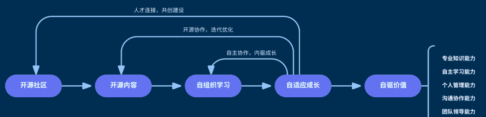
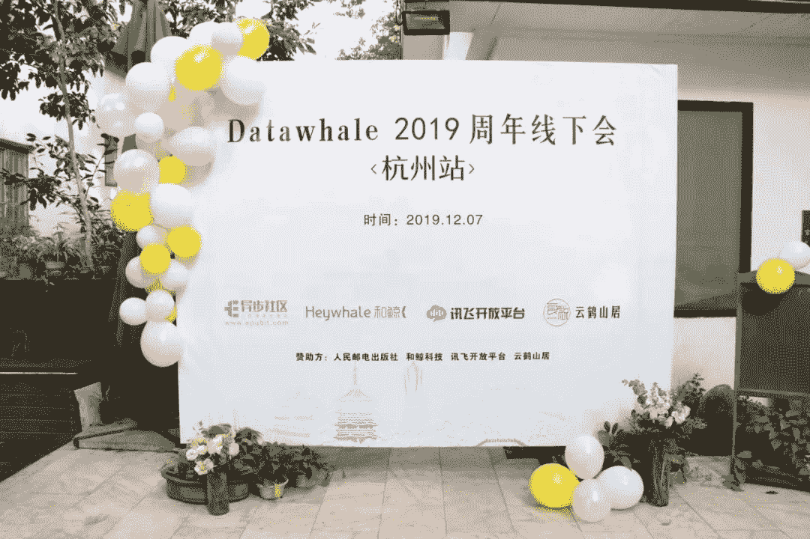
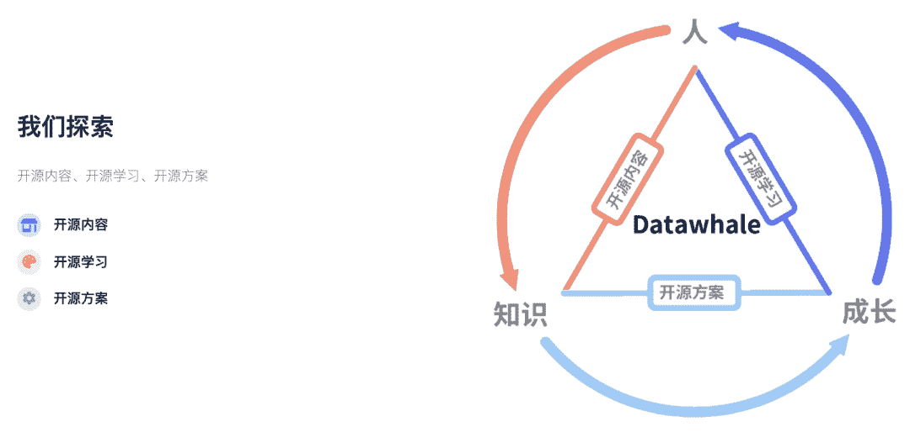

 Datawhale团队 

****公示：Datawhale 组织成员****

Datawhale已经成立一年半了，从一开始的12个人，学习互助，到提议建立开源组织，做更多开源的事情，帮助更多学习者，也促进我们更好地成长。于是有了我们的愿景：“for the learner，和学习者一起成长”，希望成为对学习者最有价值的开源组织。

**文末****阅读原文****，可申请加入Datawhale**

在这一年半的时间，Datawhale从发布第一个开源项目《Pumpkinook-南瓜书》。

开源地址：https://github.com/datawhalechina/pumpkin-book

惊喜于周老师分享。

设计了组织第一个鲸鱼logo。

19年在老师的鼓励下参与了交大项目评选，惊喜于被评为国家级项目（3/41）。

每月组织学习：包含了数据分析，数据挖掘，CV，NLP，机器学习，爬虫等多个领域，并将开源学习的理念首次写入[数据科学教育白皮书](http://mp.weixin.qq.com/s?__biz=MzIyNjM2MzQyNg%3D%3D&chksm=e870c9d0df0740c68ac2543b14063c68ac832032e4612007aaf34a37cc447d7d9575d22bcd0a&idx=1&mid=2247489693&scene=21&sn=accffa1372c16ac782f8e79beaa590cf#wechat_redirect)。

点击可跳转↓

[九月组队学习（金融风控）](http://mp.weixin.qq.com/s?__biz=MzIyNjM2MzQyNg%3D%3D&chksm=e87394a6df041db0736736cbe1a6b4331e8774b0a6e773036f1b00aa92792092d7e7a8a57388&idx=1&mid=2247534059&scene=21&sn=728a86b7179783255e8aa1e08704d9a8#wechat_redirect)

[八月组队学习（数据分析，编程等）](http://mp.weixin.qq.com/s?__biz=MzIyNjM2MzQyNg%3D%3D&chksm=e873be17df04370108552f5e1fd44397b5ae46938d3996c3873fcfdf52ce3c0f5669d48a1fcb&idx=1&mid=2247528282&scene=21&sn=875e92d2180284f57f64b765f8b2a021#wechat_redirect)

[七月组队学习（nlp，Python）](http://mp.weixin.qq.com/s?__biz=MzIyNjM2MzQyNg%3D%3D&chksm=e873661bdf04ef0d06753aa384ada8bfdc3a0059c73ce50b15637f808f0ad5b6bfaa3a976896&idx=1&mid=2247513942&scene=21&sn=03af15ab0cea588cd8b8847a3ee75c95#wechat_redirect)

[六月组队学习（cv，nlp，概率统计等）](http://mp.weixin.qq.com/s?__biz=MzIyNjM2MzQyNg%3D%3D&chksm=e873121adf049b0cf6d11bb673ca5cddfb657b2ed5f82e2edd8c1e877ad8b8817ed840f9dfa1&idx=1&mid=2247500631&scene=21&sn=2706a0ee958f53b4d37d4ccd7c01beb3#wechat_redirect)

[五月组队学习（计算机视觉）](http://mp.weixin.qq.com/s?__biz=MzIyNjM2MzQyNg%3D%3D&chksm=e873339fdf04ba8920a6948b9b681b512fc03d93649bb67706c728c62747d8f16588f98ac2fb&idx=1&mid=2247492306&scene=21&sn=f78bf461e6ae56af6044c1e0b15f15f3#wechat_redirect)

[四月组队学习（数据挖掘）](http://mp.weixin.qq.com/s?__biz=MzIyNjM2MzQyNg%3D%3D&chksm=e870c69cdf074f8a1d038d52f634a80aded40c77ccd5573c43d8ba2a0623b7004d7b69524885&idx=1&mid=2247489489&scene=21&sn=5784d433b93e2315d87a825de3910e33#wechat_redirect)

设计了组织的第一件文化衫。

组织的第一个周年聚会。

开始逐步清晰我们要做些什么。

一年多的时间，我们开始有了100多个团队成员：有高校的教授，学生，也有领域的KOL，企业从业者等。在[第二期录取名单公示](http://mp.weixin.qq.com/s?__biz=MzIyNjM2MzQyNg%3D%3D&chksm=e8736898df04e18eedf6c76b91121d9ba6580e8bb85c56eef299cc4112e6da507dd8c6cc6e09&idx=1&mid=2247514581&scene=21&sn=8b9aeb91ca6d9778c5fd6b19e7baa92e#wechat_redirect)后，共收到116份新的申请。

## 最终确认名单

总共收到116份申请。由组织成员范晶晶、马燕鹏、谢文昕、谢文睿、李碧涵、王茂霖、司玉鑫、杨煜8位成员进行审核。共投票选出了28位优秀的候选者，最终加权确定了23位优秀的小伙伴加入组织团队。第三期团队成员名单公示如下：

 1   杨雅程  清华大学（陈安东推荐）

 2   吴   雪  斯坦福大学

 3   刘雯静  宁波大学

 4   陈长沙  重庆邮电大学（杨佳达推荐）

 5   何锋丽  北京信息科技大学（游璐颖推荐）

 6   李芝翔  华北电力大学 （王程伟推荐）

 7   姚行志  华北电力大学

 8   吴   怡  爱丁堡大学

 9   左秉文  华北电力大学（姚鑫等推荐）

10   周郴莲  东北石油大学（雷钲仪推荐）

11   田   云  上海科技大学（李运佳推荐）

12   宋怡然  上海交通大学

13   李明浩  华中科技大学（王茂霖推荐）

14   赵   可  三峡大学（薛传雨推荐）

15   胡明豪  上海交通大学

16   佘   盼  中国科学技术大学

17   殷博文  北京航空航天大学（段秋阳推荐）

18   曹海广  南京工业大学（陈锴等推荐）

19   李   程  新加坡国立大学

20   李祖贤  深圳大学

21   张   晋  北京理工大学

22   孙子涵  太原理工大学

23   潘华引  浙江大学（金娟娟推荐）

-------------------------

24   王振东  西安交通大学

25   金思远  华南理工大学（范晶晶推荐）

26   黄新宇  华南理工大学

27   魏子豪  四川大学

28   钱   振  南京师范大学

与此同时，了解到到大家如何接触到Datawhale，认为Datawhale存在的价值，以及对Datawhale的建议，在前行的路上共勉。

## 你是怎么了解到Datawhale的？

网络一线牵，珍惜这段缘。我们在此相遇、相识、相知。

**1\. 通过开源学习**

2020年组队学习。

—仁   义

大二，有一期是二手车预测的组队学习。

—李   祥

第一次参加Datawhale组织的cv学习活动。

—高建杰

**2\. 通过开源内容**

去年看南瓜书公式推导的时候。

—曹海广

20年8月份在搜西瓜书时发现了这个宝藏。

—宋怡然

在寻找与西瓜书类似的教程时，发现了南瓜书项目就顺手关注了Datawhale。

—吴   怡

*更多学习开源：**https://github.com/datawhalechina*

**3\. 通过数据竞赛**

腾讯算法大赛。

—林明雄

一个月前，阿里云天池cv大赛。

—钱常德

了解Datawhale比较早，真正开始接触是二月份打kaggle比赛的时候。

—张   晋

*后台回复 **竞赛**可进入竞赛学习群*

**4\. 通过微信、知乎、CSDN等多种渠道**

好像是查找资料的时候吧，恰好关注了微信公众号，偶然间关注了组队学习的微推，自那以后就一直参加。

—孙子涵 

很早就关注了Datawhale的公众号，一开始是被优质的内容吸引，然后假期的时候参加了组队学习，内容充实，有理论有实践，大佬们的讲解也很详细，被这种学习方式吸引，到最后自己也参与了开源教程的制作，受益匪浅。

—李芝祥 

**5\. 通过导师&朋友推荐**

好朋友！也是同系的同学。

— 殷博文

第一次成立的时候，后来发现导师会给我们分享这个公众号的文章。

—杨   瑞

19年实验室导师介绍的。

—左秉文

*感谢把 Datawhale推荐给朋友的每一个小伙伴。*

## 你认为Datawhale体现的价值？

一千个人眼里有一千个哈姆雷特，但开源、分享、学习、成长依然是众多回复里出现的高频词。

形成一个良好的学习、开源氛围，促进共同成长。

—凌   鹏

我希望Datawhale的价值是普世的，是极致的开源共享并以知识和技术为源动力，既成就人才、也以人才成就自己。

—吴   怡

"我为人人，人人为我”，在这里，分享自己的知识和所学，和伙伴们互相学习与成长，不断精进。

—宋怡然

在于传播数据科学和人工智能知识，同时鼓励相关从业者从事自己喜欢的领域，并且坚持下去。

—周杨浩

就是帮助想入手人工智能的学生轻松入门，为未来人工智能汇集人才，帮助任何有能力，有兴趣的学生实现价值，不因为没有平台或者渠道而放弃。

—常泽钰

自组织协作，学习共创。

—吴   雪

让很多平凡无奇，默默努力，却没有明确方向的人，有更好的学习方向，变成一个更好的自己。      

—左秉文

相信国内的开源环境会越来越好。

*文末****阅读原文**可申请加入我们*

“给Datawhale**点个****赞**吧↓