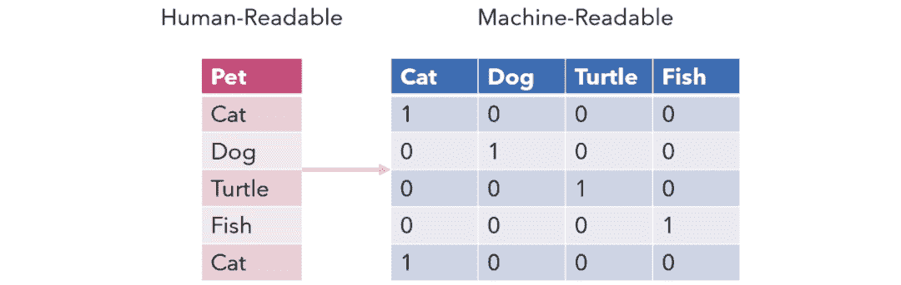
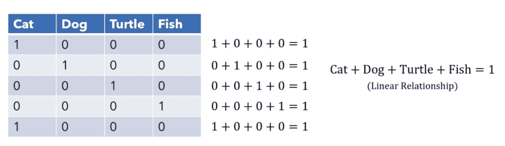
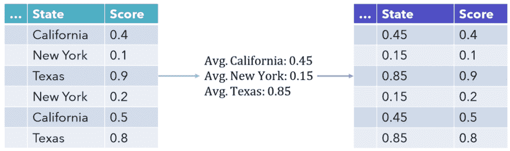
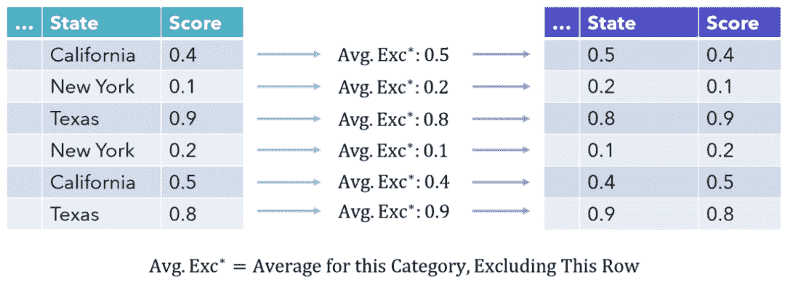

↑↑↑关注后"星标"Datawhale

每日干货 & [每月组队学习](https://mp.weixin.qq.com/mp/appmsgalbum?__biz=MzIyNjM2MzQyNg%3D%3D&action=getalbum&album_id=1338040906536108033#wechat_redirect)，不错过

 Datawhale干货 

**作者：Andre Ye，来源：机器之心、NewBeeNLP**

one-hot encoding 是一种被广泛使用的编码方法，但也会造成维度过高等问题。因此，medium 的一位博主表示，在编码分类变量方面，我们或许还有更好的选择。

one-hot 编码（one-hot encoding）类似于虚拟变量（dummy variables），是一种将分类变量转换为几个二进制列的方法。其中 1 代表某个输入属于该类别。



从机器学习的角度来看，one-hot 编码并不是一种良好的分类变量编码方法。

众所周知，维数越少越好，但 one-hot 编码却增加了大量的维度。例如，如果用一个序列来表示美国的各个州，那么 one-hot 编码会带来 50 多个维度。

one-hot 编码不仅会为数据集增加大量维度，而且实际上并没有太多信息，很多时候 1 散落在众多零之中，即有用的信息零散地分布在大量数据中。这会导致结果异常稀疏，使其难以进行优化，对于神经网络来说尤其如此。

更糟糕的是，每个信息稀疏列之间都具有线性关系。这意味着一个变量可以很容易地使用其他变量进行预测，导致高维度中出现并行性和多重共线性的问题。



最优数据集由信息具有独立价值的特征组成，但 one-hot 编码创建了一个完全不同的环境。

当然，如果只有三、四个类，那么 one-hot 编码可能不是一个糟糕的选择。但是随着类别的增加，可能还有其他更合适的方案值得探索。本文作者列举了几个方案供读者参考。

**目标编码**

目标编码（Target encoding）是表示分类列的一种非常有效的方法，并且仅占用一个特征空间，也称为均值编码。该列中的每个值都被该类别的平均目标值替代。这可以更直接地表示分类变量和目标变量之间的关系，并且也是一种很受欢迎的技术方法（尤其是在 Kaggle 比赛中）。



但这种编码方法也有一些缺点。首先，它使模型更难学习均值编码变量和另一个变量之间的关系，仅基于列与目标的关系就在列中绘制相似性。

而最主要的是，这种编码方法对 y 变量非常敏感，这会影响模型提取编码信息的能力。

由于该类别的每个值都被相同的数值替换，因此模型可能会过拟合其见过的编码值（例如将 0.8 与完全不同的值相关联，而不是 0.79），这是把连续尺度上的值视为严重重复的类的结果。

因此，需要仔细监控 y 变量，以防出现异常值。要实现这个目的，就要使用 category_encoders 库。由于目标编码器是一种有监督方法，所以它同时需要 X 和 y 训练集。

```
from category_encoders import TargetEncoder 
 enc = TargetEncoder(cols=['Name_of_col','Another_name']) 
 training_set = enc.fit_transform(X_train, y_train) 
```

**留一法编码**

留一法（Leave-one-out）编码试图通过计算平均值（不包括当前行值）来弥补对 y 变量的依赖以及值的多样性。这使异常值的影响趋于平稳，并创建更多样化的编码值。



由于模型不仅要面对每个编码类的相同值，还要面对一个范围值，因此它可以更好地泛化。

在实现方面，可以使用 category_encoders 库中的 LeaveOneOutEncoder。

```
from category_encoders import LeaveOneOutEncoder
 enc = LeaveOneOutEncoder(cols=['Name_of_col','Another_name'])
 training_set = enc.fit_transform(X_train, y_train) 
```

实现类似效果的另一种策略是将正态分布的噪声添加到编码分数中，其中标准差是可以调整的参数。

**贝叶斯目标编码**

贝叶斯目标编码（Bayesian Target Encoding）是一种使用目标作为编码方法的数学方法。仅使用均值可能是一种欺骗性度量标准，因此贝叶斯目标编码试图结合目标变量分布的其他统计度量。例如其方差或偏度（称为高阶矩「higher moments」）。

然后通过贝叶斯模型合并这些分布的属性，从而产生一种编码，该编码更清楚类别目标分布的各个方面，但是结果的可解释性比较差。

**证据权重**

证据权重（Weight of Evidence，简称 WoE）是另一种关于分类自变量和因变量之间关系的方案。WoE 源自信用评分领域，曾用于区分用户是违约拖欠还是已经偿还贷款。证据权重的数学定义是优势比的自然对数，即：

```
ln (% of non events / % of events) 
```

WoE 越高，事件发生的可能性就越大。「Non-events」是不属于某个类的百分比。使用证据权重与因变量建立单调关系，并在逻辑尺度上确保类别，这对于逻辑回归来说很自然。WoE 是另一个衡量指标「Information Value」的关键组成部分。该指标用来衡量特征如何为预测提供信息。

```
from category_encoders import WOEEncoder 
 enc = WOEEncoder(cols=['Name_of_col','Another_name']) 
 training_set = enc.fit_transform(X_train, y_train) 
```

这些方法都是有监督编码器，或者是考虑目标变量的编码方法，因此在预测任务中通常是更有效的编码器。但是，当需要执行无监督分析时，这些方法并不一定适用。

**非线性 PCA**

非线性 PCA（Nonlinear PCA）是一种使用分类量化来处理分类变量的主成分分析（PCA）方法。它会找到对类别来说的最佳数值，从而使常规 PCA 的性能（可解释方差）最大化。

**AIWIN世界人工智能****创新大赛—2021赛季「抗新冠助科研AI大赛」全球招募啦！**

开放新冠开放研究数据集（Corvid-19 Open Research Dataset，简称 CORD-19）包含近 20 万篇有关冠状病毒学术论文的数据集。

如果你是个人，这里有高额的奖金、世界500强合作企业的实习和就业机会、个人技术的世界级展示和交流平台；

如果你是企业，这里有AI+医疗全生态对接资源、有面向全球的线上线下展示机会、有真实的AI场景需求对接通道。

点击阅读原文或识别二维码，报名参赛吧！

