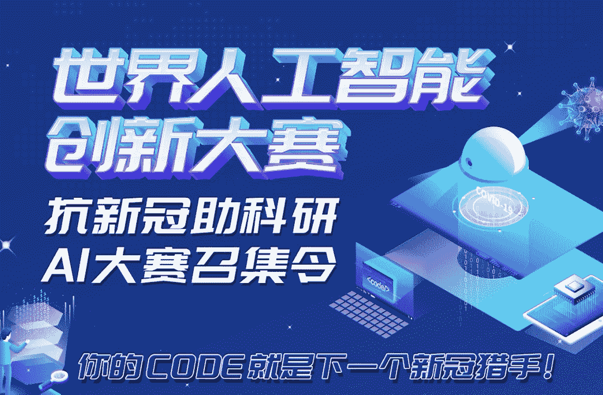
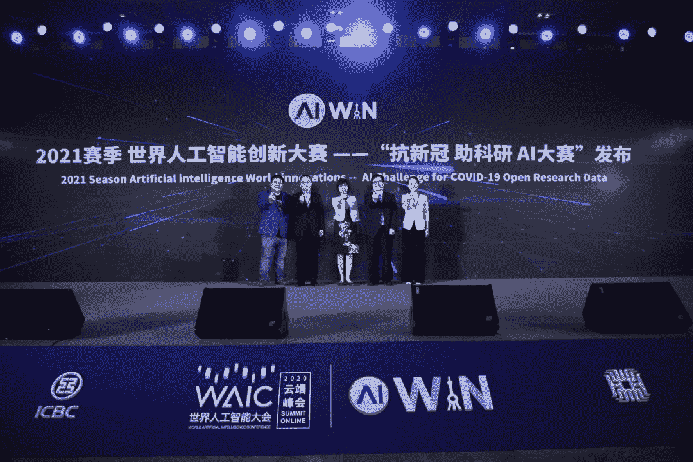
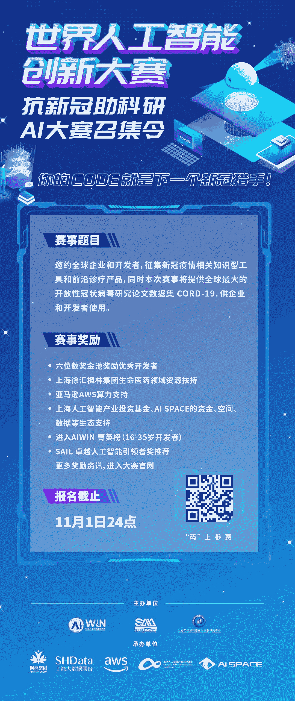

↑↑↑关注后"星标"Datawhale

每日干货 & [每月组队学习](https://mp.weixin.qq.com/mp/appmsgalbum?__biz=MzIyNjM2MzQyNg%3D%3D&action=getalbum&album_id=1338040906536108033#wechat_redirect)，不错过

 Datawhale推荐 

**赛事：世界人工智能创新大赛**

AI、COVID-19、NLP、知识图谱、CORD-19……这些关键词与“**抗新冠 助科研 AI大赛**”（以下简称新冠AI大赛）紧密相关。

虽然国内疫情目前已经稳定，但新冠病毒却不那么容易消失。

新冠 AI 大赛基于此背景，从助力抗疫新药研发、病毒研究、科研成果解读、公共卫生管理的角度出发，开展本次赛事，于 7 月 28 日正式开赛，面向全球招募优质的人工智能企业与开发者参赛，用人工智能技术解读新冠论文、用人工智能助力新冠诊疗，**报名截止时间为北京时间  11 月 1 日 24 点**。

大赛由 AIWIN 组委会、上海市经济和信息化发展研究中心、上海人工智能发展联盟医疗专委会共同主办，上海枫林生命健康产业发展（集团）有限公司、上海市大数据股份有限公司、亚马逊 AWS、上海人工智能产业投资基金、AI SPACE 共同承办。

## 赛题介绍

符合此次大赛参赛标准的项目为：

1.  基于新冠肺炎科研论文开放数据（CORD-19），利用 NLP 和知识图谱等技术所产出的新型工具和产品，用于解读、浏览、可视化论文文献数据，助力科研成果解读、病毒研究、药物研发、公共卫生管理等工作。

2.  针对新冠疫情，所开发的任何具备人工智能基因的用于预防、诊断、防护、看护等不同目的的产品和服务。例如具备新冠预检分诊能力的人工智能系统、应用于新冠防护的机器人等均可参赛。

## 参赛对象

企业组：针对 AI 企业，以企业机构身份参赛，提交自有产品或基于 CORD-19 新研发的产品皆可。提交时需同步提供企业营业执照副本。

开发者：任何非企业组开发者（含在校生），可通过 CORD-19 数据的分析应用，展示自身人工智能技术能力和应用能力。或提交其他适用于新冠疫情的人工智能系统、工具、服务产品。

## 赛事奖励

### 开发者

1.  **六位数奖金池**奖励优秀开发者。

2.  获得 **AIWIN 获奖证书**并有机会在 WAIC 平台上获得展示机会。

3.  基于获奖团队和 AWS 双方共识，**AWS** 将为符合资格的获奖团队提供进一步的算力和 Amazon SageMaker 的资源支持。

4.  获得优先入选 **AIWIN 菁英实训营**的机会，从而有资格入驻中国工商银行、中国太保等领先 AI 场景应用单位实训（注：仅针对在校生）。

### 企业组

1.  基于获奖团队和枫林集团双方共识，枫林将为符合资格的获奖团队提供产业落地、客户对接、办公场地等全方位的产业资源支持。

2.  基于获奖团队和 AWS 双方共识，AWS 将为符合资格的获奖团队提供进一步的算力和 Amazon SageMaker 的资源支持。

3.  基于获奖团队和 AI SPACE 双方共识，AI SPACE 将为符合资格的获奖团队提供加速孵化的平台支持。

4.  获奖企业将优先对接至 AIWIN 双创赋能生态圈、上海人工智能产业投资基金“投资人会客厅”等生态计划，对接百家资本。

5.  获得 2021 年 WAIC 世界人工智能大会展示机会（具体形式待公布）。

6.  获得 AIWIN 大赛证书，并推荐至 2021 SAIL 卓越人工智能引领者奖评选。

7.  获得 AIWIN百家媒体矩阵的专项覆盖曝光机会。

全球人工智能英雄快来参赛吧！（扫描下方二维码，进入大赛官网报名页）

## 世界人工智能创新大赛（AIWIN）

世界人工智能创新大赛（以下简称 AIWIN）由世界人工智能大会组委会主办，上海人工智能发展联盟承办，摩尼科技（AI SPACE）具体承接 AIWIN 的赛事运营。

大赛以“启迪智能，启航未来”为口号，从高端化、国际化、专业化、市场化、智能化角度出发，定位于国家级人工智能科技创新与全球化产品首发平台，通过设置通用技术赛和应用创新赛，与国际知名赛事横向联合，招募全球人工智能技术人才与团队，突破人工智能发展的关键性技术瓶颈，挖掘人工智能深度应用场景，在人工智能技术前瞻性研究、创新应用产品全球发布、产业实施落地等方面形成国内外交叉互动的态势，建造人工智能研发与应用的产业中心，助力上海成为人工智能国家战略高地。

过往三个赛季中，AIWIN 大赛先后在医疗、无人驾驶、机器人、金融、工业等方向开展赛事，并在 2019 年首度结合市人工智能场景建设开设场景应用赛。大赛每年平均吸引全球千余团队报名，累计收获 1200 余人工智能应用解决方案、通用技术和底层能力项目。大赛通过海外国际推广合作，在英国、以色列、法国、加拿大、美国、新加坡等国度逐步加深影响力，每年海外项目比例约 30%，在 2019 年大赛又首度配套世界人工智能大会开展了国际创业营，邀请 10 余家海外企业到上海参与大会并落地成果。

????点击阅读原文，直接报名