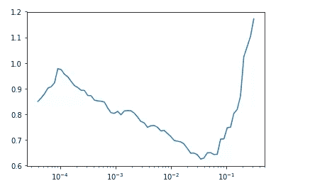
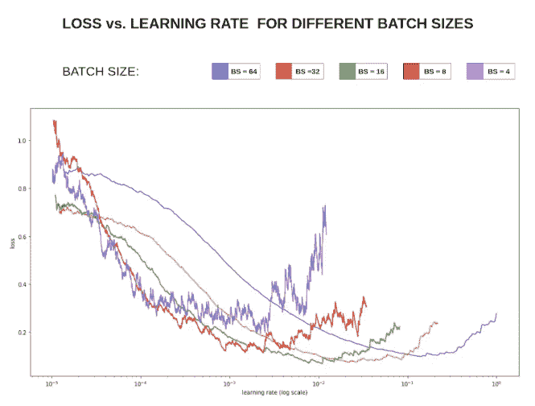
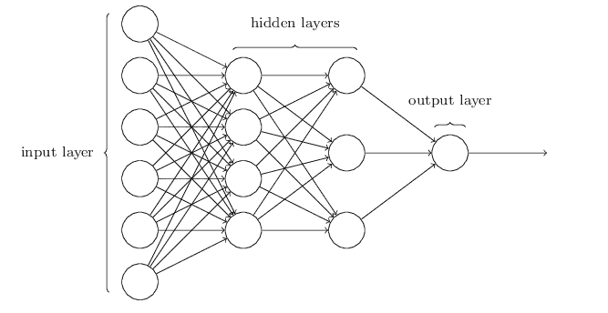
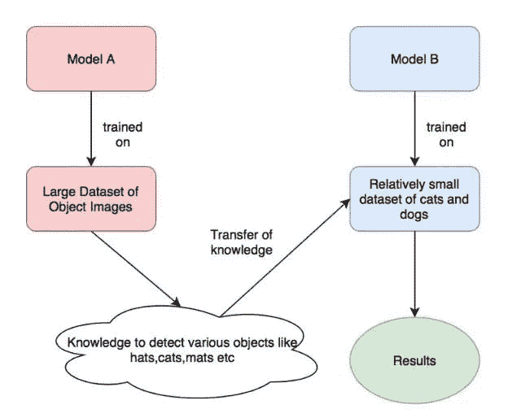
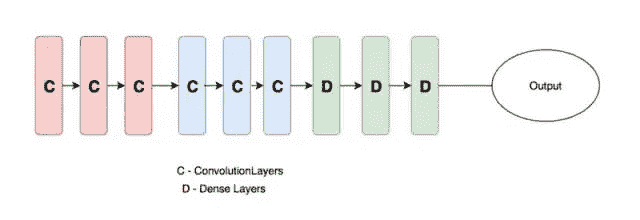
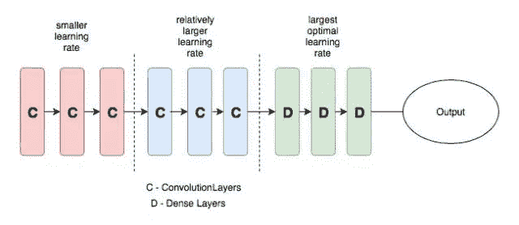
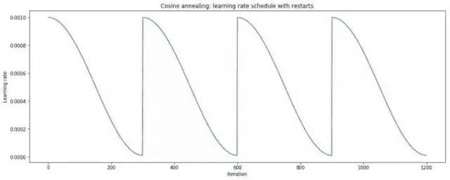
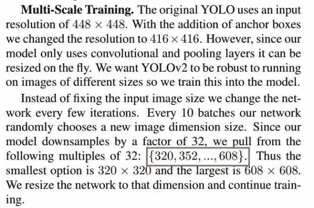
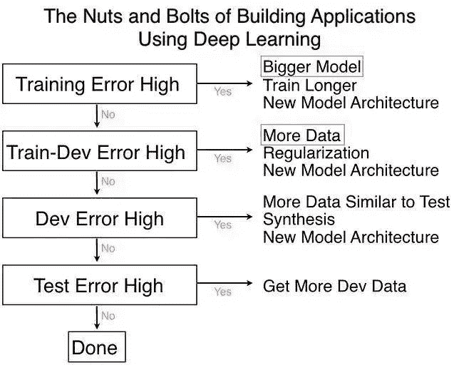

↑↑↑关注后"星标"Datawhale

每日干货 & [每月组队学习](https://mp.weixin.qq.com/mp/appmsgalbum?__biz=MzIyNjM2MzQyNg%3D%3D&action=getalbum&album_id=1338040906536108033#wechat_redirect)，不错过

 Datawhale干货 

**作者：山竹小果，来源：NewBeeNLP**

## 寻找合适的学习率(learning rate)

学习率是一个非常非常重要的超参数，这个参数呢，面对不同规模、不同batch-size、不同优化方式、不同数据集，其最合适的值都是不确定的，我们无法光凭经验来准确地确定`lr`的值，我们唯一可以做的，就是在训练中不断寻找最合适当前状态的学习率。

比如下图利用fastai中的lr_find()函数寻找合适的学习率，根据下方的学习率-损失曲线得到此时合适的学习率为`1e-2`。

推荐一篇fastai首席设计师**「Sylvain Gugger」**的一篇博客：How Do You Find A Good Learning Rate[1]

以及相关的论文Cyclical Learning Rates for Training Neural Networks[2]。

### learning-rate与batch-size的关系

一般来说，越大的batch-size使用越大的学习率。

原理很简单，越大的`batch-size`意味着我们学习的时候，收敛方向的`confidence`越大，我们前进的方向更加坚定，而小的`batch-size`则显得比较杂乱，毫无规律性，因为相比批次大的时候，批次小的情况下无法照顾到更多的情况，所以需要小的学习率来保证不至于出错。

可以看下图`损失Loss`与`学习率Lr`的关系：

在显存足够的条件下，最好采用较大的batch-size进行训练，找到合适的学习率后，可以加快收敛速度。

另外，较大的batch-size可以避免batch normalization出现的一些小问题，参考如下Pytorch库Issue[3]

## 权重初始化

权重初始化相比于其他的trick来说在平常使用并不是很频繁。

因为大部分人使用的模型都是预训练模型，使用的权重都是在大型数据集上训练好的模型，当然不需要自己去初始化权重了。只有没有预训练模型的领域会自己初始化权重，或者在模型中去初始化神经网络最后那几个全连接层的权重。

常用的权重初始化算法是**「kaiming_normal」**或者**「xavier_normal」**。

相关论文：

*   Delving deep into rectifiers: Surpassing human-level performance on ImageNet classification[4]

*   Understanding the difficulty of training deep feedforward neural networks[5]

*   Xavier初始化论文[6]

*   He初始化论文[7]

不初始化可能会减慢收敛速度，影响收敛效果。

以下 为网络的输入大小， 为网络的输出大小， 为 或

*   uniform均匀分布初始化：

*   Xavier初始法，适用于普通激活函数(tanh, sigmoid)：

*   He初始化，适用于ReLU：

*   normal高斯分布初始化， 其中stdev为高斯分布的标准差，均值设为0：

*   Xavier初始法，适用于普通激活函数 (tanh,sigmoid)：

*   He初始化，适用于ReLU：

*   svd初始化：对RNN有比较好的效果。参考论文：https://arxiv.org/abs/1312.6120[8]

## dropout

dropout是指在深度学习网络的训练过程中，对于神经网络单元，按照一定的概率将其暂时从网络中丢弃。注意是**「暂时」**，对于随机梯度下降来说，由于是随机丢弃，故而每一个mini-batch都在训练不同的网络。

Dropout类似于bagging ensemble减少variance。也就是投通过投票来减少可变性。通常我们在全连接层部分使用dropout，在卷积层则不使用。但**「dropout」**并不适合所有的情况，不要无脑上`Dropout`。

`Dropout`一般适合于全连接层部分，而卷积层由于其参数并不是很多，所以不需要dropout，加上的话对模型的泛化能力并没有太大的影响。

我们一般在网络的最开始和结束的时候使用全连接层，而hidden layers则是网络中的卷积层。所以一般情况，在全连接层部分，采用较大概率的dropout而在卷积层采用低概率或者不采用dropout。

## 数据集处理

主要有**「数据筛选」** 以及 **「数据增强」**

*   fastai中的图像增强技术为什么相对比较好[9]

## 难例挖掘 hard-negative-mining

分析模型难以预测正确的样本，给出针对性方法。

## 多模型融合

Ensemble是论文刷结果的终极核武器,深度学习中一般有以下几种方式

*   同样的参数,不同的初始化方式

*   不同的参数,通过cross-validation,选取最好的几组

*   同样的参数,模型训练的不同阶段，即不同迭代次数的模型。

*   不同的模型,进行线性融合. 例如RNN和传统模型.

提高模型性能和鲁棒性大法：probs融合 和 投票法。

假设这里有model 1, model 2, model 3，可以这样融合：

> 1\. model1 probs + model2 probs + model3 probs ==> final label

> 2\. model1 label , model2 label , model3 label ==> voting ==> final label

> 3\. model1_1 probs + ... + model1_n probs ==> mode1 label, model2 label与model3获取的label方式与1相同  ==> voting ==> final label

第三个方式的启发来源于，如果一个model的随机种子没有固定，多次预测得到的结果可能不同。

以上方式的效果要根据label个数，数据集规模等特征具体问题具体分析，表现可能不同，方式无非是probs融合和投票法的单独使用or结合。

## 差分学习率与迁移学习

首先说下迁移学习，迁移学习是一种很常见的深度学习技巧，我们利用很多预训练的经典模型直接去训练我们自己的任务。虽然说领域不同，但是在学习权重的广度方面，两个任务之间还是有联系的。

由上图，我们拿来**「model A」**训练好的模型权重去训练我们自己的模型权重(**「Model B」**)，其中，modelA可能是ImageNet的预训练权重，而ModelB则是我们自己想要用来识别猫和狗的预训练权重。

那么差分学习率和迁移学习有什么关系呢？我们直接拿来其他任务的训练权重，在进行optimize的时候，如何选择适当的学习率是一个很重要的问题。

一般地，我们设计的神经网络(如下图)一般分为三个部分，输入层，隐含层和输出层，随着层数的增加，神经网络学习到的特征越抽象。因此，下图中的卷积层和全连接层的学习率也应该设置的不一样，一般来说，卷积层设置的学习率应该更低一些，而全连接层的学习率可以适当提高。

这就是差分学习率的意思，在不同的层设置不同的学习率，可以提高神经网络的训练效果，具体的介绍可以查看下方的连接。

上面的示例图来自：towardsdatascience.com/transfer-le…[10]

### 余弦退火(cosine annealing)和热重启的随机梯度下降

**「余弦」**就是类似于余弦函数的曲线，**「退火」**就是下降，**「余弦退火」**就是学习率类似余弦函数慢慢下降。

**「热重启」**就是在学习的过程中，**「学习率」**慢慢下降然后突然再**「回弹」**(重启)然后继续慢慢下降。

两个结合起来就是下方的学习率变化图：

更多详细的介绍可以查看知乎机器学习算法如何调参？这里有一份神经网络学习速率设置指南[11]
以及相关论文SGDR: Stochastic Gradient Descent with Warm Restarts[12]

## 尝试过拟合一个小数据集

这是一个经典的小trick了，但是很多人并不这样做，可以尝试一下。

关闭正则化/随机失活/数据扩充，使用训练集的一小部分，让神经网络训练几个周期。确保可以实现零损失，如果没有，那么很可能什么地方出错了。

## 多尺度训练

多尺度训练是一种**「直接有效」**的方法，通过输入不同尺度的图像数据集，因为神经网络卷积池化的特殊性，这样可以让神经网络充分地学习不同分辨率下图像的特征，可以提高机器学习的性能。

也可以用来处理过拟合效应，在图像数据集不是特别充足的情况下，可以先训练小尺寸图像，然后增大尺寸并再次训练相同模型，这样的思想在Yolo-v2的论文中也提到过：

需要注意的是：多尺度训练并不是适合所有的深度学习应用，多尺度训练可以算是特殊的数据增强方法，在图像大小这一块做了调整。如果有可能最好利用可视化代码将多尺度后的图像近距离观察一下，**「看看多尺度会对图像的整体信息有没有影响」**，如果对图像信息有影响的话，这样直接训练的话会误导算法导致得不到应有的结果。

## Cross Validation 交叉验证

在李航的统计学方法中说到，交叉验证往往是对实际应用中**「数据不充足」**而采用的，基本目的就是重复使用数据。在平常中我们将所有的数据分为训练集和验证集就已经是简单的交叉验证了，可以称为1折交叉验证。**「注意，交叉验证和测试集没关系，测试集是用来衡量我们的算法标准的，不参与到交叉验证中来。」**

交叉验证只针对训练集和验证集。

交叉验证是Kaggle比赛中特别推崇的一种技巧，我们经常使用的是5-折(5-fold)交叉验证，将训练集分成5份，随机挑一份做验证集其余为训练集，循环5次，这种比较常见计算量也不是很大。还有一种叫做`leave-one-out cross validation`留一交叉验证，这种交叉验证就是n-折交叉，n表示数据集的容量，这种方法只适合数据量比较小的情况，计算量非常大的情况很少用到这种方法。

吴恩达有一节课The nuts and bolts of building applications using deep learning[13]中也提到了。

## 优化算法

按理说不同的优化算法适合于不同的任务，不过我们大多数采用的优化算法还是是adam和SGD+monmentum。

Adam 可以解决一堆奇奇怪怪的问题（有时 loss 降不下去，换 Adam 瞬间就好了），也可以带来一堆奇奇怪怪的问题（比如单词词频差异很大，当前 batch 没有的单词的词向量也被更新；再比如Adam和L2正则结合产生的复杂效果）。用的时候要胆大心细，万一遇到问题找各种魔改 Adam（比如 MaskedAdam[14], AdamW 啥的）抢救。

但看一些博客说adam的相比SGD，收敛快，但泛化能力差，更优结果似乎需要精调SGD。

> adam,adadelta等, 在小数据上,我这里实验的效果不如sgd, sgd收敛速度会慢一些，但是最终收敛后的结果，一般都比较好。
> 
> 如果使用sgd的话,可以选择从1.0或者0.1的学习率开始,隔一段时间,在验证集上检查一下,如果cost没有下降,就对学习率减半. 我看过很多论文都这么搞,我自己实验的结果也很好. 当然,也可以先用ada系列先跑,最后快收敛的时候,更换成sgd继续训练.同样也会有提升.据说adadelta一般在分类问题上效果比较好，adam在生成问题上效果比较好。
> 
> adam收敛虽快但是得到的解往往没有sgd+momentum得到的解更好，如果不考虑时间成本的话还是用sgd吧。

adam是不需要特别调lr，sgd要多花点时间调lr和initial weights。

## 数据预处理方式

zero-center ,这个挺常用的.

PCA whitening,这个用的比较少.

## 训练技巧

*   要做梯度归一化,即算出来的梯度除以minibatch size

*   clip c(梯度裁剪): 限制最大梯度,其实是value = sqrt(w1^2+w2^2….),如果value超过了阈值,就算一个衰减系系数,让value的值等于阈值: 5,10,15

*   dropout对小数据防止过拟合有很好的效果,值一般设为0.5

*   *   小数据上dropout+sgd在我的大部分实验中，效果提升都非常明显.因此可能的话，建议一定要尝试一下。

*   dropout的位置比较有讲究, 对于RNN,建议放到输入->RNN与RNN->输出的位置.关于RNN如何用dropout,可以参考这篇论文:http://arxiv.org/abs/1409.2329[15]

*   除了gate之类的地方,需要把输出限制成0-1之外,尽量不要用sigmoid,可以用tanh或者relu之类的激活函数.

*   *   sigmoid函数在-4到4的区间里，才有较大的梯度。之外的区间，梯度接近0，很容易造成梯度消失问题。

    *   输入0均值，sigmoid函数的输出不是0均值的。

*   rnn的dim和embdding size,一般从128上下开始调整. batch size,一般从128左右开始调整. batch size合适最重要,并不是越大越好.

*   word2vec初始化,在小数据上,不仅可以有效提高收敛速度,也可以可以提高结果.

*   尽量对数据做shuffle

*   LSTM 的forget gate的bias,用1.0或者更大的值做初始化,可以取得更好的结果,来自这篇论文:http://jmlr.org/proceedings/papers/v37/jozefowicz15.pdf[16], 我这里实验设成1.0,可以提高收敛速度.实际使用中,不同的任务,可能需要尝试不同的值.

*   Batch Normalization据说可以提升效果，参考论文：Accelerating Deep Network Training by Reducing Internal Covariate Shift

*   如果你的模型包含全连接层（MLP），并且输入和输出大小一样，可以考虑将MLP替换成Highway Network,我尝试对结果有一点提升，建议作为最后提升模型的手段，原理很简单，就是给输出加了一个gate来控制信息的流动，详细介绍请参考论文: http://arxiv.org/abs/1505.00387[17]

*   来自@张馨宇的技巧：一轮加正则，一轮不加正则，反复进行。

*   在数据集很大的情况下，一上来就跑全量数据。建议先用 1/100、1/10 的数据跑一跑，对模型性能和训练时间有个底，外推一下全量数据到底需要跑多久。在没有足够的信心前不做大规模实验。

*   subword 总是会很稳定地涨点，只管用就对了。

*   GPU 上报错时尽量放在 CPU 上重跑，错误信息更友好。例如 GPU 报 "ERROR:tensorflow:Model diverged with loss = NaN" 其实很有可能是输入 ID 超出了 softmax 词表的范围。

*   在确定初始学习率的时候，从一个很小的值（例如 1e-7）开始，然后每一步指数增大学习率（例如扩大1.05 倍）进行训练。训练几百步应该能观察到损失函数随训练步数呈对勾形，选择损失下降最快那一段的学习率即可。

*   补充一个rnn trick，仍然是不考虑时间成本的情况下，batch size=1是一个很不错的regularizer, 起码在某些task上,这也有可能是很多人无法复现alex graves实验结果的原因之一，因为他总是把batch size设成1。

*   注意实验的可复现性和一致性，注意养成良好的实验记录习惯 ==> 不然如何分析出实验结论。

*   超参上，learning rate 最重要，推荐了解 cosine learning rate 和 cyclic learning rate，其次是 batchsize 和 weight decay。当你的模型还不错的时候，可以试着做数据增广和改损失函数锦上添花了。

参考：

*   关于训练神经网路的诸多技巧Tricks\(完全总结版\)[18]

*   你有哪些deep learning（rnn、cnn）调参的经验？[19]

*   Bag of Tricks for Image Classification with Convolutional Neural Networks[20]，trick 合集 1。

*   Must Know Tips/Tricks in Deep Neural Networks[21]，trick 合集 2。

*   33条神经网络训练秘技[22]，trick 合集 3。

*   26秒单GPU训练CIFAR10[23]，工程实践。

*   Batch Normalization[24]，虽然玄学，但是养活了很多炼丹师。

*   Searching for Activation Functions[25]，swish 激活函数。

### 本文参考资料

[1]

How Do You Find A Good Learning Rate: https://sgugger.github.io/how-do-you-find-a-good-learning-rate.html

[2]

Cyclical Learning Rates for Training Neural Networks: https://arxiv.org/abs/1506.01186

[3]

Pytorch库Issue: https://github.com/pytorch/pytorch/issues/4534

[4]

Delving deep into rectifiers: Surpassing human-level performance on ImageNet classification: https://www.cv-foundation.org/openaccess/content_iccv_2015/papers/He_Delving_Deep_into_ICCV_2015_paper.pdf

[5]

Understanding the difficulty of training deep feedforward neural networks: http://proceedings.mlr.press/v9/glorot10a.html

[6]

Xavier初始化论文: http://proceedings.mlr.press/v9/glorot10a/glorot10a.pdf

[7]

He初始化论文: https://arxiv.org/abs/1502.01852

[8]

https://arxiv.org/abs/1312.6120: https://link.zhihu.com/?target=https%3A//arxiv.org/abs/1312.6120

[9]

fastai中的图像增强技术为什么相对比较好: https://oldpan.me/archives/fastai-1-0-quick-study

[10]

towardsdatascience.com/transfer-le…: https://towardsdatascience.com/transfer-learning-using-differential-learning-rates-638455797f00

[11]

机器学习算法如何调参？这里有一份神经网络学习速率设置指南: https://zhuanlan.zhihu.com/p/34236769

[12]

SGDR: Stochastic Gradient Descent with Warm Restarts: https://arxiv.org/abs/1608.03983

[13]

The nuts and bolts of building applications using deep learning: https://www.youtube.com/watch?v=F1ka6a13S9I

[14]

MaskedAdam: https://www.zhihu.com/question/265357659/answer/580469438

[15]

http://arxiv.org/abs/1409.2329: https://link.zhihu.com/?target=http%3A//arxiv.org/abs/1409.2329

[16]

http://jmlr.org/proceedings/papers/v37/jozefowicz15.pdf: https://link.zhihu.com/?target=http%3A//jmlr.org/proceedings/papers/v37/jozefowicz15.pdf

[17]

http://arxiv.org/abs/1505.00387: https://link.zhihu.com/?target=http%3A//arxiv.org/abs/1505.00387

[18]

关于训练神经网路的诸多技巧Tricks(完全总结版): https://juejin.im/post/5be5b0d7e51d4543b365da51

[19]

你有哪些deep learning（rnn、cnn）调参的经验？: https://www.zhihu.com/question/41631631

[20]

Bag of Tricks for Image Classification with Convolutional Neural Networks: https://link.zhihu.com/?target=https%3A//arxiv.org/abs/1812.01187

[21]

Must Know Tips/Tricks in Deep Neural Networks: https://link.zhihu.com/?target=http%3A//lamda.nju.edu.cn/weixs/project/CNNTricks/CNNTricks.html

[22]

33条神经网络训练秘技: https://zhuanlan.zhihu.com/p/63841572

[23]

26秒单GPU训练CIFAR10: https://zhuanlan.zhihu.com/p/79020733

[24]

Batch Normalization: https://link.zhihu.com/?target=https%3A//arxiv.org/abs/1502.03167%3Fcontext%3Dcs

[25]

Searching for Activation Functions: https://link.zhihu.com/?target=https%3A//arxiv.org/abs/1710.05941

“干货学习，**点****赞****三连**↓