**导语**

什么是因果科学？它是如何发展的？本文将从以下3个部分介绍：第一部分是因果科学的基本定义及其哲学基础，第二部分是统计领域中的因果推断，第三个部分是因果结合机器学习。

因果革命和以数据为中心的第一次数据科学革命，也就是大数据革命（涉及机器学习，深度学习机器应用，例如 Alpha-Go、语音识别、机器翻译、自动驾驶等等 ）的不同之处在于，它以科学为中心，涉及从数据到政策、可解释性、机制的泛化，再到一些社会科学中的基础概念信用、责备和公平性，甚至哲学中的创造性和自由意志 。可以说， 因果革命彻底改变了科学家处理因果问题的方式。

如果要想真正的了解因果，首先要了解因果科学是什么以及它的发展脉络。文章将分为三个部分进行展开，第一部分是因果科学的基本定义及其哲学基础，第二部分是统计领域中的因果推断，第三个部分是因果结合机器学习（Causal AI）。

# 

****一、因果科学的****

****基本定义及其哲学基础****

简单来说，因果科学研究因果关系和回答因果问题的学科，那么一个最基础的问题是：什么是因果关系？一个保持通俗的定义是，在保持其他东西不变的情况下，改变 T 会引起 Y 的变化，那么就称 T 是 Y 的原因。 

而因果效应的定义是：T 单位变化引起 Y 变化大小的度量。这种定义是哲学领域干预主义的思想，但是注意它并不是严格的数学定义。

另外一个常见的考虑哲学因果思考就是反事实因果，那什么是反事实因果呢？反事实因果说的是“若非“过去某件事情 A 发生，结果 B 就可能不发生，那么 A 是 B 的原因。通过“若非”检测判定事件之间的因果关系，也就是说这种定义因果关系的方式存在的漏洞，比如下面的这个例子：

Suzy和 Billy 都在扔石头砸瓶子，他们俩都非常准，但是 Suzy 先扔了石头，瓶子碎了。如果不是 Suzy 先扔 Billy 也会打破瓶子。通俗意义上理解是 Suzy 扔了石头导致瓶子碎了的原因，但是此时 Suzy 不扔石头，瓶子同样会碎，因此“若非”没有能够识别事件 A， B之间的因果关系。

对于因果，我们有时看似懂了但其实不懂。事实上相对清晰定义了因果关系的是物理学，物理学中的模型如牛顿定律、相对论等，它们是关于物理系统演化的动力学，都会包含某个时间结构。但是人们在使用因果思维，回答因果问题的时候通常会忽视时间，那么这样是合理的吗？Bernhard Schölkopf 认为任何数据都有一个隐含时间在里面。不考虑时间，既然考虑统计模型是有意义的，那么考虑因果也是有意义的。

哲学中关于因果关系讨论中，其因果的分类方法非常有启发性，把因果分成了两类，一类是 Type causality ，另一类是 Actual causality。Type  causality 关注的是某个原因会导致什么样的结果，例如吸烟是否导致肺癌，可理解成由因推果（Forward-looking），是一种干预思维，能帮助科学家进行预测；而 Actual causality 关注某个事件发生的具体原因是什么，例如恐龙灭亡的原因是六千万年的小行星撞地球导致的吗，它是由果推因（Backward-looking），与反事实思维思维密切相关。

总结一下，关于因果的定义没有严格的定义，因果只是一种思维和建模工具，想要更深入的了解因果的定义和哲学思想，请参考如下书籍：

*   Causality: Philosophical Theory meets Scientific Practice（2014）

*   Actual Causality（2016）

*   Free will, Causality and Neuroscience（2019）

# 

****二、统计领域中的因果推断****

**图1：关于统计因果推断的三本书（红框）**

在现实世界中我们会有大量的数据，我们希望从若干变量的一堆数据中提取出他们之间的因果关系，这时候要做的事情就是因果推断。所有的因果问题之处就是 J. Pearl 提出的三层因果关系之梯，我们需要根据数据求解出以下三个层次。

相关阅读：

[因果之箭指向何方？| 图灵奖得主珀尔的《为什么》](http://mp.weixin.qq.com/s?__biz=MzIzMjQyNzQ5MA%3D%3D&chksm=e8979a79dfe0136fe46239c480ed103924b01e09cfe4c764ca6219d075a4638dcb1c2be408e9&idx=1&mid=2247500020&scene=21&sn=7cef5358569c9d9a2983a3b65ff7d331#wechat_redirect)

## 

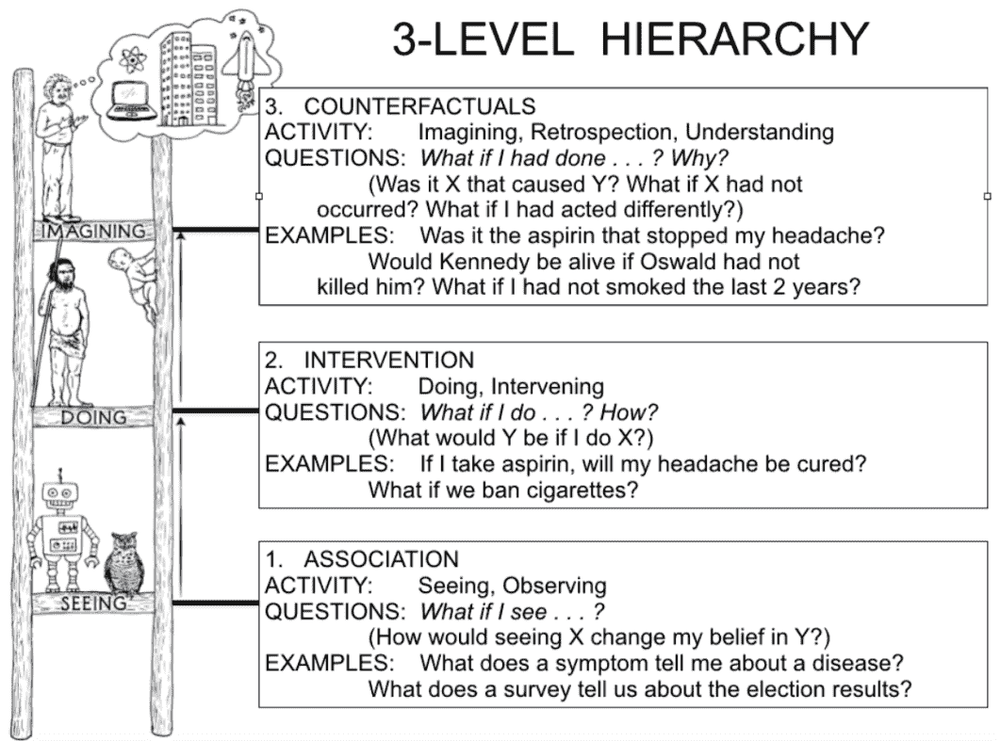

**图2：因果关系之梯**

**三级因果问题：**

第一层是关联（Association），它涉及由数据定义的统计相关性，大多数机器学习系统运行在这一层上。

第二层是干预（Intervention），不仅涉及到能看到什么，还涉及一个干预或行动将会导致什么结果。典型问题是“如果我们把价格翻倍，将会发生什么？”

第三层是反事实（Counterfactual），是对过去发生的事情的反思和溯因，典型问题是“如果过去作出不一样的行为，现在的结果会有何不同？”

**Pearl 描述了一个因果推理的三级结构****，把因果信息按其能够回答的类型进行分类。**该分类形成了一个三层的层级结构，某层的问题，只有在获取不低于该层信息时，才能够被回答。

顶层也就是反事实层是功能最强大的层次，如果我们有一个可以回答反事实问题的模型，那么我们也可以回答有关干预和观察的问题。例如，干预问题：What will happen if we double the price? 可以通过反事实问题来回答：What would happen had the price been twice its current value? 同样，一旦我们回答了干预问题，就可以回答关联问题。我们只是忽略了干预动作部分，而是让观测取代了。但是在相反的方向上，干预问题不能仅凭观测信息（也就是统计相关性）回答，涉及反思和溯因的反事实问题也不能仅用干预信息来回答。

反事实是科学思维以及法律和道德推理的基础。举个例子，在法庭判定被告是否应该负法律责任的时候，判定有罪的一个依据是 ——“若非”被告的行为，损失就很可能不会发生。“若非”的计算含义要求将现实世界与被告未发生某行为反事实世界进行比较。用个更通俗的例子来讲，已知的事实是“一个人吃了药死了”，对应的一个反事实问题是“如果此人没有吃药，不死的概率是多少？”

理解**因果推理需要抓住一个窍门，那就是区分 seeing 和 doing 的不同**，一个简单例子就是某个便利店中”观测到某商品的价格翻倍“和“店主强制让某商品价格翻倍”存在区别。Pearl 发明了 do 算子来数学化表示干预或行为，有了它我们能用数学公式区分 seeing 和 doing：

 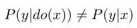

这里我们借用文献[5]中一个表格补充说明，表格的行是不同类型的问题，而列是不同类型模型：

**表1：从统计模型到因果模型，再到物理模型：**

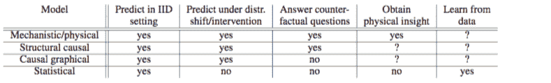

可以看到统计模型只有关联层的信息，所以只能回答相关性问题，而不能回答干预问题和反事实问题。基于图的因果贝叶斯网络因果只有干预层的信息，所以只能回答干预和关联层的问题，而不能回答反事实问题。最后基于结构的因果模型，它的能力最接近物理模型，用函数关系表示原因和结果之间的关系，三个层级的问题都能够回答。从上面的表格中可以看到因果模型是从统计模型走向物理模型的过渡。

**观测数据下的因果效应估计的方法。**当下因果建模有两个主要的框架，D.B  Rubin（1976）提出的 Potential Outcome Framework 和 Judea Pearl 的结构因果模型(SCM)。在统计和社会学等学科用得更多的是 Potential Outcome 框架，它相对于 SCM 更加简单直观。它设想了一种与观测数据相悖的情况，所以是反事实因果。因为其基本思想是对比用药或者不用药的结果，也被称为 **Experimental causality**。用该框架估计因果效应的主要困难是数据缺失，在一些假定（Ignorability）下该困难可以克服。相关不是因果，因果建模的一个重要的视角如何去除因此产生的偏差，Debias 是数据科学一个核心主题。

下面我们以新冠病毒为例来展示如何因果建模和 Debias。我们都知道意大利的新冠病毒死亡率高于中国，那么是否能够说明意大利的医疗水平低于中国呢？

因果科学的第一步是定义因果问题，把问题和已知信息转化为因果图，把影响因素作为节点，连边代表因果联系，但是困难在于确定问题的影响因素，比如这个问题，表面上看只有国家和死亡率两个因素，但有很多潜在因素，比如年龄分布、性别差异等等，这里的一个基本思是 Coarse-graining，简单来说就是把问题粗粒化，留下最重要的。在这里最终选择了国家、死亡率和年龄结构三个因素，结果如下图： 

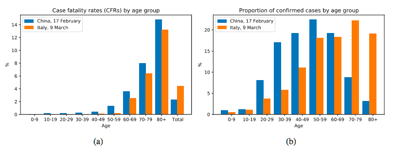

**图3：新冠病毒中意对比**

图中（a）是意大利和中国按年龄组汇总的Covid-19病死率快照，即：包括截至报告时的所有确诊病例和死亡病例（见图例）。（b）各年龄组（a）所包括病例的比例。可以看到中国和意大利的人口分布不一样，中国是 50-59 岁这个年龄段感染的人数最多，意大利是 70-79 这个年龄段感染的人数最多，在意大利容易死的都感染了，这是直观感觉的，严格回答这个问题需要因果科学。

下面来进行第二步，画出因果图。三个变量国家（Country），年龄（Age），死亡（Mortality）之间的因果模型，关注的问题是：从国家到死亡的直接因果效应是多少？

我们把国家、年龄和死亡率画在下图，C代表国家，A代表年龄，M代表死亡率，分析这个图里的因果关系，国家会影响死亡率，年龄也会影响死亡率，国家会通过年龄这个中间变量影响死亡率，这里年龄起到了中介变量的作用，如果要分析国家队死亡率的影响要阻断年龄结构的影响。

 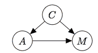

**图4：国家-年龄-死亡因果回路示意图**

第三步Do-Calculus，这里的本质就是干预，我们要求单纯国家这个因素对死亡率的影响，就要把年龄这个因素控制成一样，来求不同国家对死亡率的影响，具体做法如下：

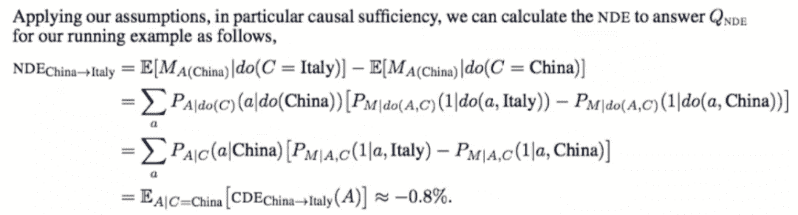

**（**点击查看大图**）**

结果得到：**国家对死亡率的直接因果效应反而是意大利比中国少 0.8%。**

接下来计算国家通过年龄而不是医疗服务对死亡率的影响是：

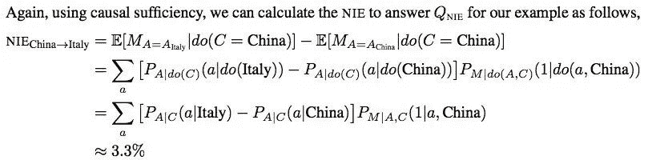

**（**点击查看大图**）**

这里我们发现**总的因果效应并不等于直接因果效应 + 间接因果效应。**

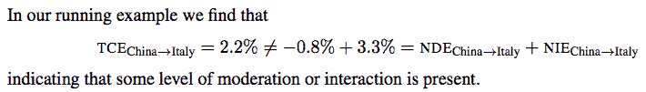

****（**点击查看大图**）****

这里 NDE（Natural direct effect）代表自然的直接效应。

**总的因果效应并不等于直接因果效应 + 间接因果效应，但线性模型的时候：总的因果效应等于直接因果效应 + 间接因果效应。**

类似的问题还有“锻炼身体是否能够是否有利于健康？”见下图，x轴表示运动时间，y轴表示胆固醇水平。

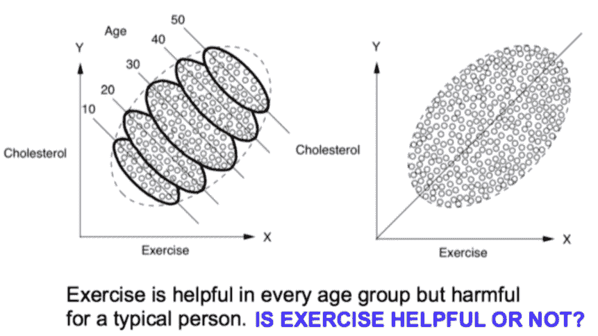

**图5：锻炼，年龄，健康之间关系**

一方面，在图（左）中，可以看到每个年龄组中都出现了向下的趋势，表明运动可能的确有降低人体胆固醇水平的效果；另一方面，在图（右）中，同样的散点图并不依据年龄对数据进行分层，那么我们就会看到一个明显向上的趋势，这表明运动得越多，人体胆固醇水平就越高，这种矛盾在统计学中被成为辛普森悖论。

回答这样的问题，首先要见一个因果模型图，年龄会影响锻炼、年龄也会影响胆固醇的水平、锻炼也会影响胆固醇水平，于是建立了一个这样的因果关系图。同时要考虑年龄的影响，所以要进行控制变量，所以把年龄考虑进去就应该是下面第一个式子所示的计算方法。

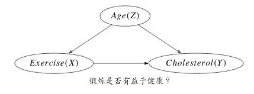

**图6：锻炼，年龄，胆固醇的因果图**

选择锻炼对健康的影响是：

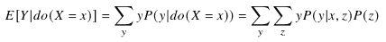

而不是：

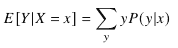

前面这两个例子都是用观测数据回答因果问题！锻炼对健康的影响，国家医疗支持对死亡率的影响。它们是两个典型的因果推理任务，对应 Pearl 的 Tool 2 和 Tool 4。

**Pearl 总结的七个因果推断工具：**

Tool 1\. Encoding causal assumptions in transparent and testable way.

Tool 2\. Predicting the effects of actions and policies.

Tool 3\. Computing counterfactuals and finding causes of effects (attribution,explanation, susceptibility).

Tool 4\. Computing direct and indirect effects (Mediation) (discrimination, inequities,fairness)

Tool 5\. Integrating data from diverse sources (external validity and selection bias).

Tool 6\. Recovering from missing data.

Tool 7\. Discovering causal relations from data

最后对数据科学中三种常见偏差做了简单介绍，包括混杂因子引起的 Confounding bias, 数据本身特点导致的 Selection bias 和 Measurement bias。

# 

****三、Causal AI****

让机器学会因果推理的是实现真正人工智能一个重要步骤。当前有很多最优秀的科学家在朝着这个方向努力，其中三个代表性研究工作者是 UCLA 教授 Judea Pearl， 马普智能所所长 Bernhard Schölkopf，Mila 所长 Yoshua Bengio。简单来说 Judea Pearl 是 Causal AI 的奠基人，Bernhard Schölkopf 等人推进了 Causality for Machine Learning，Yoshua Bengio 最近提出了 System 2 deep learning 作为 Causal AI 的一个范式。

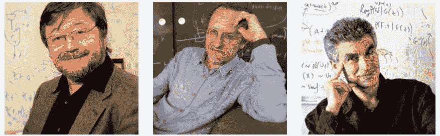

**图7：Judea Pearl, Bernhard Schölkopf, Yoshua Bengio**

**Judea Pearl ：让 AI 具备因果推理能力**

Judea Pearl 提出的小图灵测试是实现真正智能的必要条件。

对于小图灵测试，Pearl 认为关键的问题是，机器怎样才能以一种可以迅速访问必要信息、正确回答问题、并且像人类一样轻松的方式，来表征关于因果的知识？

小图灵测试本质是如何表示和高效使用因果信息来回答因果问题。而如何让机器学会因果推理？Pearl 给出了因果关系之梯来分类和识别因果问题（目前大多数机器学习系统都运行在关联层，仅仅只是曲线拟合）。提出了因果推理引擎作为回答因果的问题的范式。

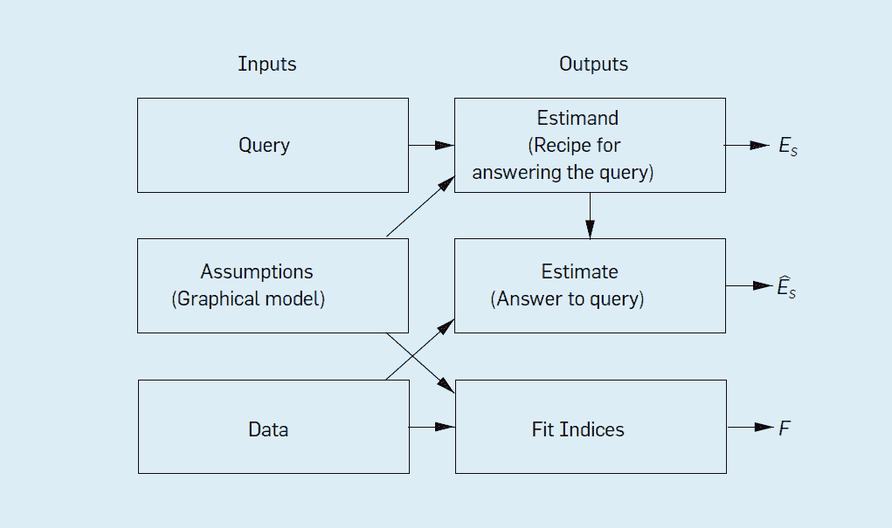

**图8：因果推理引擎**

该推理引擎将假设（以图模型的形式）、数据和 Query 作为输入，而输出是 Estimand, Estimate 和 Fit Indices。

*   估计式（Estimand） 是关注的查询（Query）的某个概率表达式，表示在已有模型假定下计算 Query 的一种方法；

*   Estimate 是用某种统计方法和已有数据对 Estimand 概率表达式的估计；

*   一组拟合指标（Fit Indices）用于衡量数据与假设的兼容程度。

第一个输出是较难理解的，如果已有模型假定下某 Query 无法回答，也就是没有对应的 Estimand，则称该 Query 为“不可识别”，Pearl 的 do-calculus 就是判断 Query 是否可识别的一个完备的演算工具。Pearl 仅用抽象的方式描述了这个推理引擎，关于该引擎如何回答因果问题，如何解决数据科学中的混杂偏差，选择偏差和迁移学习问题的细节可以参考 Elia Bareinboim 的论文《Causal Inference and Data-Fusion in Econometrics, P. Hünermund, E. Bareinboim.Dec, 2019\. 》

回答因果问题需要因果信息，当前存在多个回答因果问题的模型框架，但是回答反事实问题一般需要 Pearl 的结构因果模型（SCM），结构因果模型（SCM）由三个部分组成：图模型，结构方程以及反事实和干预逻辑。图模型是一种表示因果知识的语言，反事实和干预逻辑帮助他们阐明他们想知道的事情，结构方程将两者以扎实的语义联系在一起。

 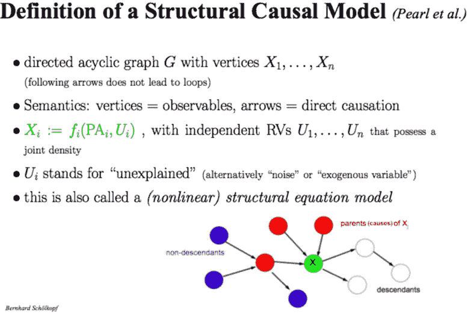

**图9：结构因果模型的定义**

下面用一个简单的例子来表示结构因果模型。草坪湿润的原因可能有：气候、下雨、洒水机作业，他们之间的因果关系是气候会影响下雨，下雨会导致湿润，气候同时也会影响洒水机作业，洒水机作业也同样会导致草坪湿润，可以得到下面的图，可以用右边的结构方程代表变量之间的作用关系，因果图中每条缺的边意味着某种条件独立性。

有了因果知识的图表示和所关注的因果问题 Q 之后，因果推理引擎中一个关键步骤是判定 Q 是否能够被回答，如果能够被回答就得到其 Estimand。此时，Pearl 的 Do-calculus 就是完成这个工作的核心工具，工具基于图准则 D-separation ：

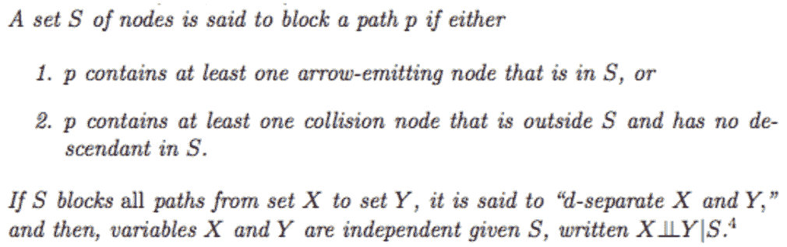

****（**点击查看大图**）****

图模型中的分离等价与概率分布中的独立性也被 Pearl 成为因果推断第二定律：

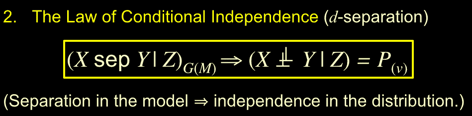

**图10：因果推断第二定律**

Do-Causalus 是得到 Estimands 的基本工具，具体来说 Do-Causalus 是关于有 do 算子的概率表达式的运算规则，涉及如何增删 Actions 和 Observations，以及他们之间的转化。

 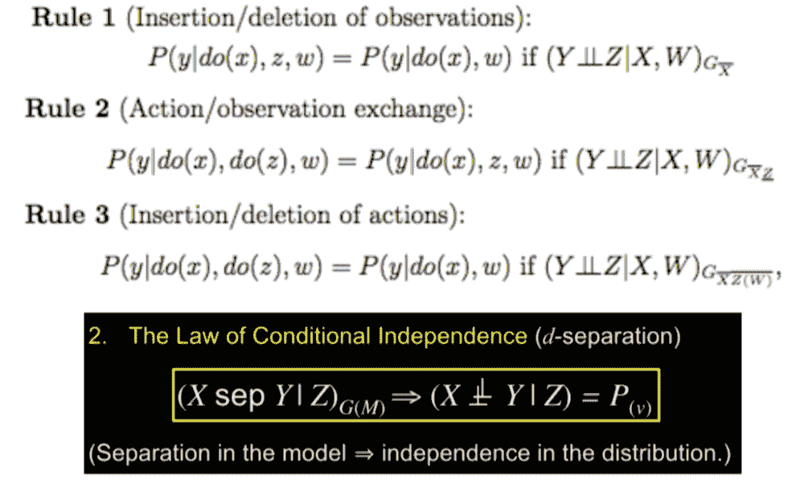

**图11：Do-Causalus ：因果推断中的微积分基本定理**

关于反事实问题的算法化，有三个步骤：

 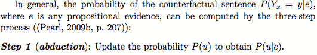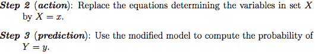

结构因果模型（SCM）是 AI 领域中用得更多的因果建模框架，那么它和当前统计和社会学科中非常流行的 Pontential Outcome 框架有什么关系呢？

*   关于因果的理解有些区别，结构因果模型是干预主义因果，用函数来表示因果关系；Pontential Outcome 通常关注吃药或者不吃药的对比，也被称为实验主义因果。

*   SCM 是回答反事实问题的框架，而 Potential Outcome 一般回答干预层的问题。

*   反事实基本定律 将 SCM 和 Pontential Outcome联系起来。

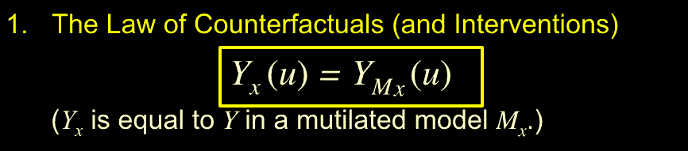

**图12：反事实基本定律**

Mx干预后的模型，Yx表示反事实。**SCM中使用函数关系描述因果关系是一个重大进步，避免了用条件概率表示因果关系时候的认知论上的困难，是其能回答反事实问题的关键因素。**

## 

**Bernhard 与 Bengio：因果结合机器学习**

Pearl 指出了 Causal AI 的目的是让机器学会因果推理，通过小图灵测试，给出因果推理引擎范式，Bernhard Schölkopf 及其团队在推进 Causal  AI  方面作出了非常多的工作。

 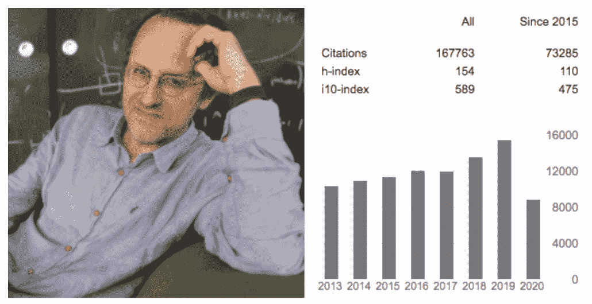

**图13：Bernhard Schölkopf 及其 Google Scholar**

他写的这篇论文《Causality for Machine Learning》总结了其主要成果，并且该论文被 Pearl 亲自点赞，主要内容如下：

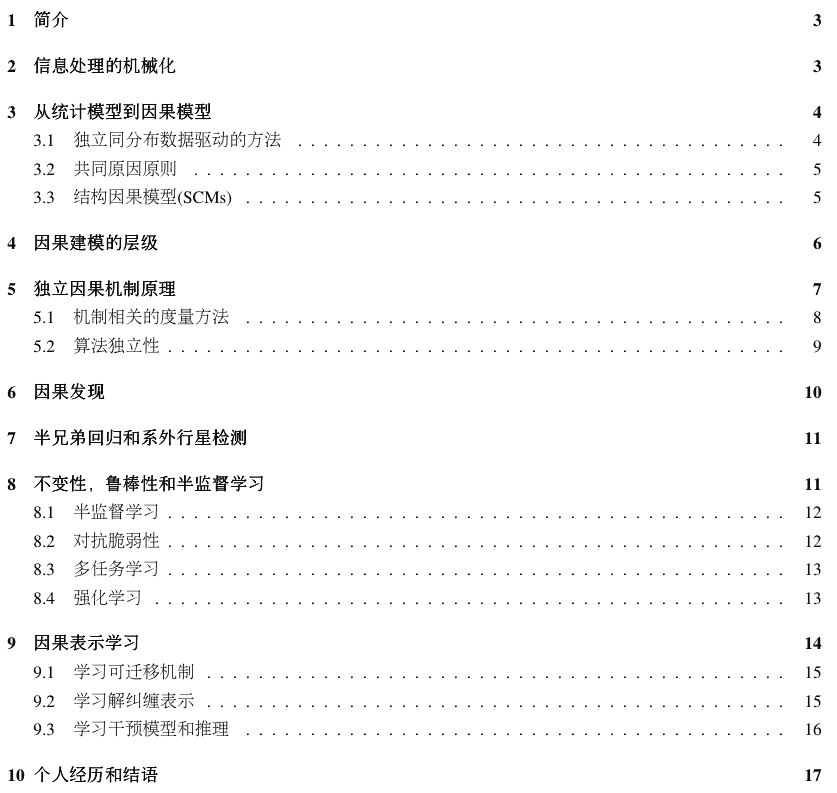

摘要中主要介绍了：机器学习中的许多开放性难题本质与因果相关，例如从问题到问题的迁移能力，而当前大多数 AI 系统主要运行在关联层，仅仅只是曲线拟合。

而在第二章信息处理的机械化中讲述了人类两次工业革命的本质是关于产生和转化能量，这次信息革命类似的是关于产生和转化能量，像能量一样，信息也将是一种货币。我们当前对信息的理解并不完全，信息革命带我们走向何方？我们很难知道。

在第三章从统计模型到因果模型中讲述了当前大多数 AI 系统仅仅只是曲线拟合，依赖于独立同分布假设，当前的许多实践以及大多数理论结果都未能解决跨问题泛化的问题，独立同分布假设是有问题的。如果对这部分感兴趣，可以参考：

AAA-Why 2019 https://why19.causalai.net/

在第四章介绍了因果建模的层级，可以看到统计模型只有关联层的信息，所以只能回答相关性问题，而不能回答干预问题和反事实问题。基于图的因果贝叶斯网络只有干预层的信息，所以只能回答干预和关联层的问题，而不能回答反事实问题。最后基于结构的因果模型，它的能力最接近物理模型，用函数关系表示原因和结果之间的关系，三个层级的问题都能够回答。从下面表格中可以看到因果模型是从统计模型走向物理模型的过渡。

**表2：因果模型是从统计模型走向物理模型的过渡：**

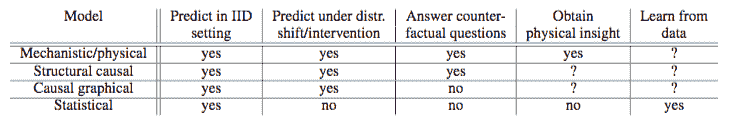

还有一些其它内容感兴趣可以详细阅读一下，如：独立因果机制原则（Independent Causal Mechanisms （ICM）Principle）、 因果具有不变性、因果发现、半兄弟回归和系外行星检测（应用案例）、因果表示学习（从数据点中学习变量）。

**Bernhard Schölkopf 个人因果研究经验也非常值得一提**，尤其是他和 Judea Pearl, Yoshua Bengio 的互动。

2001，第一次听到 Judea Pearl 报告。2004，研究因果始于 Dominik Janzing 及其学生 Xiaohai Sun，组成了强大的因果研究团队，其研究是当前因果结合机器学习的最前沿进展。Schölkopf 对 Pearl的评价和印象非常值得注意，下面是文章他亲自介绍与 Pearl 碰撞的原文：

*   I recall his talk, formalizing an area of scientific inquiry that I had previously considered solidly part of the realm of philosophy.

*   Judea Pearl, another giant of our still young field of AI.

*   Judea left me with a lasting impression as someone who has mastered not just technicalities, but has gained access to profound philosophical understanding.

总结来说是 Pearl 在把哲学问题科学化，是 AI 领域的巨人，不仅仅有技术而且有深刻哲学思想。在 CIFAR 项目中开始 Yoshua Bengio 的合作，并且开始达成了有关因果的共识。原文如下：

*   I recall a number of discussions with Yoshua Bengio when I was a member of the review panel and advisory board of the CIFAR program.

*   Our opinions have since then converged, and research has started to appear that combines both fields.

后来 Bernhard Schölkopf & Yoshua Bengio 合作一些论文，包括 Bengio et al., 2019; Goyal et al., 2019; Locatello et al., 2018a; Suter et al., 2018; Goudet et al., 2017。并且共同参与了许多因果推理研究科研活动，例如：

1.  Beyond Curve Fitting: Causation, Counterfactuals, and Imagination-based AI， AAAI Spring Symposium, March 25-27, 2019, Stanford, CA 

    https://why19.causalai.net/

2.  The Machine Learning Summer School 28 June - 10 July 2020 (virtual) by the Max Planck Institute for Intelligent Systems, Tübingen, Germany 

Yoshua Bengio 因其在深度学习方面的贡献和 Yahn Lecun, Geoffrey Hinton 一起获得了 2019 图灵奖。最近几年，也就是 CIFAR 项目与 Bernhard Schölkopf 共事过程中，他们慢慢达成了 AI 需要学会因果推理的共识。

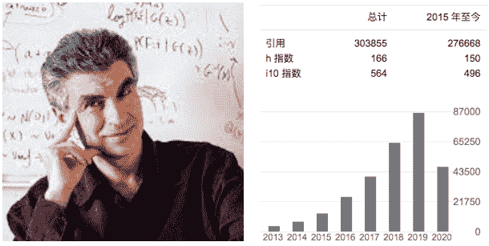

**图14：Yoshua Bengio 及其 Google Scholar**

以下是他近期的部分因果推理有关论文：

*   Javed K, White M, Bengio Y. Learning Causal Models Online[J]. arXiv preprint arXiv:2006.07461, 2020.

*   Priol R L, Harikandeh R B, Bengio Y, et al. An Analysis of the Adaptation Speed of Causal Models[J]. arXiv preprint arXiv:2005.09136, 2020.

*   Ke N R, Bilaniuk O, Goyal A, et al. Learning neural causal models from unknown interventions[J]. arXiv preprint arXiv:1910.01075, 2019.

*   Bengio Y, Deleu T, Rahaman N, et al. A meta-transfer objective for learning to disentangle causal mechanisms[J]. arXiv preprint arXiv:1901.10912, 2019.

*   Goyal A, Lamb A, Hoffmann J, et al. Recurrent independent mechanisms[J]. arXiv preprint arXiv:1909.10893, 2019.

我们来看看 Bengio 的个人主页关于其当前研究兴趣的描述，见：

https://yoshuabengio.org/research/

*   how to go **beyond the iid hypothesis **(and more generally the assumption that the test cases come from the same distribution as the training set), so we can build more versatile AIs robust to changes in their environment.

*   a hypothesis I explore is that an important ingredient to achieve this kind of out-of-distribution robustness is the kind of systematic generalization which system 2 (i.e., conscious) processing provides to humans. 

*   **causal learning** (i.e. figuring out what are the causal variables and how they are causally related), as this is a crucial part of understanding how the world works,

*   modularizing knowledge so it can be factorized into pieces that can be **re-used for fast transfer **and adaptation,

*   how agents can purposefully **act to better understand **their environment and seek knowledge, i.e., actively explore to learn,

*   **grounded language learning**, as well as how neural networks could tackle system 2 cognitive tasks (such as reasoning, planning, imagination, etc) and how that can help a learner figure out high-level representations on both the perception and action sides.

对比《思考：快与慢》书籍中的人脑的快系统和慢系统，他最近提出了一个类似人脑慢系统的 System 2 Deep Learning，做为一个目标为人类水平智能的范式，将因果推理能力的内容作为其核心组件。详情见：

https://drive.google.com/file/d/1UT118pX3DzePaEEwj1tlaznqwHICSzhG/view

 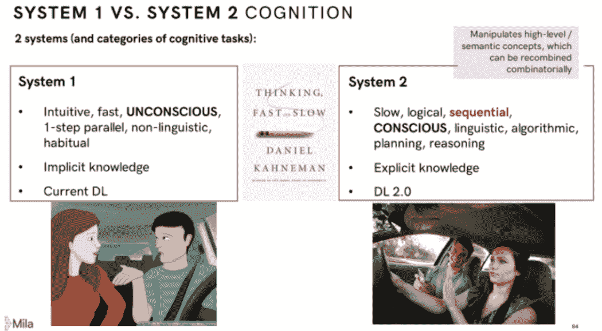

**图15: System 2 Deep Learning**

Bengio 指出人的认知系统包含两个子系统：System1是直觉系统，主要负责快速、无意识、非语言的认知，这是目前深度学习主要做的事情；System2是逻辑分析系统，是有意识的、带逻辑、规划、推理以及可以语言表达的系统，这是未来深度学习需要着重考虑的。

****四、总结****

因果科学是回答因果问题的学科，其当前相对零碎的数学基础正在走向统一方便交流和理论聚焦。Pearl 的因果关系之梯帮助科学家识别和分类因果问题，而因果推理引擎提供了一个回答因果问题的一般范式。因果革命正在改变整个数据科学，帮助解决混杂偏差，选择偏差和测量偏差等问题。AI 中的开放性难题，例如从一个问题的另一个问题的泛化能力，本质都和因果密切相关，会因果推理的 Causal AI 将助力解决相关开放性难题。本次分享也重点介绍了中国意大利新冠死亡率的案例分析，用该例子帮助大家理解因果推理。

“干货学习，**点****赞****三连**↓