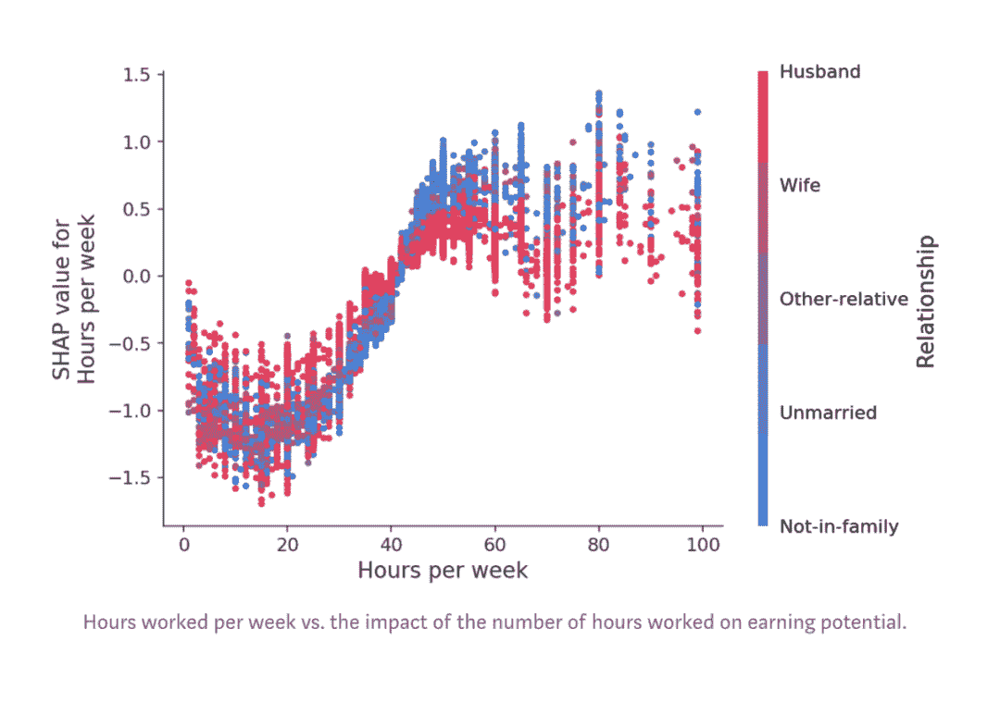

 Datawhale干货 

**来源：Scott Lundberg，来源：数据派THU**

本文长度为****4300字****，建议阅读****8分钟****

本文为大家介绍用XGBoost解释机器学习。

这是一个故事，关于错误地解释机器学习模型的危险以及正确解释所带来的价值。如果你发现梯度提升或随机森林之类的集成树模型具有很稳定的准确率，但还是需要对其进行解释，那我希望你能从这篇文章有所收获。

假定我们的任务是预测某人的银行财务状况。模型越准确，银行就越赚钱，但由于该预测要用于贷款申请，所以我们必须要提供预测背后的原因解释。在尝试了几种类型的模型之后，我们发现XGBoost实现的梯度提升树能提供最佳的准确率。不幸的是，很难解释为何XGBoost做出某个决策，所以我们只有两种选择：要么退回到线性模型，要么搞清楚如何解释XGBoost模型。没有数据科学家愿意在准确率上让步，于是我们决定挑战自己，去解释复杂的XGBoost模型（本例中，是6棵深达1247层的树）。

## **经典的全局特征重要性度量**

首先一个显而易见的选择是使用XGBoost中Python接口提供的plot_importance()方法。它给出一个简单明了的柱状图，表示数据集中每个特征的重要性（复现结果的代码在Jupyter notebook中）。

图：该模型在经典的成人普查数据集上被训练用于预测人们是否会报告超过5万美元的收入（使用logistic loss），上图是执行xgboost.plot_importance(model)的结果

仔细看一下XGBoost返回的特征重要性，我们发现年龄在所有特征中占统治地位，成为收入最重要的预测指标。我们可以止步于此，向领导报告年龄这个直观且让人满意的指标是最重要的特征，紧随其后的是每周工作时长和受教育程度这些特征。但是，作为一名好的数据科学家，我们查询了一下文档，发现在XGBoost中衡量特征重要性有3个选项：

1\. **Weight**。某个特征被用于在所有树中拆分数据的次数

2\. **Cover**。同上，首先得到某个特征被用于在所有树中拆分数据的次数，然后要利用经过这些拆分点的训练数据数量赋予权重

3\. **Gain**。使用某个特征进行拆分时，获得的平均训练损失减少量

这些是在任何基于树的建模包中都能找到的重要性度量。Weight是默认选项，因此我们也试试另外两种方法，看看有何不同：

图：运行xgboost.plot_importance,并使用参数 importance_type=’cover’和’gain’的结果

结果令人诧异，对于XGBoost提供的3个选项，特征重要性的排序都大不相同。对于cover方法，资本收益似乎是收入最重要的预测指标，而对于gain方法，关系状态特征独占鳌头。不知道哪种方法最好的情况下，依靠这些度量来报告特征重要性，这很让人不爽。

## **什么因素决定了特征重要性度量的好坏？**

如何比较两种特征归因（feature attribution）方法并不明显。我们可以在诸如数据清洗，偏差检测等任务上测量每种方法的最终用户性能。但这些任务仅仅是特征归因方法质量的间接度量。这里，定义两个我们认为任何好的特征归因方法都应遵循的属性：

1.** 一致性**（Consistency）。当我们更改模型以使其更多依赖于某个特征时，该特征的重要性不应该降低。

2. **准确性**（Accuracy）。所有特征重要性的和应该等于模型的总体重要性。例如，如果重要性由R^2值来衡量，则每个特征的归因值加起来应该等于整个模型的R^2。

如果一致性不满足，那我们就无法比较任意两个模型的特征重要性，因为此时分配到更高的归因并不意味着模型对此特征有更多依赖。

如果准确性不满足，那我们就不知道每个特征的归因是如何合并起来以代表整个模型的输出。我们不能简单的对归因进行归一化，因为这可能会破坏该方法的一致性。

## **当前的归因方法是否一致且准确？**

回到之前银行数据科学家的工作。我们意识到一致性和准确性很重要。实际上，如果一个方法不具备一致性，我们就无法保证拥有最高归因的特征是最重要的特征。因此，我们决定使用两个与银行任务无关的树模型来检查各个方法的一致性：

图：在两个特征上的简单树模型。咳嗽显然在模型B中比模型A中更重要。

模型的输出是根据某人的症状而给出的风险评分。模型A仅仅是一个用于发烧和咳嗽两个特征的简单“and”函数。模型B也一样，只不过只要有咳嗽症状，就加10分。为了检查一致性，我们需要定义“重要性”。此处，我们用两种方式定义重要性：

1) 作为当我们移除一组特征时，模型预期准确率的变化。

2) 作为当我们移除一组特征时，模型预期输出的变化。

第一个定义度量了特征对模型的全局影响。而第二个定义度量了特征对单次预测的个性化影响。在上面简单的树模型中，当发烧和咳嗽同时发生时对于两种定义，咳嗽特征在模型B中明显都更重要。

银行例子中的Weight，cover和gain方法都是全局特征归因方法。当在银行部署模型时，我们还需要针对每个客户的个性化说明。为了检查一致性，我们在简单的树模型上运行6种不同的特征归因方法：

1. **Tree SHAP**。我们提出的一种新的个性化度量方法。

2.** Saabas**。一种个性化的启发式特征归因方法。

3. **Mean****( |Tree SHAP| )**。基于个性化Tree SHAP平均幅度的一种全局归因方法。

4. **Gain**，上述XGBoost使用的相同方法，等同于scikit-learn树模型中使用的Gini重要性度量。

5. **拆分次数(Split Count)**。代表XGBoost中紧密相关的’weight’和’cover’方法，但使用’weight’方法来计算。

6. **排列（Permutation）**。当在测试集中随机排列某个特征时，导致模型准确率的下降。

图：使用6种不同方法对模型A和B做特征归因。截止发文时间，这些方法代表了文献中所有关于树模型的特征归因方法。

从图上可知，除了permutation方法外，其余方法都是不一致的。因为它们在模型B中比在模型A中给咳嗽分配的重要性更少。不一致的方法无法被信任，它无法正确地给最有影响力的特征分配更多的重要性。细心的读者会发现，之前我们在同一模型上使用经典的归因方法产生矛盾时，这种不一致已经显现。对于准确性属性呢？事实证明，Tree SHAP，Sabaas和 Gain 都如先前定义的那样准确，而permutation和split count却不然。

令人惊讶的是，诸如gain(Gini重要性)之类广泛使用的方法居然会导致如此明显的不一致。为了更好地理解为何会发生这种情况，我们来仔细看看模型A和B中的gain是如何计算的。简单起见，我们假设每个叶子节点中落有25%的数据集，并且每个模型的数据集都具有与模型输出完全匹配的标签。

如果我们用均方误差MSE作为损失函数，则在模型A中进行任何拆分之前，MSE是1200。这是来自恒定平均预测20的误差。在模型A中用发烧特征拆分后，MSE降到了800，因此gain方法将此400的下降归因于发烧特征。然后用咳嗽特征再次拆分，会得到MSE为0，gain方法会把这次800的下降归因于咳嗽特征。同理，在模型B中，800归因于发烧，625归因于咳嗽。

图：模型A和模型B的gain（又称基尼重要性）得分计算。

通常，我们期望靠近树根的特征比叶子节点附近的特征更重要（因为树就是贪婪地被构造的）。然而gain方法偏向于将更多的重要性归因于较低的拆分。这种偏见导致了不一致性，即咳嗽应该更重要时（在树根处拆分），给它归因的重要性实际却在下降。个性化的Saabas方法（被treeinterpreter包所使用）在我们从上到下遍历树时计算预测的差异，它也同样受偏见影响，即偏向较低的拆分。随着树加深，这种偏见只会加剧。相比之下，Tree SHAP方法在数学上等价于对特征所有可能的排序上的预测差异求均值，而不仅仅是按照它们在树中的位置顺序。

只有Tree SHAP既一致又准确这并不是巧合。假设我们想要一种既一致又准确的方法，事实证明只有一种分配特征重要性的方法。详细介绍在我们最近的NIPS论文中，简单来讲，从博弈论中关于利润公平分配的证明引出了机器学习中特征归因方法的唯一结果。在劳埃德·沙普利（Lloyd Shapley）于1950年代推导出它们之后，这些唯一的值被称为沙普利值（Shapley values）。我们在这里使用的SHAP值是把与Shapley值相关的几种个性化模型解释方法统一而来的。Tree SHAP是一种快速算法，可以精确地在多项式时间内为树计算SHAP值，而不是在传统的指数运行时间内（请参阅arXiv）。

## **充满信心地解释我们的模型**

扎实的理论依据和快速实用的算法相结合，使SHAP值成为可靠地解释树模型（例如XGBoost的梯度提升机）的强大工具。有了这个新方法，让我们回到解释银行XGBoost模型的任务：

 图：全局Mean( |Tree SHAP| )方法应用到收入预测模型上。x轴是当某个特征从模型中’隐藏’时模型输出的平均幅度变化（对于此模型，输出具有log-odds单位）。详细信息，请参见论文。但是“隐藏”是指将变量集成到模型之外。由于隐藏特征的影响会根据其他隐藏特征而变化，因此使用Shapley值可迫使一致性和准确性。

图上可看出，关系特征实际上是最重要的，其次是年龄特征。由于SHAP值保证了一致性，因此我们无需担心之前在使用gain或split count方法时发现的种种矛盾。不过，由于我们现在有为每个人提供的个性化说明，我们还可以做的更多，而不只是制作条形图。我们可以在数据集中给每个客户绘制特征重要性。shap Python包使此操作变得容易。我们首先调用shap.TreeExplainer（model）.shap_values（X）来解释每个预测，然后调用shap.summary_plot（shap_values，X）来绘制以下解释：

图：每个客户在每一行上都有一个点。点的x坐标是该特征对客户模型预测的影响，而点的颜色表示该特征的值。不在行上的点堆积起来显示密度（此示例中有32,561个客户）。由于XGBoost模型具有logistic loss，因此x轴具有log-odds单位（Tree SHAP解释了模型的边距输出变化）。

这些特征按mean（| Tree SHAP |）排序，因此我们再次看到关系这个特征被视为年收入超过5万美元的最强预测因子。通过绘制特征对每个样本的影响，我们还可以看到重要的异常值影响。例如，虽然资本收益并不是全局范围内最重要的特征，但对于部分客户而言，它却是最重要的特征。按特征值着色为我们显示了一些模式，例如，年纪较浅会降低赚取超过 5万美元的机会，而受高等教育程度越高，赚取超过5万美元的机会越大。

我们可以停下来将此图展示给老板，但这里咱们来更深入地研究其中一些特征。我们可以通过绘制年龄SHAP值（log odds的变化）与年龄特征值的关系来实现：

 图：y轴是年龄特征改变多少每年赚取5万美元以上的log odds。x轴是客户的年龄。每个点代表数据集中的一个客户。

在这里，我们看到了年龄对对收入潜力的明显影响。请注意，与传统的部分依赖图（其显示当更改特征值时的平均模型输出）不同，这些SHAP依赖图显示了相互影响。即使数据集中的许多人是20岁，但年龄对他们的预测的影响程度却有所不同，正如图中20岁时点的垂直分散所示。这意味着其他特征正在影响年龄的重要性。为了了解可能是什么特征在影响，我们用受教育的年限给点涂上颜色，并看到高水平的教育会降低20岁时的年龄影响，而在30岁时会提高影响：

图：y轴是年龄特征改变多少每年赚取5万美元以上的log odds。x轴是客户的年龄。Education-Num是客户已接受的教育年限。

如果我们对每周的工作小时数做另一个依赖图，我们会发现，多投入时间工作的好处在每周约50个小时时达到瓶颈，而如果你已婚，则额外工作不太可能代表更高收入：

图：每周工作时间与工作时间数对收入潜力的影响。

## **解释你自己的模型**

这篇文章整个分析过程旨在模拟你在设计和部署自己的模型时可能要经历的过程。shap包很容易通过pip进行安装，我们希望它可以帮助你放心地探索模型。它不仅包含本文涉及的内容，还包括SHAP交互值，模型不可知的SHAP值估算，以及其他可视化。还有很多notebooks来展示在各种有趣的数据集上的各种功能。例如，你可以在一个notebook中根据体检报告数据来分析你将来最可能的死亡原因，这个notebook解释了一个XGBoost死亡率模型。对于Python以外的其他语言，Tree SHAP也已直接合并到核心XGBoost和LightGBM软件包中。

“干货学习，**点****赞****三连**↓