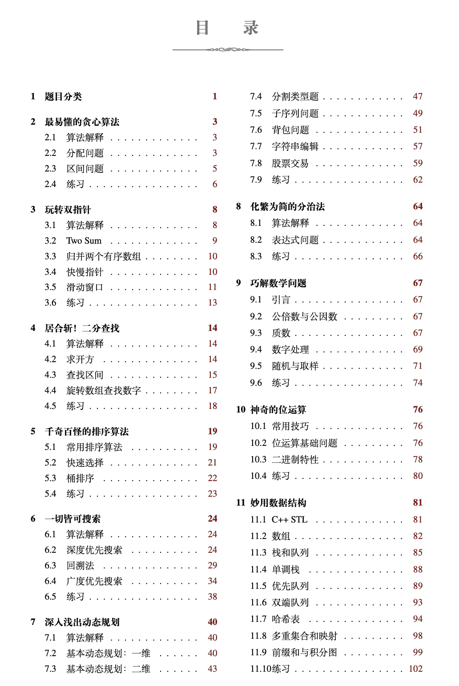
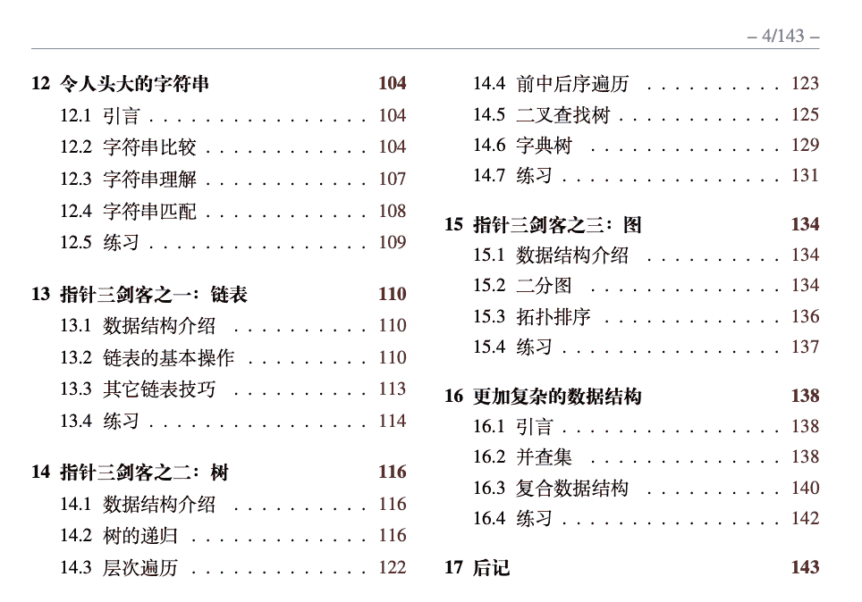
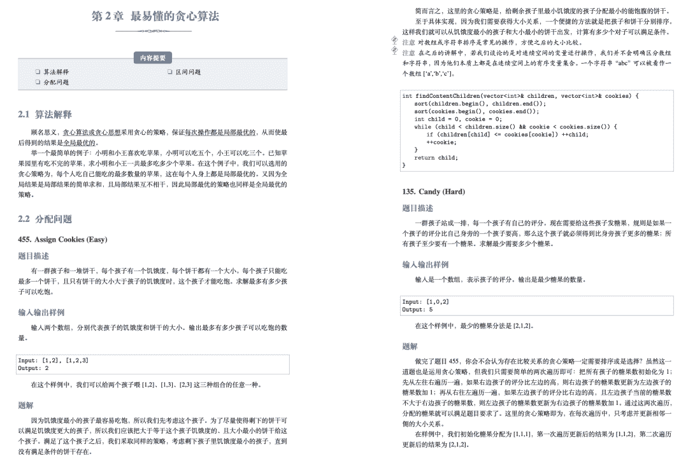
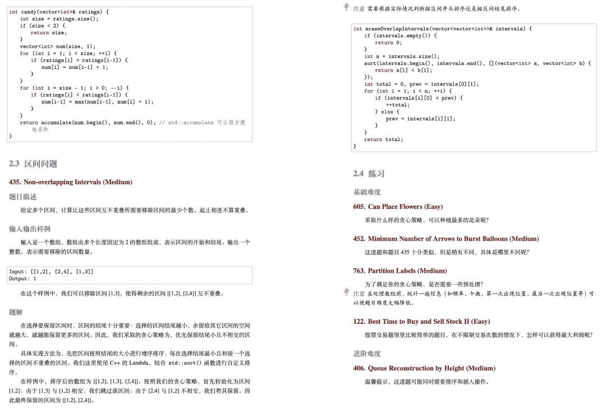

↑↑↑关注后"星标"Datawhale

每日干货 & [每月组队学习](https://mp.weixin.qq.com/mp/appmsgalbum?__biz=MzIyNjM2MzQyNg%3D%3D&action=getalbum&album_id=1338040906536108033#wechat_redirect)，不错过

 Datawhale资源 

**笔记推荐人：公子龙，Datawhale伙伴**

高畅现在是谷歌无人车部门（Waymo）的工程师，从事计算机视觉和机器学习方向。

他在美国卡内基梅隆大学攻读硕士学位时，为了准备实习秋招，他从夏天开始整理 Leetcode 上的题目，几个月的时间，刷了几百道题目。

凭借着扎实的基础和长期的勤奋，他很快找到了如愿的工作。

入职前，闲暇的时候，他突然想到，自己刷了那么多题，而且对很多题目的解法有着总结，为何不把这些题目归纳总结一些，做成一个便于后来者阅读学习的电子书呢？

有了想法，作为行动派的他说干就干，于是这样一本制作精美且免费开源的书籍出现在大家面前。

引用他的话来说：

> 本书分为算法和数据结构两大部分，又细分了十五个章节，详细讲解了刷LeetCode时常用的技巧。我把题目精简到了101道，一是呼应了本书的标题，二是不想让读者阅读和练习时间过长。
> 
> 这么做不太好的一点是，如果只练习这101道题，读者可能对算法和数据结构的掌握不够扎实。因此在每一章节的末尾，我都加上了一些推荐的练习题，并给出了一些解法提示，希望读者在理解每一章节后把练习题也完成。

整本书，我仔细看了一遍，并对书中的一些解题思路和代码进行校验。

从我的直观感受来说，这是一本用心的数据结构算法类书籍，全书总共 143 页篇幅，详细讲解算法的内容有十五个章节。

每个章节都是一些重要的知识点，伴有基础讲解和例题介绍，当然，也有一些推荐的练习题。

话不多说，让我们来看一下书的目录：

第二章是讲解贪心算法的，我们摘取一些内容查看，发现对知识点的讲解介绍是细致入微的。

为了方便读者，我已经将开源电子书下载后上传到百度云盘，

**获取方式**

第 1 步：扫码关注「**公子龙**」公众号

第 2 步：回复数字 007 即可获取资料