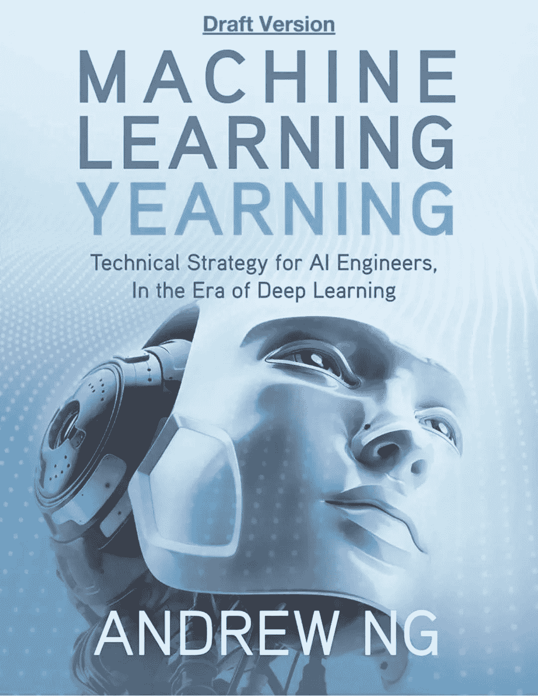
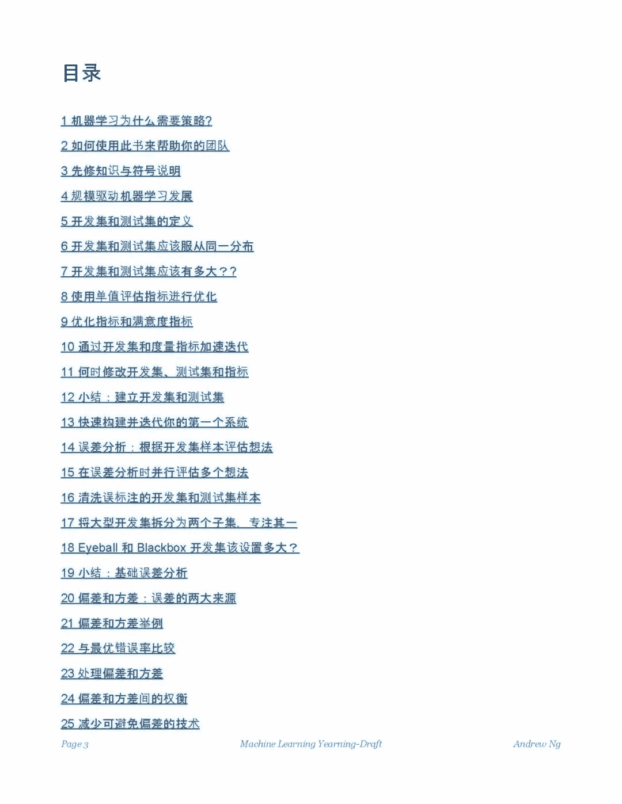
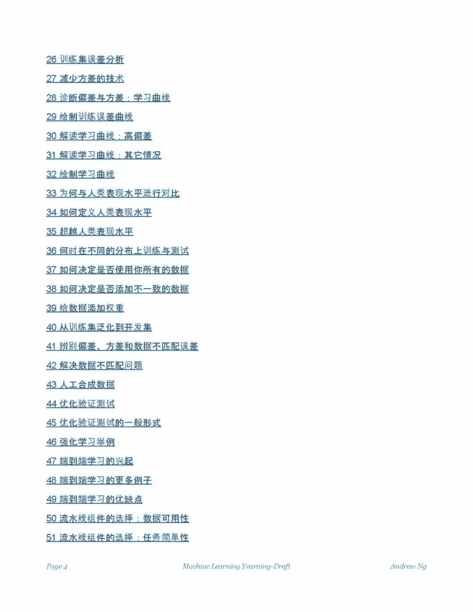
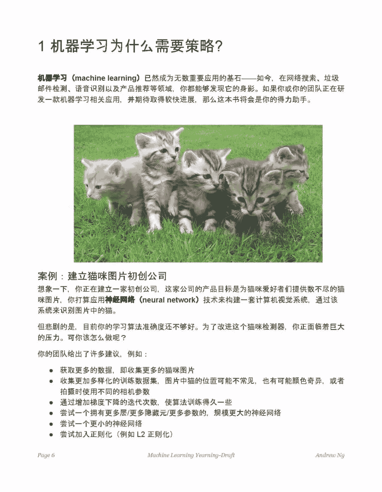

↑↑↑关注后"星标"Datawhale

每日干货 & [每月组队学习](https://mp.weixin.qq.com/mp/appmsgalbum?__biz=MzIyNjM2MzQyNg%3D%3D&action=getalbum&album_id=1338040906536108033#wechat_redirect)，不错过

 Datawhale资源 

**推荐人：GithubDaily，Datawhale伙伴**

**《Machine Learning Yearning》**是吴恩达历时两年，根据自己多年实践经验整理出来的一本机器学习、深度学习实践经验宝典。

里面讲的机器学习课程比较浅显易懂，很适合数学基础不是很好的人自学，最近中文版也开放下载阅读了。

扫码并关注下方二维码，后台回复 ”******1000******“ 获取 PDF：

????长按上方二维码 2 秒

回复「********1000********」即可获取资料