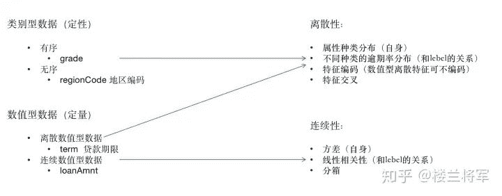

↑↑↑关注后"星标"Datawhale

每日干货 & [每月组队学习](https://mp.weixin.qq.com/mp/appmsgalbum?__biz=MzIyNjM2MzQyNg%3D%3D&action=getalbum&album_id=1338040906536108033#wechat_redirect)，不错过

 Datawhale干货 

**作者：陶旭东，北京师范大学，Datawhale成员**

## 一、背景介绍

本文以天池的金融风控赛为背景，梳理了金融风控的整个实践流程，帮助大家避坑学习。赛事的场景是个人信贷，要求选手根据贷款申请人的数据信息预测其是否有违约的可能，以此判断是否通过此项贷款，这个问题在现实的风控场景中很常见，属于典型的分类问题。另外，准入模型，评分卡模型皆是属于这个范畴。


## 二、数据概况

数据下载地址：https://tianchi.aliyun.com/competition/entrance/531830/information（阿里天池-金融风控赛事）

本次数据训练集80万数据，测试集20万数据。原始特征47维，其中匿名特征15个。详细字段如下：

```
- id	为贷款清单分配的唯一信用证标识
- loanAmnt	贷款金额
- term	贷款期限（year）
- interestRate	贷款利率
- installment	分期付款金额
- grade	贷款等级
- subGrade	贷款等级之子级
- employmentTitle	就业职称
- employmentLength	就业年限（年）
- homeOwnership	借款人在登记时提供的房屋所有权状况
- annualIncome	年收入
- verificationStatus	验证状态
- issueDate	贷款发放的月份
- purpose	借款人在贷款申请时的贷款用途类别
- postCode	借款人在贷款申请中提供的邮政编码的前3位数字
- regionCode	地区编码
- dti	债务收入比
- delinquency_2years	借款人过去2年信用档案中逾期30天以上的违约事件数
- ficoRangeLow	借款人在贷款发放时的fico所属的下限范围
- ficoRangeHigh	借款人在贷款发放时的fico所属的上限范围
- openAcc	借款人信用档案中未结信用额度的数量
- pubRec	贬损公共记录的数量
- pubRecBankruptcies	公开记录清除的数量
- revolBal	信贷周转余额合计
- revolUtil	循环额度利用率，或借款人使用的相对于所有可用循环信贷的信贷金额
- totalAcc	借款人信用档案中当前的信用额度总数
- initialListStatus	贷款的初始列表状态
- applicationType	表明贷款是个人申请还是与两个共同借款人的联合申请
- earliesCreditLine	借款人最早报告的信用额度开立的月份
- title	借款人提供的贷款名称
- policyCode	公开可用的策略_代码=1新产品不公开可用的策略_代码=2
- n系列匿名特征	匿名特征n0-n14，为一些贷款人行为计数特征的处理 
```

## 三、数据分析：

数据探索性分析即我们常说的EDA过程，此过程以了解数据，熟悉数据，为后续的特征工程做准备为目的。需要了解整个数据集的基本情况（缺失值，异常值），变量间的相互关系、变量与预测值之间的存在关系，为特征工程做准备。


### 3.1 使用pandas读取训练集和测试集文件,并使用其进行处理

```
data_train = pd.read_csv('./train.csv')
data_test_a = pd.read_csv('./testA.csv') 
```

读取文件的拓展知识:

1.  pandas读取数据时相对路径载入报错时，尝试使用os.getcwd()查看当前工作目录。

2.  TSV与CSV的区别：

*   从名称上即可知道，TSV是用制表符（Tab,'\t'）作为字段值的分隔符；CSV是用半角逗号（','）作为字段值的分隔符；

*   Python对TSV文件的支持：

*   Python的csv模块准确的讲应该叫做dsv模块，因为它实际上是支持范式的分隔符分隔值文件（DSV，delimiter-separated values）的。

*   delimiter参数值默认为半角逗号，即默认将被处理文件视为CSV。当delimiter='\t'时，被处理文件就是TSV。

1.  读取文件的部分（适用于文件特别大的场景）

*   通过nrows参数，来设置读取文件的前多少行，nrows是一个大于等于0的整数。

*   分块读取

### 3.2 查看数据集的样本个数和原始特征维度

```
data_test_a.shape
Out [53]:(200000, 48)
data_train.shape
Out [53]:(800000, 47) 
```

查看所有列：

```
data_train.columns
Index(['id', 'loanAmnt', 'term', 'interestRate', 'installment', 'grade',
       'subGrade', 'employmentTitle', 'employmentLength', 'homeOwnership',
       'annualIncome', 'verificationStatus', 'issueDate', 'isDefault',
       'purpose', 'postCode', 'regionCode', 'dti', 'delinquency_2years',
       'ficoRangeLow', 'ficoRangeHigh', 'openAcc', 'pubRec',
       'pubRecBankruptcies', 'revolBal', 'revolUtil', 'totalAcc',
       'initialListStatus', 'applicationType', 'earliesCreditLine', 'title',
       'policyCode', 'n0', 'n1', 'n2', 'n2.1', 'n4', 'n5', 'n6', 'n7', 'n8',
       'n9', 'n10', 'n11', 'n12', 'n13', 'n14'],
      dtype='object') 
```

通过info()来熟悉数据类型：


总体粗略的查看数据集各个特征的一些基本统计量：


### 3.3 查看缺失值

```
print(f'There are {data_train.isnull().any().sum()} columns in train dataset with missing values.') 
```

There are 22 columns in train dataset with missing values.

了解哪些列存在 “nan”, 并可以把nan的个数打印，主要的目的在于 nan存在的个数是否真的很大，如果很小一般选择填充，如果使用lgb等树模型可以直接空缺，让树自己去优化，但如果nan存在的过多、可以考虑删掉。

### 3.4 查看异常值

**3.4.1 检测异常的方法一：均方差**

在统计学中，如果一个数据分布近似正态，那么大约 68% 的数据值会在均值的一个标准差范围内，大约 95% 会在两个标准差范围内，大约 99.7% 会在三个标准差范围内。

```
def find_outliers_by_3segama(data,fea):
    data_std = np.std(data[fea])
    data_mean = np.mean(data[fea])
    outliers_cut_off = data_std * 3
    lower_rule = data_mean - outliers_cut_off
    upper_rule = data_mean + outliers_cut_off
    data[fea+'_outliers'] = data[fea].apply(lambda x:str('异常值') if x > upper_rule or x < lower_rule else '正常值')
    return data 
```

**3.4.2检测异常的方法二：箱型图**

总结一句话：四分位数会将数据分为三个点和四个区间，IQR = Q3 -Q1，下触须=Q1 − 1.5* IQR，上触须=Q3 + 1.5* IQR；

### 3.5 查看特征的数值类型



特征一般都是由类别型特征和数值型特征组成，类别型特征有时不仅仅代表特征属性不同的一个分类，有时各个属性之间还具有数值关系。比如特征‘grade’中的属性为等级A，B，C等，不同的类别属性A,B,C之间和逾期率是正比关系的。

数值型特征本是可以直接入模的，但往往风控人员要对其做分箱，转化为WOE编码进而做标准评分卡等操作。从模型效果上来看，特征分箱主要是为了降低变量的复杂性，减少变量噪音对模型的影响，从而使模型更加稳定。

```
numerical_fea = list(data_train.select_dtypes(exclude=['object']).columns)
category_fea = list(filter(lambda x: x not in numerical_fea,list(data_train.columns))) 
```

**3.5.1 查看某一个离散特征的逾期率**：（其他离散特征均可以如此分析，比如贷款期限等）

```
#贷前等级的逾期情况
grade_risk = train.groupby('grade')['isDefault'].agg(all_sum = np.size, bad_sum = np.sum)
#贷前等级的逾期率
grade_risk['逾期率'] = grade_risk['bad_sum']/grade_risk['all_sum'] 
```


**3.5.2 时间特征分析**

```
#转化成时间格式
data_train['issueDate'] = pd.to_datetime(data_train['issueDate'],format='%Y-%m-%d')
startdate = datetime.datetime.strptime('2007-06-01', '%Y-%m-%d')
data_train['issueDateDT'] = data_train['issueDate'].apply(lambda x: x-startdate).dt.days 
```

将数据集时间特征转化为时间格式后，可以看到整个数据集最早的issueDate是2007-06-01，所以将整个数据集的issueDate依据最小的一天做差转化为相对时间。

```
len(train['issueDateDT'].unique()) 
```

**3.5.3 查看issueDateDT的不同值**

查看issueDateDT的不同值一共139个，这说明本数据集关联的产品整个生命周期用户进入的不同时间点为139天。

### 3.6 数据可视化

**3.6.1 缺失值数据可视化**

```
# nan可视化
missing = data_train.isnull().sum()/len(data_train)
missing = missing[missing > 0]
missing.sort_values(inplace=True)
missing.plot.bar() 
```

**3.6.2 将连续性数据全部展开可视化出来**


**3.6.3 查看某一个数值型变量的分布，查看变量是否符合正态分布**

如果不符合正太分布的变量可以log化后再观察下是否符合正态分布。

```
#Ploting Transaction Amount Values Distribution
plt.figure(figsize=(16,12))
plt.suptitle('Transaction Values Distribution', fontsize=22)
plt.subplot(221)
sub_plot_1 = sns.distplot(data_train['loanAmnt'])
sub_plot_1.set_title("loanAmnt Distribuition", fontsize=18)
sub_plot_1.set_xlabel("")
sub_plot_1.set_ylabel("Probability", fontsize=15)

plt.subplot(222)
sub_plot_2 = sns.distplot(np.log(data_train['loanAmnt']))
sub_plot_2.set_title("loanAmnt (Log) Distribuition", fontsize=18)
sub_plot_2.set_xlabel("")
sub_plot_2.set_ylabel("Probability", fontsize=15) 
```


**3.6.4 单一变量分布可视化**

```
plt.figure(figsize=(8, 8))
sns.barplot(data_train["employmentLength"].value_counts(dropna=False)[:20],
            data_train["employmentLength"].value_counts(dropna=False).keys()[:20])
plt.show() 
```


**3.6.5 查看类别型变量在不同y值上的分布**

```
train_loan_fr = data_train.loc[data_train['isDefault'] == 1]
train_loan_nofr = data_train.loc[data_train['isDefault'] == 0]
fig, ((ax1, ax2), (ax3, ax4)) = plt.subplots(2, 2, figsize=(15, 8))
train_loan_fr.groupby('grade')['grade'].count().plot(kind='barh', ax=ax1, title='Count of grade fraud')
train_loan_nofr.groupby('grade')['grade'].count().plot(kind='barh', ax=ax2, title='Count of grade non-fraud')
train_loan_fr.groupby('employmentLength')['employmentLength'].count().plot(kind='barh', ax=ax3, title='Count of employmentLength fraud')
train_loan_nofr.groupby('employmentLength')['employmentLength'].count().plot(kind='barh', ax=ax4, title='Count of employmentLength non-fraud')
plt.show() 
```


**3.6.6 直接查看某连续变量在不同y值上的分布**

```
fig, ((ax1, ax2)) = plt.subplots(1, 2, figsize=(15, 6))
data_train.loc[data_train['isDefault'] == 1] \
    ['loanAmnt'].apply(np.log) \
    .plot(kind='hist',
          bins=100,
          title='Log Loan Amt - Fraud',
          color='r',
          xlim=(-3, 10),
         ax= ax1)
data_train.loc[data_train['isDefault'] == 0] \
    ['loanAmnt'].apply(np.log) \
    .plot(kind='hist',
          bins=100,
          title='Log Loan Amt - Not Fraud',
          color='b',
          xlim=(-3, 10),
         ax=ax2) 
```


**3.6.7 查看某连续变量在不同y值上的count和percent分布**

```
total = len(data_train)
total_amt = data_train.groupby(['isDefault'])['loanAmnt'].sum().sum()
plt.figure(figsize=(12,5))
plt.subplot(121)##1代表行，2代表列，所以一共有2个图，1代表此时绘制第一个图。
plot_tr = sns.countplot(x='isDefault',data=data_train)#data_train‘isDefault’这个特征每种类别的数量**
plot_tr.set_title("Fraud Loan Distribution \n 0: good user | 1: bad user", fontsize=14)
plot_tr.set_xlabel("Is fraud by count", fontsize=16)
plot_tr.set_ylabel('Count', fontsize=16)
for p in plot_tr.patches:
    height = p.get_height()
    plot_tr.text(p.get_x()+p.get_width()/2.,
            height + 3,
            '{:1.2f}%'.format(height/total*100),
            ha="center", fontsize=15)

percent_amt = (data_train.groupby(['isDefault'])['loanAmnt'].sum())
percent_amt = percent_amt.reset_index()
plt.subplot(122)
plot_tr_2 = sns.barplot(x='isDefault', y='loanAmnt',  dodge=True, data=percent_amt)
plot_tr_2.set_title("Total Amount in loanAmnt  \n 0: good user | 1: bad user", fontsize=14)
plot_tr_2.set_xlabel("Is fraud by percent", fontsize=16)
plot_tr_2.set_ylabel('Total Loan Amount Scalar', fontsize=16)
for p in plot_tr_2.patches:
    height = p.get_height()
    plot_tr_2.text(p.get_x()+p.get_width()/2.,
            height + 3,
            '{:1.2f}%'.format(height/total_amt * 100),
            ha="center", fontsize=15) 
```


## 四、特征工程

首次将EDA阶段得到的连续特征和离散特征划分到一起，方便统一处理：

```
#eda得出的结果
discrete_fea = ['term','grade','subGrade','employmentLength','homeOwnership','verificationStatus',
               'purpose','regionCode','delinquency_2years','ficoRangeLow','ficoRangeHigh','pubRec',
                'initialListStatus','applicationType'
               ]
continuous_fea = ['loanAmnt','interestRate','installment','annualIncome','issueDate','dti','openAcc',
                 'revolBal','revolUtil','totalAcc','title'] 
```

### 4.1 高维类别特征需要进行转换

高维类别特征需要进行转换，也可以理解为这也是一种编码方式：

```
# 高维类别特征需要进行转换
for data in [train, testA]:
    for f in ['employmentTitle', 'postCode', 'title']:
        data[f+'_cnts'] = data.groupby([f])['id'].transform('count')
        data[f+'_rank'] = data.groupby([f])['id'].rank(ascending=False).astype(int)
        del data[f] 
```

### 4.2 离散型单特征衍生

```
# Create Features based on anonymised prefix groups
for data in [train, testA]:
    prefix = ['grade', 'n','interestRate']
    for i, p in enumerate(prefix):
        column_set = [x for x in data.columns.tolist() if x.startswith(prefix[i])]

        # Take NA count
        data[p + "group_nan_sum"] = data[column_set].isnull().sum(axis=1) / data[column_set].shape[1]

        # Take SUM/Mean if numeric
        numeric_cols = [x for x in column_set if data[x].dtype != object]
        if numeric_cols:
            data[p + "group_sum"] = data[column_set].sum(axis=1)
            data[p + "group_mean"] = data[column_set].mean(axis=1)
            # Zero Count
            data[p + "group_0_count"] = (data[column_set] == 0).astype(int).sum(axis=1) / (
                    data[column_set].shape[1] - data[p + "group_nan_sum"]) 
```

### 4.3 连续型单特征衍生：

```
# New feature - log of transaction amount. ()
train['loanAmnt_Log'] = np.log(train['loanAmnt'])
testA['loanAmnt_Log'] = np.log(testA['loanAmnt']) 
```

### 4.4 离散特征和label的二次衍生：

```
for col in ['grade', 'subGrade','pubRec']:  #分类数据
    temp_dict = train.groupby([col])['isDefault'].agg(['mean']).reset_index().rename(columns={'mean': col + '_target_mean'})
    temp_dict.index = temp_dict[col].values
    temp_dict = temp_dict[col + '_target_mean'].to_dict()

    train[col + '_target_mean'] = train[col].map(temp_dict)
    testA[col + '_target_mean'] = testA[col].map(temp_dict) 
```

### 4.5 离散特征之间的二次衍生：

```
for feature in ['ficoRangeLow__applicationType', 'ficoRangeLow__ficoRangeHigh']:
    f1, f2 = feature.split('__')
    train[feature] = train[f1].astype(str) + '_' + train[f2].astype(str)
    testA[feature] = testA[f1].astype(str) + '_' + testA[f2].astype(str) 
```

### 4.6 连续特征衍生出新的特征：

```
for data in [train, testA]:
    #贷款金额/分期付款金额 = 贷款期限
    data['loanTerm'] = data['loanAmnt'] / data['installment']
    #手动分箱
    data['pubRec'] = data['pubRec'].apply(lambda x: 7.0 if x >= 7.0 else x)
    data['pubRecBankruptcies'] = data['pubRecBankruptcies'].apply(lambda x: 7.0 if x >= 7.0 else x) 
```

### 4.7 特征三次衍生：

```
#feature interaction
for grad in ['grade_homeOwnership', 'grade_term', 'grade_verificationStatus',
             'grade_purpose', 'grade_regionCode']:
    card1 = grad.split('_')[0]
    card2 = grad.split('_')[1]
    train[grad] = train[card1].astype(str) + '_' + train[card2].astype(str)
    testA[grad] = testA[card1].astype(str) + '_' + testA[card2].astype(str)

    train[grad + '_amt_mean'] = train[grad].map(
        (pd.concat([train[[grad, 'loanAmnt']], testA[[grad, 'loanAmnt']]], ignore_index=True)).groupby(
            [grad])['loanAmnt'].mean())
    testA[grad + '_amt_mean'] = testA[grad].map(
        (pd.concat([train[[grad, 'loanAmnt']], testA[[grad, 'loanAmnt']]], ignore_index=True)).groupby(
            [grad])['loanAmnt'].mean())

    train[grad + '_amt_std'] = train[grad].map(
        (pd.concat([train[[grad, 'loanAmnt']], testA[[grad, 'loanAmnt']]], ignore_index=True)).groupby(
            [grad])['loanAmnt'].std())
    testA[grad + '_amt_std'] = testA[grad].map(
        (pd.concat([train[[grad, 'loanAmnt']], testA[[grad, 'loanAmnt']]], ignore_index=True)).groupby(
            [grad])['loanAmnt'].std()) 
```

### 4.8 数据分桶：

1.  特征分箱的目的：

*   从模型效果上来看，特征分箱主要是为了降低变量的复杂性，减少变量噪音对模型的影响，提高自变量和因变量的相关度。从而使模型更加稳定。

1.  数据分桶的对象：

*   将连续变量离散化

*   将多状态的离散变量合并成少状态

1.  分箱的原因：

*   数据的特征内的值跨度可能比较大，对有监督和无监督中如k-均值聚类它使用欧氏距离作为相似度函数来测量数据点之间的相似度。都会造成大吃小的影响，其中一种解决方法是对计数值进行区间量化即数据分桶也叫做数据分箱，然后使用量化后的结果。

1.  分箱的优点：

*   处理缺失值：当数据源可能存在缺失值，此时可以把null单独作为一个分箱。

*   处理异常值：当数据中存在离群点时，可以把其通过分箱离散化处理，从而提高变量的鲁棒性（抗干扰能力）。例如，age若出现200这种异常值，可分入“age > 60”这个分箱里，排除影响。

*   业务解释性：我们习惯于线性判断变量的作用，当x越来越大，y就越来越大。但实际x与y之间经常存在着非线性关系，此时可经过WOE变换。

1.  特别要注意一下分箱的基本原则：

*   （1）最小分箱占比不低于5%

*   （2）箱内不能全部是好客户

*   （3）连续箱单调

**4.8.1 固定宽度分箱**

当数值横跨多个数量级时，最好按照 10 的幂（或任何常数的幂）来进行分组：09、1099、100999、10009999，等等。固定宽度分箱非常容易计算，但如果计数值中有比较大的缺口，就会产生很多没有任何数据的空箱子。

```
# 通过除法映射到间隔均匀的分箱中，每个分箱的取值范围都是loanAmnt/1000
data['loanAmnt_bn1'] = np.floor_divide(data['loanAmnt'], 1000)
## 通过对数函数映射到指数宽度分箱
data['loanAmnt_bin2'] = np.floor(np.log10(data['loanAmnt'])) 
```

**4.8.2 分位数分箱**

```
data['loanAmnt_bin3'] = pd.qcut(data['loanAmnt'], 10, labels=False) 
```

**4.8.3 决策树分箱**

```
from sklearn.tree import DecisionTreeClassifier
def optimal_binning_boundary(x: pd.Series, y: pd.Series, nan: float = -999.) -> list:
    '''
        利用决策树获得最优分箱的边界值列表
    '''
    boundary = []  # 待return的分箱边界值列表

    x = x.fillna(nan).values  # 填充缺失值
    y = y.values

    clf = DecisionTreeClassifier(criterion='entropy',    #“信息熵”最小化准则划分
                                 max_leaf_nodes=6,       # 最大叶子节点数
                                 min_samples_leaf=0.05)  # 叶子节点样本数量最小占比

    clf.fit(x.reshape(-1, 1), y)  # 训练决策树

    n_nodes = clf.tree_.node_count
    children_left = clf.tree_.children_left
    children_right = clf.tree_.children_right
    threshold = clf.tree_.threshold

    for i in range(n_nodes):
        if children_left[i] != children_right[i]:  # 获得决策树节点上的划分边界值
            boundary.append(threshold[i])

    boundary.sort()

    min_x = x.min()
    max_x = x.max() + 0.1  # +0.1是为了考虑后续groupby操作时，能包含特征最大值的样本
    boundary = [min_x] + boundary + [max_x]
    return boundary
for fea in continuous_fea:
    boundary = optimal_binning_boundary(x=train[fea],
                             y=train['isDefault'])
    train[fea+'bins'] = pd.cut(train[fea], bins= boundary, labels=False)
    testA[fea+'bins'] = pd.cut(testA[fea], bins= boundary, labels=False) 
```

查看分箱结果的单调性,以totalAcc为例：

```
term_risk = train.groupby('totalAcc')['isDefault'].agg(all_sum = np.size, bad_sum = np.sum)
#贷款年限的逾期率
term_risk['逾期率'] = term_risk['bad_sum']/term_risk['all_sum'] 
```

连续特征分箱后和逾期率的结论：

*   loanAmnt,interestRate,installment,dti,openAcc,revolUtil和逾期率呈现正比关系

*   annualIncome,totalAcc和逾期率呈现反比关系

*   revolBal 和逾期率是倒u结构

### 4.9特征编码

**4.9.1 one-hot编码**

```
for data in [data_train, data_test_a]:
    data = pd.get_dummies(data, columns=['subGrade', 'homeOwnership', 'verificationStatus', 'purpose', 'regionCode'], drop_first=True) 
```

**4.9.2 频次编码**

```
########################### Freq encoding
discrete_fea = ['term','grade','subGrade','employmentLength','homeOwnership','verificationStatus',
               'purpose','regionCode','delinquency_2years','ficoRangeLow','ficoRangeHigh','pubRec',
                'initialListStatus','applicationType'
               ]
for col in discrete_fea:
    temp_df = pd.concat([train[[col]], testA[[col]]])
    fq_encode = temp_df[col].value_counts(dropna=False).to_dict()
    train[col + '_fq_enc'] = train[col].map(fq_encode)
    testA[col + '_fq_enc'] = testA[col].map(fq_encode) 
```

**4.9.3 label-encode**

```
for col in tqdm_notebook(category_fea):
    le = LabelEncoder()
    le.fit(list(x_train[col].astype(str).values) + list(x_test[col].astype(str).values))
    x_train[col] = le.transform(list(x_train[col].astype(str).values))
    x_test[col] = le.transform(list(x_test[col].astype(str).values))
print('Label Encoding 完成') 
```

**4.9.4 woe编码**

```
#获得某个变量各个分箱的WOE、IV值函数
def feature_woe_iv(x: pd.Series, y: pd.Series, nan: float = -999.) -> pd.DataFrame:
    '''
        计算变量各个分箱的WOE、IV值，返回一个DataFrame
    '''
    x = x.fillna(nan)
    boundary = optimal_binning_boundary(x, y, nan)        # 获得最优分箱边界值列表
    df = pd.concat([x, y], axis=1)                        # 合并x、y为一个DataFrame，方便后续计算
    df.columns = ['x', 'y']                               # 特征变量、目标变量字段的重命名
    df['bins'] = pd.cut(x=x, bins=boundary, right=False)  # 获得每个x值所在的分箱区间

    grouped = df.groupby('bins')['y']                     # 统计各分箱区间的好、坏、总客户数量
    result_df = grouped.agg([('good',  lambda y: (y == 0).sum()),
                             ('bad',   lambda y: (y == 1).sum()),
                             ('total', 'count')])

    result_df['good_pct'] = result_df['good'] / result_df['good'].sum()       # 好客户占比
    result_df['bad_pct'] = result_df['bad'] / result_df['bad'].sum()          # 坏客户占比
    result_df['total_pct'] = result_df['total'] / result_df['total'].sum()    # 总客户占比

    result_df['bad_rate'] = result_df['bad'] / result_df['total']             # 坏比率

    result_df['woe'] = np.log(result_df['good_pct'] / result_df['bad_pct'])              # WOE
    result_df['iv'] = (result_df['good_pct'] - result_df['bad_pct']) * result_df['woe']  # IV

    print(f"该变量IV = {result_df['iv'].sum()}")

    return result_df 
```

## 五、特征筛选

### 5.1 具体方法

**Filter**

*   方差选择法

*   相关系数法（pearson 相关系数）

*   卡方检验

*   互信息法

**Wrapper （RFE）**

*   递归特征消除法

**Embedded**

*   基于惩罚项的特征选择法

*   基于树模型的特征选择

**5.1.1 相关系数法**

Pearson 相关系数 皮尔森相关系数是一种最简单的，可以帮助理解特征和响应变量之间关系的方法，该方法衡量的是变量之间的线性相关性。结果的取值区间为 [-1，1] ， -1 表示完全的负相关， +1表示完全的正相关，0 表示没有线性相关。

在feature_selection库的SelectKBest类结合相关系数可以用于选择特征，相关代码如下：

```
from sklearn.feature_selection import SelectKBest
from scipy.stats import pearsonr
  #选择K个最好的特征，返回选择特征后的数据
  #第一个参数为计算评估特征是否好的函数，该函数输入特征矩阵和目标向量，
  #输出二元组（评分，P值）的数组，数组第i项为第i个特征的评分和P值。在此定义为计算相关系数
  #参数k为选择的特征个数
SelectKBest(k=5).fit_transform(train,target_train） 
```

**5.1.2 方差选择法**

方差选择法中，先要计算各个特征的方差，然后根据设定的阈值，选择方差大于阈值的特征。在feature_selection库的VarianceThreshold类可以用于选择特征，相关代码如下：

```
from sklearn.feature_selection import VarianceThreshold
  #其中参数threshold为方差的阈值
VarianceThreshold(threshold=3).fit_transform(train,target_train) 
```

**5.1.3 卡方检验**

经典的卡方检验是用于检验自变量对因变量的相关性。假设自变量有N种取值，因变量有M种取值，考虑自变量等于i且因变量等于j的样本频数的观察值与期望的差距。其统计量如下：χ2=∑(A−T)2T,其中A为实际值，T为理论值。

在feature_selection库的SelectKBest类结合卡方检验可以用于选择特征，相关代码如下：
(注：卡方只能运用在正定矩阵上，否则会报错Input X must be non-negative)

```
from sklearn.feature_selection import SelectKBest
from sklearn.feature_selection import chi2
  #参数k为选择的特征个数

SelectKBest(chi2, k=5).fit_transform(train,target_train） 
```

**5.1.4 互信息法**

经典的互信息也是评价自变量对因变量的相关性的。在feature_selection库的SelectKBest类结合最大信息系数法可以用于选择特征，相关代码如下：

```
from sklearn.feature_selection import SelectKBest
from minepy import MINE
#由于MINE的设计不是函数式的，定义mic方法将其为函数式的，
#返回一个二元组，二元组的第2项设置成固定的P值0.5
def mic(x, y):
  m = MINE()
  m.compute_score(x, y)
  return (m.mic(), 0.5)
  #参数k为选择的特征个数
SelectKBest(lambda X, Y: array(map(lambda x:mic(x, Y), X.T)).T, k=2).fit_transform(train,target_train) 
```

### 5.2 Wrapper （Recursive feature elimination，RFE）

递归消除特征法使用一个基模型来进行多轮训练，每轮训练后，消除若干权值系数的特征，再基于新的特征集进行下一轮训练。

在feature_selection库的RFE类可以用于选择特征，相关代码如下（以逻辑回归为例）：

```
from sklearn.feature_selection import RFE
from sklearn.linear_model import LogisticRegression
  #递归特征消除法，返回特征选择后的数据
  #参数estimator为基模型
  #参数n_features_to_select为选择的特征个数

RFE(estimator=LogisticRegression(), n_features_to_select=2).fit_transform(train,target_train) 
```

### 5.3 Embedded

**5.3.1 基于惩罚项的特征选择法**

使用带惩罚项的基模型，除了筛选出特征外，同时也进行了降维。在feature_selection库的SelectFromModel类结合逻辑回归模型可以用于选择特征，相关代码如下：

```
from sklearn.feature_selection import SelectFromModel
from sklearn.linear_model import LogisticRegression
#带L1惩罚项的逻辑回归作为基模型的特征选择

SelectFromModel(LogisticRegression(penalty="l1", C=0.1)).fit_transform(train,target_train） 
```

**5.3.2 基于树模型的特征选择**

树模型中GBDT也可用来作为基模型进行特征选择。在feature_selection库的SelectFromModel类结合GBDT模型可以用于选择特征，相关代码如下：

```
from sklearn.feature_selection import SelectFromModel
from sklearn.ensemble import GradientBoostingClassifier
#GBDT作为基模型的特征选择
SelectFromModel(GradientBoostingClassifier()).fit_transform(train,target_train) 
```

## 六、评价指标：

1、混淆矩阵（Confuse Matrix）

*   （1）若一个实例是正类，并且被预测为正类，即为真正类TP(True Positive )

*   （2）若一个实例是正类，但是被预测为负类，即为假负类FN(False Negative )

*   （3）若一个实例是负类，但是被预测为正类，即为假正类FP(False Positive )

*   （4）若一个实例是负类，并且被预测为负类，即为真负类TN(True Negative )

2、准确率（Accuracy） 准确率是常用的一个评价指标，但是不适合样本不均衡的情况。


3、精确率（Precision） 又称查准率，正确预测为正样本（TP）占预测为正样本(TP+FP)的百分比。


4、召回率（Recall） 又称为查全率，正确预测为正样本（TP）占正样本(TP+FN)的百分比。


5、F1 Score 精确率和召回率是相互影响的，精确率升高则召回率下降，召回率升高则精确率下降，如果需要兼顾二者，就需要精确率、召回率的结合F1 Score。


6、P-R曲线（Precision-Recall Curve）

P-R曲线是描述精确率和召回率变化的曲线

7、ROC（Receiver Operating Characteristic）

ROC曲线将假正例率（FPR）定义为 X 轴，真正例率（TPR）定义为 Y 轴。

8、AUC(Area Under Curve)

AUC（Area Under Curve）被定义为 ROC曲线 下与坐标轴围成的面积，显然这个面积的数值不会大于1。又由于ROC曲线一般都处于y=x这条直线的上方，所以AUC的取值范围在0.5和1之间。AUC越接近1.0，检测方法真实性越高;等于0.5时，则真实性最低，无应用价值。

9.KS(Kolmogorov-Smirnov)

K-S曲线与ROC曲线类似，不同在于

*   ROC曲线将真正例率和假正例率作为横纵轴

*   K-S曲线将真正例率和假正例率都作为纵轴，横轴则由选定的阈值来充当。公式如下：

= ( − )

KS不同代表的不同情况，一般情况KS值越大，模型的区分能力越强，但是也不是越大模型效果就越好，如果KS过大，模型可能存在异常，所以当KS值过高可能需要检查模型是否过拟合。以下为KS值对应的模型情况，但此对应不是唯一的，只代表大致趋势。

*   KS值<0.2,一般认为模型没有区分能力。

*   KS值[0.2,0.3],模型具有一定区分能力，勉强可以接受

*   KS值[0.3,0.5],模型具有较强的区分能力。

*   KS值大于0.75，往往表示模型有异常。

具体示例代码：

```
## 混淆矩阵
import numpy as np
from sklearn.metrics import confusion_matrix
y_pred = [0, 1, 0, 1]
y_true = [0, 1, 1, 0]
print('混淆矩阵:\n',confusion_matrix(y_true, y_pred))

## accuracy
from sklearn.metrics import accuracy_score
y_pred = [0, 1, 0, 1]
y_true = [0, 1, 1, 0]
print('ACC:',accuracy_score(y_true, y_pred))

## Precision,Recall,F1-score
from sklearn import metrics
y_pred = [0, 1, 0, 1]
y_true = [0, 1, 1, 0]
print('Precision',metrics.precision_score(y_true, y_pred))
print('Recall',metrics.recall_score(y_true, y_pred))
print('F1-score:',metrics.f1_score(y_true, y_pred))

## P-R曲线
import matplotlib.pyplot as plt
from sklearn.metrics import precision_recall_curve
y_pred = [0, 1, 1, 0, 1, 1, 0, 1, 1, 1]
y_true = [0, 1, 1, 0, 1, 0, 1, 1, 0, 1]
precision, recall, thresholds = precision_recall_curve(y_true, y_pred)
plt.plot(precision, recall)

## ROC曲线
from sklearn.metrics import roc_curve
y_pred = [0, 1, 1, 0, 1, 1, 0, 1, 1, 1]
y_true = [0, 1, 1, 0, 1, 0, 1, 1, 0, 1]
FPR,TPR,thresholds=roc_curve(y_true, y_pred)
plt.title('ROC')
plt.plot(FPR, TPR,'b')
plt.plot([0,1],[0,1],'r--')
plt.ylabel('TPR')
plt.xlabel('FPR')

## AUC
import numpy as np
from sklearn.metrics import roc_auc_score
y_true = np.array([0, 0, 1, 1])
y_scores = np.array([0.1, 0.4, 0.35, 0.8])
print('AUC socre:',roc_auc_score(y_true, y_scores))

## KS值 在实际操作时往往使用ROC曲线配合求出KS值
from sklearn.metrics import roc_curve
y_pred = [0, 1, 1, 0, 1, 1, 0, 1, 1, 1]
y_true = [0, 1, 1, 0, 1, 0, 1, 1, 1, 1]
FPR,TPR,thresholds=roc_curve(y_true, y_pred)
KS=abs(FPR-TPR).max()
print('KS值：',KS) 
```

在金融风控中一般将用户违约率预测的概率转化为评分卡分数，转化过程常用以下形式：

```
#评分卡 不是标准评分卡
def Score(prob,P0=600,PDO=20,badrate=None,goodrate=None):
    P0 = P0
    PDO = PDO
    theta0 = badrate/goodrate
    B = PDO/np.log(2)
    A = P0 + B*np.log(2*theta0)
    score = A-B*np.log(prob/(1-prob))
    return score 
```

## 总结

1.  数据分析和特征工程的讲解视频：
    https://link.zhihu.com/?target=https%3A//tianchi.aliyun.com/course/video%3Fspm%3D5176.12282064.0.0.15232042VpnbAG%26liveId%3D41204

2.  特征工程的详细地址：
    https://link.zhihu.com/?target=https%3A//tianchi.aliyun.com/notebook-ai/detail%3FpostId%3D129321

3.  数据分析的详细地址：
    https://link.zhihu.com/?target=https%3A//tianchi.aliyun.com/notebook-ai/detail%3FpostId%3D129320


“整理不易，**点****赞****三连**↓