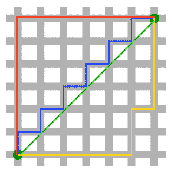
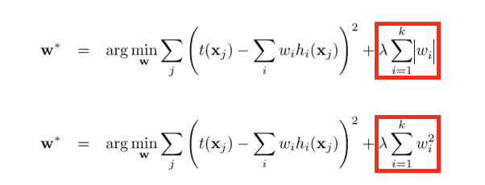
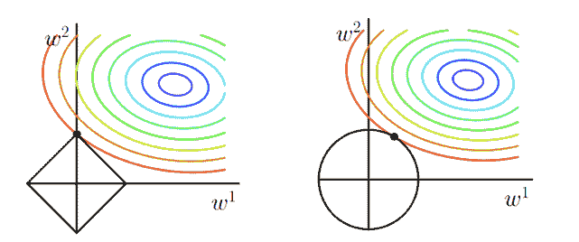
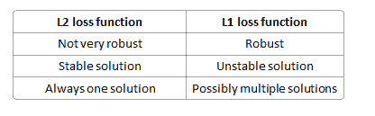

## 今日锦囊

### 特征锦囊：今天一起搞懂机器学习里的L1与L2正则化

今天我们来讲讲一个理论知识，也是老生常谈的内容，在模型开发相关岗位中出场率较高的，那就是L1与L2正则化了，这个看似简单却十分重要的概念，还是需要深入了解的。网上有蛮多的学习资料，今天我就着自己的理解也写一下笔记。????

从西瓜书????里我们可以了解到正则项的作用，那就是降低模型过拟合的风险，通常常用的有L1范数正则化与L2范数正则化，作为单独一项（正则项）加入到损失函数中，也可以自己作为损失函数。????

#### ???? L1 and L2范数

在了解L1和L2范数之前，我们可以先来了解一下范数（norm）的定义，根据参考文献[2]的说明：

> A norm is a mathematical thing that is applied to a vector (like the vector `β` above). The norm of a vector maps vector values to values in `[0,∞)`. In machine learning, norms are useful because they are used to express distances: this vector and this vector are so-and-so far apart, according to this-or-that norm.

简单来说也就是范数其实在 `[0,∞)`范围内的值，是向量的投影大小，在机器学习中一般会勇于衡量向量的距离。范数有很多种，我们常见的有L1-norm和L2-norm，其实还有L3-norm、L4-norm等等，所以抽象来表示，我们会写作`Lp-norm`，一般表示为 :

对于上面这个抽象的公式，如果我们代入p值，

若p为1，则就是我们常说的L1-norm：

若p为2，则是我们常说的L2-norm：

我们引用文章里的图片，L2-norm的距离就是两个黑点之间的绿线，而另外的3条线，都是L1-norm的大小。

#### ✍️ L1 and L2正则项

在上面我们有提及到，L1、L2范数可以用于损失函数里的一个正则化项，作用就是降低模型复杂度，减小过拟合的风险。这里的正则化项，存在的目的就是作为一个“惩罚项”，对损失函数中的某一些参数做一些限制，是结构风险最小化策略的体现，就是选择经验风险（平均损失函数）和模型复杂度同时较小的模型。

针对线性回归模型，假设对其代价函数里加入正则化项，其中L1和L2正则化项的表示分别如下所示，其中`λ >= 0`，是用来平衡正则化项和经验风险的系数。

（1）使用L1范数正则化，其模型也被叫作Lasso回归（Least Absolute Shrinkage and Selection Operator，最小绝对收缩选择算子）。

（2）使用L2范数正则化，其模型被叫做Ridge回归，中文为岭回归。

#### ???? 机器学习中一般怎么选择正则项

上面介绍的L1和L2范数正则化都有着降低过拟合风险的功能，但它们有什么不同？我们到底应该选择哪一个呢，两者之间各有什么优势和适用场景？别急，我们一一来展开讲讲。

##### Q1：L1和L2正则化项的区别？

首先，我们从上面那张二维的图可以看出，对于L2-norm，其解是唯一的，也就是绿色的那条；而对于L1-norm，其解不唯一，因此L1正则化项，其计算难度通常会高于L2的。

其次，**L1通常是比L2更容易得到稀疏输出的**，会把一些不重要的特征直接置零，至于为什么L1正则化为什么更容易得到稀疏解，可以看下图：

上图代表的意思就是目标函数-平方误差项的等值线和L1、L2范数等值线（左边是L1），我们正则化后的代价函数需要求解的目标就是在经验风险和模型复杂度之间的平衡取舍，在图中形象地表示就是黑色线与彩色线的交叉点。

对于L1范数，其图形为菱形，二维属性的等值线有4个角（高维的会有更多），“突出来的角”更容易与平方误差项进行交叉，而这些“突出来的角”都是在坐标轴上，即W1或则W2为0；

而对于L2范数，交叉点一般都是在某个象限中，很少有直接在坐标轴上交叉的。

因此L1范数正则化项比L2的更容易得到稀疏解。

##### Q2：各有什么优势，如何作选择？

直接上结论：

1）因为L1范数正则化项的“稀疏解”特性，L1更适合用于特征选择，找出较为“关键”的特征，而把一些不那么重要的特征置为零。

2）L2范数正则化项可以产生很多参数值很小的模型，也就是说这类的模型抗干扰的能力很强，可以适应不同的数据集，适应不同的“极端条件”。

#### ???? 如何作为Loss Function

讲完了作为正则化项的内容了，那么讲讲L1、L2范数作为损失函数的情况。假设我们有一个线性回归模型，我们需要评估模型的效果，很常规的，我们会用“距离”来衡量误差！

若使用L1-norm来衡量距离，那就是我们的LAD（Least Absolute Deviation，最小绝对偏差），其优化的目标函数如下：

实际意义上的解释就是预测值与真实值之间的绝对值。

若使用L2-norm，那就是我们的LSE（Least Squares Error，最小二乘误差），其优化的目标函数如下：

针对两者的差异，可以看下表：

L1损失函数的结果更具鲁棒性，也就是说对于异常值更加不敏感。而根据其范数“天性”，L2的求解更为简单与“唯一”。

#### ???? Reference

[1] Differences between L1 and L2 as Loss Function and Regularization

http://www.chioka.in/differences-between-l1-and-l2-as-loss-function-and-regularization/

[2] L1 Norms versus L2 Norms

https://www.kaggle.com/residentmario/l1-norms-versus-l2-norms

“干货学习，**点****赞****三连**↓