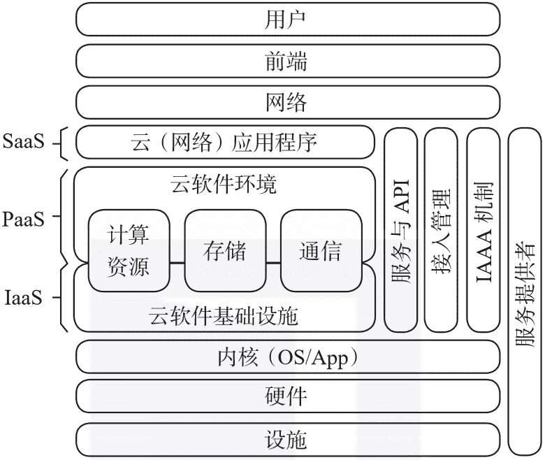

 Datawhale干货 

**作者：高聪，西安科技大学博士，来源：大数据DT**

**导读：**本文带你了解大数据及人工智能时代的3项关键技术。

**01 云计算**

根据美国国家标准与技术研究院（National Institute of Standards and Technology，NIST）的定义，**云计算是指能够针对共享的可配置计算资源，按需提供方便的、泛在的网络接入的模型。**上述计算资源包括网络、服务器、存储、应用和服务等，这些资源能够快速地提供和回收，而所涉及的管理开销要尽可能小。

具体来说，云模型包含五个基本特征、三个服务模型和四个部署模型。

**五个基本特征：**

*   按需自助服务（on-demand self-service）

*   广阔的互联网访问（broad network access）

*   资源池（resource pooling）

*   快速伸缩（rapid elasticity）

*   可度量的服务（measured service）

**三个服务模型：**

*   软件即服务（Software as a Service，SaaS）

*   平台即服务（Platform as a Service，PaaS）

*   基础设施即服务（Infrastructure as a Service，IaaS）

**四个部署模型：**

*   私有云（private cloud）

*   社区云（community cloud）

*   公有云（public cloud）

*   混合云（hybrid cloud）

一般来说，云计算可以被看作通过计算机通信网络（例如互联网）来提供计算服务的分布式系统，其主要目标是利用分布式资源来解决大规模的计算问题。

云中的资源对用户是透明的，用户无须知晓资源所在的具体位置。这些资源能够同时被大量用户共享，用户能够在任何时间、任何地点访问应用程序和相关的数据。

云计算的体系结构如图1-3所示，还对三个服务模型进行了阐述。

▲图1-3 云计算的体系结构

**1\. 基础设施即服务**

这项服务是云计算提供的最简单的内容，其涉及大规模的计算资源的交付，这些计算资源包括存储空间、运算能力和网络带宽等。

基础设施即服务的主要优势是按次付费、安全性以及可靠性，因此也被称为硬件即服务（Hardware as a Service，HaaS）。这项服务的典型案例有亚马逊云（Amazon Elastic Compute Cloud，EC2）、谷歌计算引擎（Google Compute Engine，GCE）和阿里云（Aliyun）等。

**2\. 平台即服务**

这项服务为云计算提供了应用程序的接口。对于云计算来说，基础设施即服务在很多应用场景下能力不足。

随着网络应用程序数的井喷式增长，平台即服务的相关研究与应用逐步涌现。很多全球性的跨国公司都不约而同地寻求在云计算平台方面称霸，就像微软在个人电脑领域所处的地位一样。平台即服务的典型案例有谷歌应用引擎（Google App Engine，GAE）、微软云（Microsoft Azure）等。

**3\. 软件即服务**

这项服务旨在提供终端用户可以直接使用的服务，这里的服务可以理解为部署在互联网上的软件。这样的服务模式在很大程度上替代了在个人电脑上运行的传统应用程序。

软件即服务的典型案例有思科（Cisco）的思科网迅（WebEx）、软营（Salesforce）的客户关系管理（Customer Relationship Management，CRM）系统以及亚马逊网络服务（Amazon Web Service，AWS）。

**02 物联网**

物联网技术栈由三个核心层构成，即**物/设备层**、**连接层**和**物联网云层**，详情如图1-4所示。

▲图1-4 物联网的技术栈

**在物/设备层**，诸如传感器、执行器等物联网特定的硬件可以被添加至已有的核心硬件中，嵌入式的软件可以被修改或集成进已有的系统，以便管理和操作具体的设备。

**在连接层**，由通信协议来实现单个物/设备与云之间的通信，例如消息队列遥测传输（Message Queuing Telemetry Transport，MQTT）协议。

**在物联网云层**，设备通信协议和管理软件用来协调、提供和管理互相连接的物/设备，由应用平台来实现物联网应用程序的开发和执行。此外，物联网云层还引入了分析与数据管理软件来存储、处理和分析由物/设备产生的数据。针对跨物/设备、人员和系统的过程监测，引入了过程管理软件来进行定义和执行。对于给定的目的，由物联网应用程序软件来协调物/设备、人员和系统之间的交互。

在上述三层的全域范围内，还存在特定的软件构件来对物联网体系整体的身份和安全进行管理，以及提供与商业系统和外部信息源的集成，常见的商业系统和外部信息源类型有**企业资源计划**（Enterprise Resource Planning，ERP）系统和**客户关系管理**（CRM）系统，外部信息源通常是指来自第三方的信息。

在谈论物联网技术时，“**物联网平台**”（IoT platform）是一个提及频次很高的概念。在计算领域，术语“平台”是一个相对广泛的概念，有些文献将平台定义为一组有机结合起来的技术，基于这些技术，能够开发其他的应用程序。

物联网平台本质上是软件产品，其提供大量与应用程序无关的功能，利用这些功能可以构建物联网应用程序。对于各种不同的物联网平台，其提供者所侧重的物联网技术不同，因此所提供的功能集合也是不同的。

换言之，**物联网平台的配置没有统一的标准，但是存在众多针对不同领域特定需求的物联网平台**，例如ThingSpeak、DeviceHive、Xively、WSO2以及海尔COSMOPlat等。

将云计算与物联网进行对比分析，给出了两个技术领域的互补方面，详情如表1-1所示。

▼表1-1 云计算与物联网的互补方面

一般来说，物联网能够在云计算的虚拟形式的无限计算能力和资源上补偿自身的技术性限制（例如存储、计算能力和通信能力）。

云计算能够为物联网中服务的管理和组合提供高效的解决方案，同时能够实现利用物联网中产生的数据的应用程序和服务。对于物联网来说，云计算能够以更加分布式的、动态的方式来扩展其能处理的真实世界中物/设备的范围，进而交付大量实际生活中的场景所需要的服务。

在多数情况下，云计算能够提供物与应用程序之间的中间层，同时将实现应用程序所必需的复杂性和功能都隐藏起来，这将影响未来的应用程序开发。**在未来的多云环境下，应用程序的开发面临着来自信息的收集、处理和传输等方面的新挑战。**

**物联网在工业领域的应用涵盖了众多方面，例如自动化、优化、可预测制造、运输等。**

**制造**（manufacturing）是物联网在工业领域最大的市场，涉及软件、硬件、连通性和服务等。随着物联网的引入，由原料、工件、机器、工具、库存和物流等组成的工业系统构成了实施制造过程的生产单元，上述这些构件之间可以互相通信。

物联网提供的连通性驱动了各项**操作技术**（Operational Technology，OT）的实际性能的收敛性，这里的操作技术包括机械手、传送带、仪表、发电机等。**在整个制造过程中，传感器、分布式控制以及安全软件发挥着“胶水”的作用。**当前，工业领域有远见的企业都将生产线和生产过程构建在了物联网之上。

**运输**（transportation）是物联网在工业领域的第二大市场。当前，在众多城市中涌现的智能运输网络能够优化传统运输网络中的路径，生成高效、安全的路线，降低基础设施的开销并缓解交通拥塞。航空、铁路、城际等货运公司能够集成海量的数据来对需求进行实时分析，实现统筹规划和优化操作。

**03 大数据**

随着物联网和云计算技术的发展，海量的数据以前所未有的速度从异构数据源产生，这些数据源所在的领域有医疗健康、政府机构、社交网络、环境监测和金融市场等。

在这些景象的背后，存在大量强大的系统和分布式应用程序来支持与数据相关的操作，例如**智能电网**（smart grid）系统、**医疗健康**（healthcare）系统、**零售业**（retailing）系统、**政府**（government）系统等。

在大数据的变革发生之前，绝大多数机构和公司都没有能力长期保存归档数据，也无法高效地管理和利用大规模的数据集。实际上，现有的传统技术能够应对的存储和管理规模都是有限的。在大数据环境下，传统技术缺乏可扩展性和灵活性，其性能也无法令人满意。

当前，针对海量的数据集，需要设计涵盖清洗、处理、分析、加载等操作的可行性方案。**业界的公司越来越意识到针对大数据的处理与分析是使企业具有竞争力的重要因素。**

**1\. 三类定义**

当前大数据在各个领域的广泛普及使得学界与业界对大数据的定义很难达成一致。不过有一点共识是，大数据不仅是指大量的数据。通过对现有大数据的定义进行梳理，我们总结出三种对大数据进行描述和理解的定义。

**1）属性型定义（attributive definition）**

作为大数据研究与应用的先驱，国际数据公司（International Data Corporation，IDC）在戴尔易安信（DELL EMC）公司的资助下于2011年提出了如下大数据的定义：

> 大数据技术描述了技术与体系结构，其设计初衷是通过实施高速的捕获、发现以及分析，来经济性地提取大量具有广泛类型的数据的价值。

该定义侧面描述了大数据的**四个显著特征：数量、速度、多样化和价值。**由Gartner公司分析师Doug Laney总结的研究报告中给出了与上述定义类似的描述，该研究指出数据的增长所带来的挑战与机遇是三个维度的，即显著增长的**数量**（Volume）、**速度**（Velocity）和**多样化**（Variety）。

尽管Doug Laney关于数据在三个维度的描述最初并不是要给大数据下定义，但包括IBM、微软在内的业界在其后的十年间都沿用上述“3V”模型来对大数据进行描述。

**2）比较型定义（comparative definition）**

Mckinsey公司2011年给出的研究报告将大数据定义为：

> 规模超出了典型数据库软件工具的捕获、存储、管理和分析能力的数据集。

尽管该报告没有在具体的度量标准方面对大数据给出定义，但其引入了一个革命性的方面，即怎样的数据集才能够被称为大数据。

**3）架构型定义（architectural definition）**

美国国家标准与技术研究院（NIST）对大数据的描述为：

> 大数据是指数据的数量、获取的速度以及数据的表示限制了使用传统关系数据库方法进行有效分析的能力，需要使用具有良好可扩展性的新型方法来对数据进行高效的处理。

**2\. 5V**

以下是一些文献中关于大数据特征的描述：

> 数据的规模成为问题的一部分，并且传统的技术已经没有能力处理这样的数据。

> 数据的规模迫使学界和业界不得不抛弃曾经流行的方法而去寻找新的方法。

> 大数据是一个囊括了在合理时间内对潜在的超大数据集实现捕获、处理、分析和可视化的范畴，并且传统的信息技术无法胜任上述要求。

> 大数据的核心必须包含三个关键的方面：数量多、速度快和多样化，即著名的“3V”。

**1）数量**

数据的数量又称为数据的规模，在大数据中，其是指在进行数据处理时所面对的超大规模的数据量。目前，海量的数据持续不断地从千百万设备和应用中产生（例如信息通信技术、智能手机、软件代码、社交网络、传感器以及各类日志）。

*   McAfee公司在2012年估算：在2012年的每一天中，全球都产生着2.5EB的数据，并且该数值约每40个月实现翻倍。

*   2013年，国际数据公司（IDC）估算全球所产生、复制和消费的数据已经达到4.4ZB，并且该数值约每两年实现翻倍。

*   到2015年，全球产生的数据将达到8ZB。根据IDC的研究报告，全球产生的数据将在2020年达到40ZB。

**2）速度**

在大数据中，数据的速度是指在进行数据处理时所面对的具有高频率和高实时性的数据流。高速生成的数据应当及时进行处理，以便提取有用的信息和洞察潜在的价值。

全球知名的折扣连锁店沃尔玛基于消费者的交易每小时产生2.5PB的数据。

视频分享类网站（例如优酷、爱奇艺等）则是大数据高频率和高实时性特征的另一个例证。

**3）多样化**

在大数据中，**数据的多样化是指在进行数据处理时所面对的具有不同语法格式的数据类型。**随着物联网技术与云计算技术的普及，海量的多源异构数据从不同的数据源以不同的数据格式持续地产生，典型的数据源有传感器、音频、视频、文档等。

海量的异构数据形成各种各样的数据集，这些数据集可能包含结构化数据、半结构化数据、非结构化数据，数据集的属性可能是公开或隐私的、共享或机密的、完整或不完整的，等等。

随着大数据理论的发展，更多的特征逐步被纳入考虑的范围，以便对大数据做出更好的定义，例如：

*   **想象**（vision），这里的想象是指一种目的；

*   **验证**（verification），这里的验证是指经过处理后的数据符合特定的要求；

*   **证实**（validation），这里的证实是指前述的想象成为现实；

*   **复杂性**（complexity），这里的复杂性是指由于数据之间关系的进化，海量数据的组织和分析均很困难；

*   **不变性**（immutability），这里的不变性是指如果进行妥善管理，那么经过存储的海量数据可以永久保留。

描述大数据的五个关键特征（即“5V”）：

*   数量（Volume）

*   速度（Velocity）

*   多样化（Variety）

*   准确性（Veracity）

*   价值（Value）

**4）准确性**

在商界，决策者通常不会完全信任从大数据中提取出的信息，而会进一步对信息进行加工和处理，然后做出更好的决策。如果决策者不信任输入数据，那么输出数据也不会获得信任，这样的数据不会参与决策过程。

**随着大数据中数据规模的日新月异和数据种类的多样化，如何更好地度量和提升数据可信度成为一个研究热点。**

**5）价值**

**一般来说，海量的数据具有价值密度低的缺点。**

如果无法从数据中有效地提取出潜在的价值，那么这些数据在某种程度上就是没用的。数据的价值是决策者最关注的方面，其需要仔细且认真的研究。目前，已经有大量的人力、物力和财力投入到大数据的研究和应用中，这些投资行为都期望从海量数据中获得有价值的内容。

但是，对于不同的机构和不同的价值提取方法，同样的数据集所产生的价值差异可能很大，即投入与产出并不一定成正比。因此，对大数据价值的研究需要建立更加完善的体系。

关于作者：高聪，男，1985年11月生，西安电子科技大学计算机科学与技术专业学士，计算机系统结构专业硕士、博士。自2015年12月至今，在西安邮电大学计算机学院任教，主要研究方向：数据感知与融合、边缘计算和无线传感器网络。

本文摘编自《工业大数据融合体系结构与关键技术》，经出版方授权发布。

“整理不易，**点****赞****三连**↓