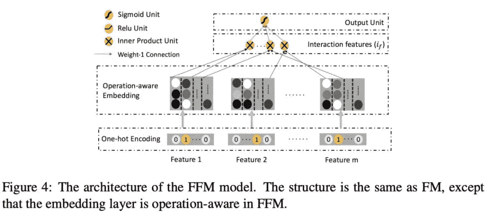

ONN: Operation-Aware Neural Network for User Response Prediction

这是一篇价值百万的文章！为什么这么说呢？看看土豪腾讯赛的前几届冠军几乎或多或少都用到了该篇论文的思路，该文章提出的算法实战能力在CTR/CVR问题上面极强，也有一些朋友称该方法为**NFFM(注意ONN和NFFM在实现的一些小细节上略有不同,不过大的思路是类似的)**，是不是感觉和NFM的名字很像(有兴趣的可以看前一篇文章)。就差了一个字，但是其实思路还是有着比较多的不同，虽然在实现的代码上也就十行左右的不同。本文思路新奇，所以不得不好好学习一波。

模型介绍

ONN和所有之前的模型不一样的地方在于，之前的工作FM,DeepFM,xDeepFM,DCS,NFM等等工作都是在Embedding之后再对embedding向量进行各种内积，外积等操作，但是却鲜有工作会考虑Embedding的合理性，以及是否足够表示我们的ID信息等，ONN和其他工作最大的不同就是在于对于Embedding向量的生成部分。

几种Embedding

几种Embedding比较，

One-hot embedding

One-hot embedding是最早的embedding，它可以很好地表示类别信息，有就在特定位置标记为1，没有就是0，但是one-hot embedding却存在非常大的一个问题，在做关联操作的时候，我们会得到非常多的“不合理”的0，比如有三种颜色：红|粉红|蓝；有两种性别：男｜女，，用one-hot表示二者的关系，假设满足男和红是1，那么其他的组合全部都会是0，很明显，这是不合理的，因为男和粉红以及男和蓝的关系肯定是不一样的，这类比到搜索推荐中也是一样，我们用one-hot表示用户和某个商品的关系，存在关联就是1，没有就是0。现在来了一个商品，历史上用户没有和该商品有过明显的关联，那么我们的用户和该商品的关联性就会变为0，很明显这是有问题的。所有one-hot的形式是不足够的。

normal embedding

normal embedding就是我们常说的embedding操作，我们将每个类别变量映射到一个低维度的dense向量上面，得到一个新的向量，后面再用该向量去做对应的操作。这么做相较于one-hot embedding的优势就较为明显了，同样的现在来了一个商品，历史上该用户没有和该商品有过明显的关联，但我们的用户和该商品的关联性在这个时候一般也不会是0。

#### Operation-aware embedding

Operation-aware embedding故名思议就是和Operation相关的embedding，一个operation对应一个embedding(注：相同的操作在不同的特征上也被认为是不同的操作)，我们发现原先我们的类别特征每次转化为一个embedding向量,想再是 个embedding向量，

*   Normal embedding:

*   Operation-aware embedding:

特征交叉

之前的研究显示，如果直接将两个特征的关系拼接起来会得到非常稀疏的表示，并且会因为训练不充分导致效果不佳，FM等模型用积(内积/外积)的形式来表示两个潜在向量之间的关系。同时大量的实验也验证来这一点带来的好处。在ONN中，作者发现内积的效果是好于外积的，所以默认使用内积。

此处我们使用

*   :表示操作 为第 个特征上面的第 个操作;

*   :表示拷贝第 个特征的operation;

*   :表示第 个特征和第 个特征的内积；

从上图中，我们可以看出我们的输出为：原始的embedding( ) + 交叉之后的值 ；

其中

*   <embed style="width: 25.226ex" src="https://mmbiz.qlogo.cn/mmbiz_svg/wXJ5kSJT6OPVq0Gc9fpKp6eQW312n1gHsb19koA0hEAak9kq86F0hEv3Y2e0CXbDHQf6SLaHgMyF6v6Ik8e2I4QqTyq1lYVd/0?wx_fmt=svg">,<embed style="width: 28.471ex" src="https://mmbiz.qlogo.cn/mmbiz_svg/wXJ5kSJT6OPVq0Gc9fpKp6eQW312n1gHGzH2r2wAVhE4xCTEKE9mdqogP13jgfPgztLcT9y1a8hnDMjwVL7zOWc9PoHuMhjN/0?wx_fmt=svg">

最终我们的输出

MLP层

上面的操作挖掘的信息可以认为是一阶和二阶的信息，更加高阶的信息文章中不再进行交叉相乘，因为有些复杂，最终作者选用MLP来自动挖掘高层的隐式特征。形式如下：

*   , 这边的

模型分析

特征embedding

在词里面，一个词可能会有多个不同的意思，这个时候我们会使用Multi-sense的embedding来处理此类情况，同样的，CTR/CVR任务随着上下文的不同也会有不同的意思，Operation-Aware的embedding可以帮助我们在不同的上下文中学习到不同的特征表示。所以**Operation-Aware的embedding会包含更多的信息**；

**Operation-Aware的embedding比其他模型里面的embedding更加方便**：例如用户User的embedding和用户受教育情况的embedding，如果我们希望对其做乘法，那么我们需要将二者的维度设置为相同的长度，但是很明显，User的维度应该是要高于User受Education的维度，所以相同长度是不合适的，这个时候，Operation-Aware方法可以针对不同的特征设置不同的embedding维度，在对不同的特征进行乘法操作的时候就可以使用。人为的设计不同操作的不同维度等可以让我们降低训练和测试的时间复杂度。

和FM,FFM的关系

此处主要是对比和FFM对关系，

FFM的式子，

我们发现，“field-aware”是“operation-aware”的一个特例，**但是FFM只有内积，而且FFM缺少挖掘深层次特征关联的能力**,(ONN的浅层特征和FFM类似).

实验

### 模型效果(非流式&流式)

*   从上面的实验中来看,ONN的效果是最好的，也就是说Operation-aware方法的效果是好于Normal embedding的。

*   流式训练的情况下，ONN的效果比其他模型也都要好；

### 不同操作的分析

*   内积操作的效果是好于外积的，内积和外积的组合可以提升模型的效果。

小结

本文提出了基于Operation-aware的NN，该方法和之前的NN的各种交叉不一样的地方在于它把重点放在了对Embedding的改进上，之前的embedding得到的是一个dense向量，而现在我们得到的是N个dense向量，embedding进行点积操作再和原始embedding拼接并用MLP挖掘这些特征的特征深度信息，该方法相较于其他的方法取得了最佳的效果，同时inner-product和outer-product结合还可以获得更好的效果。

参考文献

1.  Operation-aware Neural Networks for User Response Prediction：https://arxiv.org/pdf/1904.12579.pdf

2.  NFFM：https://github.com/guoday/ctrNet-tool/blob/master/models/ffm.py

3.  NFFM baseline：https://www.kaggle.com/guoday/nffm-baseline-0-690-on-lb

“干货学习，**点****赞****三连**↓