[](https://mp.weixin.qq.com/mp/appmsgalbum?__biz=MzU1ODEzNjI2NA%3D%3D&action=getalbum&album_id=1512355511533404161#wechat_redirect)


**桔妹导读：**每天滴滴都会为上千万人提供出行服务，在这一过程中积累了海量轨迹数据。这些轨迹数据来自于公共服务，本文介绍如何利用这些数据回馈大众，改善出行体验。

***1. ***

**背景**


首先简要介绍一下什么是数据挖掘。数据挖掘（Data Mining）是指从大量数据中发现特定信息和模式的过程，也有很多人将这一过程看作知识发现（Knowledge Discovery in Database）。数据挖掘常用的算法手段有回归、分类、聚类和模式发现，工程上数据挖掘通常和大数据技术联系在一起，工业实践中还需要从业人员对数据中包含的领域知识有足够了解。业界挖掘手段经常用在用户画像、商业智能（Business Intelligence）、社群关系发现等场景。

本文主要分享如何从海量轨迹数据中提取关键信息，改善用户出行体验。滴滴在业务运营过程中，司机端APP 会持续向后台上传位置信息，这些信息被用于分单、司乘碰面、导航、里程计费。每天滴滴都会为上千万人提供出行服务，在这一过程中积累了海量轨迹数据。这些轨迹数据不涉及用户隐私，主要反应了公共道路上的交通状况和司机驾驶习惯。下面我们会具体介绍两个典型场景。

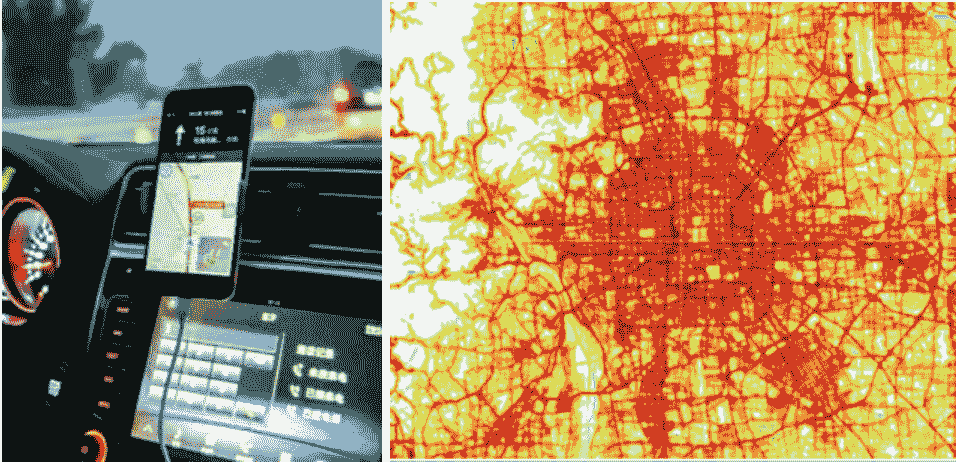

***2. ***

******路网更新** ****


作为数字道路地图的关键部分，道路交叉口是多条相互连接道路的交汇处，其几何特征和拓扑属性的精确性在移动导航和其他位置服务中起着重要作用。随着城市发展，交叉口的更新越来越频繁，主要包含挂接关系变更、新路、形态变更，这类拓扑错误如果不能及时检测及更新，会影响路网匹配、路径规划、导航播报等基于路网数据的地图服务，产生导航绕路、播报不合理等用户体验问题。

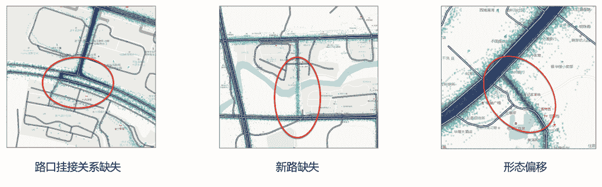

******▍********2.1** **技术挑战**

交叉口拓扑更新可以抽象成这样一个问题：路口范围内的轨迹矢量模式与路网是否匹配？为此，需要解决以下几个关键问题：第一，轨迹数据包含了大量噪声，如何进行有效去噪；第二，路口位置及范围如何确定；第三，轨迹矢量模式如何表达以及如何与路网差分。

为了解决以上问题，我们设计出的算法框架如下，包含三个核心模块：轨迹质量提升，路口影响区域检测和拓扑结构校准模块。相关工作发表在数据挖掘与数据库技术顶级学术会议 International Conference on Data Engineering (ICDE) 2020上。

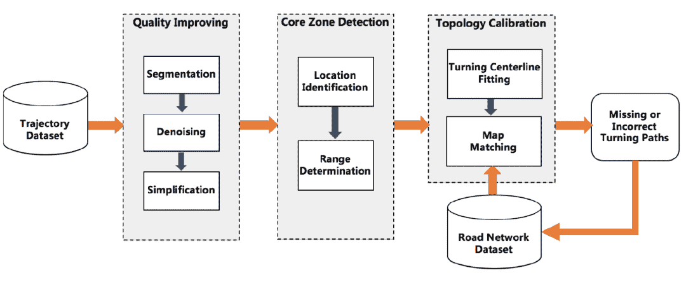

******▍********2.2 ****轨迹质量提升**

原始轨迹数据可能受设备故障、信号不佳等因素影响导致采集到的定位信息存在漂移甚至异常，我们根据前后轨迹点的距离和时间间隔进行轨迹段的分割，保证同一轨迹段在时空上具有连续性；此外，车辆在路口一般会因为等红绿灯或交通拥堵停留，导致在短距离范围内产生大量具有不同方向的位置信息（噪声），不仅增加了路口检测的计算开销，还给检测精度带来较大影响。

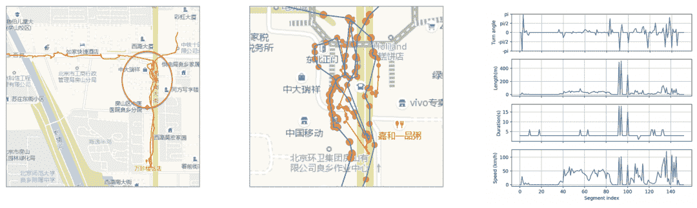

针对这一问题，我们基于轨迹点的密度（时间密度、空间密度）进行数据过滤，并对局部自相交轨迹段进行分段，最后通过Douglas Peucker算法提取轨迹段关键形状点，在保留轨迹转向特征的同时，对数据实现了压缩。因此，通过轨迹分段、去噪、压缩的预处理，实现了对原始轨迹数据的质量提升。

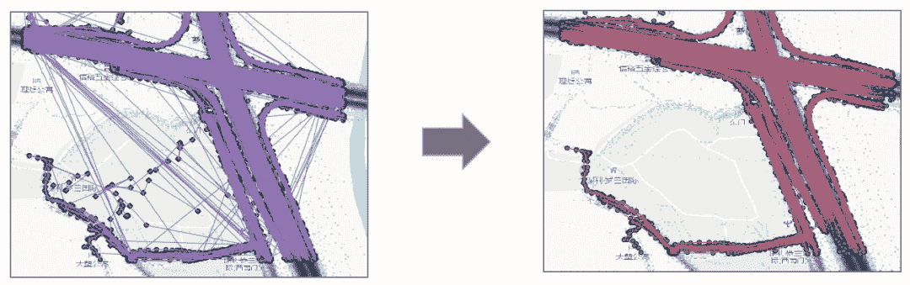

******▍********2.3 ****交叉口位置及范围生成**

为了检测道路交叉口影响区内的详细拓扑信息，首先需要识别道路交叉口的核心区域，即路口位置和覆盖范围。考虑到不同路口大小不一，并且路口范围内轨迹通常具有减速、转向等特征，我们设计了一套基于四叉树空间划分和Mean-shift的自适应路口位置检测算法。在搜索道路交叉口单元的过程中，将四叉树的最小边长设置为25米，并从200米大小边长开始的层（即从四叉树底部开始的第四层）搜索道路交叉口单元。由于交叉口中心位置的轨迹往往比路段具有更多的转向与较低的转速，我们对每个网格单元中的所有特征点（轨迹压缩获得）执行速度分析和基于方向的DBSCAN聚类，筛选潜在的道路交叉口网格单元。随后，鉴于Mean-Shift算法可以在聚类过程中同时检测出密度中心，我们通过该算法，结合候选交叉口单元内的轨迹点识别路口的中心位置。

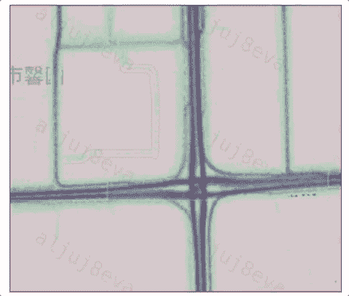

不同路口其形状有较大差异，如何更通用地基于轨迹数据确定路口的核心区范围？实质上道路交叉口的中心位置附近并不总是具有相对于路段区域更多转向行为，例如，环岛和立交桥。本文中我们利用环状几何模型逐层检测路口覆盖范围。对于一个路口而言，越到核心区边缘的环包含的转向点密度越低、速度越大，因此该路口模型适于不同形状路口的范围提取。

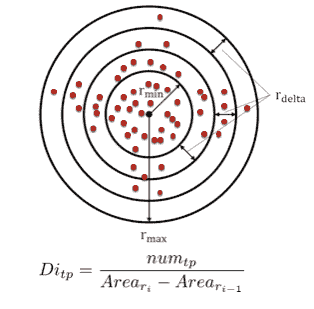

******▍********2.4 拓扑结构校准**

在路口范围拓扑结构的校准阶段，我们基于检测的路口中心位置和核心区范围向外扩展，获取交叉路口影响区内的全部轨迹。我们对这些轨迹进行转向簇提取与中心线拟合，并将拟合的转向路径与基准路网进行地图匹配。

Frechet距离适于评测曲线之间的相似性，但是对于复杂形状的路口以及路口邻接路段间朝向偏差较小的情况，Frechet表现不佳。鉴于此，我们将方向权重引入轨迹相似性度量中。对于任意两条轨迹序列，分别计算起点与终点间的方向差，并结合Frechet距离生成轨迹集合的距离矩阵。基于该矩阵结合DBSCAN聚类实现路口范围内的转向簇提取。

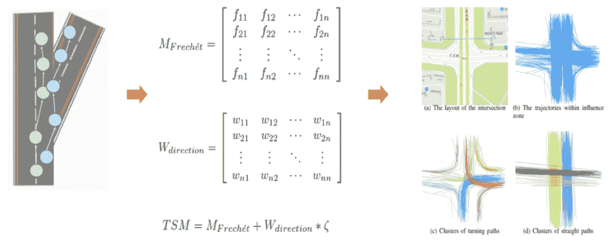

在提取转向簇后，需要对各簇轨迹进行拟合来得到转向矢量模式。我们采用基于Force Attraction的聚类方法获取各簇对应的转向路径，相比如其他依赖点信息的拟合算法如Sweeping等，Force Attraction方法能够充分运用轨迹线信息，因此对复杂转向场景的拟合更加鲁棒。Force Attraction方法首先随机采样簇中的一条轨迹作为参考轨迹，随后使用同簇内其余轨迹对参考轨迹中点的位置进行迭代调整。在调整过程中，Force Attraction算法假定任意轨迹点上有吸引力和排斥力作用，通过搜索两个力达到平衡的位置来获得参考轨迹对应点的新位置。由于随机采样轨迹容易导致拟合得到的中心线不精准，特别是当随机采样的参考轨迹远离实际道路中心时，拟合偏差较大。因此，我们引入基于Frechet的采样策略。具体来说，我们从簇中随机采样k条轨迹作为候选参考轨迹，并分别计算每个候选者与该簇的其余轨迹之间的Frechet距离。将具有最小距离和的候选轨迹视为参考轨迹。

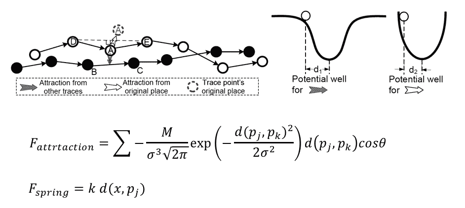

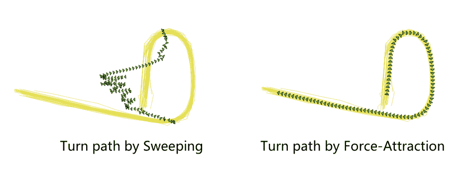

在获得转向路径后，我们采用经典的HMM算法结合基准路网进行地图匹配。为加速匹配过程，我们基于每个路口的转向路径集生成凸包再与路网空间关联。根据匹配概率得到低置信度转向路径，作为需修正拓扑情报。

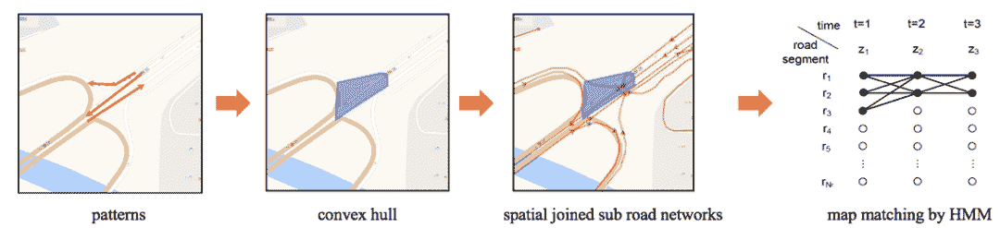

在最终的路口拓扑校准上，为了评估我们解决方案的有效性，我们基于滴滴实际轨迹数据和路网检测两种类型的错误拓扑：转向路径缺失和转向路径偏移。根据我们的评估，整体的精确率能够达到70%，转向路径缺失和偏移的比例在1 : 5。目前该方法已经在滴滴路网更新产线中得到应用，下图为两个典型案例（路网为淡灰色线，轨迹分布以深蓝色表示，校正的转向路径以红色箭头线突出显示。

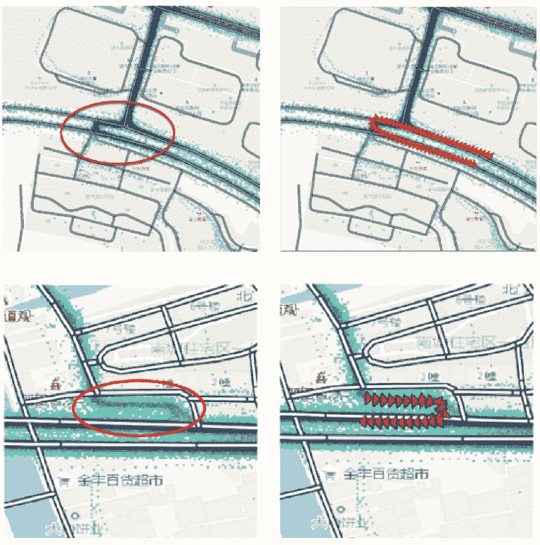

***3. ***

**路线偏移**


在网约车业务场景中，可能会出现司机师傅未能按照导航路线行驶而出现路线偏移的现象，导致此类场景出现的原因可能是路况不佳、路线不合理、道路封闭，也可能是司机发现了更好的路线躲避拥堵，或者是对路线不熟悉，甚至故意绕路等。挖掘此类场景对于网约车提升地图用户体验、避免司乘纠纷、保障司乘安全具有至关重要的意义。为了解决此类问题，地图团队通过全局/局部的起终点（Origin-Destination，简称OD) 约束，基于用户历史轨迹行为特征建模，实时观测目标用户轨迹行为空间分布特征，从而检测路线偏移行为。基于用户轨迹的路线偏移检测，我们最终构建了实时触达用户的轨迹安全产品与路网状态更新体系。

******▍********3.1 技术挑战**

基于OD轨迹路线偏移检测，通常涉及到路线表征维度多样性、OD观测空间下历史正常轨迹稀疏性、检测实时性等建模问题以及TB级轨迹大数据的离线特征存储更新、在线实时查询等工程问题。虽然在学术研究领域，轨迹异常检测已经形成了相对成熟的解决方案与不同角度的研究积累，但在实际工程实践会面临复杂多样的业务场景，具体来讲：

1.  **路线表征维度多样性** 用户轨迹路线可以用一系列有序的GPS点串表征，该方式可以保留最原始的路线信息，但是会存在轨迹飘点、冗余、无法批量高效建模的问题；也可以基于轨迹匹配道路结果进而通过一系列路段表征路线，该种表征方式最为常见，同时也会存在轨迹质量、绑路策略而带来的误匹问题；还可以将GPS映射到空间瓦片表示，该方式可以有效规避以上两类问题，但是无法精确定位路网问题。因此在不同的建模场景中，应该采取不同的路线表征维度。左侧蓝色点串GPS轨迹的原始表示，右侧表示轨迹的瓦片表示。

    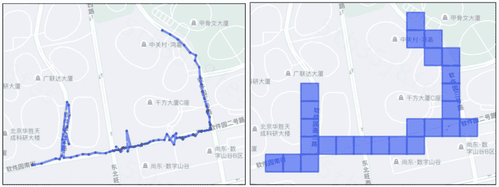

2.  **OD观测空间下历史正常轨迹稀疏性** 由于我们是在OD的空间约束下进行轨迹建模，并且需要观测在该空间下历史用户轨迹分布特征，如果用户行程起终点下关联的历史用户轨迹数量过少甚至不存在，那对于轨迹建模来讲将是巨大的挑战。

3.  **检测实时性** 在路线偏移的场景下，不管是路网状态异常还是订单状态异常，都要求算法能够实时、精确、可解释的计算结果并触达用户，因此要求我们的算法要能够实时地对端上上报的轨迹点进行状态判定。

为了解决异常路线偏移检测的问题，考虑到不同的产品及业务需求，我们设计并完成了以下两大类检测解决方案，下面进行简单的介绍。

******▍********3.2 "少而不同"绕路检测**

该类场景主要是检测单一、少数绕路订单的异常状态，该类订单在OD约束下，与其他正常相同OD下其他正常订单轨迹空间分布存在明显的差异，主要表现为连续地出现离群轨迹点，所以可以将我们的任务转化为实时离群轨迹点检测，检测方法可以由以下部分组成：

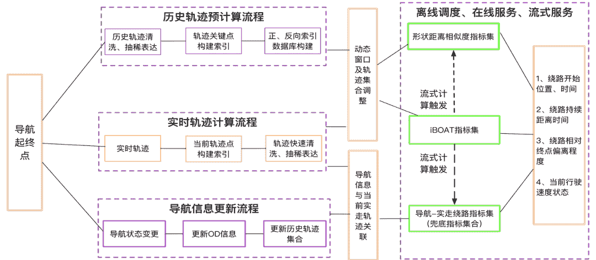

*   **路线形状表达**
    轨迹路线形状表达的目的主要是压缩轨迹，同时保证形状信息和压缩率；同时也要平滑轨迹，去除停留点与噪点。我们采用了Minimum Description Length Partition算法对轨迹进行压缩表示，该算法通过定义角度距离、垂直距离等，拓展了传统的Douglas-Peucker算法，无需定义阈值，可以自适应增量式划分和压缩轨迹。

*   **导航特征表达**

    在实际业务场景中，除了轨迹路线形状之外，我们还可以实时获取到用户导航-偏航状态的特征，通过行驶方向与导航起终点方位关系，可以判定用户当前是否在朝向终点运动。红色线条为道路路线，绿色线条为轨迹路线，β1表示A1A2导航起终点夹角为锐角，朝向相近，即朝向终点运动，β2反之。

    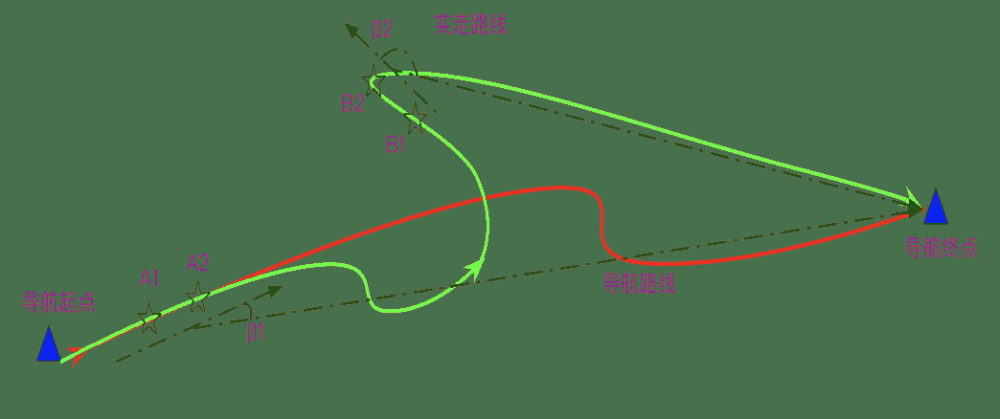

*   **稀疏OD轨迹Embedding**

    为了克服上文中提到的同OD下历史正常轨迹稀疏性的问题，我们提出了一种基于地理空间关系学习的轨迹Embedding方案。该方案主要是在订单起终点的约束下，建模轨迹中途经点与起终点之间的关系，由于不涉及到具体特定轨迹，只是建模起终点与途经点关系，因而在可以在一定程度上解决OD空间下稀疏性的问题。Embedding主要更新学习过程如下： 

    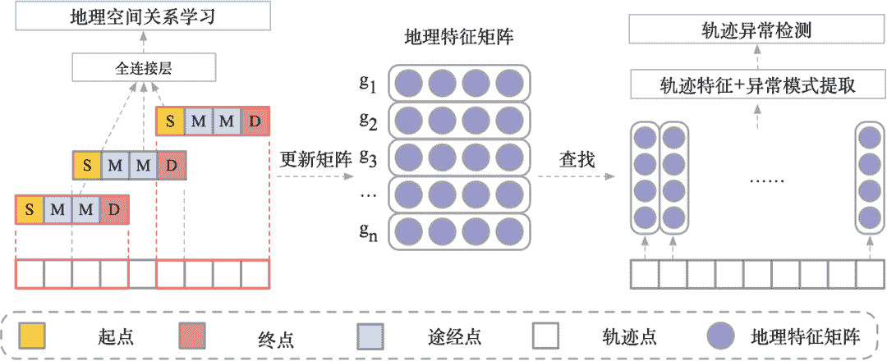

    其中，地理特征矩阵更新学习的过程为：

    **S1)**  将行驶的轨迹T={p1, p2, … , pn}根据坐标映射到对应的路网网格中。轨迹可以表示为T={g1, g2, … , gn}其中gi为行驶轨迹中坐标pi在路网中对应的网格。

    **S2）**使用具有固定窗口大小和固定滑动步长的滑动窗口，将轨迹T={g1, g2, … , gn}划分为若干定长的子轨迹，如滑动窗口大小为10，滑动步长为1，则原始轨迹T可被划分为子轨迹集合T’ = {Tj | Tj={gj, gj+1, … , gj+9}, 1≤i≤n-9}

    **S3）**假设路网中有N个互不相同的路网网格，则对目标区域的所有路网网格随机初始化两个N*d维特征矩阵，特征矩阵中的每一行为一个特征向量，分别表示对应网格作为起点和终点时的特征。将两个特征矩阵拼接后可以得到一个N*2d维的特征矩阵，用于表示对应网格作为轨迹途经点（既非起点也非终点）时的特征。

    **S4）**将S2）中得到的每条子轨迹T={g0, g1, … , gn} 根据轨迹点性质转化T={S, M1, … , Mj, D}，其中S=g0表示子轨迹起点，D=gn表示子轨迹终点，M1, … , Mj表示子轨迹途经点。

    **S5）**在起终点约束的条件下，最大化途径点M1, … , Mj出现的平均对数概率，即可完成在在地理空间约束下的轨迹建模。根据轨迹点性质，分别从不同特征矩阵查找轨迹经过的路网网格的性质。即从起点特征矩阵中查找起点S的特征向量，为d维向量；从终点矩阵中查找终点D的特征向量，为d维向量；从途径点矩阵中查找途径点Mj的特征向量，为2d维向量。拼接起点S和终点D的特征向量和，即可得到2d维的起终点特征向量。

    **S6）**通过反向传播更新起点、途经点和终点的特征矩阵，直到模型收敛。此时即可得到送驾区域路网网格在地理空间约束下的特征向量。

*   **实时离群点检测**
    为了满足轨迹实时异常检测需求，需要算法能够在系统输入的一定时间窗口的轨迹之后，完成路形表达、导航特征提取、轨迹特征Embedding之后，立即给出在该OD空间约束下，当前行程轨迹是否处于偏移状态以及该状态下基于以上特征的支持度【支持度可以定义为在OD约束下，历史正常路线途径该瓦片的订单数量 / OD约束下总订单数量】，借鉴iBOAT自适应窗口检测在线检测思路，类似的，我们提出了一种基于多特征表征的实时路线偏移检测框架，具体检测过程为：当偏航发生时，在一定时间窗口，获取目标订单行程轨迹，对该行程进行路形、导航、轨迹特征的表征与判别。下图中，图一蓝色为历史正常用户实际轨迹路线，红色为目标用户轨迹；图二为iBOAT自适应窗口判别示意图。

    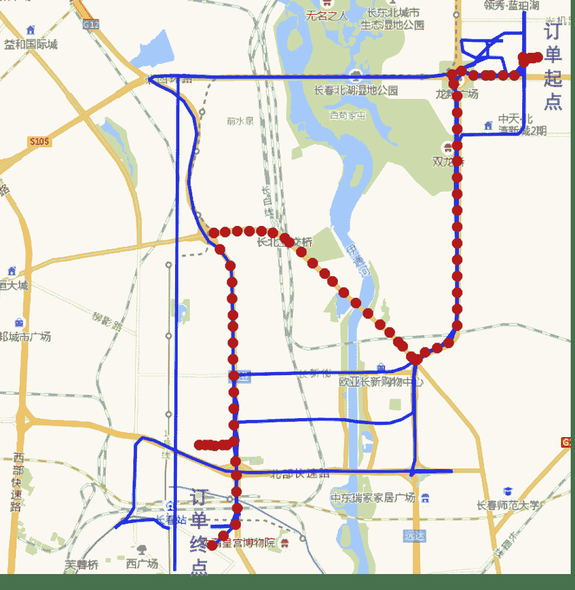

    图一

    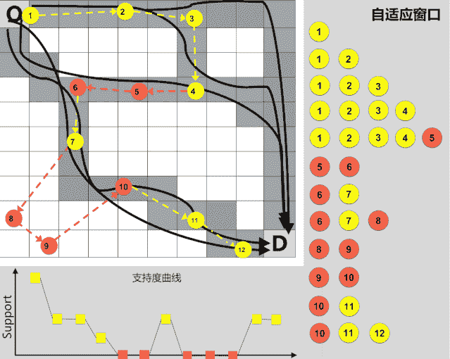
    图二

******▍********3.3 “多而不同”封路检测**

基于“少而不同”的思路针对极少数用户轨迹偏移的异常检测主要是为了解决司乘纠纷、轨迹安全等问题；“多而不同”主要是多数用户在同OD空间约束下，出现了群体性的路线偏移，该现象往往意味路网的状态发生了变更而导航依旧按照发生变更前状态规划，从而导致用户的集体被迫绕路。因此针对路网状态异常，以道路封闭为例，我们提出了一种基于 Siamese LSTM (孪生长短期记忆网络)与LSPD（缺失路段模式检测方法）的轨迹时空模型来解决路网封闭检测问题。相关工作发表在GIS领域国际会议ACM SIGSPATIAL  2019 (International Workshop on Ride-hailing Algorithms, Applications, and Systems)(SIGSPATIAL 2019 RAAS)

该模型主要结构如下：

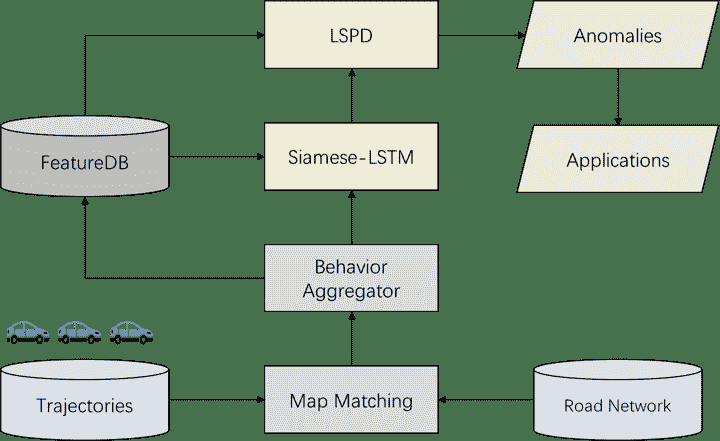

该模型主要分为两个模块，第一个算法模块是基于时间序列流量信息相似性建模，该模型可以引入经典的Siamese LSTM网络，并融合注意力机制与自定义损失函数，实时刻画历史同期流量曲线与当前流量曲线的相似性，从而在线检测流量异常。由于采取了与历史同期（例如本周一与上周一）的流量序列建模，因而对流量自然下降及波动具备很强的鲁棒性。

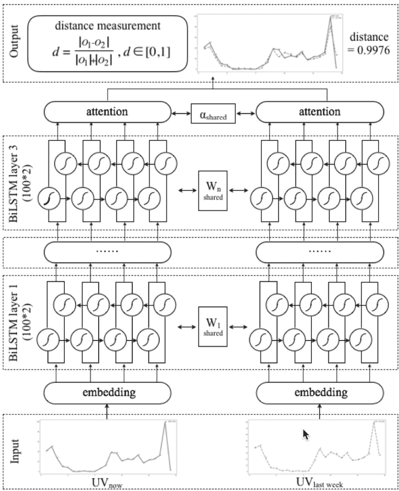

基于Siamese LSTM流量异常检测可以对全路网空间的流量异常进行实时检测，其检测的结果需要更强的证据佐证道路异常，因此，我们设计了第二个算法模块LSPD， 该算法侧重于通过群体用户行为的异常判别第一个算法模块结果的可解释性与概率性，主要思想是统计同OD下路线模式的分布变更，不同于轨迹异常检测算法(iBOAT) 在OD场景下关注“少而不同“的异常轨迹，我们重点关注“多而不同“的用户群体性异常行为，例如某时间段内历史用户集中出现了绕路事件，则通过我们的LSPD算法模块可以精确定位到哪些路段可能出现了道路封闭以及发生发生该类事件的置信度有多大。

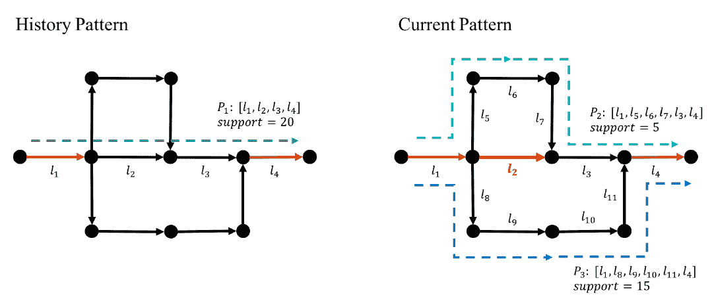

以北京市某处道路封闭事件为例，该道路在下午17时左右发生道路封闭，我们的系统在18时通过Siamese LSTM深度网络检测出该道路存在明显的流量异常，异常置信度为0.99，随后，该事例被系统流转至LSPD检测模块寻求更多的轨迹证据佐证该道路的确存在道路异常，在该模块，我们的算法检测到在局部起终点（OD）的作用下，用户的出行方式已经发生了巨大的变化，之前多数用户选择右侧红色路线，而当前状态下，用户多选择左侧蓝色路线（红色路线的支持度从30降低到6，而蓝色路线的支持度则由3上升至43），从而被系统整体判别该道路出现了道路异常，即道路封闭。   

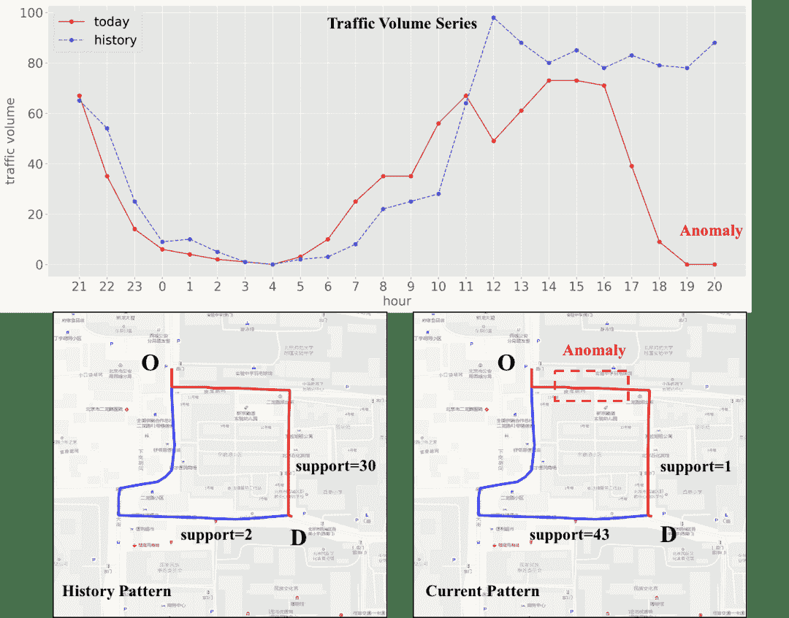

***4. ***

**总结**


在当前的工业实践中，数据挖掘也常常和一些热门词汇联席出现，比如人工智能、机器学习、大数据、数据分析、数据科学等，如下图所示。

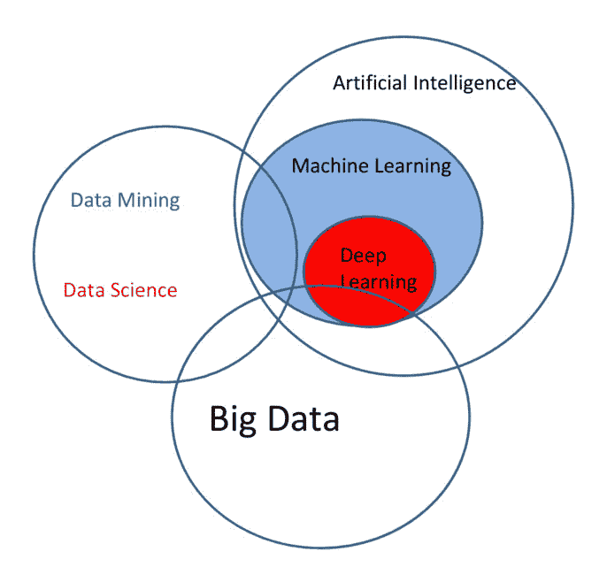

相比于其他概念，数据挖掘不强调应用何种手段，更强调目的：从数据中提取信息。在这个意义上讲，数据挖掘天然是交叉学科，需要从业人员具备统计、机器学习、大数据乃至高并发后台服务、数据可视化等复合技能。另一方面，目前的人工智能技术水平仅仅达到刻画相关性的阶段，尚不能进行通用推理或者知识学习，所以需要从业者对研究的领域具备一定先验知识，并了解如何利用这些知识从数据中提取有高价值信息。这两个特点决定了领域数据挖掘的门槛非常高，这影响了数据价值的快速发掘和落地。笔者所在团队承担了公司内部很多挖掘任务，比如安全驾驶行为检测、路网挖掘、交通事件、地理画像、出行模式分析等等，更多的数据挖掘任务因为排期和资源限制无法快速支持，而需求方因为高技能门槛无法自行对数据进行加工和价值提取。

我们下一步的目标是尝试将轨迹数据挖掘能力中台化或者平台化，能够将算法、工程、大数据、可视化等能力开放出来，大幅降低数据挖掘成本，使得数据的价值能被最大化利用。实际上这一挑战不是我们团队或者公司独有的，互联网公司可能会存在无法以合适的成本从数据中提取价值的问题，导致数据挖掘技术只在少数高ROI场景下得到应用。即将到来的5G和万物互联时代，这一问题会更加严重。欢迎对此感兴趣的同学加入我们，一起研究和探索如何解决这些挑战。

### 

**本文作者**

****▬****

### 


2017年加入滴滴，轨迹挖掘团队负责人，负责基于多模态融合的路网情报发现与路网状态更新、轨迹挖掘、地图安全特征平台等工作。


### 

2016年加入滴滴，负责基于多源大数据的路网更新方向的算法工作，研究兴趣点包括时空异常检测、出行模式挖掘、路网生成等。


### 

2018年加入滴滴，在滴滴从事轨迹模式挖掘、用户异常行为检测、道路封闭检测等工作。

**团队****招聘**

******▬******

滴滴地图与公交事业部轨迹挖掘团队利用滴滴海量的出行数据，对道路状况／交通流量／司机驾驶习惯进行建模，使用数据挖掘和机器学习技术发现路网情报和行程异常，提升滴滴用户的出行体验和平台效率。

团队长期招聘研发工程师，包括机器学习、大数据、策略架构等方向，欢迎有兴趣的小伙伴加入，可投递简历至 diditech@didiglobal.com，邮件请邮件主题请命名为「姓名-应聘部门-应聘方向」。


扫描了解更多

**延伸阅读**

******▬******

[](http://mp.weixin.qq.com/s?__biz=MzU1ODEzNjI2NA%3D%3D&chksm=fc29b2cfcb5e3bd9e1f4de8316f2c5437c770e04921def858e7b4da6a9215cb0508d6219ad82&idx=1&mid=2247507048&scene=21&sn=7e4d8721e819d7aa61f43922650b09c6#wechat_redirect)

******[](http://mp.weixin.qq.com/s?__biz=MzU1ODEzNjI2NA%3D%3D&chksm=fc29bf22cb5e3634b536b4c935b9e717b7705cb0784b9c228d6e8ed3e370df8a5600c445b449&idx=1&mid=2247504261&scene=21&sn=3fba8726efd1f7df5c71f82fb0297ef8#wechat_redirect)******

******[](http://mp.weixin.qq.com/s?__biz=MzU1ODEzNjI2NA%3D%3D&chksm=fc29a286cb5e2b90a2426407707d14b64155c54218fedc844748d0ababebbe7a6bc44e9f7968&idx=1&mid=2247502881&scene=21&sn=fb1388bc3f67e3b1b8c8befbf4f350cf#wechat_redirect)******

```
 内容编辑 | Charlotte联系我们 | DiDiTech@didiglobal.com 
```