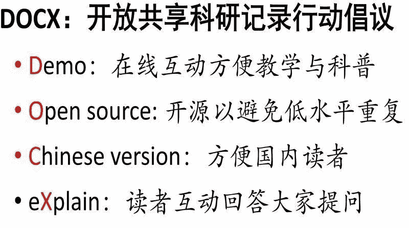

↑↑↑关注后"星标"Datawhale

每日干货 & [每月组队学习](https://mp.weixin.qq.com/mp/appmsgalbum?__biz=MzIyNjM2MzQyNg%3D%3D&action=getalbum&album_id=1338040906536108033#wechat_redirect)，不错过

 Datawhale推荐 

**作者：程明明，南开大学教授、计算机系主任**

十多年前我开始读研的时候，开源还不是主流。每做一个工作，都要花费很多时间精力去重现前人的工作。但是，稍微复杂的一个系统，都会受到很多细节因素的影响。我们实现前人工作的时候，最痛苦的还不是这个重复劳动的工作量，而是论文中不可能把所有细节说清楚，导致自己实现的版本往往并不如原始作者的版本（毕竟原作者花了很多精力打磨）。

2011年开始，我慢慢养成了代码开源的习惯，在不违反保密和商业协议的前提下，尽我所能最大化的开放我自己科研成果中的代码和数据。若干年后，我猛然意识到，那些自己没有及时开源的代码和数据，由于这些年工作单位和常用电脑的多次更换，大部分自己都找不到了。为了方便科研共同体，同时也方便自己，我想提出以下开放共享科研记录行动倡议。借用 Word软件的文件名后缀，我将这个倡议总结为DOCX：

*   **D**emo：在线互动方便教学与科普。尽可能为自己科研论文中涉及的每个问题做一个在线的demo，方便自己随时使用，方便同领域老师的课堂教学实验，方便给公众科普现在的技术水平能做什么。例如我们实验室的Demo程序后续陆续都会在这里更新：https://mmcheng.net/category/demo/

*   **O**pen source: 为了避免大家不必要的反复低水平重复工作，我们尽量开源自己每篇论文的代码。作为大部分科研资助来源于政府资金的事业单位，我们的科研成果也有义务面向公众开源。这里的开源，除了开源代码，也包括开源实验数据 https://mmcheng.net/code-data/。因此，整个倡议的题目是开放共享科研记录（代码+数据）行动倡议。

*   **C**hinese version：对包括我自己在内的很多国内科研人员来说。阅读同样一篇论文，中文版不论是从阅读速度，理解深度，还是记忆深刻程度上来讲，都明显优于相同的英文版。但是从国际科研影响力，以及评审的公正性、权威性来讲，国外顶级英文学术期刊目前依然是很难绕过去的高山。所以我建议大家在英文顶级会议或者期刊发表论文的同时，可以在自己主页上共享一个中文翻译版，方便国内读者阅读。我们论文主页上的很多论文后面都有**中译版 **https://mmcheng.net/publications/ ，方便国内读者阅读

*   e**X**plain：大家在阅读论文时，经常碰到疑惑，希望能够和作者及同行交流。同时，作者也很多时候也希望听到来自同行的反馈。因此，我倡议，大家尽量为自己的每篇论文建立一个项目主页，读者如果有问题可以去主页上留言。论文的co-author们看到这些留言后尽量及时回复。

从我做起，行动示例。上述倡议中开源(Open source)和回答问题(eXplain)我已经执行很多年了，感觉在交流共享给学术共同体服务的同时。自己其实是整个过程中受益最多的。这个过程启发我拓展了思维，促成了很多新的想法的形成。这样的样例可以通过我个人主页 https://mmcheng.net/publications/ 中的每一个论文后面的 source code和project page链接找到。

这些年国内的科研水平进步很快。以计算机视觉为例，顶级会议论文的第一作者中，华人已经超过半数。但是我们还得用英文而非自己的母语去阅读大部分论文。我们依然经常需要去实现别人的工作并纠结于为什么实现的结果不一样。我们看到了论文里面的很多炫酷的结果，但不是很容易方便的尝试这些新的技术。作为华人科研群体里的一份子，我号召大家共同为整个生态更加健康发展贡献一份自己的力量，同时大家也将从这个生态的发展中受益更多。

在开放共享的同时，另一个让我一直很担心的事情是国产生态。开源了这么多人工智能算法的代码，大家基本上用的都是美国的Pytorch，TensorFlow或者Caffe。期待国产生态如华为MindSpore，百度PaddlePaddle，清华Jittor的崛起。大家是否可以考虑稍微放慢论文发表的速度，在开源Pytorch代码的同时，也开源至少一个国产平台的版本。最后，立此文为据，从我做起，并衷心的期待华人科研生态系统越来越强大，国产生态平台越来越强大。

欢迎转发或者按照这个倡议的精神去共享。原贴地址：https://mmcheng.net/docx/

扩展阅读：

*   开源组织Datawhale：https://github.com/datawhalechina/

*   代码共享规范：https://github.com/paperswithcode/releasing-research-code

“科研开源之路，为DOCX**点****赞****三连**↓