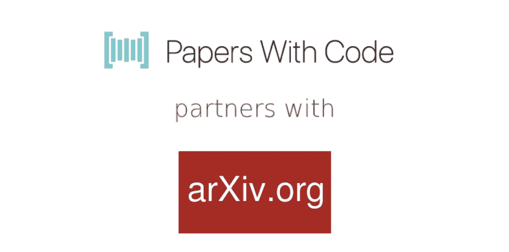
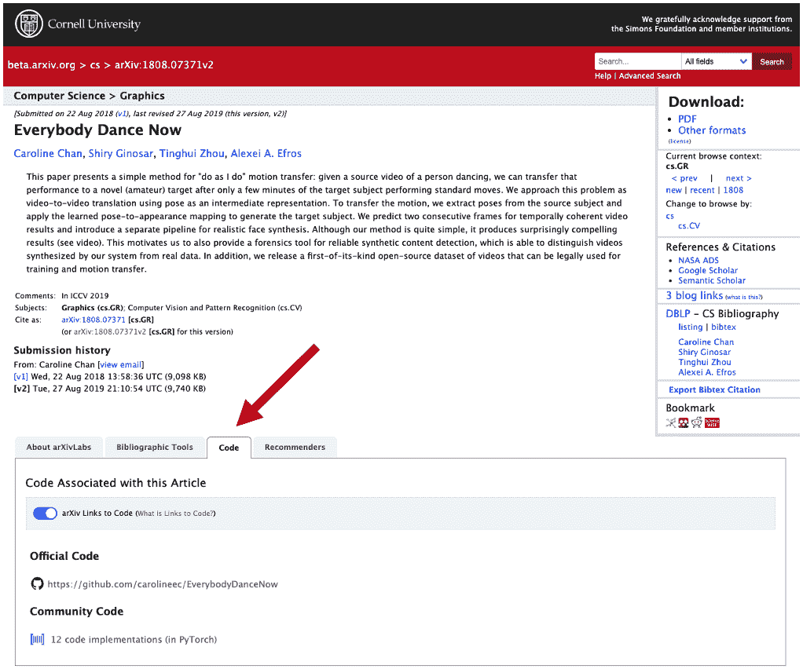
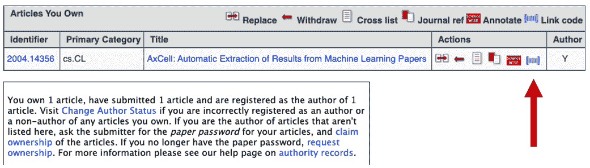
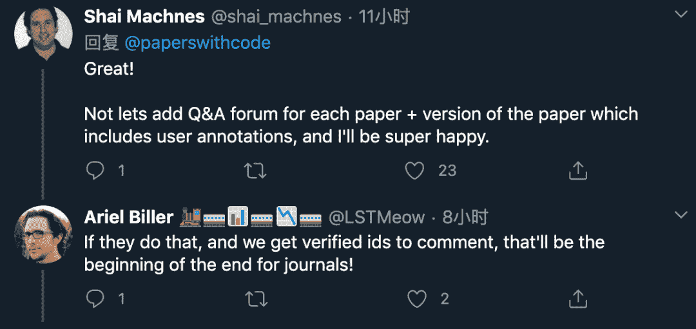

↑↑↑关注后"星标"Datawhale

每日干货 & [每月组队学习](https://mp.weixin.qq.com/mp/appmsgalbum?__biz=MzIyNjM2MzQyNg%3D%3D&action=getalbum&album_id=1338040906536108033#wechat_redirect)，不错过

 Datawhale推荐 

**作者：魔王，来源：机器之心**

> 刚刚，机器学习资源网站 Papers with Code 宣布与论文预印本平台 arXiv 进行合作，论文作者在 arXiv 上上传论文时可以同步上传官方和社区代码，这或许有助于解决论文可复现性问题。

机器学习资源网站 Papers with Code 自创立以来，凭借丰富的开放资源和卓越的社区服务，成为机器学习研究者最常用的资源网站之一。2019 年底，[Papers with Code 正式并入 Facebook AI](http://mp.weixin.qq.com/s?__biz=MzA3MzI4MjgzMw%3D%3D&chksm=871a67c3b06deed54f6fcbfa20ab799f63bebd2c7c24e2a8ce0c36a5acb6d784e4318041c5ff&idx=4&mid=2650776509&scene=21&sn=b013aca7cfa62709b48c32ca8cc9aad7#wechat_redirect)。最近，它又有了新举措：与论文预印本平台 arXiv 展开合作，支持在 arXiv 页面上添加代码链接。

现在，arXiv 上机器学习论文摘要页面的下方出现了一个 Code 按钮，它可以链接论文相关的官方和社区代码实现：

*arXiv 论文页面新增的 Code 部分（Papers with Code 提供支持）。*

*可提供官方代码和社区代码。*

**如何使用？**

论文作者登录 arXiv 网站，点击 Papers with Code 图标即可添加官方代码（参见下图箭头）。然后，页面转向 Papers with Code 网站，作者可以在那里添加代码。官方代码实现添加完成后，arXiv 论文摘要页面将出现官方代码（official code）部分。

Papers With Code 联合创始人 Robert Stojnic 表示：

> Papers With Code 的宗旨是通过使用户更轻松地获取、使用和扩展各项研究，来促进科技进步。与 arXiv 的此次合作可以帮助研究人员和从业者更轻松地基于最新机器学习研究进行复用和扩展。
> 
> Papers With Code 希望这一举措可以对机器学习以外更广泛的计算科学带来连锁反应。科学是逐渐累积的。开放科学，包括公布源代码，有助于加速科学的进步。

**全球最大的预印本系统 + 机器学习研究者最常用的资源网站 = ？**

当越来越多的人在上传论文到 arXiv 时顺手附上代码实现，提交代码是否会演变成为社区规范？这将带来什么影响？

不管最终如何，arXiv 和 Papers With Code 的合作首先有助于解决研究的可复现性问题。

有网友表示：「当这成为规范，提交代码将成为在计算机科学期刊上发表文章的软要求，如果期刊还存在的话……」

无独有偶，还有人设想，要是再加些新的功能（比如 Q&A 论坛、读者评论），说不定期刊的时代真的可以结束了：

可复现性是科学领域长期关注的话题，近期人工智能和机器学习社区也对此投入了更多关注。例如 ICML、ICLR 和 NeurIPS 这些顶级学术会议都在努力推进将实验代码和数据作为评审材料的一部分提交，并鼓励作者在评审或出版过程中提交代码以帮助结果可复现。

在此背景下，Papers with Code 与 arXiv 的合作将对可复现性研究带来有益的影响。当提交代码成为规范，当可复现性难题得到解决，开放科学还会远吗？

“干货分享，**点****赞****三连**↓