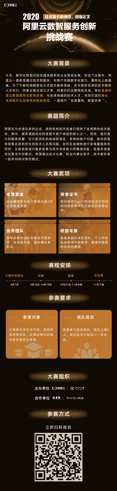

↑↑↑关注后"星标"Datawhale

每日干货 & [每月组队学习](https://mp.weixin.qq.com/mp/appmsgalbum?__biz=MzIyNjM2MzQyNg%3D%3D&action=getalbum&album_id=1338040906536108033#wechat_redirect)，不错过

 Datawhale 

**举办方：阿里云，浙江大学，阿里巴巴达摩院**

> 9月17日，阿里巴巴集团副总裁，阿里云智能全球技术服务部总经理李津在2020云栖大会技术服务分论坛上，宣布启动首届阿里云数智服务创新挑战赛。此次大赛由阿里云、浙江大学、阿里巴巴达摩院、天池平台联合举办。

作为全球前三的云计算及人工智能科技公司，阿里云为全球众多的企业组织和开发者们提供了全周期的技术服务。其中，服务调度优化则是提升客户体验的核心之一。然而，面对庞大的服务体量、巨大差异化的地域和语言、多样的客户问题、复杂的服务场景等问题，如何在保障快速分发海量服务的同时，又能高效进行服务场景与技术专家能力的精准匹配，是服务调度优化算法中的难点。

“从技术走向产品，从产品走向服务，是所有技术公司的必由之路。希望通过此次比赛，让更多年轻人知道什么是数智化时代的技术服务，如何做企业的数字化转型。”李津表示，“希望通过比赛能触达100所全球顶尖高校的1000支以上的参赛队伍，从中选拔出一批最具创新、创业精神的年轻人，给予激励。”

浙江大学控制学院副院长侯迪波教授表示，“服务的线上化已成为常态，因此如何优化服务体验相当关键。现有的人工智能技术主要面向特定任务，关注在确定性条件下的建模和决策问题。而人的思维及行为的复杂性、不确定性，使得人工智能技术在涉及解决与人相关的任务时，还面临许多困难。本次大赛以‘服务’作为切入点，希望能够吸引更多的年轻学子关注人工智能技术、知识自动化技术等在复杂、不确定性条件下的应用。”

值得一提的是，此次比赛过程中沉淀的代码及思考，将会分享在各大技术论坛及科技展会，与全球技术爱好者共建科技服务生态智库。

“阅读原文，直接报名↓