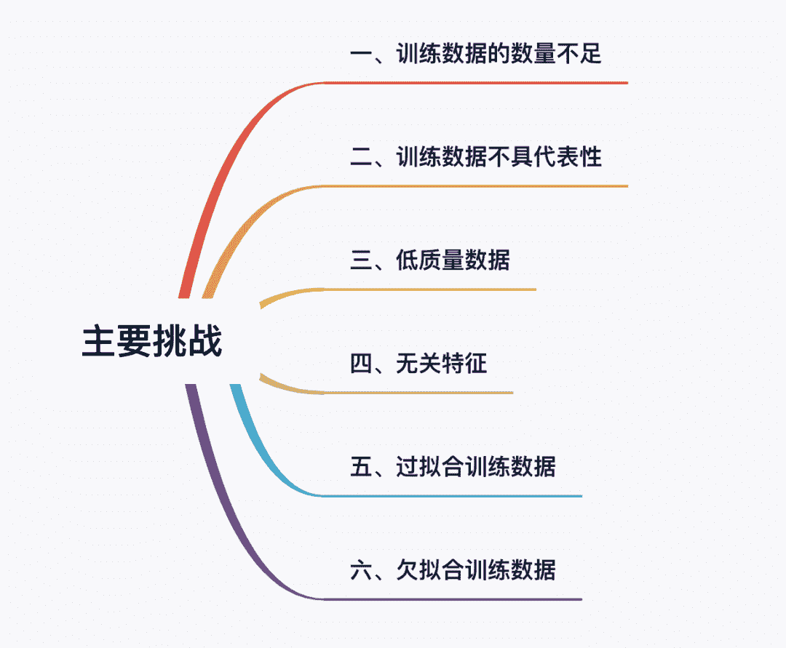
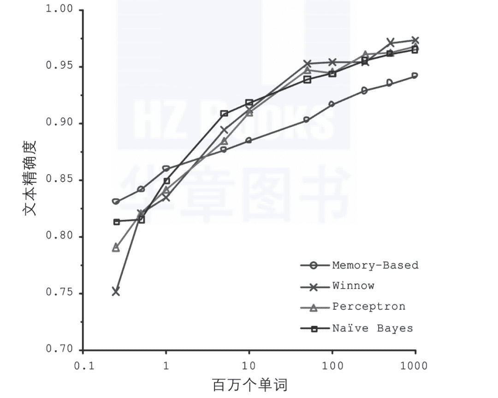
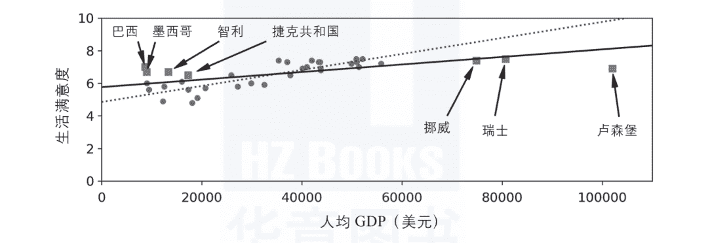
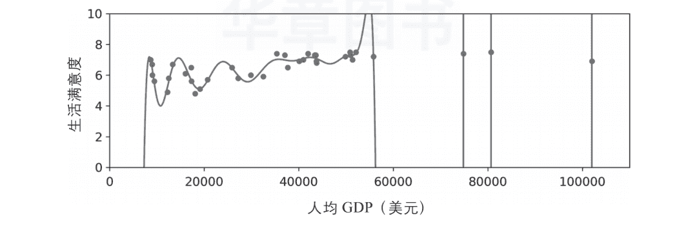
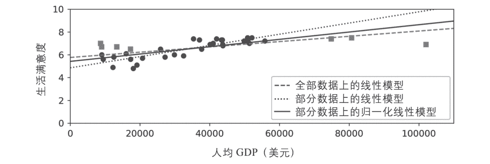

↑↑↑关注后"星标"Datawhale

每日干货 & [每月组队学习](https://mp.weixin.qq.com/mp/appmsgalbum?__biz=MzIyNjM2MzQyNg%3D%3D&action=getalbum&album_id=1338040906536108033#wechat_redirect)，不错过

 Datawhale干货 

**作者：奥雷利安·杰龙**

由于我们的主要任务是选择一种学习算法，并对某些数据进行训练，所以最可能出现的两个问题不外乎是“坏算法”和“坏数据”，本文主要从坏数据出发，带大家了解目前机器学习面临的常见问题和挑战，从而更好地学习机器学习理论。

## 一、训练数据的数量不足

要教一个牙牙学语的小朋友什么是苹果，你只需要指着苹果说“苹果”（可能需要重复这个过程几次）就行了，然后孩子就能够识别各种颜色和形状的苹果了，简直是天才！

机器学习还没达到这一步，大部分机器学习算法需要大量的数据才能正常工作。即使是最简单的问题，很可能也需要成千上万个示例，而对于诸如图像或语音识别等复杂问题，则可能需要数百万个示例（除非你可以重用现有模型的某些部分）。

### 数据的不合理有效性

在2001年发表的一篇著名论文中，微软研究员Michele Banko和Eric Brill表明，给定足够的数据，截然不同的机器学习算法（包括相当简单的算法）在自然语言歧义消除这个复杂问题上注8，表现几乎完全一致（如下图所示）。

<figcaption>数据与算法的重要性注</figcaption>

正如作者所说：“这些结果表明，我们可能会重新思考如何在二者之间做权衡—将钱和时间花在算法的开发上，还是花在语料库的建设上。”

对复杂问题而言，数据比算法更重要，这一想法被Peter Norvig等人进一步推广，于2009年发表论文“The Unreasonable Effectiveness of Data”注10。不过需要指出的是，中小型数据集依然非常普遍，获得额外的训练数据并不总是一件轻而易举或物美价廉的事情，所以暂时先不要抛弃算法。

## 二、训练数据不具代表性

为了很好地实现泛化，至关重要的一点是对于将要泛化的新示例来说，训练数据一定要非常有代表性。无论你使用的是基于实例的学习还是基于模型的学习，都是如此。

例如，前面用来训练线性模型的国家数据集并不具备完全的代表性，有部分国家的数据缺失。下图显示了补充缺失国家信息之后的数据表现。

<figcaption>更具代表性的训练样本</figcaption>

如果你用这个数据集训练线性模型，将会得到图中的实线，而虚线表示旧模型。正如你所见，添加部分缺失的国家信息不仅显著地改变了模型，也更清楚地说明这种简单的线性模型可能永远不会那么准确。看起来，某些非常富裕的国家并不比中等富裕的国家更幸福（事实上，看起来甚至是不幸福），反之，一些贫穷的国家也似乎比许多富裕的国家更加幸福。

使用不具代表性的训练集训练出来的模型不可能做出准确的预估，尤其是针对那些特别贫穷或特别富裕的国家。

针对你想要泛化的案例使用具有代表性的训练集，这一点至关重要。不过说起来容易，做起来难：如果样本集太小，将会出现采样噪声（即非代表性数据被选中）；而即便是非常大的样本数据，如果采样方式欠妥，也同样可能导致非代表性数据集，这就是所谓的采样偏差。

### 关于采样偏差的一个示例

最著名的采样偏差的示例发生在1936年美国总统大选期间，兰登对决罗斯福。Literary Digest当时举行了一次大范围的民意调查，向约1000万人发送邮件，并得到了240万个回复，因此做出了高度自信的预言—兰登将获得57%的选票。结果恰恰相反，罗斯福赢得了62%的选票。问题就在于Literary Digest的采样方式：

*   首先，为了获取发送民意调查的地址，Literary Digest采用了电话簿、杂志订阅名单、俱乐部会员名单等类似名簿。而所有这些名单上的人往往对富人有更大的偏好，也就更有可能支持共和党（即兰登）。

*   其次，收到民意调查邮件的人中，不到25%的人给出了回复。这再次引入了采样偏差，那些不怎么关心政治的人、不喜欢Literary Digest的人以及其他的一些关键群体直接被排除在外了。这是一种特殊类型的采样偏差，叫作无反应偏差。

再举一个示例，假设你想创建一个系统用来识别funk音乐视频。构建训练集的方法之一是直接在YouTube上搜索“funk music”，然后使用搜索结果的视频。但是，这其实基于一个假设—YouTube的搜索引擎返回的视频结果是所有能够代表funk音乐的视频。而实际的搜索结果可能会更偏向于当前流行的音乐人（如果你住在巴西，你会得到很多关于“funk carioca”的视频，这听起来跟James Brown完全不是一回事）。另一方面，你还能怎样获得一个大的训练集？

## 三、低质量数据

显然，如果训练集满是错误、异常值和噪声（例如，低质量的测量产生的数据），系统将更难检测到底层模式，更不太可能表现良好。所以花时间来清理训练数据是非常值得的投入。事实上，大多数数据科学家都会花费很大一部分时间来做这项工作。例如：

*   如果某些实例明显是异常情况，那么直接将其丢弃，或者尝试手动修复错误，都会大有帮助。

*   如果某些实例缺少部分特征（例如，5%的顾客没有指定年龄），你必须决定是整体忽略这些特征、忽略这部分有缺失的实例、将缺失的值补充完整（例如，填写年龄值的中位数），还是训练一个带这个特征的模型，再训练一个不带这个特征的模型。

## 四、无关特征

正如我们常说的：垃圾入，垃圾出。只有训练数据里包含足够多的相关特征以及较少的无关特征，系统才能够完成学习。一个成功的机器学习项目，其关键部分是提取出一组好的用来训练的特征集。这个过程叫作特征工程，包括以下几点：

*   特征选择（从现有特征中选择最有用的特征进行训练）。

*   特征提取（将现有特征进行整合，产生更有用的特征—正如前文提到的，降维算法可以提供帮助）。

*   通过收集新数据创建新特征。

现在我们已经看了不少“坏数据”的示例，再来看几个“坏算法”的示例。

## 五、过拟合训练数据

假设你正在国外旅游，被出租车司机敲诈，你很可能会说，那个国家的所有出租车司机都是强盗。过度概括是我们人类常做的事情，不幸的是，如果我们不小心，机器很可能也会陷入同样的陷阱。在机器学习中，这称为过拟合，也就是指模型在训练数据上表现良好，但是泛化时却不尽如人意。下图显示了一个训练数据过拟合的高阶多项式生活满意度模型。虽然它在训练数据上的表现比简单的线性模型要好得多，但是你真的敢相信它的预测吗？

<figcaption>过拟合训练数据</figcaption>

虽然诸如深度神经网络这类的复杂模型可以检测到数据中的微小模式，但是如果训练集本身是有噪声的，或者数据集太小（引入了采样噪声），那么很可能会导致模型检测噪声本身的模式。很显然，这些模式不能泛化至新的实例。举例来说，假设你给生活满意度模型提供了更多其他的属性，包括一些不具信息的属性（例如国家名）。在这种情况下，一个复杂模型可能会检测到这样的事实模式：训练数据中，名字中带有字母w的国家，如新西兰（New Zealand，生活满意度为7.3）、挪威（Norway，生活满意度为7.4）、瑞典（Sweden，生活满意度为7.2）和瑞士（Switzerland，生活满意度为7.5），生活满意度均大于7。当把这个w满意度规则泛化到卢旺达（Rwanda）或津巴布韦（Zim-babwe）时，你对结果有多大的自信？显然，训练数据中的这个模式仅仅是偶然产生的，但是模型无法判断这个模式是真实的还是噪声产生的结果。

当模型相对于训练数据的数量和噪度都过于复杂时，会发生过拟合。可能的解决方案如下。

*   简化模型：可以选择较少参数的模型（例如，选择线性模型而不是高阶多项式模型）也可以减少训练数据中的属性数量，或者是约束模型。

*   收集更多的训练数据。

*   减少训练数据中的噪声（例如，修复数据错误和消除异常值）。

通过约束模型使其更简单，并降低过拟合的风险，这个过程称为正则化。例如，我们前面定义的线性模型有两个参数：θ0和θ1。因此，该算法在拟合训练数据时，调整模型的自由度就等于2，它可以调整线的高度（θ0）和斜率（θ1）。如果我们强行让θ1 = 0，那么算法的自由度将会降为1，并且拟合数据将变得更为艰难—它能做的全部就只是将线上移或下移来尽量接近训练实例，最后极有可能停留在平均值附近。这确实太简单了！如果我们允许算法修改θ1，但是我们强制它只能是很小的值，那么算法的自由度将位于1和2之间，这个模型将会比自由度为2的模型稍微简单一些，同时又比自由度为1的模型略微复杂一些。你需要在完美匹配数据和保持模型简单之间找到合适的平衡点，从而确保模型能够较好地泛化。

下图显示了三个模型。点线表示的是在以圆圈表示的国家上训练的原始模型（没有正方形表示的国家），虚线是我们在所有国家（圆圈和方形）上训练的第二个模型，实线是用与第一个模型相同的数据训练的模型，但是有一个正则化约束。可以看到，正则化强制了模型的斜率较小：该模型与训练数据（圆圈）的拟合不如第一个模型，但它实际上更好地泛化了它没有在训练时看到的新实例（方形）。

在学习时，应用正则化的程度可以通过一个超参数来控制。超参数是学习算法（不是模型）的参数。因此，它不受算法本身的影响。超参数必须在训练之前设置好，并且在训练期间保持不变。如果将正则化超参数设置为非常大的值，会得到一个几乎平坦的模型（斜率接近零）。学习算法虽然肯定不会过拟合训练数据，但是也更加不可能找到一个好的解决方案。调整超参数是构建机器学习系统非常重要的组成部分。

<figcaption>正则化降低了过拟合的风险</figcaption>

## 六、欠拟合训练数据

你可能已经猜到了，欠拟合和过拟合正好相反。它的产生通常是因为对于底层的数据结构来说，你的模型太过简单。例如，用线性模型来描述生活满意度就属于欠拟合。现实情况远比模型复杂得多，所以即便是对于用来训练的示例，该模型产生的预测都一定是不准确的。

解决这个问题的主要方式有：

*   选择一个带有更多参数、更强大的模型。

*   给学习算法提供更好的特征集（特征工程）。

*   减少模型中的约束（例如，减少正则化超参数）。

## 七、全局总结

现在我们对机器学习已经有了一定了解。我们暂且退后一步，纵观一下全局：

*   机器学习是关于如何让机器可以更好地处理某些特定任务的理论，它从数据中学习，而无须清晰地编码规则。

*   机器学习系统有很多类型：有监督和无监督，批量的和在线的，基于实例的和基于模型的，等等。

*   在一个机器学习项目中，你从训练集中采集数据，然后将数据交给学习算法来计算。如果算法是基于模型的，它会调整一些参数来将模型适配于训练集（即对训练集本身做出很好的预测），然后算法就可以对新的场景做出合理的预测。如果算法是基于实例的，它会记住这些示例，并根据相似度度量将它们与所学的实例进行比较，从而泛化这些新实例。

*   如果训练集的数据太少或数据代表性不够，包含太多噪声或者被一些无关特征污染（垃圾进，垃圾出），那么系统将无法很好地工作。最后，你的模型既不能太简单（会导致欠拟合），也不能太复杂（会导致过拟合）。

本文内容节选自《机器学习实战：基于Scikit-Learn、Keras和TensorFlow（原书第2版）》一书，由奥雷利安·杰龙所著，是国外AI“四大名著”之一。本书分为两部分。第一部分是机器学习基础；第二部分是神经网络和深度学习，是一本理论结合实践的经典书籍。全文内容经出版社授权分享。

“干货学习，**点****赞****三连**↓