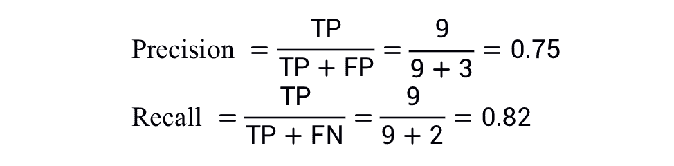
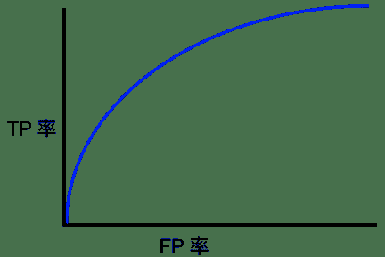

↑↑↑关注后"星标"Datawhale

每日干货 & [每月组队学习](https://mp.weixin.qq.com/mp/appmsgalbum?__biz=MzIyNjM2MzQyNg%3D%3D&action=getalbum&album_id=1338040906536108033#wechat_redirect)，不错过

 Datawhale干货 

**译者：张峰，Datawhale成员**

本文将介绍机器学习算法中非常重要的知识—分类（classification），即找一个函数判断输入数据所属的类别，可以是二类别问题（是/不是），也可以是多类别问题（在多个类别中判断输入数据具体属于哪一个类别）。与回归问题（regression）相比，分类问题的输出不再是连续值，而是离散值，用来指定其属于哪个类别。分类问题在现实中应用非常广泛，比如垃圾邮件识别，手写数字识别，人脸识别，语音识别等。

## 一、指定阈值

逻辑回归返回的是概率。你可以“原样”使用返回的概率（例如，用户点击此广告的概率为 0.00023），也可以将返回的概率转换成二元值（例如，这封电子邮件是垃圾邮件）。

如果某个逻辑回归模型对某封电子邮件进行预测时返回的概率为 0.9995，则表示该模型预测这封邮件非常可能是垃圾邮件。相反，在同一个逻辑回归模型中预测分数为 0.0003 的另一封电子邮件很可能不是垃圾邮件。可如果某封电子邮件的预测分数为 0.6 呢？为了将逻辑回归值映射到二元类别，你必须指定**分类阈值**（也称为**判定阈值**）。如果值高于该阈值，则表示“垃圾邮件”；如果值低于该阈值，则表示“非垃圾邮件”。人们往往会认为分类阈值应始终为 0.5，但阈值取决于具体问题，因此你必须对其进行调整。

我们将在后面的部分中详细介绍可用于对分类模型的预测进行评估的指标，以及更改分类阈值对这些预测的影响。

⭐️ 注意：

“调整”逻辑回归的阈值不同于调整学习速率等超参数。在选择阈值时，需要评估你将因犯错而承担多大的后果。例如，将非垃圾邮件误标记为垃圾邮件会非常糟糕。不过，虽然将垃圾邮件误标记为非垃圾邮件会令人不快，但应该不会让你丢掉工作。

## 二、阳性与阴性以及正类别与负类别

在本部分，我们将定义用于评估分类模型指标的主要组成部分先。不妨，我们从一则寓言故事开始：

> “
> 
> 伊索寓言：狼来了（精简版） 有一位牧童要照看镇上的羊群，但是他开始厌烦这份工作。为了找点乐子，他大喊道：“狼来了！”其实根本一头狼也没有出现。村民们迅速跑来保护羊群，但他们发现这个牧童是在开玩笑后非常生气。(这样的情形重复出现了很多次。)
> ...
> 一天晚上，牧童看到真的有一头狼靠近羊群，他大声喊道：“狼来了！”村民们不想再被他捉弄，都待在家里不出来。这头饥饿的狼对羊群大开杀戒，美美饱餐了一顿。这下子，整个镇子都揭不开锅了。恐慌也随之而来。
> 
> ”

我们做出以下定义：

*   “狼来了”是正类别。

*   “没有狼”是负类别。

我们可以使用一个 2x2的混淆矩阵来总结我们的“狼预测”模型，该矩阵描述了所有可能出现的结果（共四种）：

**真正例**是指模型将正类别样本正确地预测为正类别。同样，**真负例**是指模型将负类别样本正确地预测为负类别。

**假正例**是指模型将负类别样本错误地预测为正类别，而**假负例**是指模型将正类别样本错误地预测为负类别。

在后面的部分中，我们将介绍如何使用从这四种结果中衍生出的指标来评估分类模型。

## 三、准确率

准确率是一个用于评估分类模型的指标。通俗来说，**准确率是指我们的模型预测正确的结果所占的比例**。正式点说，准确率的定义如下：

对于二元分类，也可以根据正类别和负类别按如下方式计算准确率：

其中，TP = 真正例，TN = 真负例，FP = 假正例，FN = 假负例。让我们来试着计算一下以下模型的准确率，该模型将 100 个肿瘤分为恶性 （正类别）或良性（负类别）：

 

准确率为 0.91，即 91%（总共 100 个样本中有 91 个预测正确）。这表示我们的肿瘤分类器在识别恶性肿瘤方面表现得非常出色，对吧？

实际上，只要我们仔细分析一下正类别和负类别，就可以更好地了解我们模型的效果。

在 100 个肿瘤样本中，91 个为良性（90 个 TN 和 1 个 FP），9 个为恶性（1 个 TP 和 8 个 FN）。

在 91 个良性肿瘤中，该模型将 90 个正确识别为良性。这很好。不过，在 9 个恶性肿瘤中，该模型仅将 1 个正确识别为恶性。这是多么可怕的结果！9 个恶性肿瘤中有 8 个未被诊断出来！

虽然 91% 的准确率可能乍一看还不错，但如果另一个肿瘤分类器模型总是预测良性，那么这个模型使用我们的样本进行预测也会实现相同的准确率（100 个中有 91 个预测正确）。换言之，我们的模型与那些没有预测能力来区分恶性肿瘤和良性肿瘤的模型差不多。

当你使用**分类不平衡的数据集**（比如正类别标签和负类别标签的数量之间存在明显差异）时，单单准确率一项并不能反映全面情况。

在下一部分中，我们将介绍两个能够更好地评估分类不平衡问题的指标：精确率和召回率。

### 学习理解

在以下哪种情况下，高的准确率值表示机器学习模型表现出色？

*   一只造价昂贵的机器鸡每天要穿过一条交通繁忙的道路一千次。某个机器学习模型评估交通模式，预测这只鸡何时可以安全穿过街道，准确率为 99.99%。

*   一种致命但可治愈的疾病影响着 0.01% 的人群。某个机器学习模型使用其症状作为特征，预测这种疾病的准确率为 99.99%。

*   在 roulette 游戏中，一只球会落在旋转轮上，并且最终落入 38 个槽的其中一个内。某个机器学习模型可以使用视觉特征（球的旋转方式、球落下时旋转轮所在的位置、球在旋转轮上方的高度）预测球会落入哪个槽中，准确率为 4%。

## 四、精确率和召回率

### 4.1 精确率

精确率指标尝试回答以下问题：在被识别为正类别的样本中，确实为正类别的比例是多少？

精确率的定义如下：

⭐️ 注意：如果模型的预测结果中没有假正例，则模型的精确率为 1.0。

让我们来计算一下上一部分中用于分析肿瘤的机器学习模型的精确率：

 

该模型的精确率为 0.5，也就是说，该模型在预测恶性肿瘤方面的正确率是 50%。

### 4.2 召回率

召回率尝试回答以下问题：在所有正类别样本中，被正确识别为正类别的比例是多少？

从数学上讲，召回率的定义如下：

⭐️ 注意：如果模型的预测结果中没有假负例，则模型的召回率为 1.0。

让我们来计算一下肿瘤分类器的召回率：

 

该模型的召回率是 0.11，也就是说，该模型能够正确识别出所有恶性肿瘤的百分比是 11%。

### 4.3 精确率和召回率：一场拔河比赛

要全面评估模型的有效性，必须同时检查精确率和召回率。遗憾的是，精确率和召回率往往是此消彼长的情况。也就是说，提高精确率通常会降低召回率值，反之亦然。请观察下图来了解这一概念，该图显示了电子邮件分类模型做出的 30 项预测。分类阈值右侧的被归类为“垃圾邮件”，左侧的则被归类为“非垃圾邮件”。

<figcaption>图 1\. 将电子邮件归类为垃圾邮件或非垃圾邮件</figcaption>

我们根据图 1 所示的结果来计算精确率和召回率值：

精确率指的是**被标记为垃圾邮件的电子邮件**中正确分类的电子邮件所占的百分比，即图 1 中阈值线右侧的绿点所占的百分比：

召回率指的是**实际垃圾邮件**中正确分类的电子邮件所占的百分比，即图 1 中阈值线右侧的绿点所占的百分比：

图 2 显示了提高分类阈值产生的效果。

<figcaption>图2\. 提高分类阈值</figcaption>

假正例数量会减少，但假负例数量会相应地增加。结果，精确率有所提高，而召回率则有所降低：

 

相反，图 3 显示了降低分类阈值（从图 1 中的初始位置开始）产生的效果。

<figcaption>图 3.降低分类阈值</figcaption>

假正例数量会增加，而假负例数量会减少。结果这一次，精确率有所降低，而召回率则有所提高：

 

我们已根据精确率和召回率指标制定了各种指标。有关示例，请参阅 F1 值。

### 学习理解

让我们以一种将电子邮件分为“垃圾邮件”或“非垃圾邮件”这两种类别的分类模型为例。如果提高分类阈值，精确率会怎样？

*   可能会提高。

*   一定会提高。

*   一定会降低。

*   可能会降低。

让我们以一种将电子邮件分为“垃圾邮件”或“非垃圾邮件”这两种类别的分类模型为例。如果提高分类阈值，召回率会怎样？

*   始终下降或保持不变。

*   始终保持不变。

*   一定会提高。

以两个模型（A 和 B）为例，这两个模型分别对同一数据集进行评估。以下哪一项陈述属实？

*   如果模型 A 的精确率优于模型 B，则模型 A 更好。

*   如果模型 A 的精确率和召回率均优于模型 B，则模型 A 可能更好。

*   如果模型 A 的召回率优于模型 B，则模型 A 更好。

## 五、ROC 和 AUC

### 5.1 ROC 曲线

ROC 曲线（接收者操作特征曲线）是一种显示分类模型在所有分类阈值下的效果图表。该曲线绘制了以下两个参数：

*   真正例率

*   假正例率

**真正例率** (TPR) 是召回率的同义词，因此定义如下：

**假正例率** (FPR) 的定义如下：

ROC 曲线用于绘制采用不同分类阈值时的 TPR 与 FPR。降低分类阈值会导致将更多样本归为正类别，从而增加假正例和真正例的个数。下图显示了一个典型的 ROC 曲线。

<figcaption>图 4\. 不同分类阈值下的 TP 率与 FP 率</figcaption>

为了计算 ROC 曲线上的点，我们可以使用不同的分类阈值多次评估逻辑回归模型，但这样做效率非常低。幸运的是，有一种基于排序的高效算法可以为我们提供此类信息，这种算法称为曲线下面积。

### 5.2 曲线下面积：ROC 曲线下面积

**曲线下面积**表示“ROC 曲线下面积”。也就是说，曲线下面积测量的是从 (0,0) 到 (1,1) 之间整个 ROC 曲线以下的整个二维面积（参考积分学）。

<figcaption>图 5\. 曲线下面积（ROC 曲线下面积）</figcaption>

曲线下面积对所有可能的分类阈值的效果进行综合衡量。曲线下面积的一种解读方式是看作模型将某个随机正类别样本排列在某个随机负类别样本之上的概率。以下面的样本为例，逻辑回归预测从左到右以升序排列：

<figcaption>图 6\. 预测按逻辑回归分数以升序排列</figcaption>

曲线下面积表示随机正类别（绿色）样本位于随机负类别（红色）样本右侧的概率。

曲线下面积的取值范围为 0-1。预测结果 100% 错误的模型的曲线下面积为 0.0；而预测结果 100% 正确的模型的曲线下面积为 1.0。

曲线下面积因以下两个原因而比较实用：

*   曲线下面积的**尺度不变**。它测量预测的排名情况，而不是测量其绝对值。

*   曲线下面积的**分类阈值不变**。它测量模型预测的质量，而不考虑所选的分类阈值。

不过，这两个原因都有各自的局限性，这可能会导致曲线下面积在某些用例中不太实用：

*   **并非总是希望尺度不变**。例如，有时我们非常需要被良好校准的概率输出，而曲线下面积无法告诉我们这一结果。

*   **并非总是希望分类阈值不变**。在假负例与假正例的代价存在较大差异的情况下，尽量减少一种类型的分类错误可能至关重要。例如，在进行垃圾邮件检测时，你可能希望优先考虑尽量减少假正例（即使这会导致假负例大幅增加）。对于此类优化，曲线下面积并非一个实用的指标。

### 学习理解

以下哪条 ROC 曲线可产生大于 0.5 的 AUC 值？

    

将给定模型的所有预测结果都乘以 2.0（例如，如果模型预测的结果为 0.4，我们将其乘以 2.0 得到 0.8），会使按 AUC 衡量的模型效果产生何种变化？

*   这会使 AUC 变得更好，因为预测值之间相差都很大。

*   没有变化。AUC 只关注相对预测分数。

*   这会使 AUC 变得很糟糕，因为预测值现在相差太大。

## 六、预测偏差

逻辑回归预测应当无偏差。即：

**预测偏差**指的是这两个平均值之间的差值。即：

预测偏差=预测平均值−数据集中相应标签的平均值

⭐️ 注意：“预测偏差”与偏差（“wx + b”中的“b”）不是一回事。

如果出现非常高的非零预测偏差，则说明模型某处存在错误，因为这表明模型对正类别标签的出现频率预测有误。

例如，假设我们知道，所有电子邮件中平均有 1% 的邮件是垃圾邮件。如果我们对某一封给定电子邮件一无所知，则预测它是垃圾邮件的可能性为 1%。同样，一个出色的垃圾邮件模型应该预测到电子邮件平均有 1% 的可能性是垃圾邮件。（换言之，如果我们计算单个电子邮件是垃圾邮件的预测可能性的平均值，则结果应该是 1%。）然而，如果该模型预测电子邮件是垃圾邮件的平均可能性为 20%，那么我们可以得出结论，该模型出现了预测偏差。

造成预测偏差的可能原因包括：

*   特征集不完整

*   数据集混乱

*   模型实现流水线中有错误

*   训练样本有偏差

*   正则化过强

你可能会通过对学习模型进行后期处理来纠正预测偏差，即通过添加校准层来调整模型的输出，从而减小预测偏差。例如，如果你的模型存在 3% 以上的偏差，则可以添加一个校准层，将平均预测偏差降低 3%。但是，添加校准层并非良策，具体原因如下：

*   你修复的是症状，而不是原因。

*   你建立了一个更脆弱的系统，并且必须持续更新。

*   使用校准层来修复模型的所有错误。

如果可能的话，请避免添加校准层。使用校准层的项目往往会对其产生依赖

最终，维护校准层可能会令人苦不堪言。

⭐️ 注意：出色模型的偏差通常接近于零。即便如此，预测偏差低并不能证明你的模型比较出色。特别糟糕的模型的预测偏差也有可能为零。例如，只能预测所有样本平均值的模型是糟糕的模型，尽管其预测偏差为零。

## 七、分桶偏差和预测偏差

逻辑回归可预测 0 到 1 之间的值。不过，所有带标签样本都正好是 0（例如，0 表示“非垃圾邮件”）或 1（例如，1 表示“垃圾邮件”）。因此，在检查预测偏差时，你无法仅根据一个样本准确地确定预测偏差；你必须在“一大桶”样本中检查预测偏差。也就是说，只有将足够的样本组合在一起以便能够比较预测值（例如 0.392）与观察值（例如 0.394），逻辑回归的预测偏差才有意义。

你可以通过以下方式构建桶：

*   以线性方式分解目标预测。

*   构建分位数。

请查看以下某个特定模型的校准曲线。每个点表示包含 1000 个值的分桶。两个轴具有以下含义：

*   x 轴表示模型针对该桶预测的平均值。

*   y 轴表示该桶的数据集中的实际平均值。

两个轴均采用对数尺度。

<figcaption>图 7\. 预测偏差曲线</figcaption>

为什么只有模型的某些部分所做的预测如此糟糕？以下是几种可能性：

*   训练集不能充分表示数据空间的某些子集。

*   数据集的某些子集比其他子集更混乱。

*   该模型过于正则化。（不妨减小 lamdba的值。）

“整理不易，**点****赞****三连**↓