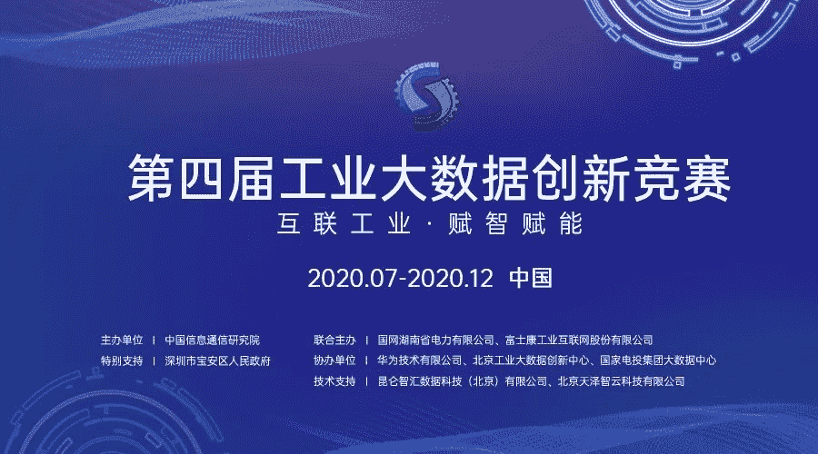

↑↑↑关注后"星标"Datawhale

每日干货 & [每月组队学习](https://mp.weixin.qq.com/mp/appmsgalbum?__biz=MzIyNjM2MzQyNg%3D%3D&action=getalbum&album_id=1338040906536108033#wechat_redirect)，不错过

 Datawhale推荐 

**主办单位：中国信息通信研究院，国家电网，富士康等**

自 2017 年以来，由中国信通院主办的工业大数据创新竞赛已经成功举办三届。这是**首个由政府主管部门指导**的工业大数据领域的全国性权威赛事。

除了权威单位的出力，许多业界知名互联网企业也贡献了宝贵的经验和数据，为参赛者们搭起专业的平台。这个秋天，2020 年第四届工业大数据创新竞赛如约而至，这次，国网湖南、富士康携手带来了关于水电站入库流量预测、注塑成型工艺的虚拟量测和调机优化等工业生产的数据，这是最具价值的生产实践一线经验。

1 本届大赛已上线两道算法赛

1.  **水电站入库流量预测**，由国网湖南省电力有限公司提供数据。参赛队伍需要基于大量历史数据和监测数据，实现水电站入库流量的精准预测，以帮助水电站合理安排防洪、发电调度工作，避免洪涝灾害、提升发电经济效益，带来显著的安全和经济价值。

2.  **注塑成型工艺的虚拟量测和调机优化**，由富士康工业互联网股份有限公司提供数据。参赛队伍需要根据塑料制品注塑成型工艺积累的大数据，感知加工过程中的不可见干扰因素，并通过分析建模解决和避免现场问题，帮助降低不合格率，提升产品质量、降低生产成本。同时还需针对现场调机不够规范化的问题，结合大数据分析提出改进调机策略，进而节省生产时间和经济成本。

以上两大赛题是本次工业大数据竞赛设计的典型性赛题，其中赛题一为**时序序列预测类型**，主要考察时序序列建模能力，赛题二为**结构化数据挖掘类型**，主要考察结构化特征工程的能力。

2 专属组队交流群，阅读原文报名

经过 2017 年、2018 年的良好奠基，去年第三届竞赛吸引了 2304 人次参赛，队伍数量达到 1609 的新高。三年里，参赛者们为答好每一道赛题各显所长，其中大部分都是来自全国各高校的大学生，初出茅庐的他们虽稚气未脱，但杰出的能力成就了工业大数据创新竞赛的盛况。**切实可行的技术方案和商业计划书，也会为选手带来实际的业务合作和在深圳落户的发展机会。**

**竞赛组队交流群******

鱼佬，武汉大学硕士，2020腾讯广告算法大赛冠军

阿水，北航计算机硕士，CV领域Top选手

杰少：南京大学硕士，DCIC冠军选手

报名地址：http://www.industrial-bigdata.com/Challenge/title

点击【阅读原文】直接报名