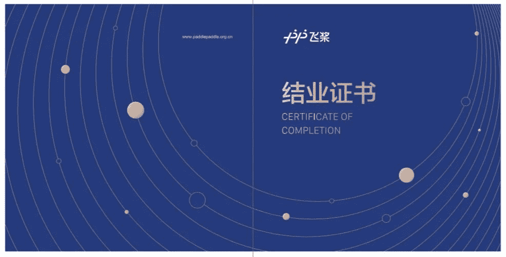

 ↑↑↑关注后"星标"Datawhale

每日干货 & [每月组队学习](https://mp.weixin.qq.com/mp/appmsgalbum?__biz=MzIyNjM2MzQyNg%3D%3D&action=getalbum&album_id=1338040906536108033#wechat_redirect)，不错过

 Datawhale学习 

**组织方：百度飞桨团队、百度研究院，方向：图像分割**

“目标检测那么火，为什么还要学图像分割呢？”

很多同学都这么问小编，因为很多场景需要更精确的检测，目标检测还达不到要求。例如医学图像病灶检测，自动驾驶等都需要图像分割，应用场景广泛：

**卫星图像分析**：识别建筑、道路、森林

**医学图像分析**：定位病灶、测量面积等

**智能交通**：识别道路信息，包括车道标记、交通标志等

作为视觉分析的热门方向，图像分割一直备受追捧，入坑的同学不少，栽跟头的也不少。究其原因，**数据问题、计算资源问题、精细分割、上下文信息**等问题难以攻克。

为帮助更多开发者深入理解图像分割这一领域，飞桨团队与百度研究院联合推出了**深度学习7日打卡营《7日玩转图像分割》**。

**全球顶会审稿人亲授**

讲师具有多年理论实战经验，在**CVPR、ECCV**等顶会上发表多篇论文，获得多次比赛Top成绩，并且担任顶会论文审稿人，是图像分割领域的资深专家

**图像分割领域知识全覆盖**

从经典算法到学界前沿，从技术细节到完整流程，语义分割、实例分割、全景分割，带你逐个击破。

** 手把手理论指导****+ 现场逐行coding**

为帮助大家深入了解理论原理与代码细节，老师们会现场**逐行coding，带大家从零实现自己的模型！**

老师逐行coding实录

手把手解析理论细节

****开课初心****

小编问老师：“朱老师，你的开课初心是什么？”

朱老师：“我们希望带着大家，**一步一步把PPT中的模型图变成一行行的代码**，从零搭建一套自己的深度学习模型，**从此告别git clone和调包。**”

两位老师结合多年实战经验，亲自授课，**10月19日起，带你从入门到精通，7日玩转图像分割！**

**你将收获：**

1\. 结业邮寄**纸质版结业证书**

2\. 与全球顶会审稿人全程深入交流

3\. 开源生态贡献卓越者，优先晋级成为PPDE（飞桨技术专家）

4. **免费**提供在线直播课+作业批改+社群答疑

5\. 提供AI Studio在线实训平台，免费Tesla V100 GPU算力卡支持大家学习。**百度承担所有课程与算力费用，****平均6999元/人****，不向学员收取任何费用**

还有超级福利，等你来挑战！本次课程前三名可以获得

**全球顶会论文审稿人的论文指导和**修改**机会！**

**优秀同学有百度内推面试机会，入职百度不是梦！**

****课程大纲****

01

**Section 1 (theory)**

1\. 课程总体概述

2. 语义分割初探

3. 基于深度学习的语义分割算法

**Section 2 (practice)**

1. 环境搭建

2. PaddlePaddle动态图

3. 语义分割的数据格式和处理

**作业**

1. 搭建并熟悉AI Studio环境

2. 熟悉Paddle环境和动态图模式

3. 实现数据加载模块

02

**Section 1 (theory)**

1. FCN全卷积网络

2. FCN网络结构详解

**Section 2 (practice)**

1. PaddlePaddle中的上采样操作实践

2. PaddlePaddle实现FCN

**作业**

PaddlePaddle实现FCN网络

03

**Section 1 (theory)**

1. U-Net模型详解

2. PSPNet模型详解

**Section 2 (practice)**

1\. PaddlePaddle实现UNet/PSPNet

2\. PaddlePaddle实现DilatedResnet

3\. 分割网络loss和metrics实现

**作业**

1. 实现U-Net或PSPNet

2. 进行模型训练和预测

04

**Section 1 (theory)**

1. Dilated Conv 原理和细节

2. ASPP模块解析

3. DeepLab系列详解

**Section 2 (practice)**

1. PadddlePaddle实现DeepLabV3/ ASPP/MultiGrid

2\. 分割网络inference和validation实现

**作业**

1. DeepLab网络实现

2. 实现语义分割网络搭建和训练完整流程

05

**Section 1 (theory)**

1\. 深入解析GCN（图卷积网络）

2\. Graph-based Segmentation多个方法详解 (GloRe, GCU, GINet) 

**Section 2 (practice)**

1\. GCN代码简要解析

2\. 在Pascal Context上实现GloRe

**大作业**

1\. 图像分割全流程实现

06

**Section 1 (theory)**

1. 实例分割与全景分割概述

2\. 实例分割：Mask R-CNN和SOLO

3\. 全景分割：PanapticFPN和UPSNet

**大作业**

1. 图像分割全流程实现

07

**Section 1 (summary)**

1. 主流分割数据集介绍

2. 最近研究进展探讨

3. 课程总结与Q&A

**大作业**

1\. 图像分割全流程实现

****讲师介绍****

百度研究院资深研究员

 

**朱老师**

本科和博士期间发表论文10余篇。博士毕业后在美国硅谷工作，负责深度学习平台和算法研发。近年来多次在CVPR、ICCV、ECCV等顶会上的国际比赛中取得Top名次。曾在硅谷一线教育平台担任人工智能课程讲师。

百度研究院高级工程师

 

**伍老师**

2019年获得中科院计算所硕士学位（计算机视觉方向），曾参与多项国家重点研发计划和国家自然科学基金项目，曾在ICME、ECCV、CVPR发表多篇论文，拥有多项发明专利。SemSegPaddle的主要完成人。

****学习激励****

担心无法坚持学习？别担心，成长的路上需要鼓励。超多奖励等你来拿！

 百度飞桨官方认证结业证书

打卡营只需要有一定的深度学习基础，就能参加！跟随全球顶会审稿人，7天搞定图像分割，现在就扫描二维码，加入课程吧~

****上课时间****

10月19日—10月27日  每晚20:30—21:30

****立即报名****

**扫码关注【飞桨】公众号**

回复【学习分割】

获取专属报名通道