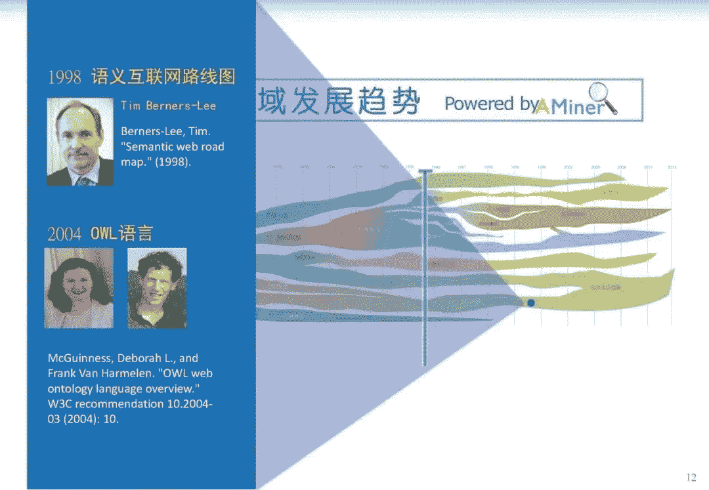
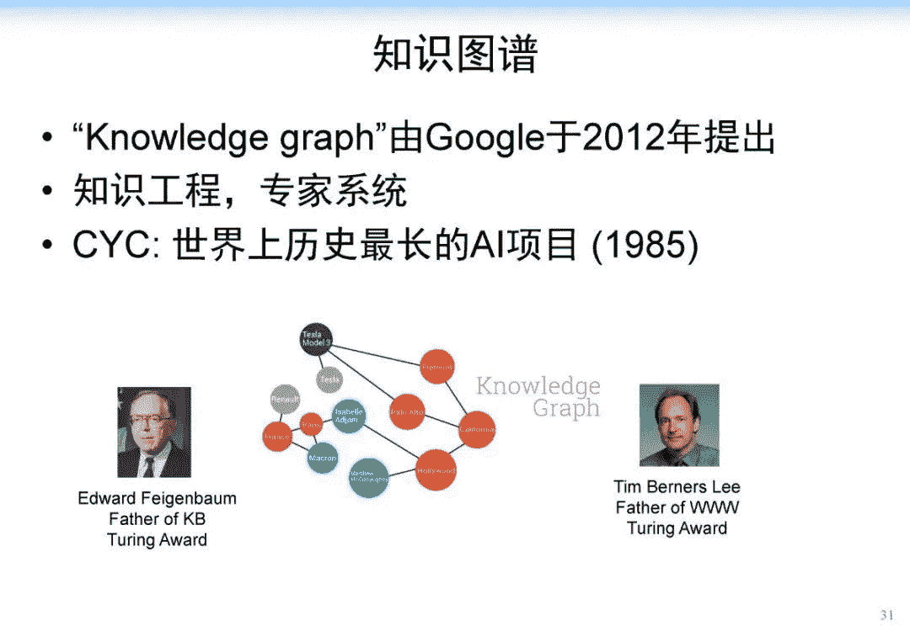
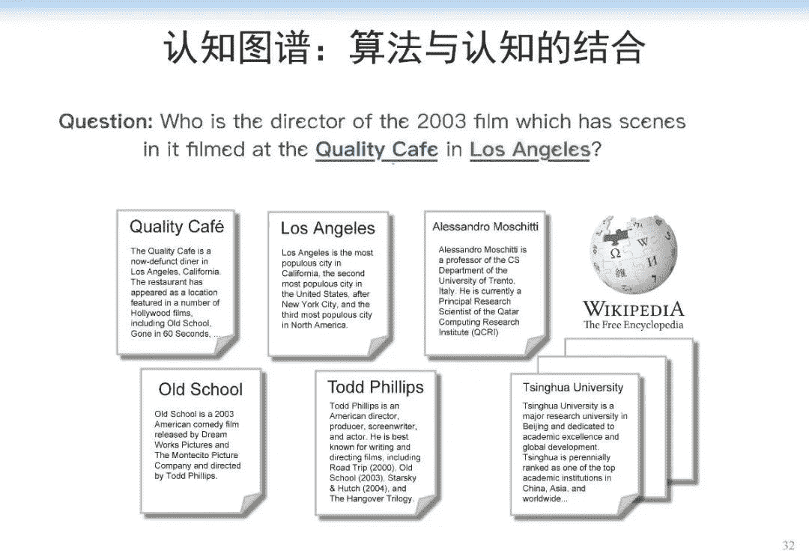

 ↑↑↑关注后"星标"Datawhale

每日干货 & [每月组队学习](https://mp.weixin.qq.com/mp/appmsgalbum?__biz=MzIyNjM2MzQyNg%3D%3D&action=getalbum&album_id=1338040906536108033#wechat_redirect)，不错过

 Datawhale干货 

**作者：唐杰教授，来源：人工智能AI技术**

编辑：AI数据派‍‍‍‍‍‍‍‍‍‍

本文约****1850********字44图****，建议阅读****9分钟。****

本文从人工智能发展的历史开始，深入分析人工智能近十年的发展，阐述了人工智能在感知方面取得的重要成果。

唐杰教授从人工智能发展的历史开始，深入分析**人工智能近十年的发展，阐述了人工智能在感知方面取得的重要成果**，尤其提到**算法**是这个**感知时代**最重要、最具代表性的内容。

重点讲解了** BERT、ALBERT、MoCo2** 等取得**快速进展的算法**。最后说到**下一波人工智能浪潮的兴起**，就是实现**具有推理、可解释性、认知的人工智能。**

人工智能对社会和经济影响的日益凸显，各国政府也先后出台了对人工智能发展的政策，并将其上升到国家战略的高度。截至目前，包括美国、中国和欧盟在内的多国和地区颁布了国家层面的人工智能发展政策。

在这个时代背景下，**我们需要考虑人工智能未来十年会怎样发展。**首先，我们需要从人工智能的发展历史中找到灵感。

我们再深入分析 AI 近十年的发展，会看到一个重要的标志：**人工智能在感知方面取得重要成果。人工智能在语音识别、文本识别、视频识别等方面已经超越了人类，我们可以说 AI 在感知方面已经逐渐接近人类的水平。**从未来的趋势来看，人工智能将会有一个从**感知到认知逐步发展**的基本趋势，如下图所示：

首先，我们来看看 AI 在感知方面做了哪些事情。在感知方面，AlphaGo、无人驾驶、文本和图片之间的跨媒体计算等取得了快速发展。从宏观来看，算法是这个感知时代最重要、最具代表性的内容。如果把最近十年的重要算法进行归类，以深度学习为例进行展示的话，我们可以得到下图所示的发展脉络。

这里，我想引用张钹院士提出来的第三代人工智能的理论体系。

2015 年，张钹院士提出第三代人工智能体系的雏形。

2017 年，DARPA 发起 XAI 项目，核心思想是从可解释的机器学习系统、人机交互技术以及可解释的心理学理论三个方面，全面开展可解释性 AI 系统的研究。

2018 年底，正式公开提出第三代人工智能的理论框架体系，核心思想为：

建立可解释、鲁棒性的人工智能理论和方法。发展安全、可靠、可信及可扩展的人工智能技术。推动人工智能创新应用。其中具体实施的路线图如下：

与脑科学融合，发展脑启发的人工智能理论。数据与知识融合的人工智能理论与方法。在这个思想框架下，我们做了一定的深入研究，我们称之为认知图谱。其核心概念是知识图谱+认知推理+逻辑表达。

当我们用传统算法（如 BIDAF, BERT, XLNet）进行解决的时候，计算机可能只会找到局部的片段，仍然缺乏一个在知识层面上的推理能力，这是计算机很欠缺的。人在这方面具有优势，而计算机缺乏类似的能力。

人在解决上述问题的过程中存在推理路径、推理节点，并且能理解整个过程，而 AI 系统，特别是在当下的 AI 系统中，深度学习算法将大部分这类问题都看作是一个黑盒子，如下图所示：

这个基本的思想是结合认知科学中的双通道理论。在人脑的认知系统中存在两个系统：System 1 和 System 2，如下图所示。System 1 是一个直觉系统，它可以通过人对相关信息的一个直觉匹配寻找答案，它是非常快速、简单的；而 System 2 是一个分析系统，它通过一定的推理、逻辑找到答案。

在去年的 NIPS 上，图灵奖获得者 Bengio 在大会主旨报告的 Keynote 也提到，System 1 到 System 2 的认知是深度学习未来发展的重要的方向，如下图所示：

因此，我们大概用这个思路构建了这个新的、我们称为认知图谱的这样一个方法。在 System 1 中我们主要做知识的扩展，在 System 2 中我们做逻辑推理和决策，如下图所示：

可以看到，我们在 System 1 中做知识的扩展，比如说针对前面的问题，我们首先找到相关的影片，然后用 System 2 来做决策。如果是标准答案，就结束整个推理的过程。如果不是标准答案，而相应的信息又有用，我们就把它作为一个有用信息提供给 System 1，System 1 继续做知识的扩展，System 2 再来做决策，直到最终找到答案。

现在，在这两个系统中，System 1 是一个直觉系统，我们用 BERT 来实现，实现了以后，我们就可以做相关的信息的匹配；System 2 就用一个图卷积网络来实现，在图卷积网络中可以做一定的推理和决策。通过这个思路，我们就可以实现一定的推理+决策。

这是一个总体的思路，要真正实现知识和推理，其实还需要万亿级的常识知识库的支持，如下图所示。也就是说，四五十年前费根鲍姆做过的事情，也许我们现在要重做一遍，但是我们要做到更大规模的常识知识图谱，并且用这样的方法，用这样的常识知识图谱来支撑上面的深度学习的计算，这样才能真正实现未来的 AI。

所以说，这一代人工智能浪潮也许到终点还是没有推理能力，没有可解释能力。而下一波人工智能浪潮的兴起，就是实现具有推理、具有可解释性、具有认知的人工智能，我们认为这是 AI 下一个 10 年要发展、也一定会发展的一个重要方向。

“整理不易，**点****赞****三连**↓