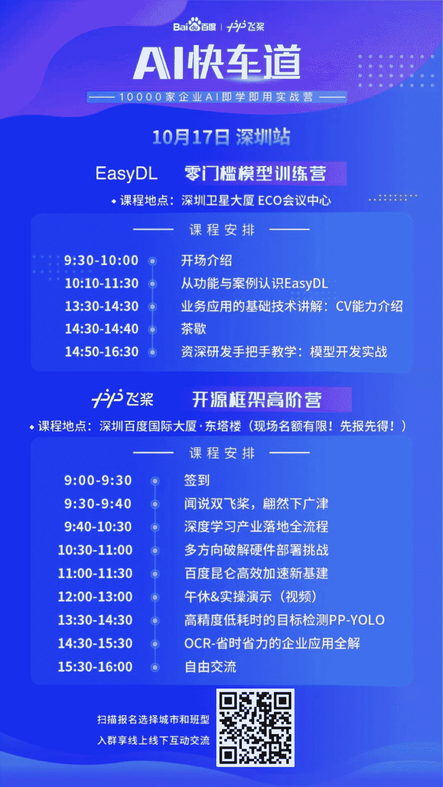

↑↑↑关注后"星标"Datawhale

每日干货 & [每月组队学习](https://mp.weixin.qq.com/mp/appmsgalbum?__biz=MzIyNjM2MzQyNg%3D%3D&action=getalbum&album_id=1338040906536108033#wechat_redirect)，不错过

 Datawhale活动 

**地点：深圳卫星大厦、深圳百度国际大厦**

十月属于深圳！

最近深圳可算是“红”穿地心，前有湾区新地标——摩天轮在国庆引爆流量，后有莲花山公园人从众“追星”庆祝深圳经济特区四十周年。

40年之际，百度AI快车道10000家企业AI即学即用实战营也将登陆深圳。2020年10月17日（明天），百度高工讲师们将为一众企业开发者带来**深度学习开发应用**系列分享，帮助开发者解决实际难题。

10月17日上午，百度AI快车道2大产业及实战班准时开课。深圳百度国际大厦·东塔楼上演“**开源框架高阶营**”，带你了解支持十种以上的服务器/工控机厂商提供高密度AI算力的百度昆仑。

学会深度学习技术低成本高效率解决工业智能化中痛点，并从数据、训练到部署提供端到端深度学习解决方案；还有高精度低耗时的目标检测技术、OCR-省时省力的企业应用全解等内容一一呈现。（本次活动所有费用由举办方承担）

除此之外，AI快车道·EasyDL零门槛模型训练营首站同一天（10月17日）锁定深圳卫星大厦ECO会议中心，着眼智能硬件、CV场景难点等核心内容，百度产品专家不仅为你深入浅出讲解产品，带来智能垃圾箱等行业最新标杆案例。

更有资深研发工程师现场手把手带你完成模型开发，并在现场实操模型SDK的部署方法。2大班型针对不同需求的一线开发者，提供快速、实用的AI落地干货课程，助你智能化转型之路更上一步！

深圳站之后，百度AI快车道将于10月24日走进上海，后面还将继续“打卡”**南京、成都、西安、厦门、武汉、北京**等城市，为大家来带即学即用的分享。

不可错过与百度高工、技术大咖“切磋”的大场面接连登场。2020年最后季度精彩纷呈的AI交流讨论会，百度AI快车道承包了！

阅读原文，直接报名↓