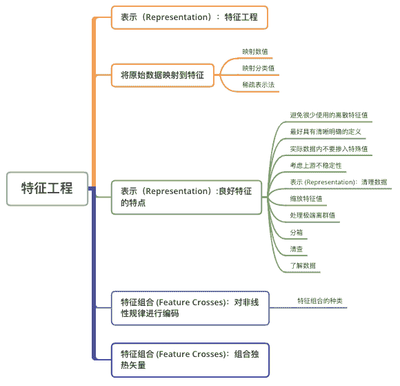
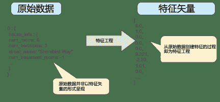
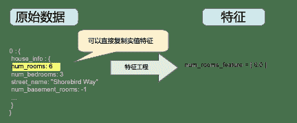
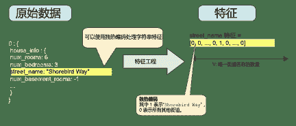
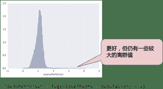
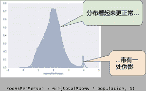
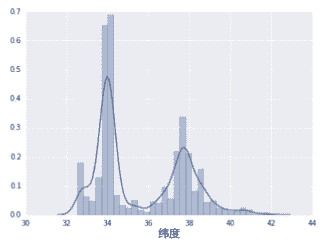
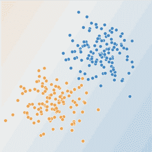
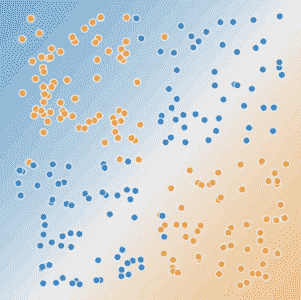
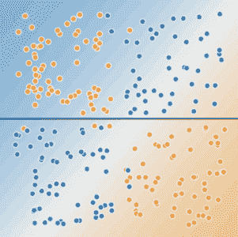

↑↑↑关注后"星标"Datawhale

每日干货 & [每月组队学习](https://mp.weixin.qq.com/mp/appmsgalbum?__biz=MzIyNjM2MzQyNg%3D%3D&action=getalbum&album_id=1338040906536108033#wechat_redirect)，不错过

 Datawhale干货 

**译者：张峰 ，**Datawhale成员****



<figcaption>结构总览</figcaption>

## 特征工程

传统编程的关注点是**代码**。在机器学习项目中，关注点变成了**特征表示**。也就是说，开发者通过添加和改善特征来调整模型。“Garbage in, garbage out”。对于一个机器学习问题，数据和特征往往决定了结果的上限，而模型、算法的选择及优化则是在逐步接近这个上限。特征工程，顾名思义，是指从原始数据创建特征的过程。

## 将原始数据映射到特征

许多机器学习模型都必须将特征表示为实数向量，因为特征值必须与模型权重相乘。



<figcaption>图 1\. 特征工程将原始数据映射到机器学习特征</figcaption>

图 1 左侧表示来自输入数据源的原始数据，右侧表示特征矢量，也就是组成数据集中样本的浮点值集。特征工程指的是将原始数据转换为特征矢量。进行特征工程预计需要大量时间。

### 映射数值

整数和浮点数据不需要特殊编码，因为它们可以与数字权重相乘。如图 2 所示，将原始整数值 6 转换为特征值 6.0 并没有多大的意义：



<figcaption>图 2\. 将整数值映射到浮点值</figcaption>

### 映射分类值

分类特征具有一组离散的可能值。例如，可能有一个名为 street_name 的特征，其中的选项包括：

**{'Charleston Road', 'North Shoreline Boulevard', 'Shorebird Way','Rengstorff Avenue'}**

由于模型不能将字符串与学习到的权重相乘，因此我们使用特征工程将字符串转换为数字值。

要实现这一点，我们可以定义一个从**特征值**（我们将其称为可能值的**词汇表**）到整数的映射。世界上的每条街道并非都会出现在我们的数据集中，因此我们可以将所有其他街道**分组**为一个全部包罗的“其他”类别，称为 **OOV（out-of-vocabulary）分桶**。

通过这种方法，我们可以按照以下方式将街道名称映射到数字：

*   将 Charleston Road 映射到 0

*   将 North Shoreline Boulevard 映射到 1

*   将 Shorebird Way 映射到 2

*   将 Rengstorff Avenue 映射到 3

*   将所有其他街道 (OOV) 映射到 4

不过，如果我们将这些索引数字直接纳入到模型中，将会造成一些可能存在问题的限制：

*   我们将学习适用于所有街道的单一权重。例如，如果我们学习到 street_name 的权重为 6，那么对于 Charleston Road，我们会将其乘以 0，对于 North Shoreline Boulevard 则乘以 1，对于 Shorebird Way 则乘以 2，依此类推。以某个使用 street_name 作为特征来预测房价的模型为例。根据街道名称对房价进行线性调整的可能性不大，此外，这会假设你已根据平均房价对街道排序。我们的模型需要灵活地为每条街道学习不同的权重，这些权重将添加到利用其他特征估算的房价中。

*   我们没有将 street_name 可能有多个值的情况考虑在内。例如，许多房屋位于两条街道的拐角处，因此如果模型包含单个索引，则无法在 street_name 值中对该信息进行编码。

要去除这两个限制，我们可以为模型中的每个分类特征创建一个二元向量来表示这些值，如下所述：

*   对于适用于样本的值，将相应向量元素设为 1。

*   将所有其他元素设为 0。

该向量的长度等于词汇表中的元素数。当只有一个值为 1 时，这种表示法称为**独热编码**；当有多个值为 1 时，这种表示法称为**多热编码**。

图 3 所示为街道 Shorebird Way 的独热编码。在此二元矢量中，代表 Shorebird Way 的元素的值为 1，而代表所有其他街道的元素的值为 0。



<figcaption>图 3\. 通过独热编码映射街道地址</figcaption>

该方法能够有效地为每个特征值（例如，街道名称）创建布尔变量。采用这种方法时，如果房屋位于 Shorebird Way 街道上，则只有 Shorebird Way 的二元值为 1。因此，该模型仅使用 Shorebird Way 的权重。同样，如果房屋位于两条街道的拐角处，则将两个二元值设为 1，并且模型将使用它们各自的权重。

### 稀疏表示法

假设数据集中有 100 万个不同的街道名称，你希望将其包含为 street_name 的值。如果直接创建一个包含 100 万个元素的二元向量，其中只有 1 或 2 个元素为 ture，则是一种非常低效的表示法，在处理这些向量时会占用大量的存储空间并耗费很长的计算时间。在这种情况下，一种常用的方法是使用稀疏表示法，其中仅存储非零值。在稀疏表示法中，仍然为每个特征值学习独立的模型权重，如上所述。

## 良好特征的特点

### 避免很少使用的离散特征值

良好的特征值应该在数据集中出现大约 5 次以上。这样一来，模型就可以学习该特征值与标签是如何关联的。也就是说，大量离散值相同的样本可让模型有机会了解不同设置中的特征，从而判断何时可以对标签很好地做出预测。

例如：house_type 特征可能包含大量样本，其中它的值为 victorian：house_type: victorian；相反，如果某个特征的值仅出现一次或者很少出现，则模型就无法根据该特征进行预测。例如，unique_house_id 就不适合作为特征，因为每个值只使用一次，模型无法从中学习任何规律：

`unique_house_id: 8SK982ZZ1242Z`

### 最好具有清晰明确的含义

每个特征对于项目中的任何人来说都应该具有清晰明确的含义。例如，下面的房龄适合作为特征，可立即识别是以年为单位的房龄：

`house_age: 27`

相反，对于下方特征值的含义，除了创建它的工程师，其他人恐怕辨识不出：

`house_age: 851472000`

在某些情况下，混乱的数据（而不是糟糕的工程选择）会导致含义不清晰的值。例如，以下 `user_age` 的来源没有检查值恰当与否：

`user_age: 277`

### 实际数据内不要掺入特殊值

良好的浮点特征不包含超出范围的异常断点或特殊的值。例如，假设一个特征具有 0 到 1 之间的浮点值。那么，如下值是可以接受的：

`quality_rating: 0.82`

`quality_rating: 0.37`

不过，如果用户没有输入 `quality_rating`，则数据集可能使用如下特殊值来表示不存在该值：

`quality_rating: -1`

为解决特殊值的问题，需将该特征转换为两个特征：

*   一个特征只存储质量评分，不含特殊值。

*   一个特征存储布尔值，表示是否提供了 quality_rating。为该布尔值特征指定一个名称，例如 is_quality_rating_defined。

### 考虑上游不稳定性

特征的定义不应随时间发生变化。例如，下列值是有用的，因为城市名称一般不会改变。（注意，我们仍然需要将“`br/sao_paulo`”这样的字符串转换为独热矢量。）

`city_id: "br/sao_paulo"`

但收集由其他模型推理的值会产生额外成本。可能值“219”目前代表圣保罗，但这种表示在未来运行其他模型时可能轻易发生变化：

`inferred_city_cluster: "219"`

### 表示 (Representation)：清理数据

苹果树结出的果子有品相上乘的，也有虫蛀坏果。而高端便利店出售的苹果是 100% 完美的水果。从果园到水果店之间，专门有人花费大量时间将坏苹果剔除或给可以挽救的苹果涂上一层薄薄的蜡。作为一名机器学习工程师，你将花费大量的时间挑出坏样本并加工可以挽救的样本。即使是非常少量的“坏苹果”也会破坏掉一个大规模数据集。

### 缩放特征值

**缩放**是指将浮点特征值从自然范围（例如 100 到 900）转换为标准范围（例如 0 到 1 或 -1 到 +1）。如果某个特征集只包含一个特征，则缩放可以提供的实际好处微乎其微或根本没有。不过，如果特征集包含多个特征，则缩放特征可以带来以下优势：

*   帮助梯度下降法更快速地收敛。

*   帮助避免“NaN 陷阱”。在这种陷阱中，模型中的一个数值变成 NaN（例如，当某个值在训练期间超出浮点精确率限制时），并且模型中的所有其他数值最终也会因数学运算而变成 NaN。

*   帮助模型为每个特征确定合适的权重。如果没有进行特征缩放，则模型会对范围较大的特征投入过多精力。

你不需要对每个浮点特征进行完全相同的缩放。即使特征 A 的范围是 -1 到 +1，同时特征 B 的范围是 -3 到 +3，也不会产生什么恶劣的影响。不过，如果特征 B 的范围是 5000 到 100000，你的模型会出现糟糕的响应。

要缩放数值数据，一种显而易见的方法是将 `[最小值，最大值]` 以线性方式映射到较小的范围，例如 `[-1，+1]`。另一种热门的缩放策略是计算每个值的 Z 得分。Z 得分与距离均值的标准偏差相关。换言之：

`scaledvalue "=("value"-"mean")/"stddev.`

例如，给定以下条件：

*   均值 = 100

*   标准偏差 = 20

*   原始值 = 130

则：

`scaled_value = (130 - 100) / 20`

`scaled_value = 1.5`

使用 Z 得分进行缩放意味着，大多数缩放后的值将介于 -3 和 +3 之间，而少量值将略高于或低于该范围。

### 处理极端离群值

下面的曲线图表示的是加利福尼亚州住房数据集中称为 roomsPerPerson 的特征。roomsPerPerson 值的计算方法是相应地区的房间总数除以相应地区的人口总数。该曲线图显示，在加利福尼亚州的绝大部分地区，人均房间数为 1 到 2 间。不过，请看一下 x 轴。


<figcaption>图 4\. 一个非常非常长的尾巴</figcaption>



<figcaption>图 5\. 对数缩放仍然留有尾巴</figcaption>

对数缩放可稍稍缓解这种影响，但仍然存在离群值这个大尾巴。我们来采用另一种方法。如果我们只是简单地将 roomsPerPerson 的最大值“限制”为某个任意值（比如 4.0），会发生什么情况呢？



<figcaption>图 6\. 将特征值限制到 4.0</figcaption>

将特征值限制到 4.0 并不意味着我们会忽略所有大于 4.0 的值。而是说，所有大于 4.0 的值都将变成 4.0。这就解释了 4.0 处的那个有趣的小峰值。尽管存在这个小峰值，但是缩放后的特征集现在依然比原始数据有用。

### 分箱

下面的曲线图显示了加利福尼亚州不同纬度的房屋相对普及率。注意集群 - 洛杉矶大致在纬度 34 处，旧金山大致在纬度 38 处。



<figcaption>图 7\. 每个纬度的房屋数</figcaption>

在数据集中，latitude 是一个浮点值。不过，在我们的模型中将 latitude 表示为浮点特征没有意义。这是因为纬度和房屋价值之间不存在线性关系。例如，纬度 35 处的房屋并不比纬度 34 处的房屋贵 35/34（或更便宜）。但是，纬度或许能很好地预测房屋价值。为了将纬度变为一项实用的预测指标，我们对纬度“分箱”，如下图所示：


<figcaption>图 8\. 分箱值</figcaption>

我们现在拥有 11 个不同的布尔值特征`（LatitudeBin1、LatitudeBin2、…、LatitudeBin11）`，而不是一个浮点特征。拥有 11 个不同的特征有点不方便，因此我们将它们统一成一个 11 元素矢量。这样做之后，我们可以将纬度 37.4 表示为：`[0, 0, 0, 0, 0, 1, 0, 0, 0, 0, 0]`

分箱之后，我们的模型现在可以为每个纬度学习完全不同的权重。

为了简单起见，我们在纬度样本中使用整数作为分箱边界。如果我们需要更精细的解决方案，我们可以每隔 1/10 个纬度拆分一次分箱边界。添加更多箱可让模型从纬度 37.4 处学习和维度 37.5 处不一样的行为，但前提是每 1/10 个纬度均有充足的样本可供学习。

另一种方法是按分位数分箱，这种方法可以确保每个桶内的样本数量是相等的。按分位数分箱完全无需担心离群值。

### 清查

截至目前，我们假定用于训练和测试的所有数据都是值得信赖的。在现实生活中，数据集中的很多样本是不可靠的，原因有以下一种或多种：

*   缺失值。例如，有人忘记为某个房屋的年龄输入值。

*   重复样本。例如，服务器错误地将同一条记录上传了两次。

*   不良标签。例如，有人错误地将一颗橡树的图片标记为枫树。

*   不良特征值。例如，有人输入了多余的位数，或者温度计被遗落在太阳底下。

一旦检测到存在这些问题，你通常需要将相应样本从数据集中移除，从而“修正”不良样本。要检测缺失值或重复样本，你可以编写一个简单的程序。检测不良特征值或标签可能会比较棘手。

除了检测各个不良样本之外，你还必须检测集合中的不良数据。直方图是一种用于可视化集合中数据的很好机制。此外，收集如下统计信息也会有所帮助：

*   最大值和最小值

*   均值和中间值

*   标准偏差 考虑生成离散特征的最常见值列表。例如，`country:uk` 的样本数是否符合你的预期？`language:jp` 是否真的应该作为你数据集中的最常用语言？

### 了解数据

遵循以下规则：

*   记住你预期的数据状态。

*   确认数据是否满足这些预期（或者你可以解释为何数据不满足预期）。

*   仔细检查训练数据是否与其他来源（例如信息中心）的数据一致。

像处理任何任务关键型代码一样谨慎处理你的数据。良好的机器学习依赖于良好的数据。

## 特征组合：对非线性规律进行编码

在图 9 和图 10 中，我们做出如下假设：

*   蓝点代表生病的树。

*   橙点代表健康的树。



<figcaption>图 9\. 这是线性问题吗？</figcaption>

你可以画一条线将生病的树与健康的树清晰地分开吗？当然可以。这是个线性问题。这条线并不完美。有一两棵生病的树可能位于“健康”一侧，但你画的这条线可以很好地做出预测。

现在，我们来看看下图：



<figcaption>图 10\. 这是线性问题吗？</figcaption>

你可以画一条直线将生病的树与健康的树清晰地分开吗？不，你做不到。这是个非线性问题。你画的任何一条线都不能很好地预测树的健康状况。



<figcaption>图 11\. 一条线无法分开两类数据</figcaption>

要想解决图 10 所示的非线性问题，可以创建一个特征组合。**特征组合**是指通过将两个或多个输入特征相乘来对特征空间中的非线性规律进行编码的合成特征。“cross”（组合）这一术语来自 `cross product`（向量积）。我们通过将x1与 x2组合来创建一个名为 x3的特征组合：

我们像处理任何其他特征一样来处理这个新建的x3特征组合。线性公式变为：

线性算法可以算出 w3的权重，就像算出 w1 和 w2 的权重一样。换言之，虽然 w3 表示非线性信息，但你不需要改变线性模型的训练方式来确定 w3的值。

### 特征组合的种类

我们可以创建很多不同种类的特征组合。例如：

*   [A X B]：将两个特征的值相乘形成的特征组合。

*   [A x B x C x D x E]：将五个特征的值相乘形成的特征组合。

*   [A x A]：对单个特征的值求平方形成的特征组合。

通过采用随机梯度下降法，可以有效地训练线性模型。因此，在使用扩展的线性模型时辅以特征组合一直都是训练大规模数据集的有效方法。

## 特征组合：组合独热矢量

到目前为止，我们已经重点介绍了如何对两个单独的浮点特征进行特征组合。在实践中，机器学习模型很少会组合连续特征。不过，机器学习模型却经常组合独热特征矢量，将独热特征矢量的特征组合视为逻辑连接。例如，假设我们具有以下两个特征：国家/地区和语言。对每个特征进行独热编码会生成具有二元特征的矢量，这些二元特征可解读为 `country=USA, country=France 或 language=English, language=Spanish`。然后，如果你对这些独热编码进行特征组合，则会得到可解读为逻辑连接的二元特征，如下所示：

`country:usa AND language:spanish`

再举一个例子，假设你对纬度和经度进行分箱，获得单独的 5 元素特征矢量。例如，指定的纬度和经度可以表示如下：

*   binned_latitude = [0, 0, 0, 1, 0]

*   binned_longitude = [0, 1, 0, 0, 0]

假设你对这两个特征矢量创建了特征组合：

*   binned_latitude X binned_longitude

此特征组合是一个 25 元素独热矢量（24 个 0 和 1 个 1）。该组合中的单个 1 表示纬度与经度的特定连接。然后，你的模型就可以了解到有关这种连接的特定关联性。

假设我们更粗略地对纬度和经度进行分箱，如下所示：

```
binned_latitude(lat) = [ 
  0  < lat <= 10 
  10 < lat <= 20 
  20 < lat <= 30 
] 

binned_longitude(lon) = [ 
  0  < lon <= 15 
  15 < lon <= 30 
]
针对这些粗略分箱创建特征组合会生成具有以下含义的合成特征：
binned_latitude_X_longitude(lat, lon) = [ 
  0  < lat <= 10 AND 0  < lon <= 15 
  0  < lat <= 10 AND 15 < lon <= 30 
  10 < lat <= 20 AND 0  < lon <= 15 
  10 < lat <= 20 AND 15 < lon <= 30 
  20 < lat <= 30 AND 0  < lon <= 15 
  20 < lat <= 30 AND 15 < lon <= 30 
] 
```

现在，假设我们的模型需要根据以下两个特征来预测狗主人对狗狗的满意程度：

*   行为类型behavior type（吠叫、啜泣、依偎等）

*   时段time of day

如果我们根据这两个特征构建以下特征组合：

`[behavior type X time of day]`

我们最终获得的预测能力将远远超过任一特征单独的预测能力。例如，如果狗狗在下午 5 点主人下班回来时（快乐地）叫喊，可能表示对主人满意度的正面预测结果。如果狗狗在凌晨 3 点主人熟睡时（也许痛苦地）哀叫，可能表示对主人满意度的强烈负面预测结果。

线性学习器可以很好地扩展到大量数据。对大规模数据集使用特征组合是学习高度复杂模型的一种有效策略。神经网络可提供另一种策略。


“干货学习，**点****赞****三连**↓