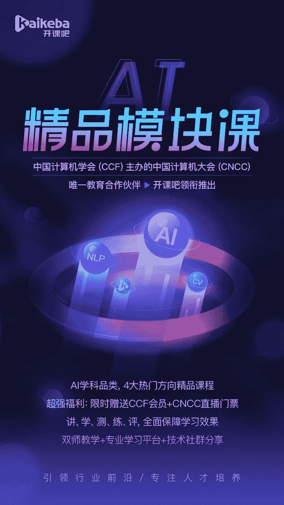
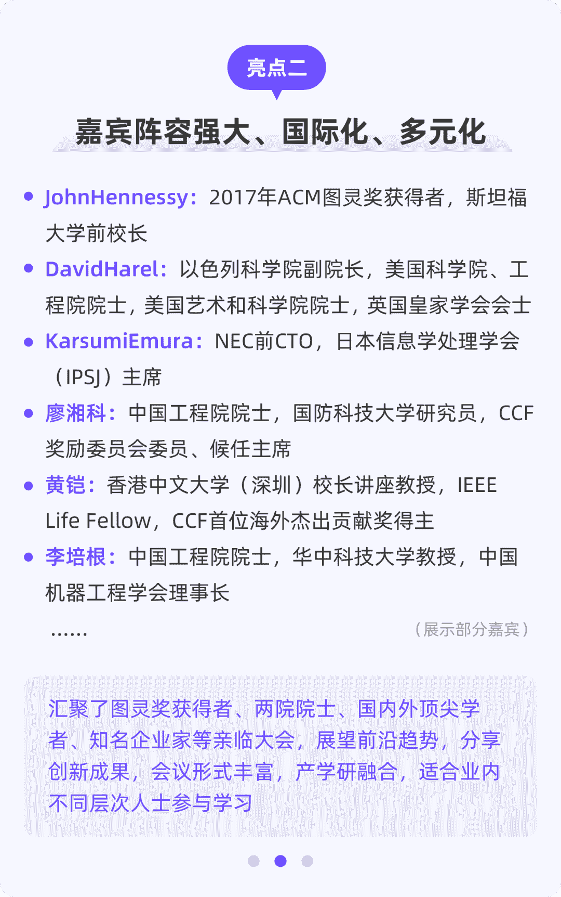

国庆已过，休息后一定不要忘记成长。10月22日，迎来了一年一度的**计算技术领域的年度盛会——中国计算机大会CNCC**，由中国计算机学会（CCF）主办，引起了社会各界的广泛关注。

**CNCC-特邀报告讲者（部分）**

CCF（中国计算机学会）是致力于为计算机领域专业人士提供服务的专业组织，**可以精准帮助匹配个人的专业、人脉、机遇等各种需求**，是计算机领域追求专业发展人士的首选平台。

**CNCC-中国互联网行业发展的风向标**

2020年CNCC大会主题：信息技术助力社会治理，贴合当前后疫情时代，疫情常态化的背景下信息技术还能如何帮助社会治理？而本次大会**开课吧****成为了唯一的教育合作伙伴和金牌赞助商。**

开课吧是一家在线教育企业，只为培养数字化人才。在此CNCC会议即将来临之际，为了回馈学员，**整合了会议中科研和学术领域的焦点话题**，并且根据互联网行业的发展与人才需求方向，**100+位**开课吧教研老师，精心制作了专业化、模块化的全新课程模式——**《AI精品模块课》**

**“讲+学+测+练+评+群”**的全新授课模式，横跨AI多方向，保障学习效果，把碎片化学习时间变为财富！**而开课吧作为本次CNCC大会的金牌赞助商****，**特给学员申请了一项**超值福利**——只要**购买本次精品模块课**，**免费赠送**给大家：

**超值福利赠送**

此福利名额有限，**仅限购课前1000名学员**，送完为止。

**提前抢占名额????????????**

**CNCC直播门票（价值：760元）**

中国互联网行业的风向标——CNCC（中国计算机大会），包括大会特邀报告、大会论坛、技术论坛、特色活动及展览，是互联网人与业内专业人士交流学习的绝佳机会！

**<< 滑动查看CNCC亮点 >>**

**CCF会员（价值：200元）**

CCF（中国计算机学会）作为致力于为计算机领域专业人士提供服务的专业组织，是每个计算机领域追求专业发展人士的首选平台。

**<< 滑动查看CCF的会员权益 >>**

**模块课程亮点**

我们根据人工智能教学特色，**重新梳理课程核心知识内容**，按照专业化路径构建全新课程模式教学。此次升级有**四大**课程亮点：

**全新六步学习法**

讲+学+测+练+评+群，全新授课模式，全面保障学习效果。

**精品模块课程**

我们为学员精选了人工智能**4大精品模块**课，**3****00+学习小节**，学员可以根据自己的行业发展方向，随意选择不同模块进行学习。

超值购课福利：**赠送CNCC直播门票+CCF会员**

只有前**1000个**名额，送完即止

赶快**优先抢占**席位????????????

**精品模块课大纲**

本次课程包含：**4大AI热门方向****精品模块课**。

**精品模块课导师**

本次授课老师均有**世界500强企业一线项目经验**，实战能力强，多年算法研发经验。带领学员迅速掌握AI知识。

**精品模块课服务管家**

**双师教学**

班主任+助教双师教学模式，只为培育更优秀的人才。

**专业测试平台**

专业化测试平台，科学性设置，全方位地快速检测学习成果。

**在线练题**

根据课程内容配套相应作业，资深老师点评，夯实学习内容，快速掌握技能。

**学员作业展示：数据可视化**

**社群集结**

云集各大互联网人才，群内不定期更新现下最热的技术问题，包括工作、面试等，与更多优秀人才探讨专业化内容，向大神更靠近一步。

**有“偿”输出**

技术输出的过程中是不断纠错、巩固知识、提高技术的过程，输出内容的同学将有机会额外获得相应奖励。

**精品模块课价格**

本次精品模块课程，分为**4大AI热门方向**，课程名称与价格如下：

成功并不是偶然。加入**《AI精品模块课》**，CNCC直播门票等着你来拿。扫描下方二维码，选择你想要参加的模块课！

**除了4门AI精品模块课程，本次还开设了Java、Web品类，共计12个模块课程**，想了解更多课程，请联系课程顾问专家。

**《AI精品模块课程》**

长按添加课程顾问

????????????

**限量**福利，先到先得????

阅读原文，直接报名