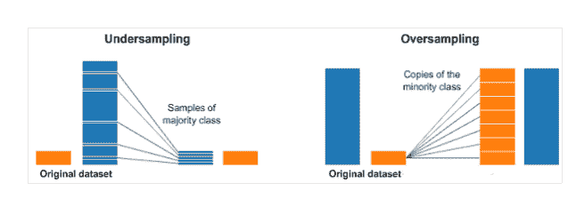

↑↑↑关注后"星标"Datawhale

每日干货 & [每月组队学习](https://mp.weixin.qq.com/mp/appmsgalbum?__biz=MzIyNjM2MzQyNg%3D%3D&action=getalbum&album_id=1338040906536108033#wechat_redirect)，不错过

 Datawhale干货 

**来源：CSDN ，编辑：数据派THU**

本文****约3000字****，建议**阅读5分钟**

本文讲述了数据分析师应当了解的五个统计基本概念：统计特征、概率分布、降维、过采样/欠采样、贝叶斯统计方法。

本文讲述了数据分析师应当了解的五个统计基本概念：统计特征、概率分布、降维、过采样/欠采样、贝叶斯统计方法。

从高的角度来看，统计学是一种利用数学理论来进行数据分析的技术。象柱状图这种基本的可视化形式，会给你更加全面的信息。但是，通过统计学我们可以以更富有信息驱动力和针对性的方式对数据进行操作。所涉及的数学理论帮助我们形成数据的具体结论，而不仅仅是猜测。

利用统计学，我们可以更深入、更细致地观察数据是如何进行精确组织的，并且基于这种组织结构，如何能够以最佳的形式来应用其它相关的技术以获取更多的信息。今天，我们来看看数据分析师需要掌握的5个基本的统计学概念，以及如何有效地进行应用。

**01 特征统计**

特征统计可能是数据科学中最常用的统计学概念。它是你在研究数据集时经常使用的统计技术，包括**偏差、方差、平均值、中位数、百分数**等等。理解特征统计并且在代码中实现都是非常容易的。请看下图：

上图中，中间的直线表示数据的中位数。中位数用在平均值上，因为它对异常值更具有鲁棒性。第一个四分位数本质上是第二十五百分位数，即数据中的25%要低于该值。第三个四分位数是第七十五百分位数，即数据中的75%要低于该值。而最大值和最小值表示该数据范围的上下两端。

箱形图很好地说明了基本统计特征的作用:

*   当箱形图很短时，就意味着很多数据点是相似的，因为很多值是在一个很小的范围内分布;

*   当箱形图较高时，就意味着大部分的数据点之间的差异很大，因为这些值分布的很广;

*   如果中位数接近了底部，那么大部分的数据具有较低的值。如果中位数比较接近顶部，那么大多数的数据具有更高的值。基本上，如果中位线不在框的中间，那么就表明了是偏斜数据;

*   如果框上下两边的线很长表示数据具有很高的标准偏差和方差，意味着这些值被分散了，并且变化非常大。如果在框的一边有长线，另一边的不长，那么数据可能只在一个方向上变化很大

**02 概率分布**

我们可以将概率定义为一些事件将要发生的可能性大小，以百分数来表示。在数据科学领域中，**这通常被量化到0到1的区间范围内，其中0表示事件确定不会发生，而1表示事件确定会发生。**那么，概率分布就是表示所有可能值出现的几率的函数。请看下图：

常见的概率分布，均匀分布(上)、正态分布(中间)、泊松分布(下)：

*   均匀分布是其中最基本的概率分布方式。它有一个只出现在一定范围内的值，而在该范围之外的都是0。我们也可以把它考虑为是一个具有两个分类的变量：0或另一个值。分类变量可能具有除0之外的多个值，但我们仍然可以将其可视化为多个均匀分布的分段函数。

*   正态分布，通常也称为高斯分布，具体是由它的平均值和标准偏差来定义的。平均值是在空间上来回变化位置进行分布的，而标准偏差控制着它的分布扩散范围。与其它的分布方式的主要区别在于，在所有方向上标准偏差是相同的。因此，通过高斯分布，我们知道数据集的平均值以及数据的扩散分布，即它在比较广的范围上扩展，还是主要围绕在少数几个值附近集中分布。

*   泊松分布与正态分布相似，但存在偏斜率。象正态分布一样，在偏斜度值较低的情况下，泊松分布在各个方向上具有相对均匀的扩散。但是，当偏斜度值非常大的时候，我们的数据在不同方向上的扩散将会是不同的。在一个方向上，数据的扩散程度非常高，而在另一个方向上，扩散的程度则非常低。

如果遇到一个高斯分布，那么我们知道有很多算法，在默认情况下高思分布将会被执行地很好，因此首先应该找到那些算法。如果是泊松分布，我们必须要特别谨慎，选择一个在空间扩展上对变化要有很好鲁棒性的算法。

**03 降维 **

降维这个术语可以很直观的理解，意思是降低一个数据集的维数。在数据科学中，这是特征变量的数量。请看下图：

上图中的立方体表示我们的数据集，它有3个维度，总共1000个点。以现在的计算能力，计算1000个点很容易，但如果更大的规模，就会遇到麻烦了。然而，仅仅从二维的角度来看我们的数据，比如从立方体一侧的角度，可以看到划分所有的颜色是很容易的。通过降维，我们将3D数据展现到2D平面上，这有效地把我们需要计算的点的数量减少到100个，大大节省了计算量。

另一种方式是我们可以通过特征剪枝来减少维数。利用这种方法，我们删除任何所看到的特征对分析都不重要。例如，在研究数据集之后，我们可能会发现，在10个特征中，有7个特征与输出具有很高的相关性，而其它3个则具有非常低的相关性。那么，这3个低相关性的特征可能不值得计算，我们可能只是能**在不影响输出的情况下将它们从分析中去掉。**

用于降维的最常见的统计技术是PCA，它本质上创建了特征的向量表示，表明了它们对输出的重要性，即相关性。PCA可以用来进行上述两种降维方式的操作。

**04 过采样和欠采样 **

过采样和欠采样是用于分类问题的技术。例如，我们有1种分类的2000个样本，但第2种分类只有200个样本。这将抛开我们尝试和使用的许多机器学习技术来给数据建模并进行预测。那么，过采样和欠采样可以应对这种情况。请看下图：

在上面图中的左右两侧，蓝色分类比橙色分类有更多的样本。在这种情况下，我们有2个预处理选择，可以帮助机器学习模型进行训练。

欠采样意味着我们将只从样本多的分类中选择一些数据，而尽量多的使用样本少的分类样本。这种选择应该是为了保持分类的概率分布。我们只是通过更少的抽样来让数据集更均衡。

过采样意味着我们将要创建少数分类的副本，以便具有与多数分类相同的样本数量。**副本将被制作成保持少数分类的分布。**我们只是在没有获得更多数据的情况下让数据集更加均衡。

**05 贝叶斯统计**

完全理解为什么在我们使用贝叶斯统计的时候，要求首先理解频率统计失败的地方。大多数人在听到“概率”这个词的时候，频率统计是首先想到的统计类型。它涉及应用一些数学理论来分析事件发生的概率，明确地说，我们唯一计算的数据是先验数据(prior data)。

假设我给了你一个骰子，问你掷出6点的几率是多少，大多数人都会说是六分之一。

但是，如果有人给你个特定的骰子总能掷出6个点呢?因为频率分析仅仅考虑之前的数据，而给你作弊的骰子的因素并没有被考虑进去。

贝叶斯统计确实考虑了这一点，我们可以通过贝叶斯法则来进行说明:

在方程中的概率P(H)基本上是我们的频率分析，给定之前的关于事件发生概率的数据。方程中的P(E|H)称为可能性，**根据频率分析得到的信息，实质上是现象正确的概率。**例如，如果你要掷骰子10000次，并且前1000次全部掷出了6个点，那么你会非常自信地认为是骰子作弊了。

如果频率分析做的非常好的话，那么我们会非常自信地确定，猜测6个点是正确的。同时，如果骰子作弊是真的，或者不是基于其自身的先验概率和频率分析的，我们也会考虑作弊的因素。正如你从方程式中看到的，贝叶斯统计把一切因素都考虑在内了。当你觉得之前的数据不能很好地代表未来的数据和结果的时候，就应该使用贝叶斯统计方法。

“干货学习，**点****赞****三连**↓