↑↑↑关注后"星标"Datawhale

每日干货 & [每月组队学习](https://mp.weixin.qq.com/mp/appmsgalbum?__biz=MzIyNjM2MzQyNg%3D%3D&action=getalbum&album_id=1338040906536108033#wechat_redirect)，不错过

 Datawhale干货 

**作者：皮钱超，厦门大学，Datawhale原创作者**

本文**约3000字**，建议**阅读9分钟**

审稿人：杨煜，Datawhale成员，就职于毕马威，从事数据分析工作。

本文中介绍的结构型数据库`MySQL`的基础知识，能够让你快速入门`MySQL`，具体内容包含：

*   相关术语

*   数据类型

*   安装`MySQL`（以`Ubuntu`为例）

*   `4`种语言

*   学习资料

*   `MySQL`内置函数


## 一、相关术语

*   数据库`database`：以某种有组织的方式存储的数据集合。通常是一个文件或者一组文件。

*   表`table`：结构化的文件，用来存储某种特定类型的数据。存储在表中的数据是同一种类型的数据或者清单。表名具有唯一性，表的特性：

*   *   数据在表中如何存储

    *   存储什么类型的数据

    *   数据如何分解

    *   各个部分的信息如何命名

*   列`column`：表由列组成，列存储表中的某部分的信息。**列是表中的字段**。表中每个列存储特定的信息，比如商品的表中有：商品的名称、生产日期、产地等。每个列都有相应的数据类型

*   行`row`：表中的数据是按照行存储的，所保存的记录是存储在自己的行内。比如顾客表中，每行存储一个顾客的相关信息。有时候行业称之为记录`record`

    **垂直的列为表列，水平行为表行**

*   主键`primary key`：一列（或一组列），能够唯一标识表中每一行，比如订单表中的订单`ID`。主键是用来表示一个特定的行。表中任何一列都是可以作为主键，满足条件：

*   *   任意两行都不具有相同的主键值

    *   每一行必须有一个主键值(主键列不允许NULL值)

    *   主键的值不允许修改或者更新

    *   主键值不能重用

## 二、数据类型

`MySQL`数据库中主要的数据类型有四种：

*   整数类型

*   小数类型

*   字符串类型

*   日期时间类型

### 2.1 整数类型

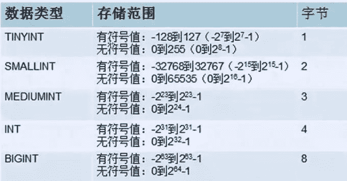

### 2.2 小数类型

*   `float(m,d)`：单精度，8位精度；m表示总个数，d表示小数位

*   `double(m,d)`：双精度，16位精度；m表示总个数，d表示小数位

*   `decimal(m,d)`：定点数，m表示总长度，d表示小数位

### 2.3 字符串类型

用的最多的是`char`和`varchar`以及`text`，其中:

*   `char`：定长，不够补空格，多了减掉；比如`char(10)`：输入`12345678**`，后面自动补两个空格。特点：**存取速度快，占空间**

*   `varchar`：变长，根据实际自动改变长度。特点：**存取速度慢，节省空间**

*   `text`：主要是用于存储文本信息

### 2.4 日期类型

| 类型 | 大小 | 格式 | 用途 |
| --- | --- | --- | --- |
| DATE | 3 | YYYY-MM-DD | 日期值 |
| TIME | 3 | HH:MM:SS | 时间值或者持续时间 |
| YEAR | 1 | YYYY | 年份值 |
| DATETIME | 8 | YYYYMMDD | 混合日期和时间值 |
| TIMESTAMP | 8 | HHMMSS | 混合日期和时间值，时间戳 |

### 2.5 字段名修饰

常见的字段修饰语：

| 修饰语 | 作用 |
| --- | --- |
| unsigned | 无符号 |
| auto_increment | 自增 |
| default | 默认值 |
| comment | 字段解释说明 |
| not null | 非空 |
| null | 空 |
| unique | 唯一索引 |
| index | 普通索引 |
| primary key | 主键，必须指定为`auto_increment` |

### 2.6 常见运算符

常用的运算符有：

| 符号 | 含义 |
| --- | --- |
| = | 赋值或者判断 |
| !=或者<> | 不等于 |
| < | 小于 |
| > | 大于 |
| <=、>= | 小于等于或者大于等于 |
| OR | 或 |
| AND | 与 |
| BETWEEN…AND… | 在….和….之间 |
| IN、NOT IN | 在或者不在 |

## 三、安装MySQL

下面是以`Ubuntu18`为例安装`MySQL`数据库。

### 3.1 官网下载

*   进入`MySQL`数据库的官网。里面有各种版本，`MySQL5.5，MySQL5.6，MySQL5.7，MySQL8.0`。

*   其中前三者是应用最广泛的，`8.0`目前刚出来，属于起步阶段，问题还是很多；而且网上的资源比较少。

`MySQL5.7`社区版本

**文件下载**

1.  这里是以安装5.7版本为例

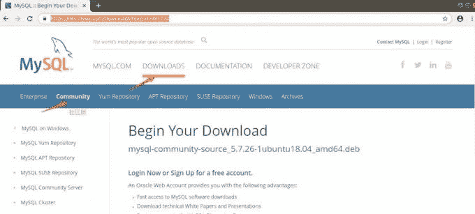

1.  选择对应的系统和版本

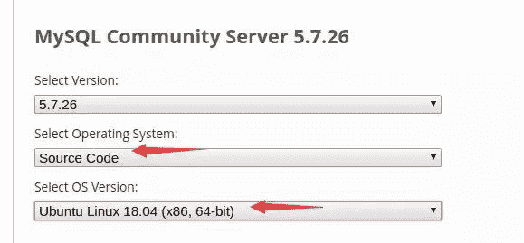

1.  下载DEB文件

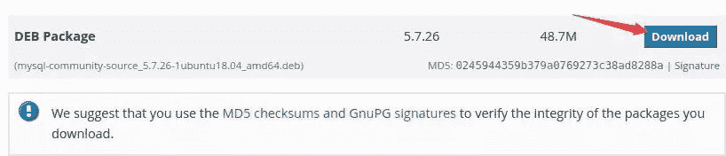 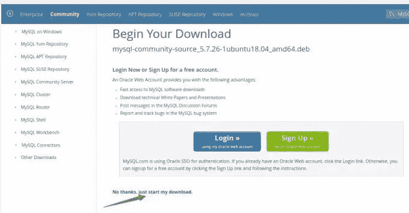

1.  点击开始安装

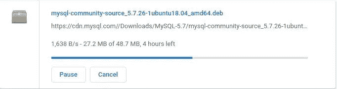

### 3.2 安装客户端和环境

进入到安装包所在的文件目录下，笔者是`Downloads`下：

```
sudo dpkg -i mysql-community-source_5.7.26-1ubuntu18.04_amd64.deb 
# 更新软件源
sudo apt-get upgrade 
```

安装客户端和环境的具体步骤：

```
# 安装mysql服务
sudo apt-get install mysql-server
# 安装客户端
sudo apt install mysql-client
# 安装依赖
sudo apt install libmysqlclient-dev
# 检查状态
sudo netstat -tap | grep mysql 
```

### 3.3 配置root密码

`mysql5.7`安装完成后普通用户不能进`mysql`，原因：`root`的`plugin`被修改成了`auth_socket`，用密码登陆的`plugin`应该是`mysql_native_password`，直接用`root`权限登录就不用密码，修改`root`密码和登录验证方式：

```
$sudo su  # 进入root账户
# mysql   # 输入mysql，进入mysql服务  ；root账户下分隔符是#，普通用户是$

mysql> select user, plugin from mysql.user;
+------------------+-----------------------+
| user             | plugin                |
+------------------+-----------------------+
| root             | auth_socket           |
| mysql.session    | mysql_native_password |
| mysql.sys        | mysql_native_password |
| debian-sys-maint | mysql_native_password |
+------------------+-----------------------+
4 rows in set (0.00 sec)
mysql> update mysql.user set authentication_string=PASSWORD('renrenren'), plugin='mysql_native_password' where user='root';   # 修改root账户密码
mysql> flush privileges;  # 刷新权限
mysql> exit  # 退出msyql服务
Bye
# exit   # 退出root账户，进入普通账户（第一个星号不是注释）
$ sudo /etc/init.d/mysql restart  # 重启msyql服务
$ mysql -uroot -p   # 进入mysql服务中，接下来输入上面步骤中设置的密码
Enter password: （上面的密码） 
```

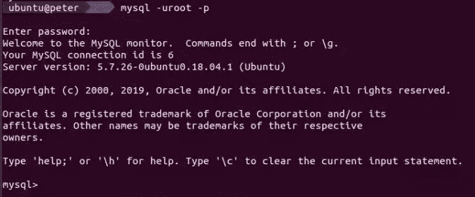

### 3.4 配置远程登录

默认的`MySQL`服务是只允许本地服务的，但是大部分时候需要远程服务，下面进行配置：

```
$sudo vi /etc/mysql/mysql.conf.d/mysqld.cnf  # 进入配置文件，注释掉bind-address = 127.0.0.1 
```

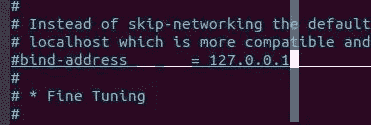

保存退出，进入`MySQL`服务，执行授权命令：

```
$sudo -uroot -p
Enter password: （上面的密码）
mysql> grant all on *.* to root@'%' identified by 'renrenren' with grant option;
Query OK, 0 rows affected, 1 warning (0.00 sec)
mysql>flush privileges;
mysql> exit
Bye

$sudo /etc/init.d/mysql restart    # 重启mysql配置服务 
```

## 四、4种语句

### 语句分类

结构化查询语言`Structured Qurey Language`，**语句必须是以分号结束**，且关键词**不区分大小写**，主要包含四种语句：

*   `DDL，data defination language`数据定义语言

*   `DML，data manipulation language`数据操作语言

*   `DCL，data control language`数据控制语言

*   `DQL，data query language`数据查询语言

### DDL

*   `data defination language`，数据定义语言；作用主要是：`创建、删除、修改库表结构`。

*   针对库表结构

### DML

*   `data manipulation language`，数据操作语言；作用主要是：增、删、改表的记录

*   针对`表`的操作

### DCL

*   `data control language`，数据控制语言；用户创建及授权操作

*   针对数据库的`用户`

### DQL

*   `data query language`，数据查询语言；查询数据

*   主要是`查询`功能

## 五、学习资料

1.  首先推荐是一本书《**SQL必知必会**》，一本非常经典的`SQL`入门书籍????

2.  一个网站：`sqlzoo`，是一个非常适合新手和提升SQL的练习网站

3.  一门课程：《网易课程-`MySQL`从入门到精通》

4.  菜鸟课程：提供很多`MySQL`的学习资料

## 六、MySQL内置大全

介绍`MySQL`中常见的内置函数：

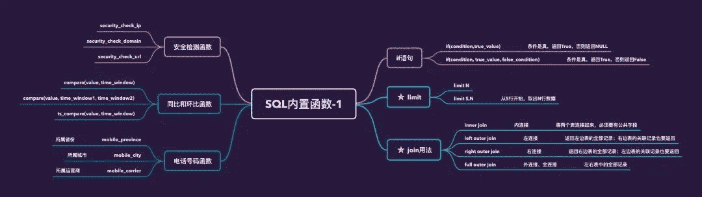 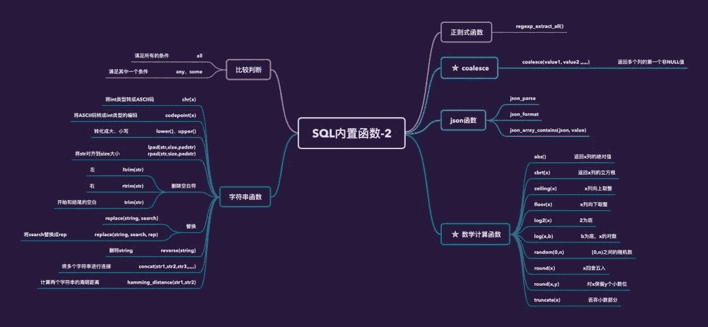  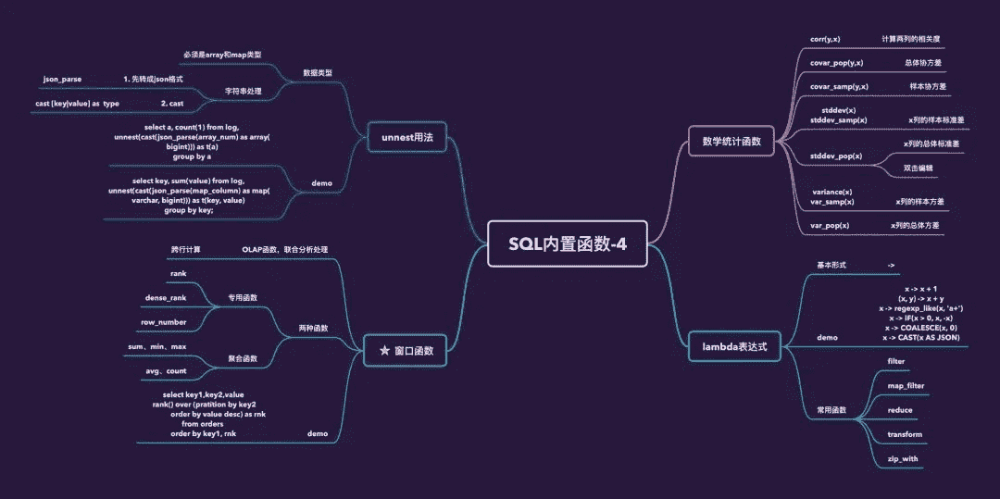 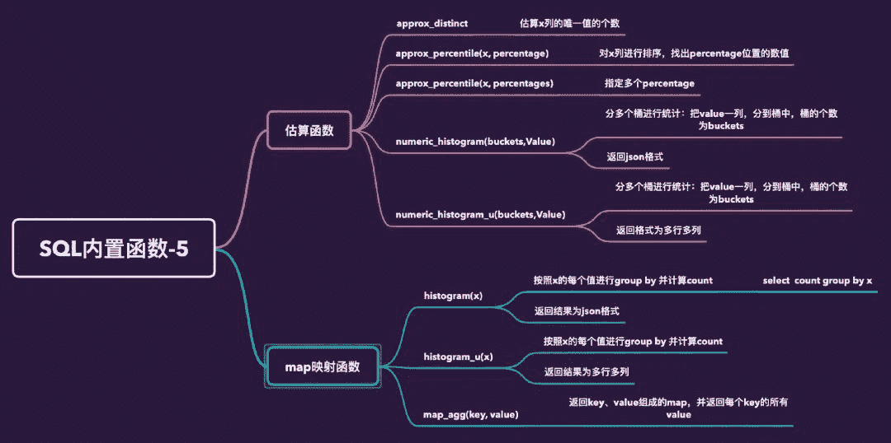


“原创不易，**点****赞****三连**↓