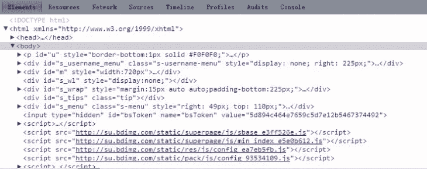
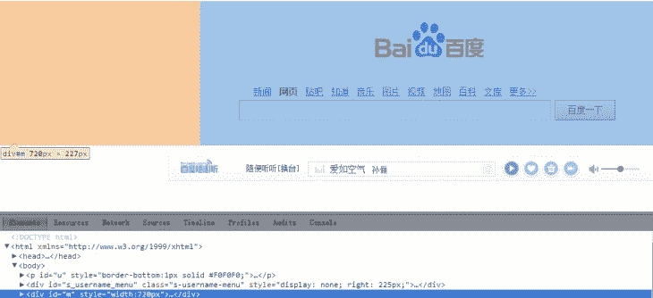
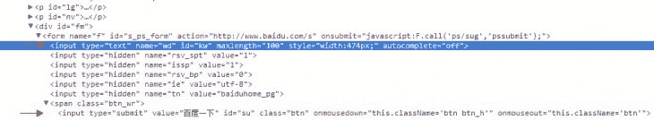
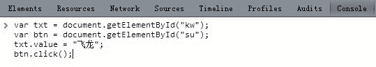

* 此教程是头一章 估计我以后也不想写什么第二章了
* 需要的基础知识：javascript语法和常用对象
* 大神勿喷

上次讲完了封包 这回我们再说说javascript
javascript是一种弱类型的客户端脚本语言 在html文本返回后在浏览器上执行
javascript除了基本的运算之外 还可以通过html dom控制浏览器的某些动作 例如向编辑框输入文本 或者点击按钮等等 以达到用代码代替手动操作的目的
同样他也是网页填表的基础

好了 废话不多说 我们来做个演示 比如我要在百度搜索“飞龙”这个词
我们要做的是 1.先在搜索框里面输入飞龙 2.然后再点击“百度一下”按钮
我们注意 这两个动作分别涉及到两个控件 文本框和按钮
学过编程的人都知道 这两个动作在程序里面实现很简单
无非就是Textbox.Text = "飞龙" 之后Button.click()
那是因为在程序中你可以直接访问到控件的对象 但是网页中不行
网页中 html控件大多数以id作为标识的

那我们首先要把id找出来
我们打开chorme 右键点击审查元素 可以看到 底下的窗口中 html源文本按照tag被分为一行一行的


我们可以看到 鼠标移上去 上面会有阴影提示你是网页的哪个部分
于是可以迅速定位到你要找的控件


一开始可能一个区域都有阴影 我们可以点击左侧的小箭头 一层一层找


找到编辑框：

```
<input type="text" name="wd" id="kw" style="width:474px;">
```

按钮：

```
<input type="submit" value="百度一下" id="su" class="btn">
```

好 控件的声明已经找到了 然后光有id也不成啊 我们要生成这个两个控件的对象
ctrl+shift+J打开控制台 输入：

```
var txt = document.getElementById("kw");
var btn = document.getElementById("su");
```

这样就成功取到了
我们可以看到 编辑框位于两个div一个form下 按钮位于两个div一个form以及一个span下面
也就是说 无论它有多下面 用这种方法都能取到
注意 输入的时候如果要换行 请用shift+enter 直接按enter会提交脚本

然后就是模拟动作了
首先是输入文本 input标签的编辑框 以及input标签的submit按钮 文本属性都是value
按钮的点击事件一般是button.click() 表单的提交事件一般是form.submit()
那我们换行 接着输入：

```
txt.value = "飞龙";
btn.click();
```

回车 于是就成功了


当然 你也可以把自己代码间的回车取掉 前面加上javascript: 存成书签用于经常使用

```
javascript:var txt = document.getElementById("kw");var btn = document.getElementById("su");txt.value = "飞龙";btn.click();
```

**变式提升**

通过js脚本 将"百度一下"按钮上面的文字改成"飞龙"
答案：

```
var btn = document.getElementById("su");
btn.value = "飞龙";
```