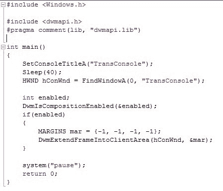
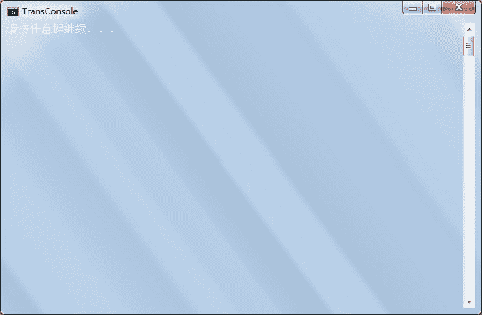
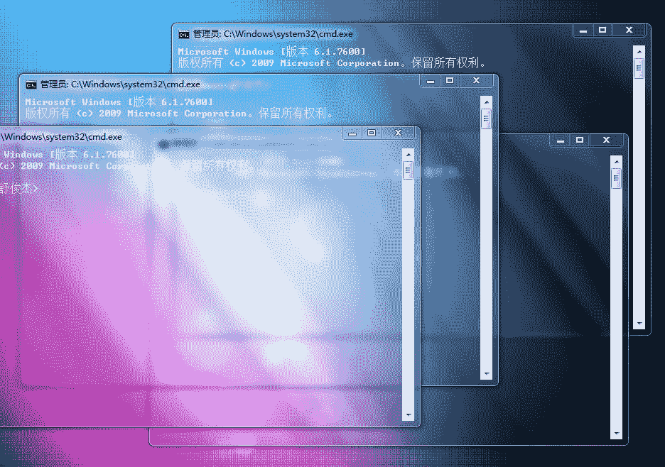
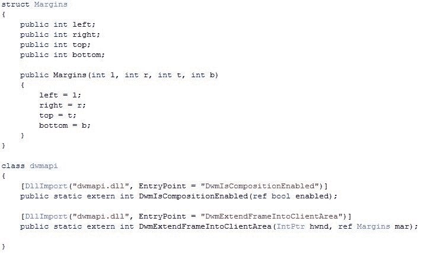
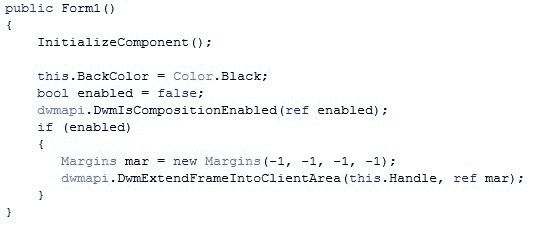
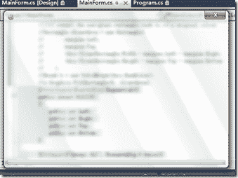

最近看到别人写的一个例程，就是把控制台弄成了全透明，我把源码下载下来做了研
究。

其实从Vista版本之后，WindowsAPI里面增加了几个函数，用于Aero效果的实现。有
两个最主要的：DwmExtendFrameIntoClientArea和DwmIsCompositionEnabled。

DwmIsCompositionEnabled用于检测系统的桌面组合功能是否打开。
DwmExtendFrameIntoClientArea用于开启控制窗体的玻璃效果，他需要一个名为
MARGINS的结构作为参数，表达的是窗口四周的边框。我们实际上就是要非客户区的
边框往内扩展，等到MARGINS足够大之后，就变成全玻璃特效的了。

下面是两个实例：

1.c++下使控制台变透明

效果 如果是win7家庭版没有透明特效是这个样子：

旗舰版等有透明特效的是这个样子

2.c#下使窗体变透明

这个事先要声明一些东西作为准备

然后在构造函数下调用即可

效果

