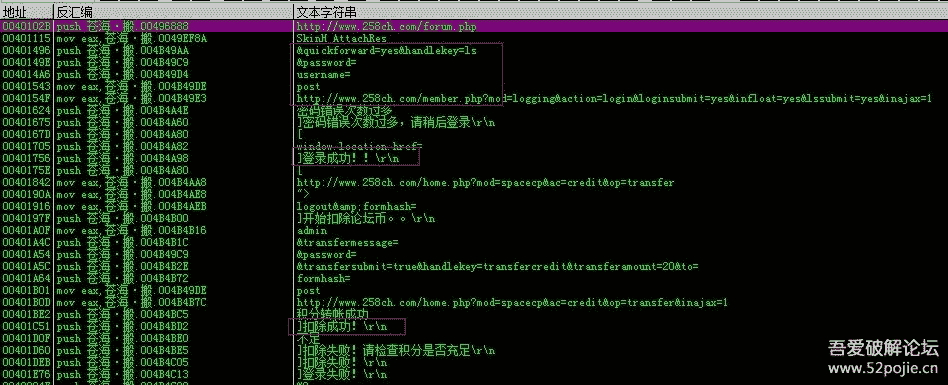
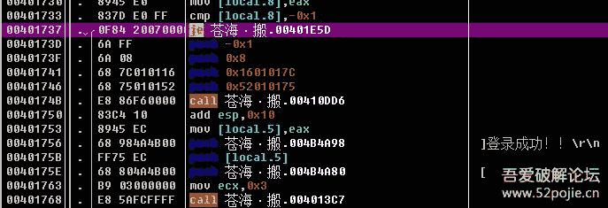
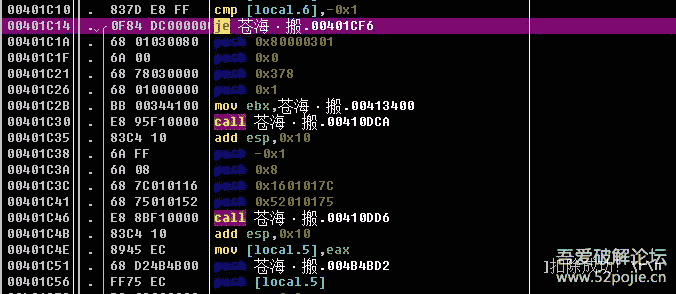
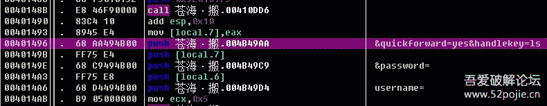
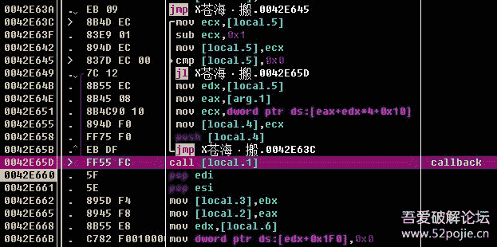
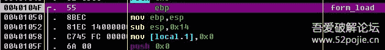
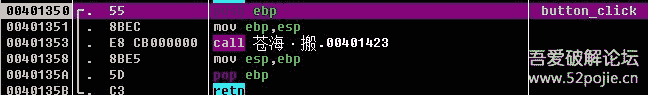
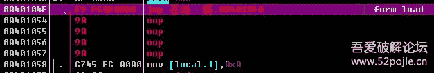
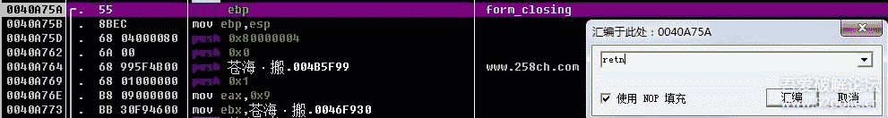

来吾爱有一段时间了 一直想给大家做个教程
这次是个入门级的破解教程 大牛请绕。。
要破解的程序是苍海帖子搬运机。。

首先我们打开程序，点击登录。。。咦。。怎么没有反应

好吧 peid确定无壳后 直接拖进OD 点击插件-》中文搜索引擎-》搜索ascll
然后滚动到最上面 找到了我们希望看到的东西（红框内）

 

我们发现有个“登录成功” 还有个“扣除成功”
按照程序执行流程应该是这样。。。

所以我们分别定位到字符串出现的地方 向上找到关键跳
这是“登录成功”的地方： 
  

这个是“扣除成功”： 
  

理论上把两个跳转抹掉就好
但是呢我们发现这个函数上面有个网络验证
不解决掉它 执行起来非常卡

那么我们记下扣除成功的地址：0x00401c1a

然后往上滚动找到网络验证的地方
找到最开始组合post字符串的地方
把第一个字节按空格 然后改成“jmp 00401c1a” 
 

然后保存 运行 是不是快多了

之后还有个问题 就是每次运行都要带个登录窗体 多不美观。。
恕我不了解易语言窗体的初始化流程 我能想到的办法
就是使form_load事件向button_click事件跳转

那怎么找消息循环呢。。
由于我们可以确定 整个登录验证是在按钮里进行的
我们在后面的retn处下断点
之后f8多走几步  大约两次就返回到了这里 
  

这个就是消息循环了 中间的那个call就是回调 果断下个断点 
  

然后重启OD 运行 我们可以发现在登录窗体出现前有且仅有一次断在了那里
按f7进去 这个就是form_load回调了 
  

等窗体加载完毕 按下登录按钮 又一次断下 按f7进去
这个就是按钮的回调 
  

那个form_load不是特别重要 那么就直接在开头跳到按钮的回调函数去 
  

如果form_load里的东西有用可以把最后一句retn改成跳走
如果没有多余的地方就把form_load的函数二进制复制 然后在代码尾找个多余的地方粘贴再改

保存 然后运行 大功告成了

关掉程序的时候有个打开网址的动作 同样可以通过消息循环定位 然后函数首retn 
